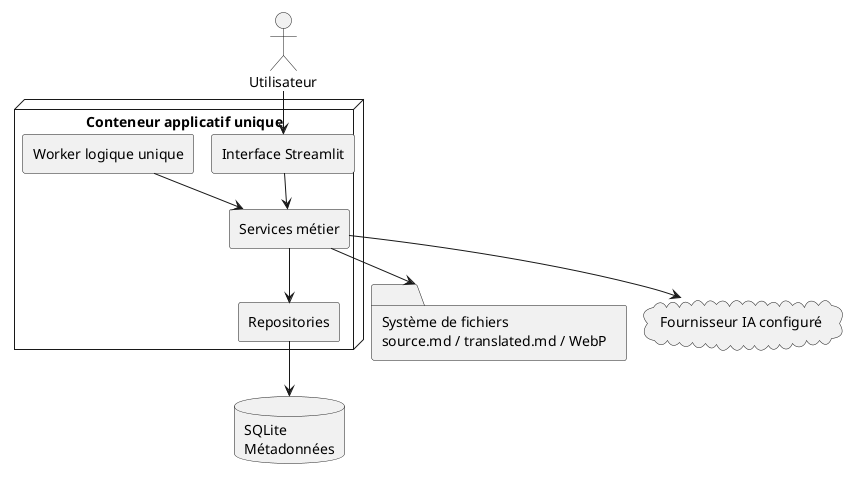
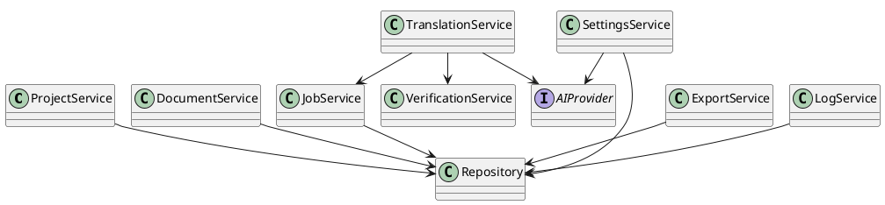
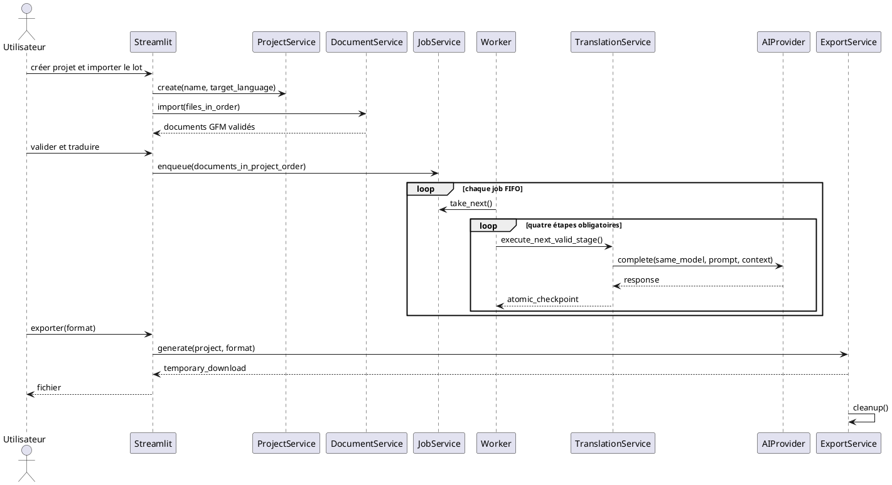
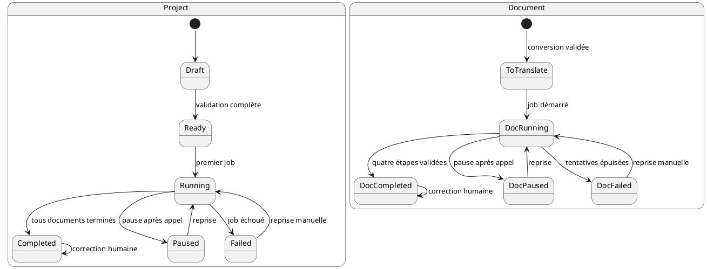
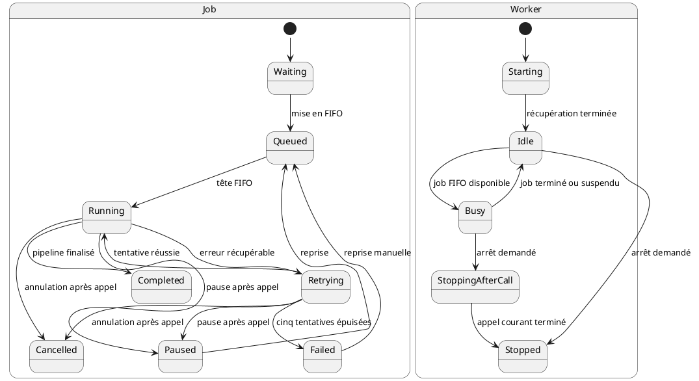
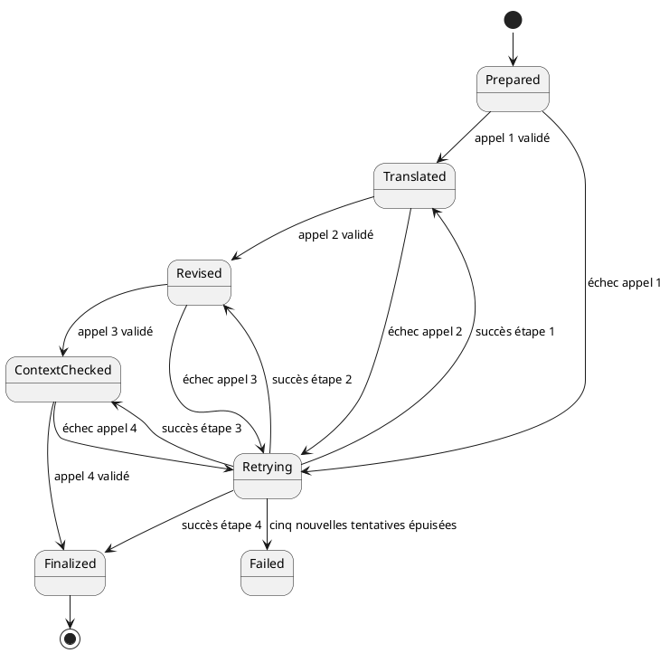
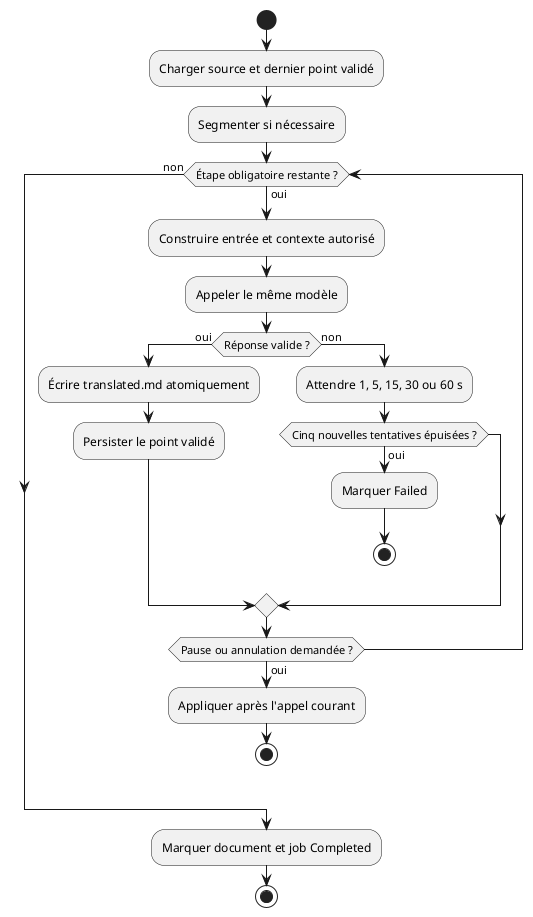
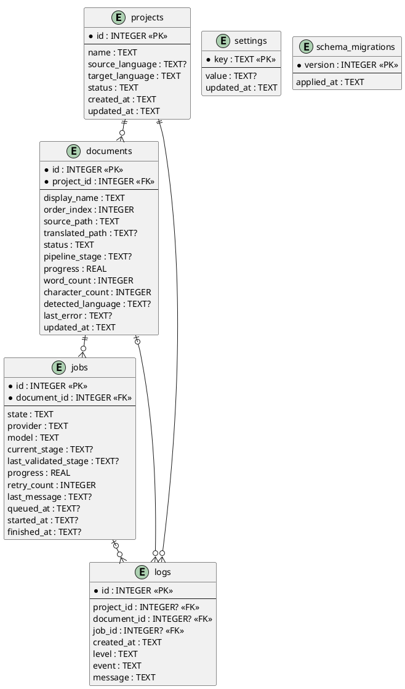

# NovelTrad — SDD

# Chapitre 1 — Vision, objectifs et périmètre

## 1.1 Vision

NovelTrad est une application locale de traduction littéraire assistée par intelligence artificielle. Son objectif est de permettre à un utilisateur d'importer une œuvre, de la traduire avec le fournisseur IA de son choix, d'appliquer automatiquement une révision complète puis d'exporter un résultat fidèle et propre.

## 1.2 Objectifs

- Simplicité : créer un projet, déposer les fichiers, lancer la traduction et exporter.
- Qualité : viser une traduction nécessitant le moins possible d'intervention humaine.
- Robustesse : aucune perte de données après interruption.
- Local-first : conservation locale des fichiers, sauf appels volontaires à une API distante.
- Maintenance : architecture simple à comprendre et à dépanner.

## 1.3 Périmètre fonctionnel

Création d'un projet représentant une œuvre ; import EPUB, DOCX, TXT, Markdown et SRT ; conversion automatique en Markdown GFM et WebP lossless ; réorganisation des chapitres ; pipeline automatique ; édition après validation ; export EPUB, DOCX, Markdown, TXT ou SRT.

## 1.4 Hors périmètre

Édition collaborative, multi-utilisateur, microservices, Redis, reverse proxy, multi-machine, multi-GPU, stockage cloud natif, conservation des originaux, historique complet des versions. Aucun import ni export complet de projet NovelTrad n'est autorisé ; seuls l'import de documents et l'export temporaire de l'œuvre dans les formats définis par ce SDD existent.

## 1.5 Principes fondateurs

- Un projet = une œuvre.
- source.md est immuable.
- translated.md est le seul fichier éditable.
- Le pipeline complet est obligatoire.
- Une seule traduction est active à la fois.
- Les exports sont temporaires.
- Toute écriture de translated.md est atomique.
- Les corrections humaines ne sont jamais écrasées automatiquement.

## 1.6 Objectifs qualité

NovelTrad vise une traduction fidèle nécessitant le moins de corrections manuelles possible. La révision automatique fait partie intégrante du produit et n'est jamais optionnelle. L'objectif est de fournir une base de très haute qualité, tout en reconnaissant que la validation humaine reste la référence finale.

## 1.7 Contraintes de conception

Aucune fonctionnalité ne doit complexifier inutilement l'installation.

Le temps de dépannage doit rester faible grâce à une architecture lisible.

Toutes les fonctionnalités doivent être compatibles avec un usage local.

Les évolutions futures ne doivent pas remettre en cause les principes fondateurs.

## 1.8 Contrat normatif du produit

**Responsabilités.** Le produit couvre l'import, la conversion, l'ordonnancement, le pipeline IA obligatoire, l'édition humaine post-pipeline, la consultation des journaux et l'export temporaire d'une œuvre.

**Règles métier et invariants.** Les principes de 1.5 s'appliquent à tous les chapitres. Toute évolution doit préserver le monolithe modulaire, le conteneur applicatif unique, SQLite unique, le Worker logique unique, la FIFO sans priorité et une seule traduction active.

**Préconditions.** L'installation locale est démarrée, `APP_PASSWORD` est défini et le volume `data` est accessible.

**Postconditions.** Les contenus persistants se limitent à `source.md`, `translated.md` et aux images WebP ; les métadonnées sont dans SQLite.

**Cas d'erreur.** Une opération incompatible avec le périmètre, un secret absent ou une ressource locale indisponible est refusé avec un message exploitable, sans altérer les données validées.

**Critères d'acceptation.** Un parcours complet permet, en français comme en anglais et sur PC, tablette ou smartphone, de créer une œuvre, importer ses documents, exécuter les quatre appels IA séquentiels et télécharger un export sans conservation de celui-ci.

**Références croisées.** Architecture : chapitre 2 ; règles : chapitre 4 ; stockage : chapitre 8 ; pipeline : chapitre 11 ; tests : chapitre 17 ; traçabilité : chapitre 19.

# Chapitre 2 — Principes d'architecture

## 2.1 Objectif

Privilégier la simplicité, la lisibilité et le dépannage. NovelTrad est un monolithe modulaire : un seul déploiement, plusieurs modules métier clairement séparés.

## 2.2 Couches logiques

Présentation Streamlit → Services métier → Repositories → SQLite et système de fichiers. Le Worker exécute les traitements longs et utilise une abstraction commune des fournisseurs IA.

## 2.3 Responsabilités

Streamlit affiche et collecte les actions. Les services appliquent les règles métier. Les repositories accèdent à SQLite. Le Worker exécute les jobs. Le fournisseur IA ne connaît pas les projets.

## 2.4 Dépendances autorisées

Streamlit → Services ; Services → Repositories ; Worker → Services ; Services de traduction → Fournisseur IA ; Repositories → SQLite.

## 2.5 Dépendances interdites

Aucun SQL dans Streamlit ou les services ; aucun appel IA depuis Streamlit ; aucune logique métier dans les repositories ; aucun accès direct aux fichiers depuis l'interface.

## 2.6 Invariants

SQLite est la source des métadonnées. source.md et translated.md sont la source des contenus. Une seule traduction s'exécute. Les paramètres IA sont globaux. Le pipeline est fixe.

## 2.7 Principes de conception

Responsabilité unique, faible couplage, forte cohésion, testabilité, erreurs explicites, absence d'état caché.

## 2.8 Contrats d'architecture

Les couches communiquent exclusivement selon les dépendances définies par le SDD. Toute violation constitue un défaut d'architecture.

L'interface Streamlit appelle uniquement les services métier.

Les services sont les seuls autorisés à appliquer les règles métier.

Les repositories n'effectuent que des opérations de persistance.

Le Worker ne communique jamais directement avec l'interface.

Les fournisseurs IA sont encapsulés derrière une interface unique.

## 2.9 Gestion des transactions

Toute modification de l'état métier est réalisée dans une transaction SQLite. Les écritures de fichiers et les mises à jour de la base doivent rester cohérentes.

Commit uniquement après succès complet de l'opération.

Rollback automatique en cas d'erreur.

Les écritures de translated.md sont atomiques.

Les exceptions sont propagées aux services puis journalisées.

## 2.10 Contrat de conformité architecturale

**Préconditions.** Toute dépendance nouvelle est classée dans une couche de 2.2 et respecte 2.4–2.5.

**Postconditions.** Une action de l'interface traverse un service ; toute persistance SQLite traverse un repository ; tout appel IA traverse l'abstraction fournisseur.

**Contraintes et invariants.** Aucun composant réseau interne obligatoire n'est ajouté. Streamlit et le Worker partagent le même conteneur applicatif et le même stockage local, sans devenir des services distribués.

**Cas d'erreur.** Une transaction échouée est annulée ; une écriture de fichier échouée ne peut pas être suivie d'un état SQLite annonçant sa validation.

**Critères d'acceptation.** Les tests d'architecture interdisent les dépendances de 2.5 et vérifient les frontières représentées dans les diagrammes 18.11 et 18.12.

**Références croisées.** Modules Python : chapitre 7 ; transactions : chapitre 8 ; robustesse : chapitre 16.

# Chapitre 3 — Exigences fonctionnelles

EF-001 --- Créer un projet avec un nom libre et une langue cible.

EF-002 --- Détecter automatiquement la langue source après import.

EF-003 --- Accepter uniquement EPUB, DOCX, TXT, Markdown et SRT.

EF-004 --- Convertir immédiatement les textes en GFM et les images en WebP lossless.

EF-005 --- Supprimer l'original après conversion réussie et nettoyage de la copie temporaire.

EF-006 --- Conserver l'ordre de dépôt et autoriser le réordonnancement avant traduction.

EF-007 --- Valider le projet avant lancement.

EF-008 --- Exécuter quatre appels IA : traduction, révision linguistique, contexte, finalisation.

EF-009 --- Traiter une seule unité à la fois et accepter une file de nombreux chapitres.

EF-010 --- Autoriser l'arrêt propre après l'appel IA en cours.

EF-011 --- Autoriser l'édition uniquement après validation finale.

EF-012 --- Effectuer une recherche et un remplacement sur l'ensemble du projet.

EF-013 --- Exporter l'œuvre complète en EPUB, DOCX, Markdown, TXT ou SRT.

EF-014 --- Générer l'export à la volée et le supprimer après téléchargement.

EF-015 --- Fournir une interface FR/EN, claire/sombre/sépia et responsive.

EF-016 --- Afficher et filtrer les journaux dans l'interface.

## 3.1 Préconditions générales

Avant toute opération, l'application doit être initialisée, la base SQLite disponible et la configuration IA valide.

## 3.2 Postconditions générales

Chaque opération métier met à jour SQLite, les journaux et l'état de l'interface de manière cohérente.

## 3.3 Cas d'erreur communs

Projet inexistant.

Document introuvable.

Configuration IA invalide.

Espace disque insuffisant.

Erreur de conversion.

Fournisseur IA indisponible.

## 3.4 Critères d'acceptation

Chaque exigence fonctionnelle est considérée conforme lorsqu'elle est implémentée, testée et traçable via son identifiant `EF`.

## 3.5 Responsabilités, contraintes et invariants

**Objectif et responsabilités.** Le chapitre 3 définit exclusivement les résultats fonctionnels attendus. Les modules responsables sont donnés par la matrice 19.10 ; les règles contraignantes correspondantes restent celles du chapitre 4.

Les seize identifiants `EF-001` à `EF-016` sont uniques, stables et ne constituent pas une série `REQ` distincte. Une exigence ne peut être déclarée satisfaite sans les tests unitaires, d'intégration et fonctionnels du chapitre 17.

## 3.6 Références croisées et cas non spécifiés

Les critères détaillés figurent en 17.11 et la traçabilité en 19.10. Tout comportement fonctionnel absent de `EF-001` à `EF-016` et non déductible des règles `RM` est **non spécifié**. Pour l'interface, restent notamment non spécifiés les raccourcis clavier, la disposition visuelle précise, le moteur de rendu de l'aperçu et le délai exact de l'autosauvegarde ; ces choix d'implémentation ne peuvent ajouter aucune fonction au contrat minimal de 13.5.

# Chapitre 4 — Règles métier

RM-001 --- Un projet représente exactement une œuvre.

RM-002 --- Tout document présent dans le projet appartient à l'export final.

RM-003 --- source.md ne peut jamais être modifié.

RM-004 --- translated.md est créé au lancement de la traduction.

RM-005 --- Les corrections manuelles sont possibles uniquement après la fin du pipeline.

RM-006 --- L'ordre du projet pilote la traduction, le contexte et l'export.

RM-007 --- Le projet est verrouillé pendant une traduction active.

RM-008 --- La vérification contextuelle reçoit le chapitre précédent traduit, le courant traduit et le suivant source.

RM-009 --- Chaque appel IA échoué fait l'objet de cinq tentatives de reprise, après 1, 5, 15, 30 et 60 secondes, avant le passage du job en erreur.

RM-010 --- L'export est bloqué tant que tous les documents ne sont pas terminés.

RM-011 --- La suppression d'un document traduit exige une confirmation renforcée.

RM-012 --- Les paramètres IA globaux ne peuvent être modifiés pendant un traitement.

## 4.1 Cycle de vie métier

Chaque document suit obligatoirement le cycle : Import → Conversion → Validation → Traduction → Révision → Vérification contextuelle → Validation finale → Édition manuelle éventuelle → Export.

## 4.2 Règles de cohérence

Un document ne peut être exporté que s'il est terminé.

Un chapitre supprimé est exclu définitivement du projet.

L'ordre des chapitres est identique pour la traduction, le contexte et l'export.

Les statistiques sont recalculées après toute modification manuelle.

Toute erreur métier doit être journalisée.

## 4.3 Règles de verrouillage

Impossible de modifier l'ordre pendant une traduction.

Impossible de changer le fournisseur IA pendant un job actif.

Impossible de supprimer un projet en cours de traduction sans annulation préalable.

## 4.4 Préconditions et postconditions des règles métier

**Objectif et responsabilités.** Le chapitre fixe les décisions métier que tous les modules doivent appliquer.

**Contraintes et invariants.** Les douze règles sont obligatoires, transversales et ne peuvent être contournées par l'interface, le Worker ou un fournisseur.

**Préconditions.** Le projet, les documents et les jobs concernés existent ; leur état courant autorise l'opération selon les machines à états des chapitres 9, 11, 12 et 18.

**Postconditions.** Toute règle appliquée laisse SQLite et les fichiers cohérents, conserve l'ordre du projet et n'écrase jamais une correction humaine.

## 4.5 Cas d'erreur et critères d'acceptation

Toute violation de `RM-001` à `RM-012` est une erreur métier bloquante et transactionnelle. Les douze règles sont acceptées uniquement si leurs trois niveaux de test définis en 17.12 réussissent et si leur traçabilité 19.10 est complète.

## 4.6 Références croisées

Cycle de vie : chapitre 9 ; pipeline : chapitre 11 ; jobs : chapitre 12 ; export : chapitre 15 ; tests : chapitre 17.

# Chapitre 5 — Architecture logicielle

## 5.1 Vue générale

Utilisateur → Streamlit → Services métier → Repositories / Worker → SQLite, fichiers et fournisseur IA.

## 5.2 Présentation

Affichage, navigation, formulaires, confirmations, progression et messages. Aucune logique métier.

## 5.3 Services

ProjectService, DocumentService, JobService, TranslationService, VerificationService, ExportService, SettingsService et LogService.

## 5.4 Repositories

Couche unique d'accès SQLite. Opérations de lecture, insertion, mise à jour et suppression seulement.

## 5.5 Worker

Exécute les opérations longues sans connaître Streamlit.

## 5.6 Fournisseur IA

Interface commune couvrant Ollama, LM Studio, OpenAI, OpenRouter, Gemini, Claude, Grok et les serveurs OpenAI-compatibles.

## 5.7 Fichiers persistants

SQLite, source.md, translated.md et images WebP uniquement.

## 5.8 Contrats des services

Chaque service expose une API métier stable. Les services ne communiquent jamais via l'interface utilisateur.

ProjectService : créer, renommer, supprimer et valider un projet.

DocumentService : importer, convertir, réordonner et supprimer des documents.

JobService : créer, planifier, suspendre, reprendre et annuler des jobs.

TranslationService : exécuter le pipeline IA complet.

ExportService : reconstruire puis exporter l'œuvre.

SettingsService : lire, valider et enregistrer la configuration.

## 5.9 Principes de découplage

Les services échangent des objets métier, jamais des composants Streamlit.

Les repositories ne s'appellent jamais entre eux.

Le Worker utilise uniquement les services.

Les dépendances sont injectées afin de faciliter les tests.

## 5.10 Performances

Les traitements coûteux (conversion, traduction, export) sont délégués au Worker afin de maintenir une interface réactive.

## 5.11 Contrats techniques des services métier

Les types Python précis des objets d'entrée et de sortie sont **non spécifiés** ; ils doivent être des objets métier typés et indépendants de Streamlit. Les exceptions ci-dessous sont des catégories contractuelles, leurs noms de classes étant définis par l'implémentation.

| Service | Rôle et responsabilités | Entrées | Sorties | Exceptions contractuelles | Invariants et dépendances |
|---|---|---|---|---|---|
| `ProjectService` | Créer, renommer, valider et supprimer une œuvre | nom, langue cible, identifiant projet, confirmation si requise | projet ou état mis à jour | projet absent, état incompatible, validation impossible | `projects` repository ; un projet = une œuvre |
| `DocumentService` | Importer, convertir, ordonner, supprimer et recalculer les statistiques | fichiers acceptés, identifiant projet/document, ordre demandé | documents et statistiques | format refusé, conversion invalide, verrouillage actif, espace insuffisant | `documents` repository, système de fichiers ; `source.md` immuable |
| `JobService` | Créer la FIFO, demander pause/annulation, reprendre et récupérer | documents validés, commande de contrôle | jobs et états persistés | job absent, transition interdite, traduction déjà active | `jobs` repository ; FIFO stricte, Worker unique |
| `TranslationService` | Exécuter les quatre appels et valider chaque étape | source, contexte autorisé, configuration globale figée | étape validée et `translated.md` atomique | réponse invalide, fournisseur indisponible, tentatives épuisées | fournisseur IA, `JobService`, fichiers ; même modèle aux quatre appels |
| `VerificationService` | Révision linguistique, contrôle contextuel, finalisation | résultat de l'étape précédente et contexte défini en RM-008 | contenu révisé/validé | structure altérée, omission détectée, réponse invalide | `TranslationService` ; étapes obligatoires et ordonnées |
| `ExportService` | Contrôler, assembler, générer puis nettoyer l'export | projet terminé, format supporté | flux ou chemin temporaire téléchargeable | projet incomplet, image absente, génération impossible | repositories, système de fichiers ; aucun export persistant |
| `SettingsService` | Lire, valider et enregistrer la configuration globale | langue, thème, fournisseur, URL, clé, modèle, options | configuration masquée et résultat de validation | configuration invalide, job actif, connexion impossible | `settings` repository, adaptateur IA ; aucun secret journalisé |
| `LogService` | Enregistrer, filtrer et restituer les événements sûrs | niveau, type d'événement, identifiants et message expurgé | entrée de journal ou liste filtrée | niveau invalide, persistance indisponible | `logs` repository ; aucun secret ni contenu complet |

## 5.12 Contrat technique de l'interface Streamlit

**Rôle.** Présenter l'état, collecter les commandes et afficher leur résultat sans appliquer de règle métier.

**Entrées.** Actions authentifiées, fichiers importés, paramètres de formulaire et sélections d'export.

**Sorties.** Vues FR/EN responsives, progression, confirmations, téléchargements temporaires et erreurs actionnables.

**Exceptions.** Les exceptions métier sont traduites en messages utilisateur sans trace de secret ni contenu complet. Les exceptions techniques sont corrélées à un événement consultable.

**Invariants et dépendances.** L'interface dépend uniquement des services, ne fait aucun SQL, aucun accès direct aux fichiers et aucun appel IA. Elle ne conserve pas d'état métier faisant autorité.

## 5.13 Conditions et acceptation de l'architecture logicielle

**Objectif.** Rendre les contrats 5.11–5.12 implémentables et vérifiables sans couplage entre couches.

**Préconditions.** Les repositories, chemins, configuration et adaptateurs nécessaires sont injectés.

**Postconditions.** Chaque mutation réussie est persistée ; chaque échec laisse un état cohérent et journalisé.

**Contraintes.** Les dépendances respectent le chapitre 2 et aucune API distribuée interne n'est requise.

**Critères d'acceptation et références croisées.** Les contrats 5.11–5.12 sont couverts par les tests 17.13 et par les diagrammes 18.11–18.13.

# Chapitre 6 — Architecture Docker

## 6.1 Déploiement officiel

Docker Compose est le mode officiel. Une commande doit suffire à démarrer l'application.

## 6.2 Conteneur

Un conteneur applicatif unique regroupe Streamlit et le Worker. Le fournisseur IA reste externe ou distant.

## 6.3 Environnement

`.env` contient `APP_PASSWORD` et éventuellement des options techniques. Il est distinct du dossier `data`, doit être protégé comme un secret et se sauvegarde séparément. Tous les paramètres fonctionnels sont dans SQLite.

## 6.4 Volume

Le volume data contient database.sqlite, logs et projects. Aucun export n'est conservé.

## 6.5 Démarrage

Création des dossiers manquants, validation de APP_PASSWORD, ouverture/migration SQLite et nettoyage des temporaires.

## 6.6 Arrêt

Fin de l'appel IA courant, sauvegarde atomique, mise à jour du job et arrêt propre.

## 6.7 Sauvegarde et restauration

La copie du dossier `data` sauvegarde toutes les données applicatives persistantes : SQLite, journaux, `source.md`, `translated.md` et images WebP. Elle ne sauvegarde pas la configuration d'installation contenue dans `.env`.

Une sauvegarde complète de l'installation exige donc deux opérations séparées : copier `data` et sauvegarder `.env` dans un emplacement sûr adapté aux secrets. Pour restaurer, arrêter l'application, restaurer `data`, puis restaurer ou recréer séparément `.env` avec au minimum `APP_PASSWORD` avant le redémarrage. Les permissions, le chiffrement et le support de sauvegarde de `.env` sont **non spécifiés** ; ils doivent seulement empêcher l'exposition du secret.

## 6.8 Mise à jour

Les migrations sont automatiques, transactionnelles et non destructives.

## 6.9 Exigences de portabilité

Le même conteneur doit fonctionner sans modification sur Windows, Linux et les NAS compatibles Docker.

Aucun chemin absolu codé en dur.

Toutes les données persistantes sont stockées dans le volume data.

Les permissions des fichiers doivent être compatibles avec les principaux systèmes de fichiers.

Les migrations SQLite sont automatiques au démarrage.

## 6.10 Santé du conteneur

Le conteneur expose un mécanisme de vérification de santé permettant de confirmer que l'application est opérationnelle.

Base SQLite accessible.

Répertoire data accessible en lecture/écriture.

Worker démarré.

Configuration chargée.

## 6.11 Contrat d'exploitation

**Objectif et responsabilités.** Construire et démarrer une installation locale reproductible, initialiser la base et les dossiers, superviser Streamlit et le Worker dans le même conteneur, puis arrêter proprement.

**Règles, contraintes et invariants.** Un seul conteneur applicatif ; aucun composant distribué obligatoire ; toutes les données persistantes dans `data` ; aucun export persistant.

**Préconditions.** Docker Compose, un volume `data` inscriptible et `APP_PASSWORD` sont disponibles. Les exigences minimales de ressources sont **non spécifiées**.

**Postconditions.** Après démarrage sain, Streamlit, SQLite et le Worker répondent ; après arrêt, l'appel IA courant est terminé et la dernière étape validée est persistée.

**Cas d'erreur.** Secret absent, volume inaccessible, migration échouée ou Worker non démarré rendent le contrôle de santé négatif sans destruction de données.

**Critères d'acceptation et références.** Un démarrage, un redémarrage pendant traitement et une restauration du volume réussissent selon 16.5 et les tests 17.13 ; le composant est représenté en 18.11.

# Chapitre 7 — Architecture Python

## 7.1 Objectif

Un projet Python unique, structuré en modules métier simples et testables.

## 7.2 Environnement

Python 3.12 minimum, type hints, Ruff et Pytest. Les dépendances sont gérées par uv ou pip.

## 7.3 Arborescence

app/main.py ; core/ ; ui/ ; modules/authentication, projects, documents, jobs, translation, verification, export, settings, system ; tests/.

## 7.4 Structure d'un module

models.py, schemas.py, repository.py, service.py, exceptions.py et tests/. Seuls les fichiers réellement utiles sont créés.

## 7.5 core

Base SQLite, transactions, chemins, journalisation, exceptions communes et écritures atomiques. Aucun métier.

## 7.6 authentication

Lecture et validation de APP_PASSWORD sans persistance ni journalisation du secret.

## 7.7 projects

Création, renommage, suppression, langue cible et état global.

## 7.8 documents

Import, conversion, ordre, statistiques, fichiers Markdown et images.

## 7.9 jobs

File FIFO, statut, progression, pause, reprise, erreur et récupération après redémarrage.

## 7.10 translation

Segmentation, appels IA, reconstruction, politique de reprises et sauvegarde.

## 7.11 verification

Révision linguistique, contexte et validation finale.

## 7.12 export

Assemblage, génération temporaire et nettoyage.

## 7.13 settings

Langue, thème, fournisseur, URL, clé, modèle, détection et test de connexion.

## 7.14 system

Journaux, diagnostics, nettoyage et état du Worker.

## 7.15 Exceptions et tests

Exceptions métier explicites, injection des dépendances, fournisseurs et système de fichiers simulables.

## 7.16 Standards de développement

Toutes les contributions doivent respecter des conventions communes afin de garantir un code homogène et facile à maintenir.

Type hints obligatoires sur les API publiques.

Docstrings pour les classes et services publics.

Aucune logique métier dans les callbacks Streamlit.

Fonctions courtes avec une responsabilité unique.

Journalisation structurée des erreurs.

Le réemploi de code externe est encouragé lorsqu'il réduit le risque d'implémentation d'un comportement déjà exigé par ce SDD. Avant intégration, chaque emprunt doit être rattaché à un dépôt, un commit et un fichier précis, puis contrôlé sur quatre axes : licence compatible, dépendances compatibles avec le conteneur unique, respect des invariants NovelTrad et présence de tests transposables.

Le périmètre fonctionnel reste exclusivement défini par ce SDD : un composant externe ne peut introduire ni format, ni fournisseur, ni passe IA, ni cache de métadonnées, ni Worker, ni service ou option utilisateur supplémentaire. La licence de NovelTrad est **non spécifiée** par ce SDD. En l'absence d'une décision de licence explicite et compatible, le code GPL-3.0 ou AGPL-3.0 est une référence de conception et de tests uniquement ; il doit faire l'objet d'une réimplémentation indépendante. Le code sous licence permissive peut être adapté à condition de conserver les mentions d'auteur et de licence requises.

Ce contrôle s'applique aussi aux dépendances transitives et aux tests copiés : un projet permissif ne rend pas réutilisable une bibliothèque copyleft qu'il embarque ou appelle. Un dépôt sans licence explicite, inaccessible ou dont la licence ne permet pas l'usage envisagé ne fournit aucun code réutilisable ; seuls les comportements observables et les principes généraux peuvent alors alimenter une réimplémentation indépendante. Toute dépendance retenue doit être épinglée à une version vérifiée et son avis de licence doit être conservé dans la distribution.

## 7.17 Conventions de tests

Chaque module possède son propre dossier de tests. Les tests utilisent des doubles (mocks/fakes) pour les fournisseurs IA et le système de fichiers lorsque nécessaire.

## 7.18 Contrats des modules Python

| Module | API publique attendue | Entrées / sorties | Exceptions et invariants | Dépendances autorisées |
|---|---|---|---|---|
| `core` | transactions, chemins relatifs, logs, écritures atomiques | objets de connexion, chemins, octets/texte → résultat atomique | rollback et nettoyage sur échec ; aucun métier | SQLite, système de fichiers |
| `authentication` | vérifier le mot de passe | saisie utilisateur → booléen/session authentifiée | secret absent ou invalide ; aucune persistance du mot de passe | environnement uniquement |
| `projects` | opérations de `ProjectService` | commandes projet → projet/état | états de 9.13 ; une œuvre par projet | repository de projets |
| `documents` | opérations de `DocumentService` | fichiers/commandes → documents/statistiques | formats fermés ; `source.md` immuable | repository de documents, `core` |
| `jobs` | opérations de `JobService` et boucle Worker | commandes/jobs → transitions/progression | états de 12.15 ; un seul job actif | repository de jobs, services métier |
| `translation` | segmenter, appeler, reconstruire, reprendre | Markdown/configuration/contexte → Markdown validé | pipeline de 11.13 ; même modèle | abstraction fournisseur, `core` |
| `verification` | réviser, contextualiser, finaliser | résultats intermédiaires → contenu validé | aucune étape facultative | `translation` |
| `export` | contrôler, assembler, produire, nettoyer | projet/format → fichier temporaire | tous les documents, ordre strict, aucune persistance | repositories, convertisseurs, `core` |
| `settings` | lire, masquer, valider, écrire | configuration → configuration/résultat | verrouillage si traduction active | repository de paramètres, fournisseurs |
| `system` | santé, diagnostic, nettoyage, consultation des logs | filtres/commandes sûres → état/événements | aucune fuite de secret ou contenu complet | `core`, repository de logs |
| `ui` | pages et composants Streamlit | événements utilisateur → rendu | aucune logique métier | services uniquement |

## 7.19 Préconditions, postconditions et acceptation

**Règles et contraintes.** Les frontières 7.18, Python 3.12 minimum, les types publics et l'injection des dépendances sont obligatoires.

**Préconditions.** Python 3.12 minimum et les dépendances déclarées sont installés ; SQLite et le volume sont disponibles.

**Postconditions.** Les API publiques sont typées, les erreurs métier sont explicites et les dépendances sont injectables.

**Cas d'erreur.** Toute violation de couche, type public absent ou dépendance non simulable est un défaut d'architecture.

**Critères d'acceptation et références croisées.** Ruff et Pytest réussissent ; les contrats 7.18 sont couverts par 17.13. Les noms exacts des fichiers au-delà de l'arborescence 7.3 sont **non spécifiés** jusqu'à leur définition par l'implémentation.

# Chapitre 8 — Modèle de données SQLite

## 8.1 Objectif

SQLite est l'unique base de données de NovelTrad. Elle stocke uniquement les métadonnées de l'application. Les contenus des chapitres restent exclusivement dans source.md et translated.md.

## 8.2 Principes

La base contient les projets, documents, jobs, paramètres et journaux. Aucun texte de chapitre ni image n'est enregistré dans SQLite.

## 8.3 Transactions

Toute modification est transactionnelle. En cas d'échec, un rollback complet est effectué.

## 8.4 Intégrité

Les clés étrangères sont activées. Toutes les dates sont stockées au format UTC ISO-8601.

## 8.5 Table projects

| Colonne | Type SQLite | Null / défaut | Contraintes et sens |
|---|---|---|---|
| `id` | INTEGER | non nul | clé primaire ; stratégie exacte de génération **non spécifiée** |
| `name` | TEXT | non nul | nom libre de l'œuvre |
| `source_language` | TEXT | nul avant détection | langue détectée automatiquement |
| `target_language` | TEXT | non nul | une seule langue cible par projet |
| `status` | TEXT | non nul | `Draft`, `Ready`, `Running`, `Paused`, `Completed` ou `Failed` |
| `created_at` | TEXT | non nul | UTC ISO-8601 |
| `updated_at` | TEXT | non nul | UTC ISO-8601 |

Le choix de langue cible est immuable pendant une traduction active. L'unicité du nom n'est pas exigée et reste **non spécifiée**.

## 8.6 Table documents

| Colonne | Type SQLite | Null / défaut | Contraintes et sens |
|---|---|---|---|
| `id` | INTEGER | non nul | clé primaire |
| `project_id` | INTEGER | non nul | FK → `projects.id`, `ON DELETE CASCADE` |
| `display_name` | TEXT | non nul | doublons autorisés dans un projet |
| `order_index` | INTEGER | non nul | entier ≥ 0 ; `UNIQUE(project_id, order_index)` |
| `source_path` | TEXT | non nul | chemin relatif unique du `source.md` du document |
| `translated_path` | TEXT | nul avant lancement | chemin relatif du seul contenu éditable |
| `status` | TEXT | non nul | `ToTranslate`, `Running`, `Paused`, `Completed` ou `Failed` |
| `pipeline_stage` | TEXT | nul avant pipeline | dernière étape validée selon 11.16 |
| `progress` | REAL | 0 | de 0 à 100 inclus |
| `word_count` | INTEGER | 0 | entier ≥ 0 |
| `character_count` | INTEGER | 0 | entier ≥ 0 |
| `detected_language` | TEXT | nul avant détection | langue source détectée |
| `last_error` | TEXT | nul | résumé expurgé, jamais le contenu complet |
| `updated_at` | TEXT | non nul | UTC ISO-8601 |

## 8.7 Table jobs

| Colonne | Type SQLite | Null / défaut | Contraintes et sens |
|---|---|---|---|
| `id` | INTEGER | non nul | clé primaire ; départage FIFO après `queued_at` |
| `document_id` | INTEGER | non nul | FK → `documents.id`, `ON DELETE CASCADE` |
| `state` | TEXT | non nul | `Waiting`, `Queued`, `Running`, `Paused`, `Retrying`, `Completed`, `Cancelled` ou `Failed` |
| `provider` | TEXT | non nul à l'exécution | instantané du fournisseur global |
| `model` | TEXT | non nul à l'exécution | même modèle pour les quatre appels |
| `current_stage` | TEXT | nul avant exécution | étape en cours |
| `last_validated_stage` | TEXT | nul avant première validation | point de reprise persistant |
| `progress` | REAL | 0 | de 0 à 100 inclus |
| `retry_count` | INTEGER | 0 | de 0 à 5 pour l'appel courant ; remis à 0 après succès |
| `last_message` | TEXT | nul | diagnostic expurgé |
| `queued_at` | TEXT | nul tant que `Waiting` | UTC ISO-8601 ; clé principale de FIFO |
| `started_at` | TEXT | nul | UTC ISO-8601 |
| `finished_at` | TEXT | nul | UTC ISO-8601 pour état terminal |

Un document ne peut avoir qu'un job non terminal. La méthode exacte d'application de cette contrainte (index partiel ou transaction de service) est **non spécifiée**.

## 8.8 Tables settings et logs

### 8.8.1 Table settings

| Colonne | Type SQLite | Null / défaut | Contraintes et sens |
|---|---|---|---|
| `key` | TEXT | non nul | clé primaire |
| `value` | TEXT | nul selon le paramètre | valeur sérialisée ; jamais `APP_PASSWORD` |
| `updated_at` | TEXT | non nul | UTC ISO-8601 |

Les clés couvrent la langue, le thème, le niveau de journalisation, le fournisseur, l'URL, la clé API éventuelle, le modèle et les options compatibles. Le format de chiffrement au repos des clés API est **non spécifié** ; elles doivent au minimum être masquées à l'affichage et exclues des journaux et exports.

### 8.8.2 Table logs

| Colonne | Type SQLite | Null / défaut | Contraintes et sens |
|---|---|---|---|
| `id` | INTEGER | non nul | clé primaire |
| `created_at` | TEXT | non nul | UTC ISO-8601 |
| `level` | TEXT | non nul | `DEBUG`, `INFO`, `WARNING`, `ERROR` ou `CRITICAL` |
| `event` | TEXT | non nul | catégorie stable de l'événement |
| `project_id` | INTEGER | nul | FK → `projects.id`, `ON DELETE CASCADE` |
| `document_id` | INTEGER | nul | FK → `documents.id`, `ON DELETE CASCADE` |
| `job_id` | INTEGER | nul | FK → `jobs.id`, `ON DELETE CASCADE` |
| `message` | TEXT | non nul | message expurgé, sans secret ni contenu complet |

### 8.8.3 Table schema_migrations

Cette table découle de l'invariant « version du schéma enregistrée en base ».

| Colonne | Type SQLite | Null / défaut | Contraintes et sens |
|---|---|---|---|
| `version` | INTEGER | non nul | clé primaire, strictement croissante |
| `applied_at` | TEXT | non nul | UTC ISO-8601 |

## 8.9 Index

Index obligatoires :

- `idx_projects_name` sur `projects(name)` ;
- contrainte/index unique `uq_documents_project_order` sur `documents(project_id, order_index)` ;
- `idx_documents_status` sur `documents(status)` ;
- `idx_jobs_fifo` sur `jobs(state, queued_at, id)` ;
- `idx_logs_created_at` sur `logs(created_at)` ;
- `idx_logs_project` sur `logs(project_id, created_at)`.

Les index supplémentaires dépendent des mesures de performance et sont **non spécifiés**.

## 8.10 Invariants

SQLite est l'unique source des métadonnées. Les suppressions sont transactionnelles. Un projet supprimé supprime ses documents, jobs et journaux associés.

## 8.11 Stratégie de migration

Toute évolution du schéma SQLite est gérée par des migrations versionnées, transactionnelles et réversibles.

Sauvegarde logique avant migration majeure.

Version du schéma enregistrée en base.

Rollback automatique si une migration échoue.

Aucune migration ne modifie les fichiers source.md ou translated.md.

## 8.12 Contraintes d'intégrité

Un project_id référencé doit exister.

order_index est unique par projet.

Les colonnes `projects.status`, `documents.status`, `jobs.state`, `logs.level`, les progressions et `jobs.retry_count` sont protégées par des contraintes `CHECK` correspondant exactement aux domaines documentés en 8.5–8.8. `documents.source_path` est unique ; `documents.translated_path` est unique lorsqu'il n'est pas nul.

Les chemins stockés sont relatifs au dossier du projet.

Toute suppression respecte les clés étrangères.

## 8.13 Règles de suppression et de fichiers

La suppression d'un projet cascade vers documents, jobs et logs dans la même transaction SQLite, puis supprime le dossier du projet après confirmation. Si la suppression des fichiers échoue, l'opération ne doit pas laisser SQLite annoncer une suppression complète ; le mécanisme compensatoire exact est **non spécifié**.

La suppression d'un document cascade vers ses jobs et logs. Un document traduit exige la confirmation renforcée de RM-011. Aucun `source.md`, `translated.md` ou WebP n'est stocké en BLOB.

## 8.14 Contrat des repositories SQLite

**Responsabilités.** Exécuter exclusivement les lectures et écritures du schéma 8.5–8.9.

**Entrées / sorties.** Entités ou critères typés → entités, listes ou compteurs ; aucun objet Streamlit.

**Exceptions.** Violation d'intégrité, verrouillage SQLite, migration échouée et indisponibilité disque sont propagés aux services sous forme d'erreurs techniques explicites.

**Invariants.** `PRAGMA foreign_keys = ON` pour chaque connexion ; une transaction par mutation métier ; aucun contenu complet de chapitre ; dates UTC ISO-8601.

**Préconditions / postconditions.** Le schéma est à la version attendue avant tout service. Un commit n'intervient qu'après satisfaction des contraintes ; sinon rollback.

**Critères d'acceptation et références croisées.** Les contraintes, cascades, index, migrations et rollbacks réussissent les tests 17.13 ; le modèle est représenté en 18.18.

## 8.15 Règles de migration

Au démarrage, lire la plus haute `schema_migrations.version`, appliquer dans l'ordre chaque migration manquante dans une transaction et inscrire sa version seulement après succès. Une migration échouée est intégralement annulée et bloque le démarrage applicatif normal.

Une migration réversible doit fournir son opération inverse. La politique précise de conservation et l'emplacement de la sauvegarde logique avant migration majeure sont **non spécifiés**. Aucune migration ne lit ni ne réécrit les contenus Markdown.

# Chapitre 9 — Gestion des projets et des documents

## 9.1 Objectif

Définir le cycle de vie complet d'un projet et des documents qui le composent.

## 9.2 Création d'un projet

L'utilisateur saisit un nom et choisit une langue cible. Le projet est créé vide.

## 9.3 Import

Les formats EPUB, DOCX, TXT, MD et SRT sont acceptés. Les textes sont convertis en Markdown GFM et les images en WebP lossless. Les originaux sont supprimés après conversion réussie.

## 9.4 Organisation

Chaque document devient un chapitre avec un source.md immuable et un translated.md créé lors du pipeline.

## 9.5 Ordre

L'ordre initial correspond au dépôt. Il est modifiable par glisser-déposer tant qu'aucune traduction n'est active.

## 9.6 Validation

Avant traduction, NovelTrad vérifie l'intégrité du projet, la configuration IA, l'espace disque et la structure Markdown.

## 9.7 États

Les valeurs persistées sont en anglais et leurs libellés d'interface sont traduits : projet `Draft` (Brouillon), `Ready` (Prêt), `Running` (En cours), `Paused` (En pause), `Completed` (Terminé), `Failed` (Erreur) ; document `ToTranslate` (À traduire), `Running`, `Paused`, `Completed`, `Failed`.

## 9.8 Suppression

La suppression d'un projet supprime les métadonnées SQLite, les fichiers Markdown, les images WebP, les jobs et les journaux associés après confirmation.

## 9.9 Invariants

Un projet représente une seule œuvre. Tous les documents présents sont destinés à l'export final. Aucun document ne peut appartenir à plusieurs projets.

## 9.10 Cycle de vie d'un projet

Un projet évolue selon les états persistés : `Draft → Ready → Running → Paused → Running`, puis `Completed` ou `Failed`. Le passage par `Paused` n'est pas obligatoire. Un projet `Completed` reste modifiable tant qu'aucune nouvelle traduction n'est lancée.

## 9.11 Règles d'import

Chaque fichier importé devient un document indépendant.

Les chapitres conservent l'ordre de dépôt jusqu'à une réorganisation manuelle.

Les doublons de nom sont autorisés mais possèdent un identifiant interne unique.

Un document en erreur n'empêche pas l'administration du projet.

## 9.12 Statistiques du projet

Le tableau de bord calcule automatiquement le nombre de documents, de mots, de caractères, l'avancement global, les erreurs en attente et le temps estimé restant lorsque des jobs sont actifs.

## 9.13 Machine à états du projet

| État courant | Événement / garde | État suivant | Effet obligatoire |
|---|---|---|---|
| inexistant | création avec nom et langue cible | `Draft` | insérer le projet vide |
| `Draft` | imports valides puis validation complète | `Ready` | figer l'ordre candidat et autoriser la mise en file |
| `Draft` | import, suppression ou réordonnancement | `Draft` | mettre à jour documents et statistiques |
| `Ready` | démarrage du premier job FIFO | `Running` | verrouiller ordre, documents et configuration IA |
| `Running` | demande de pause, après fin de l'appel IA courant | `Paused` | persister le dernier point validé |
| `Paused` | job repris effectivement par le Worker | `Running` | reprendre sans rejouer les étapes validées |
| `Running` | tous les documents terminés | `Completed` | déverrouiller l'édition humaine et l'export |
| `Running` | job en échec après tentatives | `Failed` | conserver le point de reprise et déverrouiller les commandes de récupération autorisées |
| `Failed` | reprise manuelle valide | `Running` | reprendre au dernier point validé |
| `Completed` | correction manuelle | `Completed` | écrire seulement `translated.md` et recalculer les statistiques |

La suppression confirmée est possible hors traduction active. Depuis `Running`, elle exige d'abord une annulation propre aboutie. Aucun retour automatique de `Completed` vers un pipeline n'est défini : il est **non spécifié**.

## 9.14 Machine à états du document

| État courant | Événement / garde | État suivant | Effet obligatoire |
|---|---|---|---|
| inexistant | conversion import validée | `ToTranslate` | créer `source.md` immuable et les métadonnées |
| `ToTranslate` | job démarré | `Running` | créer `translated.md` et commencer à la première étape non validée |
| `Running` | pause effective après appel courant | `Paused` | persister étape et contenu validés |
| `Paused` | job repris effectivement par le Worker | `Running` | continuer à l'étape suivante non validée |
| `Running` | quatre étapes validées | `Completed` | autoriser l'édition humaine |
| `Running` | tentatives épuisées | `Failed` | conserver fichiers et dernier point validé |
| `Failed` | reprise manuelle | `Running` | reprendre sans rejeu |
| `Completed` | correction humaine | `Completed` | écriture atomique de `translated.md` uniquement |

La suppression confirmée termine l'existence de l'entité et l'exclut de l'export. Aucune transition ne modifie `source.md`.

## 9.15 Contrat de gestion des projets et documents

**Responsabilités.** Maintenir l'appartenance, l'ordre, les états, les statistiques et les fichiers autorisés.

**Préconditions.** Le projet existe et n'est pas verrouillé pour toute mutation d'ordre, d'appartenance ou de langue cible.

**Postconditions.** Les `order_index` sont contigus et uniques ; tous les documents restants appartiennent à l'export ; les statistiques correspondent aux fichiers.

**Contraintes.** L'ordre, l'appartenance et la langue cible ne changent pas pendant une traduction active.

**Cas d'erreur.** Projet/document absent, état ou format incompatible, confirmation manquante, ordre invalide, espace disque insuffisant.

**Critères d'acceptation et références croisées.** Toutes les transitions 9.13–9.14 sont déterministes, persistées et couvertes par 17.11–17.13 ; diagrammes 18.14–18.15.

# Chapitre 10 — Import et conversion

## 10.1 Objectif

Définir le processus d'import, de conversion et de validation des documents avant toute traduction.

## 10.2 Formats supportés

EPUB, DOCX, TXT, Markdown (.md) et SRT uniquement.

## 10.3 Conversion

Le texte est converti en GitHub Flavored Markdown. Les images sont converties en WebP lossless. Les originaux sont supprimés après validation de la conversion.

## 10.4 Structure

Chaque document produit un source.md. translated.md sera créé lors du lancement du pipeline.

## 10.5 Markdown

La protection structurelle des blocs GFM reconnus est garantie pendant la conversion : titres, listes, tableaux, liens, images, citations et blocs de code clôturés ne sont ni coupés ni fusionnés de manière à produire une structure invalide. La fidélité exacte de présentation lorsque le format source n'a pas d'équivalent GFM est **non spécifiée** ; elle ne peut remettre en cause la validité structurelle.

## 10.6 Contrôles

Détection de la langue, comptage des mots et caractères, validation des images, vérification de la structure Markdown.

## 10.7 Gestion des erreurs

Un import dont la conversion n'est pas validée ne crée aucun document exportable ; l'échec est journalisé et les autres imports restent exploitables. Une erreur détectée après la création valide d'un document place celui-ci en `Failed` et l'exclut de la traduction jusqu'à une reprise réussie.

## 10.8 Invariants

Aucun fichier d'origine n'est conservé. source.md est immuable. Les chemins enregistrés dans SQLite sont relatifs au dossier du projet.

## 10.9 Pipeline de conversion détaillé

Chaque import suit systématiquement les étapes : copie temporaire, analyse du format, extraction du contenu, conversion en GitHub Flavored Markdown, conversion des images en WebP lossless, validation de la structure, création de source.md puis suppression des fichiers temporaires.

## 10.10 Validation de la conversion

Le nombre de titres est vérifié.

Les liens internes et les images sont contrôlés.

Le Markdown généré doit être syntaxiquement valide.

Les images référencées doivent exister.

Toute anomalie est enregistrée dans les journaux.

## 10.11 Performances attendues

La conversion doit être indépendante du fournisseur IA et pouvoir être exécutée en lot sur plusieurs documents avant le lancement de la traduction.

## 10.12 Pseudo-code d'import multiple

```text
IMPORTER_LOT(project_id, fichiers_ordonnes):
  exiger projet existant et non verrouillé
  pour chaque fichier dans l'ordre de dépôt:
    exiger extension dans {epub, docx, txt, md, srt}
    copier fichier vers un emplacement temporaire
    résultat = CONVERTIR_ET_VALIDER(fichier_temporaire)
    si résultat est valide:
      dans une transaction:
        créer document avec order_index suivant
        déplacer atomiquement source.md et WebP vers le dossier du document
        enregistrer langue détectée et statistiques
      supprimer original temporaire et résidus de conversion
    sinon:
      nettoyer toute sortie partielle
      enregistrer une erreur expurgée
      journaliser l'import échoué sans créer de document exportable
  recalculer les statistiques du projet
```

## 10.13 Pseudo-code de conversion et validation

```text
CONVERTIR_ET_VALIDER(fichier_temporaire):
  détecter le format depuis l'extension autorisée et le contenu
  extraire texte, structure et images selon le format
  convertir la structure en GitHub Flavored Markdown
  identifier et protéger les blocs GFM reconnus pendant la conversion
  pour chaque image référencée:
    convertir en WebP lossless
    remplacer la référence par son chemin relatif
  détecter la langue source
  calculer mots et caractères
  valider syntaxe Markdown, titres, liens internes et existence des images
  si une validation échoue: retourner erreur sans source.md validé
  écrire source.md atomiquement
  rendre source.md immuable pour les services métier
  retourner chemins relatifs, langue, statistiques et validation
```

La bibliothèque de conversion, la méthode de détection de langue et la normalisation exacte du GFM sont **non spécifiées**.

## 10.14 Contrat d'import et conversion

**Responsabilités et règles.** Valider chaque fichier indépendamment, convertir immédiatement les formats autorisés et ne publier un document qu'après validation complète.

**Entrées / sorties.** Un projet non verrouillé et une liste ordonnée de fichiers → zéro ou plusieurs documents validés avec `source.md`, WebP et métadonnées.

**Exceptions.** Format non supporté, archive corrompue, extraction impossible, Markdown invalide, image manquante, espace ou permissions insuffisants.

**Invariants.** Aucun original après validation ; aucun fichier partiel après échec ; ordre de dépôt conservé ; aucune dépendance au fournisseur IA.

**Contraintes.** Formats fermés, GFM obligatoire, images WebP lossless et chemins relatifs.

**Préconditions.** Projet existant non verrouillé, espace temporaire accessible et fichier dans un format autorisé.

**Postconditions.** Chaque succès produit un document valide ; chaque échec ne produit aucun document exportable ni sortie partielle.

**Critères d'acceptation et références.** EF-002 à EF-006 réussissent les tests 17.11 ; modèle de document 8.6, états 9.14, séquence 18.13.

La mise en œuvre suit un contrat d'adaptateur commun, dérivé des architectures inspectées sans en importer le périmètre fonctionnel : `extraire → protéger → segmenter → reconstruire → valider → publier`. La protection remplace temporairement chaque élément structurel non traduisible par un marqueur opaque associé univoquement à son contenu d'origine. La reconstruction échoue si un marqueur manque, est dupliqué, change d'ordre lorsque l'ordre est significatif ou produit une structure non refermée.

Les adaptateurs appliquent ce contrat aux cinq formats autorisés : arbre XHTML et ressources pour EPUB ; paragraphes, tableaux, relations et images pour DOCX ; blocs GFM, liens, images et blocs de code clôturés pour Markdown ; lignes et séparateurs pour TXT ; indices, horodatages et texte pour SRT. Les blocs de dialogue détectables restent indivisibles conformément à 11.14. Les techniques DOM et leurs tests de `bilingual_book_maker` sous MIT peuvent être adaptées pour EPUB ; l'insertion bilingue, PDF et tout format supplémentaire restent exclus.

Pour Markdown, l'analyse doit être pilotée par les jetons d'un parseur GFM en deux passes — collecte des frontières structurelles puis construction des unités — et non par des expressions régulières isolées. Les cas de test Apache-2.0 de `mdait` peuvent être transposés pour vérifier au minimum le front matter, les commentaires HTML, les blocs de code indentés ou clôturés, les marqueurs ressemblants placés dans un bloc de code et l'idempotence `analyser → reconstruire → analyser`. Le code TypeScript et les marqueurs persistants propres à `mdait` ne sont pas intégrés au runtime Python et ne créent aucun état extérieur à SQLite.

La version inspectée d'EbookLib est AGPL-3.0-or-later : elle ne peut donc être copiée, vendoriée ni ajoutée comme dépendance tant que la licence de NovelTrad n'est pas explicitement déclarée compatible. Son parcours du manifeste, de la spine, des ressources et ses scénarios de lecture/écriture servent uniquement de référence comportementale pour une implémentation indépendante. Beautiful Soup, sous MIT, peut être employé comme parseur tolérant de fragments XHTML avec attribution, mais la reconstruction canonique reste soumise aux contrôles de structure, d'ordre et de ressources du présent contrat.

# Chapitre 11 — Pipeline IA

## 11.1 Objectif

Définir le pipeline automatique obligatoire appliqué à chaque document.

## 11.2 Préparation

Validation du Markdown, segmentation si nécessaire et préparation des données d'entrée.

## 11.3 Traduction fidèle

Premier appel IA produisant une traduction fidèle sans ajout ni omission.

## 11.4 Révision linguistique

Deuxième appel IA corrigeant orthographe, grammaire, ponctuation et fluidité sans changer le sens.

## 11.5 Vérification contextuelle

Troisième appel IA utilisant le chapitre précédent traduit, le chapitre courant traduit et le chapitre suivant source pour assurer la cohérence.

## 11.6 Validation finale

Quatrième appel IA vérifiant qu'aucun passage n'est oublié, que la structure Markdown est conservée et que le résultat est prêt à être édité.

## 11.7 Sauvegarde

Après chaque étape, translated.md est écrit de façon atomique et la progression est mise à jour dans SQLite.

## 11.8 Politique de reprise

En cas d'échec d'un appel IA, cinq tentatives de reprise sont réalisées après 1, 5, 15, 30 et 60 secondes avant le passage du job en erreur.

## 11.9 Invariants

Le pipeline est toujours exécuté dans le même ordre et aucune étape ne peut être désactivée.

## 11.10 Segmentation et contexte

Lorsqu'un chapitre dépasse la fenêtre de contexte du modèle, il est découpé en segments. La reconstruction respecte strictement l'ordre d'origine. La vérification contextuelle utilise toujours le chapitre précédent traduit, le chapitre courant traduit et le chapitre suivant dans sa version source.

## 11.11 Contrats des appels IA

Chaque étape possède un prompt dédié et versionné.

Aucun appel ne doit modifier la structure Markdown.

Les images et leurs références doivent être conservées.

Chaque réponse est validée avant de passer à l'étape suivante.

Toute anomalie déclenche une nouvelle tentative ou un passage en erreur.

## 11.12 Critères de validation

Un document est considéré comme terminé uniquement lorsque les quatre étapes du pipeline sont validées, que le Markdown reste cohérent et qu'aucune erreur bloquante n'est détectée.

## 11.13 Contrat technique du pipeline IA

**Responsabilités et règles.** Transformer un `source.md` immuable en un `translated.md` validé au moyen de quatre appels obligatoires et séquentiels au même modèle.

**Entrées.** Document courant, langue cible du projet, configuration globale figée, prompt versionné de l'étape et contexte autorisé.

**Sorties.** Contenu de l'étape validée, point de reprise et progression persistés ; après la quatrième étape, document `Completed`.

**Exceptions.** Configuration ou modèle indisponible, fenêtre de contexte dépassée sans segmentation possible, délai/erreur fournisseur, réponse vide, structure Markdown altérée, omission ou incohérence détectée.

**Dépendances.** `TranslationService`, `VerificationService`, adaptateur fournisseur, `JobService`, repositories et écriture atomique.

**Invariants.** Ordre traduction → révision → vérification contextuelle → finalisation ; aucune étape facultative ; même modèle ; aucune correction humaine avant achèvement ; aucune étape validée rejouée à la reprise.

**Contraintes.** Le contexte est limité aux trois éléments de RM-008 et la structure GFM doit être préservée.

**Patrons d'implémentation retenus.** Les quatre prompts sont des ressources distinctes, chargées par identifiant d'étape et substituées uniquement avec des variables nommées autorisées. Un contexte d'appel immuable porte la langue cible, le modèle figé, l'étape et les trois éléments maximum de RM-008 ; il ne contient ni glossaire, ni recherche web, ni mémoire agentique. Ce découplage peut adapter le chargeur de prompts et le contexte typé d'Aphra sous MIT, mais jamais son pipeline à cinq agents.

Les délimiteurs explicites de `translation-agent` sous MIT peuvent être adaptés dans les prompts existants afin de distinguer sans ambiguïté la source, le contenu à transformer, le résultat de l'étape précédente et le contexte en lecture seule. Les valeurs insérées sont échappées ou encapsulées par des marqueurs opaques non conflictuels avant l'appel ; une chaîne du document qui ressemble à un délimiteur ne peut jamais changer la portée de l'instruction. Le workflow à trois appels, les paramètres régionaux et les fonctions de glossaire de ce dépôt ne sont pas repris.

Avant validation, la réponse normalisée doit être non vide, conserver le nombre et l'ordre des unités attendues, restituer tous les marqueurs protégés une fois chacun et produire une structure GFM valide. Une réponse refusée, tronquée, surnuméraire, désordonnée ou structurellement invalide est un échec récupérable soumis à l'unique politique 11.8. Les retries internes d'un SDK fournisseur sont désactivés afin que l'appel initial et les cinq nouvelles tentatives restent exactement ceux de RM-009.

## 11.14 Pseudo-code de segmentation

```text
SEGMENTER(markdown, limite_contexte):
  si markdown tient dans la limite: retourner [markdown]
  découper uniquement sur des frontières structurelles GFM sûres
  détecter les blocs de dialogues détectables et interdire une coupure interne
  préserver pour chaque segment son ordre et les références nécessaires
  refuser tout découpage qui casserait une structure non refermable
  retourner les segments ordonnés
```

La mesure exacte de la fenêtre, la taille cible, le chevauchement éventuel et la méthode de détection des dialogues sont **non spécifiés**. Ils doivent seulement préserver l'ordre, les dialogues détectables et la structure.

La stratégie de repli examine les frontières dans l'ordre décroissant de sûreté : fin de bloc GFM, séparation de paragraphes, séparation de lignes, puis limite de phrase. Les validations d'arguments et les tests de découpage récursif de `llm_text_splitter` sous MIT peuvent être adaptés, mais ses lecteurs PDF/HTML, ses découpes arbitraires par caractères et son recouvrement recopié ne sont pas repris. Si aucune frontière sûre ne permet de respecter la fenêtre du modèle, la segmentation échoue explicitement au lieu de dupliquer, perdre ou altérer du contenu.

## 11.15 Pseudo-code du pipeline et des reprises

```text
EXECUTER_PIPELINE(document, configuration_figee):
  étapes = [TRADUIRE, REVISER, VERIFIER_CONTEXTE, FINALISER]
  charger dernière étape validée et dernier contenu atomique
  pour chaque étape strictement après la dernière validée:
    entrée = contenu précédent, ou source.md pour TRADUIRE
    si étape = VERIFIER_CONTEXTE:
      ajouter précédent traduit s'il existe
      ajouter courant traduit
      ajouter suivant source s'il existe
    réponse = APPELER_AVEC_REPRISE(étape, entrée, configuration_figee)
    valider réponse, sens attendu et structure Markdown
    écrire translated.md atomiquement
    persister l'étape comme validée et remettre retry_count à zéro
    si pause ou annulation demandée: appliquer la demande maintenant
  marquer document et job terminés

APPELER_AVEC_REPRISE(étape, entrée, configuration):
  délais = [0, 1, 5, 15, 30, 60]
  pour tentative de 0 à 5:
    attendre délais[tentative] si tentative > 0
    essayer l'appel au même modèle
    si réponse valide: retourner réponse
    persister état Retrying et nombre de nouvelles tentatives consommées
  lever tentatives épuisées
```

Le tableau contient l'appel initial puis exactement cinq nouvelles tentatives.

## 11.16 Machine à états des étapes du pipeline

| Étape validée courante | Événement | Étape validée suivante | Contenu persistant |
|---|---|---|---|
| aucune | traduction fidèle validée | `Translated` | première traduction |
| `Translated` | révision validée | `Revised` | texte révisé |
| `Revised` | vérification contextuelle validée | `ContextChecked` | texte contextualisé |
| `ContextChecked` | finalisation validée | `Finalized` | résultat final éditable |

Un échec ou une pause ne fait jamais avancer l'étape validée. La reprise repart de l'état persistant et exécute seulement l'étape suivante. Les transitions inverses automatiques sont interdites.

## 11.17 Préconditions, postconditions et acceptation

**Préconditions.** Projet `Ready` ou repris, tous les documents à traiter validés, configuration testée et aucun autre job actif.

**Postconditions.** Soit une nouvelle étape est atomiquement validée, soit l'étape précédente reste la référence ; après finalisation, l'édition et l'export deviennent possibles selon leurs gardes.

**Critères d'acceptation.** EF-008 à EF-011 et RM-005, RM-008, RM-009 sont couverts par 17.11–17.12 et les diagrammes 18.13, 18.16 et 18.17.

# Chapitre 12 — Worker et gestion des jobs

## 12.1 Objectif

Définir l'exécution séquentielle des traitements longs et la gestion des jobs.

## 12.2 File d'attente

Chaque document validé génère un job. Plusieurs jobs peuvent être ajoutés, mais un seul est exécuté à la fois.

## 12.3 États

Waiting, Queued, Running, Paused, Retrying, Completed, Cancelled et Failed.

## 12.4 Progression

Le Worker met à jour l'étape courante, le pourcentage, le fournisseur IA, le modèle utilisé et le dernier message.

## 12.5 Pause et reprise

Une pause est demandée proprement. L'appel IA en cours se termine, puis le job est suspendu. La reprise recommence à la dernière étape validée.

## 12.6 Erreurs

Après cinq tentatives de reprise, réalisées après 1, 5, 15, 30 et 60 secondes, le job passe en `Failed` et reste disponible pour une reprise manuelle.

## 12.7 Journalisation

Chaque changement d'état est enregistré dans SQLite et visible dans l'interface.

## 12.8 Invariants

Un seul Worker logique traite les jobs. La file des jobs est une FIFO stricte sans priorité. L'utilisateur peut réordonner les documents du projet avant la création/démarrage de la traduction ; une fois les jobs mis en file, leur ordre n'est plus modifiable.

## 12.9 Ordonnancement

Le Worker exécute les jobs de manière séquentielle selon une file FIFO. Les documents peuvent être ajoutés en masse avant le démarrage, mais un seul job est actif à un instant donné.

## 12.10 Reprise et annulation

Une annulation attend la fin de l'appel IA en cours avant d'arrêter le job.

Une reprise redémarre à la dernière étape validée.

Les étapes déjà validées ne sont jamais rejouées automatiquement ni sur commande de reprise.

## 12.11 Métriques

Le Worker expose la progression globale, le document courant, le fournisseur, le modèle, le temps écoulé, une estimation du temps restant et le nombre de jobs restants.

## 12.12 Invariants d'exécution

Un seul Worker logique est autorisé.

Aucun job ne contourne la file d'attente.

Chaque changement d'état est enregistré dans SQLite et dans les journaux.

## 12.13 Contrat technique du Worker

**Responsabilités.** Consommer séquentiellement la FIFO persistée et orchestrer les services longs dans le même conteneur que Streamlit.

**Entrées.** Jobs `Queued` triés par `(queued_at, id)`, commandes persistées de pause/annulation/reprise et état de récupération au démarrage.

**Sorties.** Transitions de job, progression, appels aux services, journaux expurgés et état de santé.

**Exceptions.** Transition invalide, job/document absent, second job actif, base indisponible, pipeline en échec.

**Dépendances.** `JobService`, services métier et repositories ; aucune dépendance vers Streamlit.

**Invariants.** Une boucle logique, un job actif, aucune priorité, aucun dépassement FIFO, arrêt/pause seulement après l'appel IA courant.

**Contraintes.** Aucun Redis, service de file externe, second Worker logique ou exécution distribuée.

Les patrons de checkpoint sur fichier, de cache JSON ou de fichier EPUB temporaire observés dans les dépôts comparés ne sont pas intégrables tels quels : SQLite demeure l'unique source des métadonnées et `translated.md` le seul contenu de travail mutable. Le Worker persiste exclusivement les états déjà définis, `last_validated_stage`, `retry_count` et les clés FIFO d'origine ; il ne crée ni journal de reprise parallèle ni seconde file. Les contrôles d'annulation coopérative observés peuvent être réimplémentés uniquement à la frontière située après l'appel IA courant, jamais à l'intérieur de cet appel.

## 12.14 Pseudo-code de la boucle FIFO

```text
BOUCLE_WORKER():
  récupérer les états interrompus selon 12.16
  tant que le processus fonctionne:
    si un job Running existe: signaler invariant violé et ne pas en démarrer un autre
    job = premier Queued trié par queued_at puis id
    si aucun job: attendre une notification locale ou scruter à intervalle non spécifié
    sinon:
      transitionner atomiquement job vers Running
      exécuter le pipeline depuis last_validated_stage
      après chaque appel IA, appliquer pause ou annulation demandée
      sur succès final: transitionner vers Completed
      sur tentatives épuisées: transitionner vers Failed
```

Le mécanisme local de réveil du Worker et l'intervalle de scrutation sont **non spécifiés** ; ils ne peuvent introduire ni Redis ni service supplémentaire.

## 12.15 Machine à états du job et du Worker

| État job | Événement / garde | État suivant |
|---|---|---|
| `Waiting` | ajout à la file selon l'ordre du projet | `Queued` |
| `Queued` | tête FIFO et aucun job actif | `Running` |
| `Running` | échec récupérable d'un appel | `Retrying` |
| `Retrying` | nouvelle tentative réussie | `Running` |
| `Retrying` | cinq nouvelles tentatives épuisées | `Failed` |
| `Running` ou `Retrying` | pause demandée, appel courant terminé | `Paused` |
| `Paused` | reprise demandée | `Queued` |
| `Running` ou `Retrying` | annulation demandée, appel courant terminé | `Cancelled` |
| `Running` | pipeline finalisé | `Completed` |
| `Failed` | reprise manuelle | `Queued` |

États du Worker : `Starting → Idle → Busy`; `Busy → StoppingAfterCall → Stopped` à l'arrêt, ou `Busy → Idle` à la fin d'un job. `Starting` récupère d'abord les jobs interrompus. Un Worker `Busy` ne sélectionne aucun autre job.

## 12.16 Pseudo-code de récupération après interruption

```text
RECUPERER_AU_DEMARRAGE():
  dans une transaction:
    pour chaque job trouvé Running ou Retrying:
      conserver last_validated_stage et translated.md validé
      placer le job en Queued en conservant ses clés FIFO queued_at et id d'origine
    conserver Paused comme Paused
    ne modifier aucun état terminal
  démarrer la consommation FIFO
```

Après redémarrage, tous les jobs `Queued`, y compris ceux récupérés depuis `Running` ou `Retrying`, sont consommés selon leurs clés `(queued_at, id)` d'origine. La récupération ne réhorodate jamais un job et ne modifie donc pas son ordre relatif dans la FIFO. Aucun mécanisme de priorité ne peut intervenir et deux jobs ne peuvent jamais être actifs.

## 12.17 Préconditions, postconditions et acceptation

**Préconditions.** Schéma migré, Worker logique unique et jobs cohérents avec leurs documents.

**Postconditions.** Chaque transition est atomique et journalisée ; une interruption conserve le dernier contenu et la dernière étape validés.

**Critères d'acceptation et références croisées.** EF-009, EF-010, RM-007, RM-009 et RM-012 réussissent 17.11–17.12 ; diagrammes 18.15–18.17.

# Chapitre 13 — Interface utilisateur

## 13.1 Objectif

Définir une interface simple, responsive et cohérente sur ordinateur, tablette et smartphone.

## 13.2 Premier lancement

Choix de la langue (FR/EN), du thème (Clair/Sombre/Sépia), puis ouverture automatique des paramètres.

## 13.3 Authentification

Écran unique demandant APP_PASSWORD. Aucun compte utilisateur n'est géré.

## 13.4 Écran Projets

Création, renommage, suppression, recherche et ouverture d'un projet avec résumé de son état.

## 13.5 Écran Projet

Glisser-déposer, réorganisation des chapitres, aperçu des statistiques, lancement de la traduction et export.

Après la finalisation complète du pipeline, l'écran fournit un éditeur Markdown simple limité à `translated.md` et un aperçu rendu de son contenu courant. Chaque modification valide déclenche une autosauvegarde atomique de `translated.md` ; le délai exact, le moteur de rendu et les raccourcis sont **non spécifiés**. Avant la finalisation, l'éditeur reste en lecture seule et aucune autosauvegarde ne peut modifier le fichier.

La recherche et le remplacement global définis par `EF-012` portent uniquement sur les `translated.md` finalisés du projet. L'interface affiche le nombre et les emplacements des occurrences, puis exige une confirmation explicite avant toute écriture atomique. Une annulation ou l'absence de confirmation ne modifie aucun fichier ; `source.md` reste toujours exclu.

## 13.6 Paramètres

Configuration du fournisseur IA, du modèle, de l'URL, de la clé API, de la langue et du thème. Paramètres verrouillés pendant un traitement.

## 13.7 Journaux

Consultation et filtrage des événements, erreurs et diagnostics.

## 13.8 Messages

Toutes les erreurs doivent être explicites et proposer une action corrective.

## 13.9 Responsive

Toutes les fonctionnalités restent accessibles sans perte d'information sur smartphone.

## 13.10 Invariants

Aucune logique métier dans Streamlit. Toutes les actions passent par les services métier.

## 13.11 Navigation et ergonomie

La navigation doit limiter le nombre de clics et rendre les traitements longs compréhensibles.

## 13.12 Composants réutilisables

Tableaux triables et filtrables.

Barres de progression par document et globales.

Panneaux d'état du Worker et du fournisseur IA.

Notifications de succès, avertissement et erreur.

## 13.13 Glisser-déposer

Import multiple de fichiers.

Réorganisation visuelle des chapitres.

Mise à jour immédiate de l'ordre dans SQLite.

Verrouillage pendant une traduction.

## 13.14 Accessibilité

Responsive PC, tablette et smartphone.

Contraste compatible avec les thèmes clair, sombre et sépia.

Libellés explicites et messages d'erreur compréhensibles.

## 13.15 Pseudo-code des actions Streamlit

```text
TRAITER_REQUETE_INTERFACE(action, session):
  si session non authentifiée:
    comparer la saisie à APP_PASSWORD sans la journaliser
    refuser toute autre action
  traduire l'action en commande de service
  appeler uniquement le service concerné
  si succès: relire l'état faisant autorité depuis le service et rendre la vue
  si erreur métier: afficher cause et action corrective sûres
  si erreur technique: afficher un identifiant de diagnostic sans secret ni contenu

RAFRAICHIR_PROGRESSION():
  lire périodiquement l'état via JobService et LogService
  rendre progression document, progression globale et état Worker
  ne jamais modifier l'état métier depuis le rafraîchissement
```

La fréquence de rafraîchissement et les composants Streamlit exacts sont **non spécifiés**.

## 13.16 Contrat d'interface et critères d'acceptation

**Responsabilités et règles.** Authentifier, présenter les vues, collecter les commandes et rendre les résultats des services sans appliquer le métier.

**Préconditions.** `APP_PASSWORD` est défini ; les services sont disponibles ; toute commande métier est authentifiée.

**Postconditions.** L'état affiché provient des services ; les fichiers téléchargés sont remis au navigateur puis nettoyés selon le chapitre 15.

**Cas d'erreur.** Authentification invalide, session expirée, action verrouillée, service indisponible et validation de formulaire échouée donnent un message FR/EN actionnable.

**Invariants.** FR/EN, thèmes clair/sombre/sépia, fonctionnalités accessibles sur PC/tablette/smartphone, aucun SQL/fichier/appel IA direct. L'éditeur et l'autosauvegarde restent verrouillés avant finalisation ; tout remplacement global attend une confirmation explicite.

**Contraintes.** Streamlit est l'unique technologie d'interface et ne devient pas une API métier.

**Critères d'acceptation et références croisées.** EF-015 et EF-016 réussissent les tests 17.11 et 17.13 ; composant représenté en 18.11–18.13.

# Chapitre 14 — Paramètres et fournisseurs IA

## 14.1 Objectif

Centraliser tous les paramètres globaux de l'application.

## 14.2 Paramètres généraux

Langue (FR/EN), thème (Clair/Sombre/Sépia), niveau de journalisation.

## 14.3 Fournisseurs IA

Ollama, LM Studio, OpenAI, OpenRouter, Gemini, Claude, Grok et toute API compatible OpenAI.

## 14.4 Configuration

URL, clé API (si nécessaire), modèle et options du fournisseur sont enregistrés dans SQLite.

## 14.5 Détection

Les modèles Ollama et LM Studio installés sont détectés automatiquement.

## 14.6 Validation

Un test de connexion permet de vérifier le fournisseur et le modèle avant toute traduction.

## 14.7 Verrouillage

Les paramètres IA ne peuvent pas être modifiés lorsqu'un job est en cours.

## 14.8 Sécurité

Les clés API ne sont jamais affichées en clair dans les journaux ni exportées.

## 14.9 Invariants

Une configuration IA globale est active à un instant donné pour toute l'application.

## 14.10 Gestion des fournisseurs

Le changement de fournisseur conserve les autres paramètres compatibles.

Chaque fournisseur expose les modèles disponibles via une interface commune.

La configuration active est unique pour toute l'application.

## 14.11 Validation des modèles

Vérification de la disponibilité du modèle avant lancement.

Détection automatique des modèles Ollama et LM Studio.

Message explicite si le modèle n'est plus disponible.

## 14.12 Paramètres avancés

Température, contexte maximal et options compatibles avec le fournisseur.

Les paramètres non supportés sont masqués automatiquement.

## 14.13 Sécurité de la configuration

Les clés API ne sont jamais affichées en clair.

Les tests de connexion n'enregistrent jamais les secrets dans les journaux.

## 14.14 Contrat commun des fournisseurs IA

Chaque adaptateur expose les capacités logiques suivantes ; les signatures Python et les SDK précis sont **non spécifiés**.

| Opération | Entrées | Sorties | Exceptions |
|---|---|---|---|
| `validate_configuration` | URL, clé éventuelle, modèle, options | succès ou diagnostic expurgé | authentification, URL, option ou modèle invalide |
| `list_models` | configuration Ollama ou LM Studio | modèles installés | service local indisponible, réponse invalide |
| `complete` | prompt versionné, contenu, modèle et options supportées | texte de réponse et métadonnées techniques sûres | délai, quota, réseau, fournisseur, réponse vide/invalide |

Adaptateurs obligatoires : Ollama, LM Studio, OpenAI-compatible personnalisé, OpenRouter, OpenAI/ChatGPT, Gemini, Claude et Grok. Tous présentent les mêmes catégories d'erreur au pipeline.

DeepSeek désigne un modèle utilisable par l'intermédiaire d'Ollama, LM Studio, OpenRouter ou de la configuration OpenAI-compatible personnalisée lorsque le fournisseur choisi le propose. DeepSeek ne constitue pas un neuvième fournisseur et n'exige aucun adaptateur distinct.

Une fabrique interne associe la configuration globale à exactement l'un des huit adaptateurs. Aucun objet propre à un SDK ne franchit la frontière de 14.14 : les réponses ChatCompletions ou équivalentes sont normalisées en texte et métadonnées techniques sûres, et les erreurs en catégories communes. La détection de capacité d'une sortie structurée peut choisir une extraction structurée ou un repli textuel déterministe, sans modifier les prompts métier, le nombre d'appels ni l'interface utilisateur. L'orchestrateur du chapitre 11 reste seul propriétaire des tentatives et délais ; chaque client fournisseur doit donc être configuré sans retry automatique supplémentaire et être fermé proprement à l'arrêt du Worker.

## 14.15 Invariants, dépendances et verrouillage

Une seule configuration globale est active. Le Worker en capture un instantané au démarrage du job et utilise exactement le même modèle pour les quatre appels. `SettingsService` refuse toute mutation tant qu'une traduction est active.

La détection automatique des modèles est obligatoire uniquement pour Ollama et LM Studio. Pour les autres fournisseurs, la manière d'obtenir ou saisir les modèles est **non spécifiée**.

Pour les options avancées de 14.12, les types exacts, bornes, unités, valeurs par défaut et règles de combinaison qui ne sont pas exposés par le fournisseur sont **non spécifiés**. L'interface ne peut afficher et transmettre qu'une option déclarée compatible par l'adaptateur actif.

Les clés sont transmises seulement à l'adaptateur concerné, masquées dans l'interface et absentes des journaux, exceptions et exports.

## 14.16 Préconditions, postconditions et acceptation

**Responsabilités, règles et contraintes.** `SettingsService` gère l'unique configuration globale ; chaque adaptateur respecte 14.14 ; aucune mutation n'est permise pendant une traduction.

**Préconditions.** Une configuration complète et un test de connexion réussi avant traduction.

**Postconditions.** La configuration validée est persistée dans SQLite ; un échec ne remplace pas automatiquement la dernière configuration valide.

**Critères d'acceptation et références croisées.** Chaque adaptateur passe le même jeu de tests contractuels 17.13 ; RM-012 et les parcours de configuration EF-008 sont traçables en 19.10.

# Chapitre 15 — Export

## 15.1 Objectif

Définir le processus d'assemblage et de génération des fichiers exportés.

## 15.2 Conditions

L'export est autorisé uniquement lorsque tous les documents du projet sont terminés.

## 15.3 Formats

EPUB, DOCX, Markdown, TXT et SRT.

## 15.4 Reconstruction

L'œuvre est reconstruite dans l'ordre défini par le projet à partir des translated.md.

## 15.5 Métadonnées

Le nom du projet est utilisé comme titre par défaut. Les autres métadonnées restent minimales afin de permettre une édition ultérieure avec un outil spécialisé.

## 15.6 Téléchargement

Le fichier est généré dans un emplacement temporaire, téléchargé par l'utilisateur puis supprimé.

## 15.7 Contrôles

Vérification de l'ordre, de la présence des chapitres, des images WebP et de la cohérence Markdown avant génération.

## 15.8 Invariants

Aucun export n'est conservé. Les fichiers source.md et translated.md ne sont jamais modifiés par l'export.

L'export ne modifie jamais source.md ni translated.md.

Les fichiers temporaires sont supprimés après téléchargement.

## 15.9 Reconstruction de l'œuvre

L'export assemble exclusivement les fichiers translated.md selon order_index. Les chapitres supprimés sont ignorés.

## 15.10 Contrôles avant export

Tous les documents sont terminés.

Aucun job n'est actif.

Toutes les images référencées existent.

Le Markdown est valide.

## 15.11 Gestion des erreurs d'export

Aucun fichier partiel n'est conservé.

Les erreurs sont journalisées.

L'utilisateur reçoit un message explicite.

## 15.12 Pseudo-code d'export à la volée

```text
EXPORTER(project_id, format):
  exiger format dans {epub, docx, txt, md, srt}
  charger tous les documents triés par order_index
  exiger au moins un document et tous en Completed
  exiger aucun job actif
  pour chaque document:
    lire translated.md sans le modifier
    valider Markdown et existence des WebP référencées
  créer un répertoire temporaire dédié
  assembler tous les contenus dans l'ordre, sans exclusion implicite
  générer le format demandé dans ce répertoire
  valider que le fichier final est téléchargeable
  remettre le fichier à l'interface
  après fin du téléchargement ou abandon détectable: supprimer le temporaire
  sur toute erreur: supprimer les sorties partielles, journaliser, propager un message sûr
```

Le convertisseur concret, le délai de nettoyage après abandon et les métadonnées autres que le titre par défaut sont **non spécifiés**.

## 15.13 Contrat technique de l'export

**Responsabilités et règles.** Contrôler l'éligibilité, assembler toute l'œuvre, générer le format demandé et nettoyer le temporaire.

**Entrées / sorties.** Projet terminé et format supporté → un unique fichier temporaire téléchargeable.

**Exceptions.** Document incomplet, job actif, `translated.md` ou image absent, Markdown invalide, format refusé, génération ou nettoyage impossible.

**Invariants.** Tous les documents et uniquement les documents présents ; ordre `order_index` ; aucune modification des contenus ; aucun export persistant.

**Contraintes.** Cinq formats fermés, génération à la volée et absence de filtre d'exclusion.

**Préconditions.** Tous les documents sont `Completed`, aucun job actif et toutes les ressources référencées existent.

**Postconditions.** Le téléchargement reçoit un fichier complet puis aucun fichier exporté ne reste stocké.

**Critères d'acceptation et références croisées.** EF-013, EF-014, RM-002, RM-006 et RM-010 réussissent 17.11–17.12 ; séquence 18.13.

# Chapitre 16 — Journalisation, sécurité et robustesse

## 16.1 Objectif

Garantir la traçabilité, la sécurité des données et la robustesse de l'application.

## 16.2 Journalisation

Tous les événements importants sont enregistrés : démarrage, arrêt, import, conversion, traduction, export, erreurs et changements d'état.

## 16.3 Sécurité

`APP_PASSWORD` est lu uniquement depuis le `.env`. Les clés API sont protégées et ne sont jamais affichées dans les journaux.

## 16.4 Robustesse

Toutes les écritures sont atomiques. Les transactions SQLite assurent la cohérence des métadonnées.

## 16.5 Reprise après incident

Après un redémarrage, les jobs interrompus sont restaurés à leur dernière étape validée.

## 16.6 Nettoyage

Les fichiers temporaires sont supprimés automatiquement au démarrage et après les exports.

## 16.7 Diagnostics

L'interface affiche l'état du Worker, du fournisseur IA, de la base SQLite et les erreurs récentes.

## 16.8 Invariants

Aucun secret n'est inscrit dans les journaux. Les erreurs utilisateur et techniques sont clairement distinguées.

## 16.9 Politique de journalisation

La journalisation doit fournir suffisamment d'informations pour diagnostiquer un problème sans divulguer de données sensibles.

- Horodatage UTC pour chaque événement.
- Niveaux `DEBUG`, `INFO`, `WARNING`, `ERROR` et `CRITICAL`.
- Identifiant du projet et du document lorsque pertinent.

## 16.10 Résilience

- Redémarrage sans perte des données validées.
- Détection des fichiers temporaires orphelins.
- Vérification automatique de l'intégrité SQLite au démarrage.

## 16.11 Sécurité des données

- Aucun contenu de chapitre dans les journaux.
- Les mots de passe et clés API ne sont jamais affichés.
- Les écritures sensibles sont limitées au volume `data`.

## 16.12 Audit

Les événements majeurs — création, suppression, import, traduction, export et erreurs — restent consultables depuis l'interface de journalisation.

## 16.13 Contrats de journalisation et diagnostic

| Composant | Entrées | Sorties | Exceptions | Invariants / dépendances |
|---|---|---|---|---|
| `LogService` | niveau, événement, identifiants, message déjà expurgé | entrée persistée, résultats filtrés | niveau invalide, SQLite indisponible | repository `logs`; aucun secret ni contenu complet |
| Filtre de sécurité | événement ou exception brute | représentation sûre | donnée non classifiable | échec fermé : remplacer la valeur suspecte par une marque expurgée |
| Diagnostic système | états Worker, SQLite, stockage, fournisseur | résumé consultable | sonde indisponible | lecture seule ; aucune clé ou contenu retourné |
| Nettoyeur | chemins temporaires reconnus | nombre d'éléments nettoyés | permission ou fichier occupé | ne cible jamais les fichiers persistants autorisés |

## 16.14 Préconditions, postconditions et cas d'erreur

**Responsabilités, règles et contraintes.** Expurger avant persistance, diagnostiquer en lecture seule, limiter le nettoyage aux temporaires reconnus et préserver les points validés.

**Préconditions.** Le schéma `logs` est disponible et les chemins temporaires sont séparés des chemins persistants.

**Postconditions.** Chaque événement majeur et transition d'état produit une entrée UTC ; les données sensibles sont expurgées avant persistance et affichage.

**Cas d'erreur.** Une panne de journalisation ne doit pas exposer le contenu dans une sortie de secours. Une incohérence SQLite au démarrage bloque les mutations et fournit un diagnostic sûr. Un nettoyage partiel est signalé sans suppression large ou non ciblée.

## 16.15 Critères d'acceptation et références

Des tests injectent mots de passe, clés et contenus complets dans toutes les voies d'erreur et vérifient leur absence des logs et de l'interface. Les redémarrages après chaque étape du pipeline conservent le dernier point validé. Références : schéma 8.8.2, Worker 12.16, tests 17.13, composants 18.11.

# Chapitre 17 — Tests et critères d'acceptation

## 17.1 Objectif

Définir la stratégie de validation garantissant que chaque exigence est correctement implémentée.

## 17.2 Tests unitaires

Chaque service métier est testé indépendamment. Les appels IA, SQLite et le système de fichiers sont simulés lorsque nécessaire.

## 17.3 Tests d'intégration

Validation des flux complets : création de projet, import, pipeline, export et reprise après incident.

## 17.4 Tests d'interface

Vérification des écrans principaux sur ordinateur et smartphone, en français et en anglais.

## 17.5 Tests de robustesse

Arrêt pendant une traduction, reprise automatique, rollback SQLite et intégrité des fichiers Markdown.

## 17.6 Critères d'acceptation

Toutes les exigences fonctionnelles `EF` et règles métier `RM` doivent être couvertes par au moins un test documenté avant une version stable.

## 17.7 Non-régression

Chaque correction de bug doit être accompagnée d'un test empêchant sa réapparition.

## 17.8 Invariants

Aucune version ne peut être publiée si un test critique échoue.

## 17.9 Couverture minimale

- 100 % des exigences critiques sont couvertes par des tests.
- Tous les services métier disposent de tests unitaires.
- Chaque pipeline complet dispose de tests d'intégration.

## 17.10 Tests de performance

- Import massif de documents : scénarios `IT-EF-003` et `FT-EF-003` répétés sur un lot mêlant les cinq formats ; réussite si chaque fichier est soit converti et ordonné, soit rejeté atomiquement sans état partiel. Le nombre de fichiers, leur volume et les seuils de durée sont **non spécifiés**.
- Exécution prolongée du Worker : scénario `IT-WORKER-001` ; réussite si un seul job reste actif, si l'ordre FIFO d'origine est respecté après redémarrage et si aucun job ne reste bloqué dans un état incohérent. La durée et le volume du scénario sont **non spécifiés**.
- Validation des migrations SQLite : scénario `IT-MIG-001` ; réussite si montée, rollback et reprise respectent le contrat de 8.15 sans perte de données validées. Le volume de la base de performance est **non spécifié**.

## 17.11 Catalogue de tests des exigences fonctionnelles

Chaque ligne impose les trois tests indiqués. Les doubles IA doivent reproduire succès, réponse invalide, erreur récupérable et échec définitif sans appeler un service réel.

| REQ | Test unitaire | Test d'intégration | Test fonctionnel | Critère de réussite |
|---|---|---|---|---|
| EF-001 | `UT-EF-001` valide nom/langue | `IT-EF-001` persiste projet vide | `FT-EF-001` crée le projet depuis Streamlit | projet `Draft`, une langue cible, aucune œuvre mélangée |
| EF-002 | `UT-EF-002` interprète une détection | `IT-EF-002` écrit la langue du document/projet | `FT-EF-002` affiche la langue détectée après import | aucune saisie de langue source demandée |
| EF-003 | `UT-EF-003` accepte seulement cinq extensions | `IT-EF-003` route chaque convertisseur | `FT-EF-003` accepte les cinq formats et refuse un sixième | EPUB/DOCX/TXT/MD/SRT seuls |
| EF-004 | `UT-EF-004` valide GFM, front matter, commentaires, blocs de code et WebP lossless | `IT-EF-004` convertit puis reconstruit texte et images de façon idempotente | `FT-EF-004` importe un document illustré contenant les structures GFM protégées | `source.md` GFM et WebP lossless valides, aucune structure interprétée comme marqueur |
| EF-005 | `UT-EF-005` décide le nettoyage après validation | `IT-EF-005` supprime original/temporaire | `FT-EF-005` constate leur absence après import | aucun original ; échec conservant les données validées |
| EF-006 | `UT-EF-006` calcule un ordre contigu | `IT-EF-006` persiste le glisser-déposer | `FT-EF-006` réordonne avant traduction | ordre de dépôt initial puis ordre utilisateur stable |
| EF-007 | `UT-EF-007` évalue les gardes | `IT-EF-007` contrôle fichiers/configuration/disque | `FT-EF-007` bloque puis autorise le lancement | `Ready` seulement si tous les contrôles réussissent |
| EF-008 | `UT-EF-008` impose quatre étapes et des délimiteurs non conflictuels | `IT-EF-008` exécute quatre appels au même modèle après segmentation structurelle | `FT-EF-008` montre les quatre validations | ni étape omise, inversée ou facultative ; aucun contenu perdu, dupliqué ou pris pour une instruction |
| EF-009 | `UT-EF-009` trie `(queued_at,id)` | `IT-EF-009` traite un lot et redémarre sans réhorodater | `FT-EF-009` met plusieurs chapitres en file puis redémarre | un seul actif, ordre FIFO d'origine, aucune priorité |
| EF-010 | `UT-EF-010` diffère pause/arrêt | `IT-EF-010` attend la fin de l'appel | `FT-EF-010` arrête depuis l'interface | aucun appel interrompu au milieu, point validé conservé |
| EF-011 | `UT-EF-011` garde l'éditeur et l'autosauvegarde | `IT-EF-011` refuse avant, prévisualise et autosauvegarde après finalisation | `FT-EF-011` édite et prévisualise un chapitre terminé | seul `translated.md` finalisé est autosauvegardé atomiquement |
| EF-012 | `UT-EF-012` calcule la prévisualisation des remplacements | `IT-EF-012` exige confirmation puis écrit atomiquement les `translated.md` terminés | `FT-EF-012` annule puis confirme un remplacement global | aucune écriture sans confirmation, aucune source modifiée |
| EF-013 | `UT-EF-013` accepte cinq sorties | `IT-EF-013` génère chacune depuis tous les documents | `FT-EF-013` télécharge chaque format | EPUB/DOCX/MD/TXT/SRT complets et ordonnés |
| EF-014 | `UT-EF-014` planifie le nettoyage | `IT-EF-014` supprime succès/erreur | `FT-EF-014` vérifie l'absence après téléchargement | aucun export conservé |
| EF-015 | `UT-EF-015` couvre traductions/thèmes | `IT-EF-015` rend les variantes | `FT-EF-015` parcourt FR/EN, 3 thèmes et 3 tailles | aucune fonction inaccessible ni information perdue |
| EF-016 | `UT-EF-016` filtre événements/niveaux | `IT-EF-016` lit SQLite sans fuite | `FT-EF-016` consulte et filtre les journaux | filtres exacts, messages sûrs et actionnables |

## 17.12 Catalogue de tests des règles métier

| REQ | Test unitaire | Test d'intégration | Test fonctionnel | Critère de réussite |
|---|---|---|---|---|
| RM-001 | `UT-RM-001` valide l'appartenance | `IT-RM-001` empêche le partage de document | `FT-RM-001` gère deux œuvres séparées | un projet contient exactement une œuvre |
| RM-002 | `UT-RM-002` sélectionne tous les documents | `IT-RM-002` assemble sans filtre caché | `FT-RM-002` retrouve chaque chapitre exporté | aucun document présent omis |
| RM-003 | `UT-RM-003` interdit l'écriture source | `IT-RM-003` simule toutes les mutations | `FT-RM-003` compare le hash avant/après | `source.md` identique |
| RM-004 | `UT-RM-004` garde la création | `IT-RM-004` crée au lancement seulement | `FT-RM-004` observe le cycle du fichier | absent avant, présent au pipeline |
| RM-005 | `UT-RM-005` garde l'édition | `IT-RM-005` refuse avant `Finalized` | `FT-RM-005` vérifie verrou/déverrouillage | corrections uniquement après quatre étapes |
| RM-006 | `UT-RM-006` retourne l'ordre unique | `IT-RM-006` partage l'ordre entre pipeline/contexte/export | `FT-RM-006` vérifie un ordre réorganisé | même ordre partout |
| RM-007 | `UT-RM-007` évalue le verrou | `IT-RM-007` refuse mutations actives | `FT-RM-007` vérifie commandes désactivées | projet immuable pendant traduction sauf contrôles du job |
| RM-008 | `UT-RM-008` construit trois contextes | `IT-RM-008` gère premier/milieu/dernier chapitre | `FT-RM-008` inspecte les appels du double IA | précédent traduit si présent, courant traduit, suivant source si présent |
| RM-009 | `UT-RM-009` produit 1/5/15/30/60 | `IT-RM-009` simule cinq nouvelles tentatives | `FT-RM-009` affiche Retrying puis Failed | délais et nombre exacts, aucun essai supplémentaire |
| RM-010 | `UT-RM-010` vérifie tous terminés | `IT-RM-010` bloque projet partiel | `FT-RM-010` rend export indisponible puis disponible | export seulement si tous `Completed` |
| RM-011 | `UT-RM-011` exige confirmation renforcée | `IT-RM-011` conserve puis supprime avec confirmation | `FT-RM-011` vérifie le dialogue | aucun traduit supprimé sans confirmation |
| RM-012 | `UT-RM-012` détecte traitement actif | `IT-RM-012` refuse l'écriture settings | `FT-RM-012` verrouille les champs IA | configuration inchangée pendant traduction |

## 17.13 Catalogue de tests techniques transversaux

| ID | Niveau | Objet | Critère de réussite |
|---|---|---|---|
| `UT-ARCH-001` | unitaire | dépendances de couches | aucune dépendance interdite de 2.5 |
| `IT-DB-001` | intégration | schéma, FK, CHECK, index et cascades | schéma 8.5–8.9 conforme, `foreign_keys` actif |
| `IT-DB-002` | intégration | rollback et cohérence fichier/base | aucun état validé si écriture atomique échoue |
| `IT-MIG-001` | intégration | montée, rollback et reprise de migration | version inscrite seulement après succès |
| `IT-WORKER-001` | intégration | concurrence | au plus un job `Running`/`Retrying` |
| `IT-RECOVERY-001` | intégration | redémarrage à chacune des quatre étapes | reprise à l'étape suivante sans rejeu, cache de reprise parallèle ni modification de `(queued_at, id)` |
| `IT-PROVIDER-001` | intégration contractuelle | huit adaptateurs | mêmes sorties/erreurs logiques ; sortie vide, cardinalité, ordre, marqueurs, délimiteurs conflictuels et GFM contrôlés ; retry SDK désactivé ; même modèle par pipeline |
| `IT-LOG-001` | intégration sécurité | mots de passe, clés et contenus injectés | aucune valeur sensible dans SQLite, console ou UI |
| `FT-AUTH-001` | fonctionnel | mot de passe unique | seul `APP_PASSWORD` ouvre l'application, aucun compte |
| `FT-DOCKER-001` | fonctionnel | conteneur unique et santé | Streamlit/Worker/SQLite sains dans un conteneur |
| `FT-RESP-001` | fonctionnel | arrêt conteneur pendant appel | arrêt après appel, données validées intactes |
| `FT-BACKUP-001` | fonctionnel | restauration séparée de `data` et `.env` | données restaurées et démarrage possible avec `APP_PASSWORD`, sans secret dans `data` |
| `FT-TEMP-001` | fonctionnel | nettoyage au démarrage | seuls les temporaires reconnus sont supprimés |

## 17.14 Préconditions, postconditions et références

**Responsabilités et contraintes.** La suite de tests prouve chaque REQ aux trois niveaux, isole les ressources et interdit toute dépendance à un fournisseur IA réel pour les tests déterministes.

**Préconditions.** Jeux de données minimaux pour les cinq formats, doubles déterministes des huit fournisseurs, base et volume temporaires isolés.

**Postconditions.** Les tests ne laissent aucun export, original ou secret et restaurent leur environnement.

**Cas d'erreur.** Un test non exécutable, instable ou sans oracle est un échec ; il ne peut pas être marqué comme couvert.

**Critères d'acceptation.** Les 28 REQ disposent chacun d'un test unitaire, d'intégration et fonctionnel, soit exactement 84 tests REQ. Avec les 13 tests techniques transversaux de 17.13, il existe exactement 97 tests documentés au total : 29 unitaires, 35 d'intégration et 33 fonctionnels. La matrice 19.10 ne contient aucune cellule vide.

# Chapitre 18 — Diagrammes et modèles

## 18.1 Objectif

Centraliser les représentations d'architecture et de flux utilisées dans le projet.

## 18.2 Diagramme de composants

Décrit les relations entre Streamlit, les services métier, les repositories, le Worker, SQLite, le système de fichiers et les fournisseurs IA.

## 18.3 Diagramme de séquence

Présente le déroulement complet : création du projet, import, conversion, traduction, révision, validation et export.

## 18.4 Diagramme de données

Représente les principales tables SQLite et leurs relations.

## 18.5 Cycle de vie d'un document

Illustration des états d'un document, de l'import à l'export.

## 18.6 Cycle de vie d'un job

Illustration des transitions `Waiting → Queued → Running → Retrying/Paused → Completed, Cancelled ou Failed`.

## 18.7 Conventions

Tous les diagrammes UML utilisent une nomenclature cohérente avec les noms des modules et services définis dans ce SDD.

## 18.8 Invariants

Les diagrammes sont documentaires : en cas de divergence, le texte normatif du SDD fait foi jusqu'à leur mise à jour.

## 18.9 Diagrammes UML

Les diagrammes obligatoires sont :

- diagrammes de classes ;
- diagrammes de séquence ;
- diagrammes d'états ;
- diagrammes de composants.

## 18.10 Maintenance des diagrammes

Toute évolution majeure de l'architecture impose une mise à jour des diagrammes concernés.

## 18.11 Diagramme de composants



## 18.12 Diagramme de classes logiques



## 18.13 Diagramme de séquence du parcours complet



## 18.14 Diagramme d'états Project et Document



## 18.15 Diagramme d'états Job et Worker



## 18.16 Diagramme du pipeline obligatoire



Les quatre retours depuis `Retrying` représentent la validation de l'étape qui était en reprise ; ils atteignent donc respectivement `Translated`, `Revised`, `ContextChecked` et `Finalized` sans rejouer aucune étape déjà validée.

## 18.17 Diagramme d'activité du flux de traduction



## 18.18 Diagramme du modèle SQLite



## 18.19 Contrat de cohérence des modèles

**Responsabilités, règles et contraintes.** Maintenir les huit diagrammes compilables, synchronisés avec les noms, relations et transitions normatifs.

**Préconditions.** Tout diagramme utilise les noms normatifs des chapitres 5, 8, 9, 11 et 12.

**Postconditions.** Une modification d'état, de table ou de dépendance met à jour dans le même changement le texte, le diagramme, les tests et la traçabilité.

**Cas d'erreur.** Un diagramme non compilable, une transition sans texte normatif ou une relation SQLite absente du schéma est une référence cassée.

**Critères d'acceptation.** Les huit blocs PlantUML 18.11–18.18 compilent sans erreur et leurs éléments correspondent aux sections citées.

**Validation reproductible.** Les huit blocs utilisent le moteur Smetana intégré afin de ne pas dépendre d'une version externe de Graphviz. La chaîne de référence exige Java 17 ou ultérieur et le JAR PlantUML `1.2026.1` dont le SHA-256 est `89c116168a2a0f7cf5292e11617ba22abd743f891914f1fec5bc9c7d257b3092`. Depuis la racine du dépôt, la procédure autonome suivante extrait les huit blocs inchangés, vérifie le JAR, produit huit SVG et échoue au premier diagramme invalide :

```bash
validation_dir="$(mktemp -d)"
trap 'rm -rf "$validation_dir"' EXIT
npm --cache "$validation_dir/npm-cache" pack --silent plantuml-cli@1.2026.1 --pack-destination "$validation_dir"
tar -xzf "$validation_dir/plantuml-cli-1.2026.1.tgz" -C "$validation_dir"
plantuml_jar="$validation_dir/package/build/plantuml-1.2026.1.jar"
test "$(sha256sum "$plantuml_jar" | cut -d' ' -f1)" = "89c116168a2a0f7cf5292e11617ba22abd743f891914f1fec5bc9c7d257b3092"
python3 - "$validation_dir" <<'PY'
from pathlib import Path
import re
import sys

markdown = Path("NovelTrad_SDD.md").read_text(encoding="utf-8")
blocks = re.findall(r"```plantuml\n(.*?)```", markdown, flags=re.S)
assert len(blocks) == 8, f"8 blocs attendus, {len(blocks)} trouvés"
for index, block in enumerate(blocks, 1):
    assert block.count("@startuml") == block.count("@enduml") == 1
    Path(sys.argv[1], f"diagram-{index}.puml").write_text(block, encoding="utf-8")
PY
java -jar "$plantuml_jar" -tsvg -failfast2 "$validation_dir"/diagram-*.puml
test "$(find "$validation_dir" -maxdepth 1 -name '*.svg' | wc -l)" -eq 8
```

# Chapitre 19 — Exigences (REQ) et traçabilité

## 19.1 Objectif

Assurer la traçabilité entre les exigences, l'implémentation et les tests.

## 19.2 Identifiants

Chaque exigence possède un identifiant unique. Les exigences fonctionnelles utilisent `EF-XXX` et les règles métier utilisent `RM-XXX`. Le terme `REQ` désigne collectivement ces deux catégories dans la traçabilité.

## 19.3 Classification

Les exigences sont classées en fonctionnelles, techniques, sécurité, interface et performance.

## 19.4 Traçabilité

Chaque fonctionnalité implémentée référence les exigences qu'elle satisfait. Chaque exigence possède au moins un test associé.

## 19.5 Gestion des évolutions

Une modification d'exigence implique une mise à jour du SDD, des tests et, si nécessaire, des migrations de données.

## 19.6 Critères

Une exigence est considérée satisfaite uniquement lorsque son implémentation et ses tests sont validés.

## 19.7 Invariants

Aucune fonctionnalité ne doit être développée sans être rattachée à une ou plusieurs exigences documentées.

## 19.8 Matrice de traçabilité

Chaque exigence `EF` ou règle métier `RM` est reliée aux modules, aux tests et aux sections du SDD correspondantes.

## 19.9 Gestion des changements

- Toute nouvelle exigence reçoit un identifiant unique.
- Les exigences obsolètes restent historisées.

Cette historisation est documentaire dans le SDD et ne crée ni historique de versions des contenus, ni troisième série d'identifiants. Toute suppression, déplacement ou renommage d'une exigence existante exige une justification explicite dans le journal de décisions 20.5.

## 19.10 Matrice exhaustive de traçabilité EF/RM

`REQ` est uniquement le terme collectif des lignes `EF` et `RM` suivantes.

| REQ | Chapitre / section normative | Module Python responsable | Tests obligatoires | Diagrammes concernés |
|---|---|---|---|---|
| EF-001 | 3, 9.2, 9.13 | `projects` | UT/IT/FT-EF-001 | 18.12–18.14, 18.18 |
| EF-002 | 3, 10.6, 10.13 | `documents` | UT/IT/FT-EF-002 | 18.13, 18.18 |
| EF-003 | 3, 10.2 | `documents` | UT/IT/FT-EF-003 | 18.13 |
| EF-004 | 3, 10.3–10.5, 10.13 | `documents` | UT/IT/FT-EF-004 | 18.13 |
| EF-005 | 3, 10.3, 10.12 | `documents`, `core` | UT/IT/FT-EF-005 | 18.13 |
| EF-006 | 3, 9.5, 10.12 | `documents`, `ui` | UT/IT/FT-EF-006 | 18.13–18.14, 18.18 |
| EF-007 | 3, 9.6, 9.13 | `projects`, `settings` | UT/IT/FT-EF-007 | 18.13–18.14 |
| EF-008 | 3, 11.3–11.6, 11.15 | `translation`, `verification` | UT/IT/FT-EF-008 | 18.13, 18.16–18.17 |
| EF-009 | 3, 12.2, 12.14 | `jobs` | UT/IT/FT-EF-009 | 18.13, 18.15 |
| EF-010 | 3, 12.5, 12.15 | `jobs`, `system` | UT/IT/FT-EF-010 | 18.15, 18.17 |
| EF-011 | 3, 11.16, 13.5 | `documents`, `ui` | UT/IT/FT-EF-011 | 18.14, 18.16 |
| EF-012 | 3, 4.2 | `documents`, `core` | UT/IT/FT-EF-012 | 18.12, 18.14 |
| EF-013 | 3, 15.3–15.4, 15.12 | `export` | UT/IT/FT-EF-013 | 18.12–18.13 |
| EF-014 | 3, 15.6, 15.12 | `export`, `core` | UT/IT/FT-EF-014 | 18.13 |
| EF-015 | 3, 13.2, 13.9, 13.14 | `ui`, `settings` | UT/IT/FT-EF-015 | 18.11–18.13 |
| EF-016 | 3, 13.7, 16.13 | `ui`, `system` | UT/IT/FT-EF-016 | 18.11–18.13, 18.18 |
| RM-001 | 4, 9.9 | `projects` | UT/IT/FT-RM-001 | 18.14, 18.18 |
| RM-002 | 4, 15.9, 15.12 | `export` | UT/IT/FT-RM-002 | 18.13 |
| RM-003 | 4, 10.8, 11.13 | `documents`, `core` | UT/IT/FT-RM-003 | 18.14, 18.17 |
| RM-004 | 4, 10.4, 9.14 | `translation`, `documents` | UT/IT/FT-RM-004 | 18.14, 18.17 |
| RM-005 | 4, 11.13, 13.5 | `verification`, `documents`, `ui` | UT/IT/FT-RM-005 | 18.14, 18.16 |
| RM-006 | 4, 9.5, 15.9 | `documents`, `translation`, `export` | UT/IT/FT-RM-006 | 18.13–18.14 |
| RM-007 | 4, 9.13, 13.13 | `projects`, `jobs`, `settings`, `ui` | UT/IT/FT-RM-007 | 18.14–18.15 |
| RM-008 | 4, 11.5, 11.15 | `verification`, `translation` | UT/IT/FT-RM-008 | 18.13, 18.17 |
| RM-009 | 4, 11.8, 11.15, 12.6 | `translation`, `jobs` | UT/IT/FT-RM-009 | 18.15–18.17 |
| RM-010 | 4, 15.2, 15.10 | `export`, `jobs` | UT/IT/FT-RM-010 | 18.13–18.15 |
| RM-011 | 4, 9.8, 9.15 | `documents`, `ui` | UT/IT/FT-RM-011 | 18.13–18.14 |
| RM-012 | 4, 14.7, 14.15 | `settings`, `jobs`, `ui` | UT/IT/FT-RM-012 | 18.11–18.12, 18.15 |

La notation `UT/IT/FT-X` désigne les trois identifiants complets `UT-X`, `IT-X` et `FT-X` définis en 17.11–17.12.

## 19.11 Règles de validation de la traçabilité

**Responsabilités et contraintes.** La matrice couvre toutes les EF et RM sans créer d'identifiant `REQ`, de cellule vide ou de dépendance vers un module non normatif.

**Préconditions.** Tout identifiant référencé existe une seule fois au chapitre 3 ou 4.

**Postconditions.** Chaque REQ pointe vers au moins une section normative, un module, ses trois tests et un diagramme.

**Cas d'erreur.** Identifiant absent/dupliqué, cellule vide, module hors arborescence, test absent ou diagramme inexistant.

**Critères d'acceptation.** La validation automatique compte exactement 16 EF, 12 RM, 28 lignes uniques de matrice et 84 tests REQ distincts.

# Chapitre 20 — Annexes techniques

## 20.1 Glossaire

Définitions des termes techniques utilisés dans le SDD : GFM, Worker, Job, Pipeline, WebP, etc.

## 20.2 Arborescence de référence

Structure officielle des dossiers du projet et du volume `data`.

## 20.3 Conventions de nommage

Règles pour les modules, classes, services, tables SQLite et fichiers Markdown.

## 20.4 Formats d'échange

Description des formats importés et exportés ainsi que des contraintes de compatibilité.

## 20.5 Journal des décisions

Historique des choix d'architecture majeurs et justification des arbitrages.

| Date | Décision | Justification |
|---|---|---|
| 2026-08-05 | Inspecter les implémentations comparables et réemployer au maximum leurs mécanismes compatibles, sans importer leur périmètre fonctionnel | réduire les risques techniques tout en préservant les 16 EF, 12 RM et l'architecture simple de NovelTrad |

## 20.6 Évolutions futures

Liste des améliorations envisageables sans remettre en cause l'architecture validée.

## 20.7 Références

Références documentaires : Markdown GFM, SQLite, Docker, Streamlit et fournisseurs IA. Le PDF comparatif `Open Source AI Translation Tools.pdf` oriente l'étude mais n'est pas normatif. Les versions de code suivantes ont été inspectées ; leurs dépôts et commits ne deviennent jamais des dépendances d'exécution ni des sources d'exigences.

| Projet inspecté et version | Fichiers de référence | Licence constatée | Réemploi autorisé dans NovelTrad | Éléments explicitement exclus |
|---|---|---|---|---|
| [TranslateBooksWithLLMs `0ae4704`](https://github.com/hydropix/TranslateBooksWithLLMs/tree/0ae47041ca8db486313765dbf8f9489c07610a29) | `src/core/common/translation_orchestrator.py`, `src/core/epub/epub_translation_adapter.py`, `src/core/epub/translator.py`, `tests/test_common/test_translation_orchestrator.py` | AGPL-3.0 | référence pour la frontière adaptateur, la protection par marqueurs, la reconstruction et les scénarios de reprise ; réimplémentation indépendante tant que la licence NovelTrad n'est pas compatible | Flask, parallélisme, glossaire, TTS, OCR, raffinement optionnel, rotation de clés, notifications et formats hors périmètre |
| [bilingual_book_maker `fc1aea0`](https://github.com/yihong0618/bilingual_book_maker/tree/fc1aea0a582dfd2cdf75f991ade1ec75d8539fa3) | `book_maker/loader/epub_loader.py`, `book_maker/translator/chatgptapi_translator.py`, `tests/test_epub_loader_batch_translate.py` | MIT | adaptation directe possible des parcours DOM EPUB, tests d'extraction, validation de cardinalité/ordre et repli déterministe de réponse, avec mentions de licence | sortie bilingue, PDF, liseuse, cache `_temp.epub`, multi-clés, modèles/fournisseurs supplémentaires et passe facultative |
| [Aphra `d5cdd49`](https://github.com/DavidLMS/aphra/tree/d5cdd49cfcd9805af8cca7befc64c0d01e1718ad) | `aphra/core/context.py`, `aphra/core/workflow.py`, `tests/test_core_prompts.py` | MIT | adaptation directe possible du contexte typé, du chargement de prompts et de leurs tests, avec mentions de licence | agents multiples, analyse préalable, recherche web, glossaire, critique séparée, notes du traducteur et cinquième passe |
| [GalTransl `c1c470b`](https://github.com/GalTransl/GalTransl/tree/c1c470b55e6c60dea723f0da4670213f997715b7) | `GalTransl/Backend/BaseTranslate.py`, `GalTransl/Cache.py`, `tests/test_translate_refactor_regressions.py` | GPL-3.0 | référence de tests pour limite de retries, fermeture des flux et annulation coopérative ; réimplémentation indépendante tant que la licence NovelTrad n'est pas compatible | concurrence adaptative, cache JSON, dictionnaires/glossaires, formats de jeux et fournisseurs supplémentaires |
| [PDFMathTranslate `44c4d5b`](https://github.com/PDFMathTranslate/PDFMathTranslate/tree/44c4d5b332705797c1df17fadde2022e7c49f5de) | `pdf2zh/translator.py` | AGPL-3.0 | référence pour une interface fournisseur uniforme et la normalisation des erreurs ; réimplémentation indépendante tant que la licence NovelTrad n'est pas compatible | PDF, vision, détection de mise en page, cache de traduction et services non prévus |
| [AiNiee `ab567e3`](https://github.com/NEKOparapa/AiNiee/tree/ab567e36f315f7f4d399f4e21196cd58be4f64c5) | `ModuleFolders/Domain/ResponseChecker/ResponseChecker.py`, `ModuleFolders/Service/TaskExecutor/TranslatorTask.py`, `ModuleFolders/Domain/FileAccessor/EpubAccessor.py` | AGPL-3.0 | référence pour les invariants de réponse — vide, cardinalité, ordre, marqueurs — et la restauration structurelle ; réimplémentation indépendante tant que la licence NovelTrad n'est pas compatible | GUI de bureau, parallélisme, glossaires, filtres de jeux, PDF/PPT/ASS/VTT/LRC et passes ou options supplémentaires |
| [EbookLib `693636f`](https://github.com/aerkalov/ebooklib/tree/693636fb4588af404fcf00cf74636726d8ac886c) | `ebooklib/epub.py`, `tests/test_ebook.py`, `tests/test_epub_html.py`, `tests/test_epub_item.py` | AGPL-3.0-or-later | référence comportementale pour manifeste, spine, navigation, ressources et scénarios de lecture/écriture EPUB ; réimplémentation indépendante tant que la licence NovelTrad n'est pas compatible | dépendance ou code vendorié AGPL, API générale d'édition d'ebooks et exemples hors import/export NovelTrad |
| [translation-agent `e0fc605`](https://github.com/andrewyng/translation-agent/tree/e0fc605acbb5d78cb7a58a98bc8bd8f0056df49c) | `src/translation_agent/utils.py`, `tests/test_agent.py` | MIT | adaptation possible des délimiteurs de prompts, de la séparation entre texte ciblé et contexte en lecture seule, et de tests unitaires de composition des messages | workflow à trois appels, glossaire, région/pays, découpage global sans structure GFM et client OpenAI global |
| [mdait `3e784d4`](https://github.com/mochimochiki/mdait/tree/3e784d4efba5c2728cd5b2a07a470eb2a5a45580) | `src/core/markdown/parser.ts`, `src/core/markdown/code-block-lines.ts`, `src/test/unit/core/markdown/parser-code-block-marker.test.ts`, `src/test/unit/core/markdown/parser-html-comment.test.ts` | Apache-2.0 | transposition des tests et du patron d'analyse GFM en deux passes, avec conservation de l'avis de licence | extension VS Code, TypeScript au runtime, marqueurs persistants, glossaire, mémoire de traduction, synchronisation et fournisseurs supplémentaires |
| [llm_text_splitter `c88f979`](https://github.com/MohamedElghobary/llm_text_splitter/tree/c88f9795c062c8abefd59f96fe742f7fe377cda8) | `llm_text_splitter/splitter.py`, `tests/test_splitter.py` | MIT | adaptation des validations d'arguments, de la hiérarchie de séparateurs et des tests de découpage récursif | lecteurs PDF/HTML, recouvrement recopié, découpe arbitraire par caractères, métadonnées RAG et formats hors périmètre |
| [Ebook-Subtitle-Translator `627dc2f`](https://github.com/Mubumbutu/Ebook-Subtitle-Translator/tree/627dc2f41b452fe027ab344d6f92d92c9efb3593) | `file_processors.py`, `epub_creator_lxml.py`, `translation_engine.py` | AGPL-3.0 | référence pour la protection/restauration des balises EPUB, la préservation des horodatages SRT et la détection de marqueurs manquants ; réimplémentation indépendante tant que la licence NovelTrad n'est pas compatible | PyQt, PDF/Kindle/FB2, traduction rapide, alignement neuronal, sessions sur fichier, modes alternatifs et options utilisateur supplémentaires |
| [Beautiful Soup 4.15.0](https://www.crummy.com/software/BeautifulSoup/) | documentation officielle et distribution `beautifulsoup4` | MIT | dépendance ou adaptation possible pour l'analyse tolérante de fragments HTML/XHTML, avec attribution et validation structurelle NovelTrad | scraping web, réparation silencieuse utilisée comme validation, sérialisation non contrôlée et tout accès réseau |

Toute réutilisation effective doit figer le commit inspecté, conserver les avis requis, supprimer les branches de code hors périmètre et repasser les tests NovelTrad. Une mise à jour amont n'est jamais absorbée automatiquement.

Le corpus additionnel fourni le 5 août 2026 contient 57 entrées. Cinquante-quatre arbres Git ont été examinés localement à leur tête observée, Beautiful Soup a été contrôlé via sa distribution et sa documentation officielles, et deux liens n'ont fourni aucun code auditable : `BeowuIf/libretranslator` redirige vers une authentification GitLab et `thinh-vu/epub_to_text` répond `404`. Les clients LibreTranslate/Argos, SDK Go, bibliothèques d'interface ou de CLI, applications de bureau, skills de prompts et frameworks multi-agents restants n'apportent aucun code directement intégrable au monolithe Python/Streamlit sans ajouter un fournisseur, un format, une interface, un service ou un workflow interdit ; ils ne sont donc pas des sources d'implémentation NovelTrad.

## 20.8 Clôture

Le présent SDD constitue la référence technique unique du projet NovelTrad. Toute évolution devra modifier directement ce document.

## 20.9 Évolutions prévues

- Nouveaux fournisseurs IA.
- Nouveaux formats d'import et d'export.
- Optimisations du pipeline.

Cette liste est informative et n'autorise aucune implémentation. Chaque évolution exige au préalable une modification validée du présent SDD ; jusqu'alors, les formats, fournisseurs et quatre étapes actuellement définis forment un ensemble fermé.

## 20.10 Révision du SDD

Le présent document est la référence unique et doit rester synchronisé avec l'implémentation.

## 20.11 Glossaire normatif complété

Ce glossaire est exclusivement documentaire. NovelTrad ne fournit aucun glossaire ou lexique métier à utiliser pendant la traduction.

| Terme | Définition normative |
|---|---|
| GFM | GitHub Flavored Markdown, format interne immédiat de tous les textes importés |
| Projet | Une œuvre unique et sa langue cible unique |
| Document / chapitre | Un élément ordonné du projet, toujours inclus dans l'export tant qu'il existe |
| Worker | Boucle logique unique consommant séquentiellement la FIFO dans le conteneur applicatif |
| Job | Unité persistée de traitement d'un document selon les états 12.15 |
| Pipeline | Quatre appels obligatoires et ordonnés décrits au chapitre 11 |
| Point validé | Dernière étape dont le contenu a été écrit atomiquement et l'état persisté |
| REQ | Terme collectif couvrant `EF` et `RM`, sans identifiant propre |
| WebP lossless | Format persistant unique des images converties sans perte |
| Export à la volée | Fichier généré temporairement pour téléchargement puis supprimé |

## 20.12 Arborescence normative minimale

```text
app/main.py
core/
ui/
modules/
  authentication/
  projects/
  documents/
  jobs/
  translation/
  verification/
  export/
  settings/
  system/
tests/
data/
  database.sqlite
  logs/
  projects/<project_id>/<document_id>/source.md
  projects/<project_id>/<document_id>/translated.md
  projects/<project_id>/<document_id>/images/*.webp
```

`translated.md` n'existe pas avant le lancement du pipeline. Aucun `project.json`, original importé ou export final n'appartient à cette arborescence persistante. Aucun import ni export complet de projet NovelTrad n'est autorisé ; cette arborescence ne constitue pas un format d'échange. Les noms précis des sous-fichiers Python et des répertoires temporaires sont **non spécifiés**.

## 20.13 Conventions et formats

Modules, fonctions, variables, tables et colonnes utilisent l'anglais ; les textes utilisateur disposent d'une traduction française et anglaise. Les classes de service suivent le suffixe `Service`, les repositories le suffixe `Repository` et les identifiants d'exigence conservent exactement `EF-XXX` ou `RM-XXX`.

Les entrées et sorties sont limitées à EPUB, DOCX, TXT, Markdown et SRT. Le Markdown GFM est le pivot interne ; les règles exactes de fidélité propres à chaque convertisseur qui ne figurent pas au chapitre 10 sont **non spécifiées**.

## 20.14 Registre des décisions consolidées

| Décision | Justification normative | Sections |
|---|---|---|
| Monolithe modulaire, un conteneur | installation, maintenance et dépannage simples | 1.4, 2.1, 6.2 |
| Streamlit seul | interface unique responsive | 5.12, 13 |
| SQLite seul | source unique des métadonnées | 2.6, 8 |
| Worker unique et FIFO sans priorité | exécution déterministe et simple | 12 |
| Quatre appels au même modèle | qualité automatique obligatoire | 11 |
| Markdown et WebP persistants | stockage minimal et formats pivots | 10, 20.12 |
| Aucun historique/glossaire métier/project.json, import ou export complet de projet | périmètre simple figé | 1.4, 20.12 |
| Export temporaire de tous les documents | cohérence de l'œuvre et absence d'artefacts | 15 |
| Réemploi externe contrôlé | utiliser du code éprouvé sans importer de fonctionnalité, dépendance ou obligation de licence incompatible | 7.16, 10.14, 11.13, 12.13, 14.14, 20.7 |

## 20.15 Contrat de clôture du SDD

**Objectif.** Garantir que ce document unique reste normatif, complet et interprétable sans source extérieure.

**Responsabilités.** Ce chapitre définit le vocabulaire, l'arborescence et les conventions nécessaires pour interpréter sans ambiguïté les dix-neuf autres chapitres.

**Préconditions.** Toute implémentation lit le SDD depuis `main` et traite ses divergences avec le code comme des défauts du code.

**Postconditions.** Une évolution approuvée modifie directement ce fichier unique et met à jour exigences, tests, diagrammes et traçabilité concernés.

**Cas d'erreur.** Une information non déductible est écrite « non spécifiée » ; elle ne peut être transformée implicitement en fonctionnalité.

**Critères d'acceptation et références.** Vingt chapitres numérotés sans rupture, références valides, 28 REQ couvertes, huit diagrammes compilables et aucune contradiction avec les invariants de 1.5.
