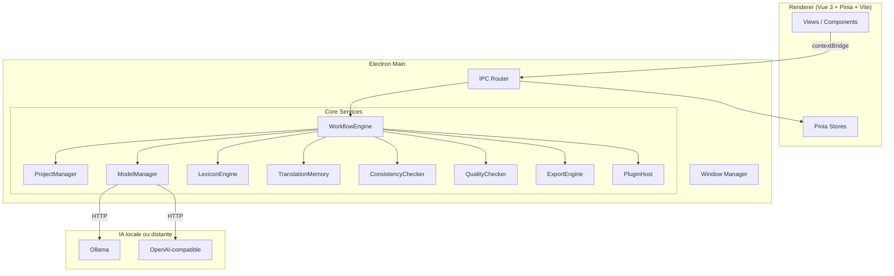

# Diagramme d’architecture globale

```mermaid
flowchart TB
    subgraph Renderer["Renderer (Vue 3 + Pinia + Vite)"]
        Views["Views / Components"]
        Stores["Pinia Stores"]
    end

    subgraph Electron["Electron Main"]
        IPC["IPC Router"]
        Window["Window Manager"]
        subgraph Core["Core Services"]
            PM["ProjectManager"]
            MM["ModelManager"]
            WE["WorkflowEngine"]
            LE["LexiconEngine"]
            TM["TranslationMemory"]
            CC["ConsistencyChecker"]
            QC["QualityChecker"]
            EE["ExportEngine"]
            PH["PluginHost"]
        end
    end

    subgraph External["IA locale ou distante"]
        Ollama["Ollama"]
        OpenAI["OpenAI-compatible"]
    end

    Views -->|contextBridge| IPC
    IPC --> Stores
    IPC --> WE
    WE --> PM
    WE --> MM
    WE --> LE
    WE --> TM
    WE --> CC
    WE --> QC
    WE --> EE
    WE --> PH
    MM -->|HTTP| Ollama
    MM -->|HTTP| OpenAI
```
