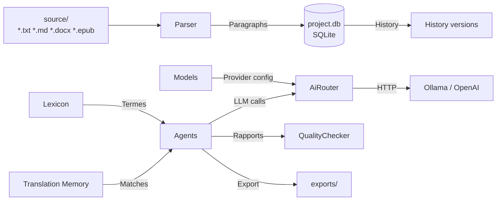

# Diagramme des flux de données

```mermaid
flowchart LR
    Source["source/\n*.txt *.md *.docx *.epub"] --> Parser["Parser"]
    Parser -->|Paragraphs| DB[("project.db\nSQLite")]
    Lexicon["Lexicon"] -->|Termes| Agents
    TM["Translation Memory"] -->|Matches| Agents
    Models["Models"] -->|Provider config| AiRouter["AiRouter"]
    AiRouter -->|HTTP| Ollama["Ollama / OpenAI"]
    Agents -->|LLM calls| AiRouter
    Agents -->|Rapports| QC["QualityChecker"]
    Agents -->|Export| Files["exports/"]
    DB -->|History| History["History versions"]
```
