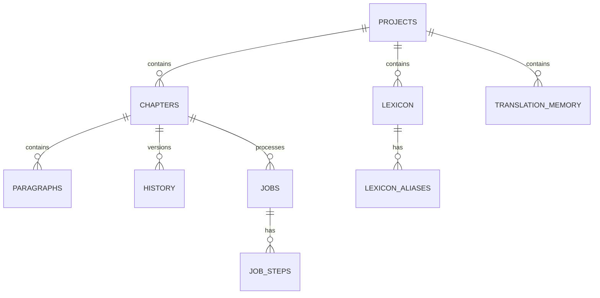

# Diagramme entité-relation simplifié

```mermaid
erDiagram
    PROJECTS ||--o{ CHAPTERS : contains
    PROJECTS ||--o{ LEXICON : contains
    PROJECTS ||--o{ TRANSLATION_MEMORY : contains
    CHAPTERS ||--o{ PARAGRAPHS : contains
    CHAPTERS ||--o{ HISTORY : versions
    CHAPTERS ||--o{ JOBS : processes
    JOBS ||--o{ JOB_STEPS : has
    LEXICON ||--o{ LEXICON_ALIASES : has
```
