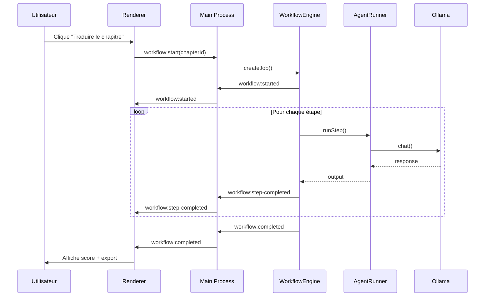

# Diagramme de séquence — Lancer un workflow

```mermaid
sequenceDiagram
    participant U as Utilisateur
    participant R as Renderer
    participant M as Main Process
    participant W as WorkflowEngine
    participant A as AgentRunner
    participant O as Ollama

    U->>R: Clique "Traduire le chapitre"
    R->>M: workflow:start(chapterId)
    M->>W: createJob()
    W->>M: workflow:started
    M->>R: workflow:started
    loop Pour chaque étape
        W->>A: runStep()
        A->>O: chat()
        O-->>A: response
        A-->>W: output
        W->>M: workflow:step-completed
        M->>R: workflow:step-completed
    end
    W->>M: workflow:completed
    M->>R: workflow:completed
    R->>U: Affiche score + export
```
