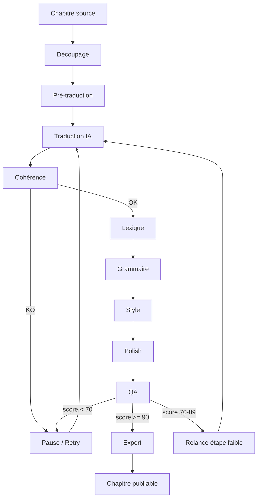

# Diagramme du workflow

```mermaid
flowchart TD
    A["Chapitre source"] --> B["Découpage"]
    B --> C["Pré-traduction"]
    C --> D["Traduction IA"]
    D --> E["Cohérence"]
    E -->|OK| F["Lexique"]
    E -->|KO| P["Pause / Retry"]
    F --> G["Grammaire"]
    G --> H["Style"]
    H --> I["Polish"]
    I --> J["QA"]
    J -->|score >= 90| K["Export"]
    J -->|score 70-89| L["Relance étape faible"]
    J -->|score < 70| P
    K --> M["Chapitre publiable"]
    L --> D
    P --> D
```
