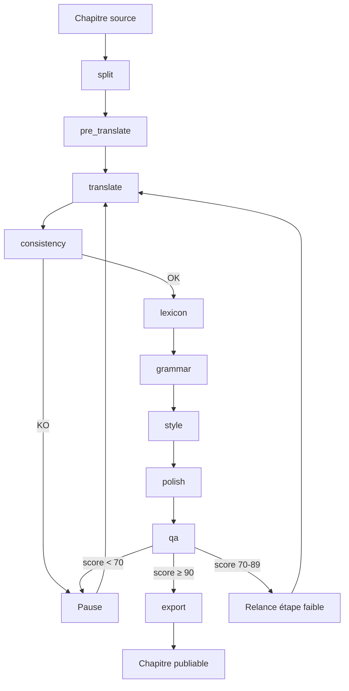

# Guide développeur

> **Références canoniques du SDD** :
> - [Volume 3 — Gestion des modèles IA](/volumes/03-AI-Models)
> - [Volume 7 — Workflow Engine](/volumes/07-Workflow)
> - [Volume 8 — Agents](/volumes/08-Agents)
> - [Volume 9 — Translation Memory](/volumes/09-Translation-Memory)
> - [Volume 10 — Lexique](/volumes/10-Lexicon)
> - [Volume 13 — Export](/volumes/13-Export)
> - [Volume 25 — Prompt Book](/volumes/25-Prompt-Book)
>
> Ce guide ne réinvente pas les interfaces. Il montre **comment étendre** NovelTrad 2.0 en s'appuyant sur les contrats déjà définis.

---

## Sommaire

- [Architecture multi-agent en pratique](#architecture-multi-agent-en-pratique)
- [Ajouter un agent](#ajouter-un-agent)
- [Brancher un provider IA](#brancher-un-provider-ia)
- [Modifier le pipeline](#modifier-le-pipeline)
- [Translation Memory et Lexique](#translation-memory-et-lexique)
- [Tests obligatoires](#tests-obligatoires)
- [Déboguer un agent](#déboguer-un-agent)
- [Ajouter un format d'export](#ajouter-un-format-dexport)
- [Patterns inspirés des projets similaires](#patterns-inspirés-des-projets-similaires)

---

## Architecture multi-agent en pratique

### Vue d'ensemble

```text
Renderer (Vue 3 + Pinia)
    ↓  IPC contextBridge
Electron Main (Window Manager + IPC Router)
    ↓
Managers (WorkflowEngine, ProjectManager, ModelManager, ExportEngine...)
    ↓
Services (AiRouter, LexiconEngine, TranslationMemoryEngine, ConsistencyChecker, QualityChecker...)
    ↓  HTTP / REST
Providers IA (Ollama, OpenAI, Anthropic, Gemini, OpenRouter, LMStudio, custom OpenAI-compatible)
```

### Les 10 agents natifs

| Stage | Agent | Rôle | Entrée principale | Sortie principale | Modèle recommandé |
|---|---|---|---|---|---|
| `split` | **SplitAgent** | Découper le chapitre en paragraphes numérotés | `text` brut | `paragraphs` | aucun (règles) |
| `pre_translate` | **PreTranslateAgent** | Brouillon littéral rapide | `paragraphs` source | `paragraphs` avec `preTranslatedText` | `qwen3.5:4b` |
| `translate` | **TranslateAgent** | Traduction littéraire qualité | `paragraphs` + lexique + TM | `paragraphs` avec `translatedText` | `qwen3.5:9b` |
| `consistency` | **ConsistencyAgent** | Vérifier source ↔ cible | `paragraphs` source + traduits | `ConsistencyReport` | `qwen3.5:9b` |
| `lexicon` | **LexiconAgent** | Appliquer impérativement le lexique | `text` + lexique | `text` corrigé + `substitutions` | `qwen3.5:9b` |
| `grammar` | **GrammarAgent** | Corriger grammaire/ponctuation | `text` traduit | `text` corrigé + `corrections` | `qwen3.5:9b` |
| `style` | **StyleAgent** | Réécrire pour fluidité | `text` traduit | `text` réécrit | `qwen3.5:9b` (ou modèle plus grand selon disponibilité) |
| `polish` | **PolishAgent** | Passage éditorial final | `text` réécrit | `text` final | `qwen3.5:9b` (ou modèle plus grand selon disponibilité) |
| `qa` | **QAAgent** | Évaluer la qualité | `paragraphs` + rapports | `QualityReport` | `qwen3.5:9b` JSON mode |
| `export` | **ExportAgent** | Formater le fichier final | `paragraphs` + format + métadonnées | chemin fichier exporté | aucun IA |

### Mapping avec les rôles d'autres projets

Les projets similaires utilisent des vocabulaires légèrement différents. Voici comment ils se mappent sur l'architecture existante de NovelTrad :

| Rôle commun (honya / LaTeXTrans / TransAgents) | Agent NovelTrad | Justification |
|---|---|---|
| **Orchestrator** | `WorkflowEngine` | Ordonne les étapes, gère les événements, persiste l'état. |
| **Parser** | `SplitAgent` | Transforme le texte brut en paragraphes numérotés. |
| **Translator** | `TranslateAgent` | Traduction principale avec mémoire et lexique. |
| **Reviewer** | `ConsistencyAgent` + `QAAgent` + `PolishAgent` | Revue structurelle, scoring, passe éditoriale. |
| **Validator** | `ConsistencyAgent` | Vérifie que la cible correspond à la source. |
| **Terminology agent** | `LexiconAgent` | Applique et corrige les termes du lexique. |
| **Summarizer** | *Piste d'évolution* | Maintient un résumé global du roman pour la cohérence long terme. |

### Séquence d'exécution et décisions



### Orchestration, fallback et retry

Le `WorkflowEngine` gère déjà l'ordre, la reprise et les erreurs (Volume 7 §7.4, §7.8, §7.10, §7.11) :

- **Retry** : 3 tentatives par étape, backoff exponentiel sur les erreurs réseau.
- **Pause** : si une étape échoue, le job passe en `paused` ; l'utilisateur peut corriger lexique/prompt/modèle.
- **Retry partiel** : `retryStep(jobId, stepId)` relance une étape ; `retryFrom(jobId, stage)` relance depuis une étape.
- **Fallback provider** : défini dans la table `models` (`is_fallback = 1`). Si le principal échoue après retry, le fallback prend le relais (Volume 3 §3.5).
- **Circuit breaker** : si Ollama échoue 3 fois consécutivement, le provider est marqué indisponible (Volume 1 §1.5).
- **Resumability** : à chaque changement de statut, le job et les steps sont persistés dans `jobs` / `job_steps`. Au redémarrage, les jobs `running` ou `paused` sont rechargés.

---

## Ajouter un agent

### Étape 1 : choisir un stage

Réutilisez un stage existant si votre agent remplace ou enrichit une étape. Sinon, ajoutez une valeur au type union `WorkflowStage` (Volume 7 §7.4) :

```typescript
type WorkflowStage =
  | 'split'
  | 'pre_translate'
  | 'translate'
  | 'consistency'
  | 'lexicon'
  | 'grammar'
  | 'style'
  | 'polish'
  | 'qa'
  | 'export'
  | 'my_custom' // ajout
```

### Étape 2 : implémenter l'interface `Agent`

Le contrat exact est défini dans [Volume 8 §8.1](/volumes/08-Agents#81-contrat-commun) :

```typescript
import { Agent, AgentInput, AgentOutput, AgentContext } from '@noveltrad/agent-contracts'

export class MyCustomAgent implements Agent {
  readonly id = 'my_custom'
  readonly name = 'My Custom Agent'
  readonly stage = 'my_custom' as WorkflowStage

  // Schémas JSON utilisés pour la validation automatique
  readonly inputSchema = {
    $schema: 'http://json-schema.org/draft-07/schema#',
    type: 'object',
    properties: { text: { type: 'string' } },
    required: ['text']
  }
  readonly outputSchema = {
    $schema: 'http://json-schema.org/draft-07/schema#',
    type: 'object',
    properties: {
      text: { type: 'string' },
      score: { type: 'number', minimum: 0, maximum: 100 }
    },
    required: ['text']
  }

  readonly defaultModel = 'qwen3.5:9b'

  async execute(input: AgentInput, context: AgentContext): Promise<AgentOutput> {
    const { text } = input
    context.emitProgress(0, 'Démarrage...')

    const result = await context.aiRouter.chat(
      [
        { role: 'system', content: this.loadPrompt(context) },
        { role: 'user', content: text }
      ],
      {
        model: context.options.modelId ?? this.defaultModel,
        temperature: 0.3
      }
    )

    context.emitProgress(100, 'Terminé')

    return {
      text: result,
      score: 95,
      metadata: { modelUsed: context.options.modelId ?? this.defaultModel }
    }
  }

  private loadPrompt(context: AgentContext): string {
    // Charger depuis packages/agent-contracts/prompts/my_custom.system.txt
    return context.promptLoader.get('my_custom', 'system')
  }
}
```

::: tip
`AgentInput` et `AgentOutput` sont définis dans [Volume 8 §8.1](/volumes/08-Agents#81-contrat-commun). Les JSON Schemas de référence sont dans `docs/examples/schemas/agent-input.schema.json` et `agent-output.schema.json`.
:::

### Étape 3 : enregistrer dans `AgentFactory`

```typescript
// src/main/services/AgentFactory.ts
class AgentFactory {
  create(stage: WorkflowStage, overrides?: Partial<AgentConfig>): Agent {
    // ...
    switch (stage) {
      // agents natifs
      case 'my_custom': return new MyCustomAgent(config, this.aiRouter, this.promptLoader)
      default:
        const pluginAgent = this.pluginHost.getAgent(stage)
        if (pluginAgent) return pluginAgent
        throw new Error(`Unknown workflow stage: ${stage}`)
    }
  }
}
```

### Étape 4 : enregistrer en base

```sql
INSERT INTO agents (id, name, stage, enabled, config_schema)
VALUES ('my_custom', 'My Custom Agent', 'my_custom', 1, '{"temperature": {"type": "number"}}');
```

La table `agents` est définie dans [Volume 6 §6.3](/volumes/06-Database).

### Étape 5 : ajouter le prompt

Créez `packages/agent-contracts/prompts/my_custom.system.txt` :

```yaml
id: my_custom-system
version: 1.0.0
agent: my_custom
role: system
language: fr
target_model: qwen3.5:9b
output_format: text
---
You are a specialized literary processing agent.
Process the text below according to the project instructions.
{text}
```

Les conventions de prompt sont dans [Volume 25 §25.2](/volumes/25-Prompt-Book#252-structure-dun-prompt).

---

### Exemple complet : ajouter un agent `SummarizerAgent`

Supposons que l'on veuille ajouter un agent qui maintient un résumé global du roman pour améliorer la cohérence long terme (inspiré de `LaTeXTrans` / `RepoTransAgent`, voir [REUSE_MAP.md](https://github.com/Balrog57/NovelTrad-Documentation/blob/main/REUSE_MAP.md)).

#### 1. Déclarer le stage

Dans `packages/shared/src/types/workflow.ts` :

```typescript
export type WorkflowStage =
  | 'split' | 'pre_translate' | 'translate' | 'consistency'
  | 'lexicon' | 'grammar' | 'style' | 'polish' | 'qa'
  | 'summarize' // nouveau
  | 'export'
```

#### 2. Implémenter l'agent

```typescript
// src/main/services/agents/SummarizerAgent.ts
import type { Agent, AgentInput, AgentOutput } from '@noveltrad/shared'

export class SummarizerAgent implements Agent {
  readonly id = 'summarize'
  readonly name = 'Summarizer'
  readonly stage = 'summarize'
  readonly inputSchema = { type: 'object', properties: { chapterId: { type: 'string' } } }
  readonly outputSchema = { type: 'object', properties: { summary: { type: 'string' } } }

  async execute(input: AgentInput): Promise<AgentOutput> {
    const summary = await this.aiRouter.chat(/* prompt résumé */)
    return { summary }
  }
}
```

#### 3. L'enregistrer dans `AgentFactory`

```typescript
// src/main/services/agents/AgentFactory.ts
import { SummarizerAgent } from './SummarizerAgent'

agentFactory.register('summarize', (config) => new SummarizerAgent(config))
```

#### 4. Ajouter le prompt versionné

```text
// packages/agent-contracts/prompts/summarize-system.txt
You are a literary continuity assistant. Given the following chapter summary and the current chapter,
update the global summary of the novel in {targetLanguage}. Keep it under 500 words.
Return only the updated summary as plain text.
```

#### 5. Insérer le stage dans le pipeline

```typescript
// src/main/services/WorkflowEngine.ts
const defaultPipeline: WorkflowStage[] = [
  'split', 'pre_translate', 'translate', 'consistency',
  'lexicon', 'grammar', 'style', 'polish', 'summarize', 'qa', 'export'
]
```

#### 6. Écrire les tests obligatoires

- Test unitaire : `SummarizerAgent.execute` retourne un résumé non vide.
- Test de schéma : la sortie respecte `outputSchema`.
- Test d'intégration : un workflow contenant `summarize` passe de bout en bout.
- Test de fallback JSON : si la sortie est mal formée, le prompt `json-fix` est utilisé (si sortie JSON).
- Test de non-régression : les jeux de tests historiques continuent de passer.

#### 7. Mettre à jour la documentation

- Ajouter une ligne dans le tableau des agents de ce guide.
- Documenter l'entrée/sortie et le modèle recommandé dans [Volume 8](/volumes/08-Agents).
- Si l'agent reprend un pattern existant, citer le projet inspirant dans [REUSE_MAP.md](https://github.com/Balrog57/NovelTrad-Documentation/blob/main/REUSE_MAP.md).

---

## Brancher un provider IA
## Brancher un provider IA

### Interface `AiProvider`

Le contrat canonique est dans [Volume 3 §3.2](/volumes/03-AI-Models#32-modèle-unifié) :

```typescript
export interface AiProvider {
  readonly id: string
  readonly name: string
  readonly host?: string
  readonly apiKey?: string

  listModels(): Promise<string[]>
  chat(messages: ChatMessage[], options?: ChatOptions): Promise<string>
  streamChat(messages: ChatMessage[], options?: ChatOptions): AsyncIterable<string>
  embeddings(texts: string[]): Promise<number[][]>
  isAvailable(): Promise<boolean>
}
```

### Exemple : provider custom OpenAI-compatible

```typescript
// src/main/services/providers/CustomProvider.ts
import OpenAI from 'openai'
import { AiProvider, ChatMessage, ChatOptions } from '@noveltrad/shared'

export class CustomProvider implements AiProvider {
  readonly id = 'custom'
  readonly name = 'Custom Provider'

  private client: OpenAI

  constructor(
    public readonly host: string,
    public readonly apiKey?: string
  ) {
    this.client = new OpenAI({ baseURL: host, apiKey })
  }

  async listModels(): Promise<string[]> {
    const response = await this.client.models.list()
    return response.data.map(m => m.id)
  }

  async chat(messages: ChatMessage[], options?: ChatOptions): Promise<string> {
    const completion = await this.client.chat.completions.create({
      model: options?.model ?? 'default',
      messages,
      stream: false,
      temperature: options?.temperature ?? 0.7
    })
    return completion.choices[0].message.content ?? ''
  }

  async *streamChat(messages: ChatMessage[], options?: ChatOptions): AsyncIterable<string> {
    const stream = await this.client.chat.completions.create({
      model: options?.model ?? 'default',
      messages,
      stream: true,
      temperature: options?.temperature ?? 0.7
    })

    for await (const chunk of stream) {
      const content = chunk.choices[0]?.delta?.content
      if (content) yield content
    }
  }

  async embeddings(texts: string[]): Promise<number[][]> {
    const response = await this.client.embeddings.create({
      model: options?.model ?? 'text-embedding-3-small',
      input: texts
    })
    return response.data.map(d => d.embedding)
  }

  async isAvailable(): Promise<boolean> {
    try {
      await this.listModels()
      return true
    } catch {
      return false
    }
  }
}
```

### Enregistrer dans `ModelManager` / `AiRouter`

```typescript
// src/main/services/ModelManager.ts
const providers: Record<string, AiProvider> = {
  ollama: new OllamaProvider(config.ollamaHost),
  openai: new OpenAIProvider(config.openaiKey),
  // ...
  custom: new CustomProvider(config.customHost, config.customApiKey)
}
```

### UI de configuration

Dans `src/renderer/views/SettingsModels.vue`, ajoutez les champs `custom.host` et `custom.apiKey`. Le bouton "Tester" doit appeler `provider.isAvailable()` et afficher la latence (Volume 3 §3.4).

### Priorité et fallback

Définissez le provider principal et le fallback dans la table `models` (Volume 3 §3.5) :

```sql
INSERT INTO models (id, provider, name, model, host, api_key, is_default, is_fallback)
VALUES
  ('ollama-main',   'ollama',  'Ollama local',  'qwen3.5:9b',  'http://localhost:11434', NULL, 1, 0),
  ('openai-fb',     'openai',  'OpenAI fallback', 'gpt-4o-mini', NULL, 'sk-...', 0, 1);
```

---

## Modifier le pipeline

### Pipeline par défaut

```typescript
// src/main/services/WorkflowEngine.ts
const DEFAULT_STAGES: WorkflowStage[] = [
  'split',
  'pre_translate',
  'translate',
  'consistency',
  'lexicon',
  'grammar',
  'style',
  'polish',
  'qa',
  'export'
]
```

### Pipeline custom

```typescript
const job = await workflowEngine.createJob({
  projectId: 'proj-001',
  chapterId: 'ch-001',
  options: {
    startStage: 'translate',     // recommencer à la traduction
    stopStage: 'qa',             // s'arrêter avant l'export
    skipStages: ['pre_translate'],
    modelId: 'qwen3.5:9b',
    fastModelId: 'qwen3.5:4b',
    maxRetries: 2
  }
})

await workflowEngine.start(job.id)
```

### Relance partielle

```typescript
// Relancer une étape en échec
await workflowEngine.retryStep(jobId, stepId)

// Relancer depuis une étape donnée
await workflowEngine.retryFrom(jobId, 'style')
```

Ces méthodes sont décrites dans [Volume 7 §7.8](/volumes/07-Workflow#78-retry-et-relance-partielle).

### Ajouter un stage custom

1. Ajouter la valeur au type `WorkflowStage`.
2. Créer l'agent et l'enregistrer dans `AgentFactory`.
3. Insérer l'agent dans la table `agents`.
4. Ajouter le prompt dans `packages/agent-contracts/prompts/`.
5. (Optionnel) Enregistrer le stage dans la configuration par défaut du `WorkflowEngine`.

---

## Translation Memory et Lexique

::: warning
Ne parlez pas de "cache mémoire" dans le code ou la doc. NovelTrad utilise une **Translation Memory** (phrases) et un **Lexique** (termes). Ce sont des bases de données persistantes, pas des caches volatiles.
:::

### Trois niveaux de contexte

| Niveau | Stockage | Rôle | Volume |
|---|---|---|---|
| **Translation Memory** | SQLite `translation_memory` | Phrases source → cible, exact/fuzzy/semantic match | [Volume 9](/volumes/09-Translation-Memory) |
| **Lexique** | SQLite `lexicon` + `lexicon_aliases` | Termes verrouillés, alias, catégories | [Volume 10](/volumes/10-Lexicon) |
| **Contexte RAG** | Embeddings dans `translation_memory.embedding` | Recherche sémantique des passages similaires | [Volume 9 §9.7](/volumes/09-Translation-Memory#97-recherche-par-embeddings-rag-v15) |

### Cycle de vie de la Translation Memory

```text
Traduction validée
    ↓
Découpage en phrases (segmentSentences)
    ↓
Stockage dans translation_memory (source_text, target_text, usage_count=1)
    ↓
Indexation embedding si activée (EmbeddingIndex.index)
    ↓
Réutilisation par exactMatch / fuzzyMatches / semanticMatches
```

Le moteur d'aide aux agents injecte un `memoryBlock` dans le prompt (Volume 9 §9.6, Volume 25 §25.4).

### Priorité des matches

1. Exact match du projet.
2. Fuzzy match fort (> 0.95) du projet.
3. Exact match global.
4. Fuzzy match (> 0.85) global.
5. Match par embeddings (> 0.80).

Définie dans [Volume 9 §9.4](/volumes/09-Translation-Memory#94-priorité).

### Lexique verrouillé

Un terme `locked = 1` ne peut jamais être traduit autrement. L'agent `LexiconAgent` :

1. Trie les entrées par longueur décroissante.
2. Applique les substitutions en préservant la casse contextuelle.
3. Signale les substitutions sur les termes verrouillés.

Défini dans [Volume 10 §10.5](/volumes/10-Lexicon#105-verrouillage) et §10.11.

### Mise à jour depuis une correction manuelle

Quand un utilisateur corrige manuellement une traduction :

1. La table `paragraphs` est mise à jour (`translated_text`).
2. La Translation Memory est mise à jour (`target_text`, `usage_count` réinitialisé).
3. Une nouvelle version est créée dans `history`.

```typescript
// src/main/services/TranslationMemory.ts
updateFromManualEdit(source: string, newTarget: string, projectId: string): void
```

---

## Tests obligatoires

Chaque agent ou provider doit passer au minimum les tests définis dans [Volume 8 §8.13](/volumes/08-Agents#813-tests-dun-agent) :

1. **Test nominal** — input fixe → sortie attendue.
2. **Test de validation JSON Schema** — sortie conforme à `outputSchema`.
3. **Test de préservation** — nombre de paragraphes / texte structuré conservé.
4. **Test d'erreur** — provider injoignable, fallback correct.
5. **Test de cas limite** — texte vide, très long, lexique vide.

### Exemple avec Vitest

```typescript
import { describe, it, expect, vi } from 'vitest'
import { MyCustomAgent } from './MyCustomAgent'
import agentOutputSchema from '@noveltrad/shared/schemas/agent-output.schema.json'

const mockAiRouter = {
  chat: vi.fn().mockResolvedValue('Processed text')
}

const mockContext = {
  jobId: 'job-1',
  stepId: 'step-1',
  projectId: 'proj-1',
  options: {},
  emitProgress: vi.fn(),
  logger: { info: vi.fn(), debug: vi.fn() },
  promptLoader: { get: vi.fn().mockReturnValue('You are a helper.') }
}

describe('MyCustomAgent', () => {
  it('préserve le nombre de paragraphes', async () => {
    const agent = new MyCustomAgent({}, mockAiRouter)
    const output = await agent.execute({
      projectId: 'proj-1',
      paragraphs: [
        { id: 'p1', indexInChapter: 1, sourceText: 'Hello', translatedText: '' }
      ]
    }, mockContext)

    expect(output.paragraphs).toHaveLength(1)
  })

  it('retourne une sortie conforme au schéma', async () => {
    const agent = new MyCustomAgent({}, mockAiRouter)
    const output = await agent.execute({
      projectId: 'proj-1',
      text: 'Hello world'
    }, mockContext)

    const ajv = new Ajv()
    const validate = ajv.compile(agentOutputSchema)
    expect(validate(output)).toBe(true)
  })
})
```

---

## Déboguer un agent

### Logs

`AgentContext` expose un logger :

```typescript
context.logger.info('Agent started', { chapterId: input.chapterId, step: this.stage })
context.logger.debug('Prompt', { prompt: systemPrompt })
context.logger.warn('Retrying', { attempt: 2 })
context.logger.error('Agent failed', { error: err.message })
```

### Snapshots

À chaque étape, `job_steps` stocke `input_snapshot` et `output_snapshot` (JSON). Vous pouvez relancer une étape individuelle sans tout recommencer :

```typescript
await workflowEngine.retryStep(jobId, stepId)
```

### Inspection manuelle

| Emplacement | Contenu |
|---|---|
| `<projet>/noveltrad.db` | Base SQLite (jobs, steps, TM, lexique, history). |
| `<projet>/.noveltrad/cache/` | Snapshots intermédiaires (si activé). |
| `~/.noveltrad/logs/` | Logs applicatifs. |

---

## Ajouter un format d'export

### Interface `ExportPlugin`

Le contrat est dans [Volume 13 §13.7](/volumes/13-Export#137-plugins-dexport) :

```typescript
interface ExportPlugin {
  id: string
  name: string
  supportedFormats: string[]
  export(input: ExportInput): Promise<Buffer | string>
}
```

### Exemple : export JSON

```typescript
// src/main/services/plugins/JsonExportPlugin.ts
import { ExportPlugin, ExportInput } from '@noveltrad/shared'

export class JsonExportPlugin implements ExportPlugin {
  readonly id = 'json'
  readonly name = 'JSON Export'
  readonly supportedFormats = ['json']

  async export(input: ExportInput): Promise<string> {
    return JSON.stringify({
      title: input.title,
      author: input.author,
      language: input.project?.targetLanguage,
      paragraphs: input.paragraphs.map(p => ({
        source: p.sourceText,
        translation: p.translatedText
      }))
    }, null, 2)
  }
}
```

### Enregistrer dans `ExportEngine`

```typescript
// src/main/services/ExportEngine.ts
const plugins: ExportPlugin[] = [
  new MarkdownExportPlugin(),
  new TxtExportPlugin(),
  new HtmlExportPlugin(),
  new DocxExportPlugin(),
  new EpubExportPlugin(),
  new JsonExportPlugin() // ajout
]
```

### Validation

Ajoutez une règle dans `ExportEngine.validate` (Volume 13 §13.8) :

```typescript
if (format === 'json') {
  JSON.parse(content) // doit parser sans erreur
}
```

---

## Patterns inspirés des projets similaires

### honya — Orchestrator / Translator / Reviewer

- **Ce qu'on garde** : l'agent `Reviewer` de honya est décomposé chez NovelTrad en `ConsistencyAgent`, `QAAgent` et `PolishAgent`. Pas besoin de nouvel agent.
- **Ce qu'on peut ajouter** : un mode "review loop" où `PolishAgent` peut relancer `StyleAgent` si le score reste faible.

### LaTeXTrans — Parser / Validator / Summarizer / Terminology / Generator

- **Ce qu'on garde** : `Parser` = `SplitAgent`, `Validator` = `ConsistencyAgent`, `Terminology` = `LexiconAgent`, `Generator` = `ExportAgent`.
- **Ce qu'on peut ajouter** : un agent `Summarizer` optionnel en v1.5+ qui maintient un résumé global du roman pour la cohérence long terme.

### NovelTrans — Resumability, QA queue, termes forbidden/locked

- **Ce qu'on garde** : la resumability est déjà implémentée via `jobs`/`job_steps` persistants.
- **Ce qu'on peut ajouter** :
  - **Termes "forbidden"** : champ `forbidden` dans `lexicon` pour interdire certaines traductions.
  - **QA queue** : file d'attente des paragraphes/chapitres marqués comme suspects par `QAAgent`.

### AnythingLLM / Chatbox — Workspaces par projet

- **Ce qu'on garde** : chaque projet NovelTrad est déjà un workspace autonome (SQLite + fichiers + paramètres modèle).
- **Ce qu'on peut ajouter** : UI de "sélection de workspace" avec settings modèle, temperature, system prompt par projet.

### OmegaT / Ebook Translator (Calibre)

- **Ce qu'on garde** : glossaire verrouillé, mémoire de traduction, export TMX.
- **Ce qu'on peut ajouter** :
  - Segmentation fine au niveau phrase (déjà dans TM, §9.2).
  - Parsing EPUB sans destruction du markup (Volume 13).
  - Interface côte à côte source/cible segment par segment.

### RepoTransAgent — RAG repository-aware

- **Ce qu'on garde** : la TM et le lexique forment déjà une base de connaissances projet.
- **Ce qu'on peut ajouter** : indexation sémantique des chapitres précédents pour enrichir le contexte du prompt de traduction.

---

## Checklist avant de contribuer un agent

- [ ] Le stage est défini dans le type `WorkflowStage`.
- [ ] L'agent implémente `Agent` avec `id`, `name`, `stage`, `inputSchema`, `outputSchema`, `execute`.
- [ ] L'agent est enregistré dans `AgentFactory`.
- [ ] L'agent est inséré dans la table `agents`.
- [ ] Le prompt est versionné dans `packages/agent-contracts/prompts/`.
- [ ] Les 5 tests obligatoires sont écrits.
- [ ] `npm run build` et `npm run sdd:concat` passent.

---

## Ressources

- [Volume 3 — Gestion des modèles IA](/volumes/03-AI-Models)
- [Volume 7 — Workflow Engine](/volumes/07-Workflow)
- [Volume 8 — Agents](/volumes/08-Agents)
- [Volume 9 — Translation Memory](/volumes/09-Translation-Memory)
- [Volume 10 — Lexique](/volumes/10-Lexicon)
- [Volume 13 — Export](/volumes/13-Export)
- [Volume 25 — Prompt Book](/volumes/25-Prompt-Book)
- [Projets similaires et inspirations](/inspirations)
- [REUSE_MAP.md](https://github.com/Balrog57/NovelTrad-Documentation/blob/main/REUSE_MAP.md)
- [CLAIMS_TO_VERIFY.md](https://github.com/Balrog57/NovelTrad-Documentation/blob/main/CLAIMS_TO_VERIFY.md)
