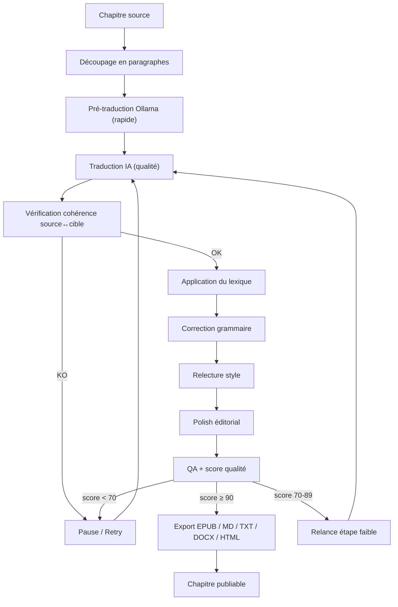

---
layout: home

hero:
  name: "NovelTrad 2.0"
  text: "Software Design Document"
  tagline: "Moteur de traduction de romans assisté par IA multi-agent — architecture, workflow et référence complète."
  actions:
    - theme: brand
      text: Commencer par la Vision
      link: /volumes/00-Vision
    - theme: alt
      text: Voir l'Architecture
      link: /volumes/01-Architecture
    - theme: alt
      text: GitHub
      link: https://github.com/Balrog57/noveltrad

features:
  - title: 26 volumes
    details: Vision, architecture, UI, base de données, workflow multi-agents, prompts, sécurité, CI/CD.
  - title: Basé sur Context7
    details: API et bonnes pratiques alignées avec la documentation officielle des bibliothèques (voir la note Context7 ci-dessous).
  - title: Prêt pour les agents IA
    details: Cahier des charges, schémas, exemples et critères d'acceptation pour Codex, Claude Code, OpenCode, Cursor.
  - title: Recherche intégrée
    details: Moteur de recherche local VitePress pour trouver instantanément un volume, une table ou un prompt.
---

## 🚧 Statut du document

<Badge type="warning" text="DRAFT v2.0.0" />

Ce SDD est en cours de rédaction. Les volumes 0 à 12 sont considérés comme **stables** ; les volumes 13 à 25 sont en **révision** ou en **draft**.

| Tranche | Statut |
|---|---|
| Volumes 00 — 12 (fondation, UI, moteur de traduction) | ✅ Stable |
| Volumes 13 — 16 (export, historique, plugins, API) | 🔄 Révision |
| Volumes 17 — 25 (infra, sécurité, plan, prompts) | 📝 Draft |

---

## À propos

Ce site est la documentation d'architecture de **NovelTrad 2.0**, une application de bureau **Electron + Vue 3 + TypeScript** pour la traduction assistée par IA de romans et web-novels.

La stack technique est volontairement simple : **Node.js only + Ollama + SQLite**, sans dépendance Python ni NLLB.

---

## Pourquoi NovelTrad ?

Contrairement aux traducteurs IA classiques :

- ❌ traduction chapitre par chapitre sans mémoire ;
- ❌ perte de cohérence entre chapitres ;
- ❌ glossaire statique et manuel ;
- ❌ qualité non mesurée ;
- ❌ pipelines non reproductibles.

NovelTrad 2.0 introduit :

- ✅ **Translation Memory** persistante au niveau phrase + RAG interne.
- ✅ **Lexique dynamique** avec termes verrouillés et alias.
- ✅ **10 agents spécialisés** (cohérence, style, polish, QA, export).
- ✅ **Score qualité** global et par dimension.
- ✅ **Workflow reproductible**, observable, relançable pas à pas.
- ✅ **Export natif** EPUB / DOCX / Markdown / TXT / HTML.
- ✅ **100 % local possible** avec Ollama.

## Cycle de vie d'un chapitre

---

## Navigation rapide

Utilisez la barre latérale pour parcourir les 26 volumes, ou la **recherche en haut à droite** (Ctrl+K) pour trouver un terme technique.

---

## Exemple d'utilisation

1. Créer un projet.
2. Importer un roman ou un chapitre.
3. Configurer un provider IA (Ollama local recommandé).
4. Lancer `Traduire le chapitre`.
5. Vérifier le glossaire auto et le rapport de cohérence.
6. Exporter en EPUB.

---

## Qu'est-ce que Context7 ?

> **Context7** est un standard de contexte documentaire utilisé ici pour garantir que les choix techniques (Electron, Vue, Ollama, SQLite, Pinia...) s'appuient sur la documentation officielle des bibliothèques. Chaque volume mentionne les références Context7 pertinentes afin que les agents IA et les développeurs puissent vérifier les API au lieu de deviner.

---

## Pour les agents IA

Pour ingérer l'intégralité de ce SDD en un seul contexte, utilisez le fichier [`llms.txt`](./llms.txt).
