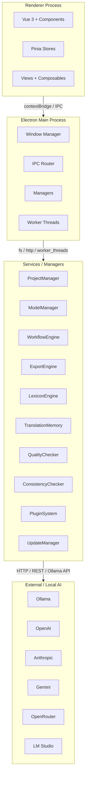
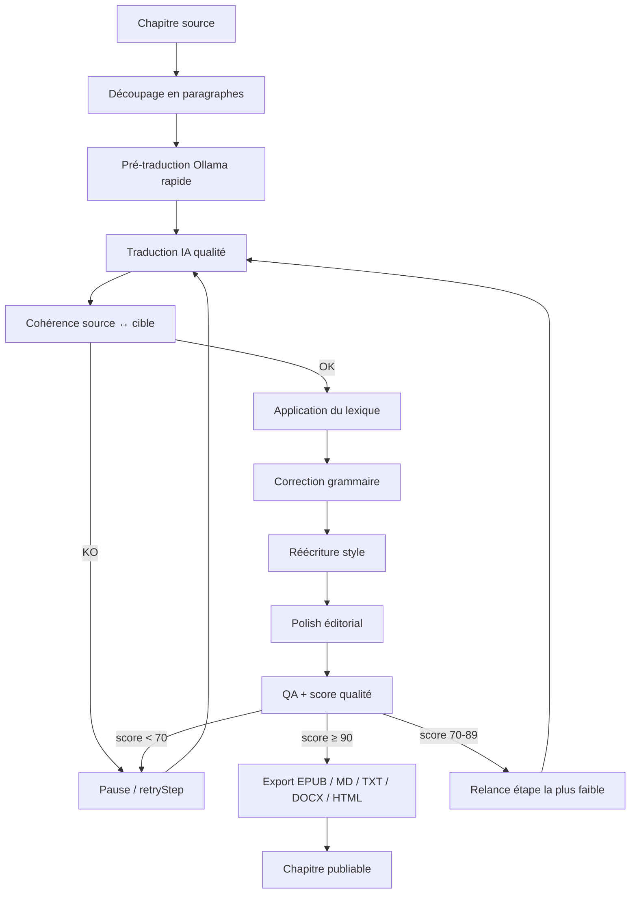

# NovelTrad 2.0 — Software Design Document complet

::: tip
Cette page contient l'intégralité des 26 volumes du SDD dans un seul fichier, pour lecture hors ligne ou impression.
:::

## Table des matières

- [Sans titre](#sans-titre)
- [Sans titre](#sans-titre)
- [Volume 2 — Installation et premier lancement](#volume-2-installation-et-premier-lancement)
- [Sans titre](#sans-titre)
- [Volume 4 — Interface utilisateur](#volume-4-interface-utilisateur)
- [Chapitre 1 : Le réveil](#chapitre-1-le-rveil)
- [Volume 6 — Base de données](#volume-6-base-de-donnes)
- [Sans titre](#sans-titre)
- [Sans titre](#sans-titre)
- [Volume 9 — Translation Memory](#volume-9-translation-memory)
- [Sans titre](#sans-titre)
- [Sans titre](#sans-titre)
- [Sans titre](#sans-titre)
- [Sans titre](#sans-titre)
- [Sans titre](#sans-titre)
- [Sans titre](#sans-titre)
- [Sans titre](#sans-titre)
- [Sans titre](#sans-titre)
- [Volume 18 — Journalisation](#volume-18-journalisation)
- [Volume 19 — Tests](#volume-19-tests)
- [Volume 20 — CI/CD](#volume-20-cicd)
- [Volume 21 — Sécurité](#volume-21-scurit)
- [Volume 22 — Performances](#volume-22-performances)
- [Sans titre](#sans-titre)
- [Sans titre](#sans-titre)
- [Sans titre](#sans-titre)

---

## Sans titre

# Volume 0 — Vision

## 0.1 Présentation

### Objectif

NovelTrad 2.0 est une application de bureau (Electron + Vue 3 + TypeScript) dédiée à la traduction assistée par IA de romans, web-novels et fan-fictions. L’objectif n’est plus de produire une traduction brute : il est de transformer un chapitre source en un chapitre **prêt à publier**, en un seul clic.

### Philosophie

- **Un seul bouton visible.** L’utilisateur clique sur *Traduire le chapitre*. Derrière, un workflow multi-agents exécute les étapes.
- **Autonomie totale.** Aucun serveur externe obligatoire : tout fonctionne localement avec Ollama (modèles recommandés : `qwen3.5:9b` pour la qualité, `qwen3.5:4b` pour la pré-traduction rapide).
- **Qualité prouvée.** Chaque chapitre reçoit un score qualité et un rapport de cohérence.
- **Extensibilité.** Le système de plugins permet d’ajouter de nouveaux modèles, exporteurs, agents ou workflows sans toucher au cœur.
- **Répétabilité.** Chaque projet est un dossier autonome contenant sources, lexique, traductions, cache, logs et base SQLite.

### Public visé

1. **Traducteurs amateurs** de web-novels chinois/coréens/japonais vers le français ou l’anglais.
2. **Éditeurs de fan-fictions** souhaitant industrialiser la relecture.
3. **Équipes de traduction** collaboratives (fichiers partagés via Git ou cloud).
4. **Développeurs** voulant étendre NovelTrad via plugins.

### Fonctionnalités principales (v1.0)

| ID | Feature | Priority |
|----|---------|----------|
| F01 | Gestion de projets autonomes (dossier + SQLite) | Must |
| F02 | Premier lancement guidé avec détection d’Ollama | Must |
| F03 | Configuration des fournisseurs IA (Ollama, OpenAI, Anthropic, Gemini, OpenRouter, LM Studio) | Must |
| F04 | Lexique structuré avec alias, catégories, priorité | Must |
| F05 | Translation Memory avec fuzzy matching | Must |
| F06 | Workflow multi-agents (pré-traduction, traduction, cohérence, lexique, grammaire, style, polish, QA, export) | Must |
| F07 | Vérification de cohérence avant/après | Must |
| F08 | Score qualité global et par dimension | Must |
| F09 | Export Markdown, TXT, DOCX, EPUB, HTML | Must |
| F10 | Historique des versions avec diff/rollback | Must |
| F11 | Traitement par lots avec file d’attente | Should |
| F12 | Auto-update via GitHub Releases | Should |
| F13 | Système de plugins | Could |
| F14 | RAG interne sur le lexique et les chapitres déjà traduits | Could |

### Fonctionnalités futures (v2.0+)

- Collaboration multi-utilisateurs (merge de traductions).
- Marketplace de plugins et de modèles.
- Mode serveur HTTP pour usage via navigateur.
- Comparaison côte à côte enrichie.
- Fine-tuning de modèle sur corpus projet.
- Audio/speech-to-text pour relecture.

## 0.2 Analyse des solutions existantes

### Points forts du marché

- **GPTWnTranslator** : pipeline automatique basé sur GPT.
- **OmegaT / Trados** : mémoire de traduction mature, mais interface lourde et pas d’IA native.
- **NovelAITrans** : workflow spécifique web-novel, mais peu extensible.
- **Deepl / Google Translate** : qualité générique, pas de gestion lexique propre.

### Points faibles

- Fragmentation : chaque outil fait une partie du travail.
- Peu de vérification automatique de cohérence.
- Gestion lexique manuelle ou inexistante.
- Pas de score qualité objectif.
- Dépendance aux API cloud coûteuses.

### Pourquoi repartir de zéro

La codebase v4 (PyQt6 + FastAPI Python) fonctionne mais mélange UI, backend, agents et pipeline dans un seul runtime Python. NovelTrad 2.0 adopte une architecture plus pérenne :

- UI moderne en Vue 3.
- Runtime Node.js unique côté desktop.
- Ollama comme seule dépendance IA locale.
- Workflow déclaratif, observable et testable.
- Système de plugins dès la conception.

## 0.3 Pourquoi NovelTrad ?

### Différenciation

| Problème des traducteurs IA classiques | Solution NovelTrad 2.0 |
|---|---|
| Traduction chapitre par chapitre sans mémoire | Translation Memory persistante au niveau phrase + RAG interne |
| Perte de cohérence entre chapitres | Lexique verrouillé, alias, cohérence source/cible mesurée |
| Glossaire statique et manuel | Extraction automatique de termes candidats + suggestions IA |
| Qualité subjective | Score qualité global + rapport par dimension |
| Pipelines non reproductibles | Workflow déclaratif, snapshots d'étape, retry/rollback |
| Dépendance aux API cloud | Ollama en local + providers cloud optionnels |

### Comparatif rapide

| Feature | NovelTrad | GalTransl | NovelForge | GPTWnTranslator |
|---|---|---|---|---|
| Multi-agent | ✅ | ✅ | ✅ | ❌ |
| Mémoire long terme | ✅ | ❌ | ✅ | ❌ |
| EPUB export | ✅ | ✅ | ❌ | ✅ |
| Workflow structuré | ✅ | ❌ | ✅ | ❌ |
| Score qualité objectif | ✅ | ❌ | ❌ | ❌ |
| 100 % local possible | ✅ | partiel | ❌ | ❌ |

*(Comparatif indicatif basé sur les documentations publiques des projets.)*

## 0.3 Roadmap

### MVP (Sprints 1–4)

- Electron + Vue 3 + Vite + Pinia fonctionnel.
- Création/ouverture de projet.
- Écran lexique et chapitres.
- SQLite + repositories.

### Version 1.0 (Sprints 5–12)

- Workflow multi-agents complet.
- Translation Memory et cohérence.
- Score qualité et export.
- Auto-update et tests E2E.

### Version 2.0

- Plugins, marketplace, RAG avancé, collaboration.

## ✅ Critères d’acceptation de la vision

- [ ] Le cahier des charges fonctionnel de v1.0 est complet et priorisé (table F01–F14 avec MoSCoW).
- [ ] Chaque fonctionnalité `Must` a un cas d’usage et un critère d’acceptation vérifiable dans les volumes correspondants.
- [ ] La roadmap est décomposée en sprints de 1 à 2 semaines avec des livrables mesurables (Volume 24).
- [ ] La différence entre NovelTrad v4 (PyQt6 + FastAPI Python monolithique) et NovelTrad 2.0 (Electron + Vue 3 + Node.js) est documentée dans ce volume.
- [ ] Le positionnement produit ("moteur de traduction de romans multi-agent") apparaît en haut du README et de la page d’accueil.

---

## Sans titre

# Volume 1 — Architecture

## 1.1 Choix techniques

### Electron

**Rationale.** Electron fournit un shell desktop cross-platform, un accès natif au système de fichiers, et un écosystème mature pour l’auto-update via `electron-builder`/`electron-updater`.

**Security baseline** (Context7: `/electron/electron`):
- `contextIsolation` reste à `true` (défaut depuis Electron 12).
- `nodeIntegration` à `false`.
- APIs exposées via `contextBridge.exposeInMainWorld()` dans un preload script.
- Sandbox activé par défaut dès Electron 20 ; `nodeIntegration: false`, `contextIsolation: true`, `webSecurity: true`.
- Content Security Policy stricte via `session.defaultSession.webRequest.onHeadersReceived`.

```javascript
// preload.js
const { contextBridge, ipcRenderer } = require('electron')

contextBridge.exposeInMainWorld('novelTradAPI', {
  openProject: (path) => ipcRenderer.invoke('project:open', path),
  onLog: (callback) => ipcRenderer.on('log', (_event, value) => callback(value))
})
```

### Vue 3 + TypeScript + Vite

**Rationale.** Vue 3 offre le Composition API, une réactivité performante et une intégration TypeScript naturelle. Vite fournit un serveur de développement rapide et un bundling optimisé.

**Patterns retenus** (Context7: `/websites/vuejs_guide`, `/vitejs/vite`):
- `<script setup lang="ts">` par défaut.
- Composants métier sous `src/renderer/components/`.
- Stores Pinia sous `src/renderer/stores/`.
- Services métier sous `src/main/services/` (processus main Electron).
- Types partagés sous `src/shared/types/`.

### Pinia

**Rationale.** Pinia remplace Vuex, est modulaire, type-safe et accepte des plugins (persistance, logs).

**Patterns retenus** (Context7: `/vuejs/pinia`):
- Un store par domaine : `useProjectStore`, `useWorkflowStore`, `useModelStore`, `useLexiconStore`.
- Actions asynchrones retournant des promesses.
- Getters pour les dérivations.
- Plugin de persistence éventuel pour les préférences globales.

### SQLite

**Rationale.** Base relationnelle embarquée, zero-config, portable dans le dossier projet.
- Librairie : `better-sqlite3` (synchrone, performante, précompilée pour Electron).
- Schéma versionné avec migrations.
- Repositories pour isoler les requêtes SQL du reste du code.

### Node.js only

**Rationale.** Un seul runtime supprime la dépendance Python, simplifie l’installation et le packaging.
- Les appels IA passent par HTTP à Ollama ou aux API compatibles OpenAI.
- Le pré-traduction est assuré par un modèle Ollama léger (ex. `qwen3.5:4b`, `qwen3.5:2b`, `llama3.2:3b`, ou un modèle spécifique choisi par l’utilisateur).
- Les worker threads Node.js (`worker_threads`) exécutent les agents longs pour ne pas bloquer le main process.

## 1.2 Architecture globale



### Flux d’un clic “Traduire le chapitre”

1. **Renderer** : appelle `novelTradAPI.runWorkflow(chapterId)`.
2. **IPC Router** : valide le message et route vers `WorkflowEngine`.
3. **WorkflowEngine** : crée un `Job` dans SQLite, publie des événements.
4. **AgentRunner** (Worker Thread) : exécute chaque agent séquentiellement.
5. **LexiconEngine / TranslationMemory** : injectés comme contexte.
6. **QualityChecker / ConsistencyChecker** : évaluent le résultat.
7. **ExportEngine** : écrit le fichier final.
8. **Historique** : sauvegarde une version.
9. **Événements** : retournés au renderer via `webContents.send('job:event', payload)`.

## 1.3 Arborescence du projet

```text
noveltrad2/
├── apps/
│   └── desktop/
│       ├── electron-builder.yml
│       ├── package.json
│       ├── resources/
│       │   ├── icon.ico
│       │   ├── icon.png
│       │   └── splash.html
│       ├── src/
│       │   ├── main/
│       │   │   ├── index.ts              # entry point Electron main
│       │   │   ├── ipc/
│       │   │   │   ├── channels.ts       # IPC channel registry
│       │   │   │   ├── router.ts         # validation + dispatch
│       │   │   │   └── handlers/         # per-domain handlers
│       │   │   ├── managers/
│       │   │   │   ├── ProjectManager.ts
│       │   │   │   ├── ModelManager.ts
│       │   │   │   ├── WorkflowEngine.ts
│       │   │   │   ├── UpdateManager.ts
│       │   │   │   └── FileManager.ts
│       │   │   ├── services/
│       │   │   │   ├── AiRouter.ts
│       │   │   │   ├── LexiconEngine.ts
│       │   │   │   ├── TranslationMemory.ts
│       │   │   │   ├── ConsistencyChecker.ts
│       │   │   │   ├── QualityChecker.ts
│       │   │   │   ├── ExportEngine.ts
│       │   │   │   └── PluginHost.ts
│       │   │   ├── workers/
│       │   │   │   └── AgentWorker.ts
│       │   │   └── utils/
│       │   │       ├── logger.ts
│       │   │       ├── paths.ts
│       │   │       └── errors.ts
│       │   ├── preload/
│       │   │   └── index.ts
│       │   └── renderer/
│       │       ├── index.html
│       │       ├── src/
│       │       │   ├── main.ts
│       │       │   ├── App.vue
│       │       │   ├── router/
│       │       │   ├── stores/
│       │       │   ├── views/
│       │       │   ├── components/
│       │       │   ├── composables/
│       │       │   ├── services/
│       │       │   │   └── ipc.ts
│       │       │   └── types/
│       │       └── package.json
│       └── tests/
│           ├── e2e/
│           └── unit/
├── packages/
│   ├── shared/                           # types + schemas partagés
│   │   ├── src/
│   │   │   ├── types/
│   │   │   ├── schemas/
│   │   │   └── constants.ts
│   │   └── package.json
│   └── agent-contracts/                  # définitions des agents
│       ├── src/
│       │   ├── contracts/
│       │   ├── prompts/
│       │   └── tests/
│       └── package.json
├── docs/                                 # ce SDD (dépôt NovelTrad-Documentation séparé)
│   ├── volumes/
│   ├── examples/
│   ├── assets/
│   └── .vitepress/
├── scripts/
│   ├── setup-dev.js
│   └── build.js
├── tests/
│   └── fixtures/
└── package.json
```

## 1.4 Design Patterns

| Pattern | Usage |
|---------|-------|
| **Repository** | Isoler SQL dans `repositories/*.ts` (Projects, Chapters, Lexicon, etc.). |
| **Factory** | Créer les instances d’agent selon le type d’étape (`AgentFactory`). |
| **Observer** | Événements workflow publiés via EventEmitter et WebSocket-like IPC. |
| **Command** | Chaque étape workflow = commande avec `execute()`, `undo()`, `retry()`. |
| **Strategy** | Choisir le provider IA (Ollama, OpenAI, etc.) via `ModelStrategy`. |
| **Dependency Injection** | Managers injectés dans le moteur via un `Container` simple (pas de framework lourd). |

## 1.5 Gestion des erreurs

- Toute erreur métier hérite de `NovelTradError`.
- Erreurs propagées au renderer via `{ type: 'error', code, message, details }`.
- Retry avec backoff exponentiel sur les appels réseau.
- Circuit breaker pour Ollama : si 3 échecs consécutifs, on marque le provider comme indisponible.

## 1.6 Gestion mémoire et multi-thread

- Le main process ne fait pas de traitement LLM direct.
- Les agents tournent dans `Worker` threads via `new Worker(path)`.
- Les gros fichiers sont streamés, jamais chargés entièrement en RAM.
- Limite de concurrence configurable : `maxConcurrentJobs` (défaut 1 modèle Ollama local).

## ✅ Critères d’acceptation de l’architecture

- [ ] L’arborescence est créée et compilable (`npm run build`).
- [ ] Un preload script sécurisé expose uniquement les API nécessaires au renderer.
- [ ] Le main process ne contient pas de logique UI.
- [ ] Chaque manager/service a une interface TypeScript et un test unitaire.
- [ ] Le workflow s’exécute dans un worker thread sans bloquer l’UI.

---

## Volume 2 — Installation et premier lancement

## Objectif

L’utilisateur télécharge l’installeur, lance NovelTrad 2.0, et l’application le guide jusqu’à ce qu’un premier projet puisse être créé. Aucune ligne de commande n’est requise.

## Flux du premier lancement

```text
Bienvenue
    ↓
Vérification
    ✓ Ollama installé ?
    Sinon → Installer Ollama
    ↓
Vérification modèle IA
    ✓ Modèle requis présent ?
    Sinon → Télécharger le modèle
    ↓
Configuration rapide
    Langue source, langue cible, dossier par défaut
    ↓
Test de connexion
    ↓
Application prête
```

**Note.** NovelTrad 2.0 utilise exclusivement Ollama comme moteur IA local. Il n’y a pas de dépendance NLLB ni de backend Python. Le modèle de pré-traduction est un modèle Ollama léger (ex. `qwen3.5:4b`), pas un modèle NLLB séparé.

## 2.1 Détection d’Ollama

**Méthode.** Requête HTTP `GET http://localhost:11434/api/tags`.

```typescript
import { Ollama } from 'ollama'

async function isOllamaRunning(host = 'http://localhost:11434'): Promise<boolean> {
  try {
    const ollama = new Ollama({ host })
    await ollama.list()
    return true
  } catch {
    return false
  }
}
```

**Référence** (Context7: `/ollama/ollama-js`) : `ollama.list()` retourne les modèles disponibles ; une erreur indique que le serveur n’est pas accessible.

## 2.2 Installation d’Ollama

### Windows

1. Télécharger `OllamaSetup.exe` depuis `https://ollama.com/download`.
2. Exécuter silencieusement si possible : `OllamaSetup.exe /S`.
3. Attendre que le service réponde sur `localhost:11434` (timeout 5 minutes).

### macOS

1. Télécharger le `.dmg`.
2. Monter et copier `Ollama.app` dans `/Applications`.
3. Lancer l’application et attendre le démarrage du serveur.

### Linux

1. Exécuter : `curl -fsSL https://ollama.com/install.sh | sh`.
2. Attendre le démarrage du service systemd.

**Note.** L’installeur Ollama est téléchargé depuis le site officiel. NovelTrad ne redistribue pas Ollama.

## 2.3 Détection et téléchargement du modèle

### Modèle par défaut

| Usage | Modèle recommandé | Taille | Raison |
|-------|-------------------|--------|--------|
| Pré-traduction rapide | `qwen3.5:4b` ou `llama3.2:3b` | ~3 GB | Rapide, multilingue, contexte 256K |
| Traduction qualitative | `qwen3.5:9b` ou `deepseek-r1:7b` | ~6–7 GB | Meilleur style, support 256K |

L’utilisateur peut changer le modèle par défaut dans l’écran Paramètres.

### Téléchargement avec progression

```typescript
import { Ollama } from 'ollama'

async function* pullModelProgress(name: string, host = 'http://localhost:11434') {
  const ollama = new Ollama({ host })
  const stream = await ollama.pull({ model: name, stream: true })
  for await (const chunk of stream) {
    yield chunk // { status, completed?, total? }
  }
}
```

**Référence** (Context7: `/ollama/ollama-js`) : `ollama.pull({ model, stream: true })` retourne un flux async iterable ; afficher `completed/total` pour la barre de progression.

## 2.4 Validation

Avant de quitter le wizard :

1. `ollama.list()` confirme le modèle présent.
2. Un appel test de chat (`ollama.chat`) avec un prompt court retourne une réponse non vide.
3. L’utilisateur peut cliquer sur *Terminer*.

## 2.5 Écran de bienvenue

### Wireframe

```text
┌─────────────────────────────────────┐
│         🚀 NovelTrad 2.0            │
│                                     │
│  Bienvenue dans l’assistant de        │
│  traduction assistée par IA.          │
│                                     │
│  [ Suivant ]                        │
│                                     │
└─────────────────────────────────────┘
```

```text
┌─────────────────────────────────────┐
│  Vérification d’Ollama              │
│                                     │
│  ✓ Ollama détecté                   │
│  ○ Téléchargement de qwen3.5:4b…    │
│    [████████████░░░░] 67 %          │
│                                     │
│  [ Suivant ] (désactivé)            │
└─────────────────────────────────────┘
```

## 2.6 Stockage des préférences de premier lancement

Les choix du wizard sont persistés dans :

- `%APPDATA%/NovelTrad/config.json` (Windows)
- `~/Library/Application Support/NovelTrad/config.json` (macOS)
- `~/.config/NovelTrad/config.json` (Linux)

```json
{
  "firstRunCompleted": true,
  "ollamaHost": "http://localhost:11434",
  "defaultModel": "qwen3.5:9b",
  "defaultPreTranslateModel": "qwen3.5:4b",
  "sourceLanguage": "zh",
  "targetLanguage": "fr",
  "defaultProjectsPath": "~/NovelTrad Projects"
}
```

## ✅ Critères d’acceptation de l’installation

- [ ] Sur une machine sans Ollama, l’assistant télécharge et installe Ollama automatiquement.
- [ ] Le modèle par défaut est téléchargé avec une barre de progression.
- [ ] Le wizard refuse de passer à l’étape suivante si le test de connexion échoue.
- [ ] Les préférences sont persistées et relues au lancement suivant.
- [ ] L’utilisateur peut relancer le wizard depuis Paramètres.

---

## Sans titre

# Volume 3 — Gestion des modèles IA

## 3.1 Providers supportés

| Provider | Type | Configuration |
|----------|------|---------------|
| Ollama | Local | `host` (défaut `http://localhost:11434`) |
| OpenAI | Cloud | `apiKey`, `baseURL` optionnel |
| Anthropic | Cloud | `apiKey`, `baseURL` optionnel |
| Gemini | Cloud | `apiKey` |
| OpenRouter | Cloud/aggregate | `apiKey`, `baseURL` |
| LM Studio | Local OpenAI-compatible | `baseURL` (ex. `http://localhost:1234/v1`) |
| Custom OpenAI-compatible | Local/cloud | `baseURL`, `apiKey` optionnel |

## 3.2 Modèle unifié

Tous les providers exposent une interface `AiProvider` commune. L’implémentation masque les différences d’API.

```typescript
export interface AiProvider {
  readonly id: string
  readonly name: string
  readonly host?: string
  readonly apiKey?: string

  listModels(): Promise<string[]>
  chat(messages: ChatMessage[], options?: ChatOptions): Promise<string>
  streamChat(messages: ChatMessage[], options?: ChatOptions): AsyncIterable<string>
  embeddings(texts: string[]): Promise<number[][]>
  isAvailable(): Promise<boolean>
}
```

### Exemple Ollama

```typescript
import { Ollama } from 'ollama'

class OllamaProvider implements AiProvider {
  private client: Ollama

  constructor(public readonly host = 'http://localhost:11434') {
    this.client = new Ollama({ host })
  }

  async listModels(): Promise<string[]> {
    const response = await this.client.list()
    return response.models.map(m => m.name)
  }

  async chat(messages: ChatMessage[]): Promise<string> {
    const response = await this.client.chat({
      model: this.model,
      messages,
      stream: false
    })
    return response.message.content
  }
}
```

**Référence** (Context7: `/ollama/ollama-js`) : `ollama.list()` retourne `response.models[].name` ; `ollama.chat({ model, messages, stream: false })` retourne la réponse complète.

### Exemple OpenAI-compatible

```typescript
import OpenAI from 'openai'

class OpenAiCompatibleProvider implements AiProvider {
  private client: OpenAI

  constructor(public readonly baseURL: string, public readonly apiKey?: string) {
    this.client = new OpenAI({ baseURL, apiKey })
  }

  async chat(messages: ChatMessage[]): Promise<string> {
    const completion = await this.client.chat.completions.create({
      model: this.model,
      messages,
      stream: false
    })
    return completion.choices[0].message.content ?? ''
  }
}
```

## 3.3 Vérifications

### Connexion

- `provider.isAvailable()` retourne `true` si l’endpoint répond.
- Pour Ollama : `GET /api/tags`.
- Pour OpenAI-compatible : `GET /models` ou appel test.

### Modèle présent

- Ollama : `listModels()` inclut le nom exact.
- Cloud : considéré présent si le provider répond.

### Téléchargement

- Ollama : `ollama.pull({ model, stream: true })`.
- Cloud : non applicable.

### Benchmark

Un mini-test mesure :

1. **Latence** : temps pour générer 100 tokens.
2. **Vitesse** : tokens/seconde.
3. **Mémoire** : usage RAM estimé via Ollama (`/api/ps`) ou système.

```typescript
interface ModelBenchmark {
  model: string
  provider: string
  latencyMs: number
  tokensPerSecond: number
  memoryMB?: number
  score: number // 0-100
}
```

## 3.4 Configuration UI

```text
IA
────────────────

Provider
• Ollama        ● OpenAI        ○ Anthropic
○ Gemini        ○ OpenRouter    ○ LM Studio

Adresse
[ http://localhost:11434          ]

Modèle
[ ▼ qwen3.5:9b                    ]

Clé API
[ ******************************** ]

                [ Tester ]
                ✓ Connecté — 12 tok/s

[ Sauvegarder ]
```

## 3.5 Priorité et fallback

L’utilisateur définit un provider principal et optionnellement un provider de fallback.

- Si le principal est indisponible → fallback.
- Si le fallback échoue → workflow en pause, notification utilisateur.
- Les modèles peuvent être marqués “rapide” vs “qualité” et utilisés pour des étapes différentes.

## 3.6 Modèles recommandés par étape

| Étape workflow | Type de modèle | Exemple | Contexte estimé |
|----------------|----------------|---------|-----------------|
| Pré-traduction | Rapide, multilingue | `qwen3.5:4b` | 128K+ |
| Traduction | Qualité, contexte long | `qwen3.5:9b` | 128K+ |
| Cohérence | Analyse comparative | `qwen3.5:9b` | 128K+ |
| Lexique | Respect strict d’instructions | `qwen3.5:9b` | 128K+ |
| Grammaire | Correction | `qwen3.5:9b` | 128K+ |
| Style | Réécriture créative | `qwen3.5:9b` ou modèle plus grand selon disponibilité | 128K+ |
| Polish | Édition finale | `qwen3.5:9b` ou modèle plus grand selon disponibilité | 128K+ |
| QA | Évaluation structurée | `qwen3.5:9b` avec JSON mode | 128K+ |

> **Note sur les modèles `qwen3.5:27b` et `qwen3.6:35b`.** Ces tags étaient mentionnés dans une version antérieure du SDD. Ils doivent être vérifiés sur [ollama.com/library/qwen3.5](https://ollama.com/library/qwen3.5) au moment de l’implémentation. En l’absence de confirmation, `qwen3.5:9b` reste le modèle qualité par défaut recommandé.

## 3.6b Gestion des context windows

### Principe

Chaque modèle a une fenêtre contextuelle (nombre de tokens disponibles pour le prompt + la réponse). NovelTrad doit s’assurer que le prompt injecté reste en dessous de cette limite, en gardant une marge de sécurité.

### Limites par défaut

| Modèle | Context window annoncé | Marge NovelTrad | Usage max recommandé |
|---|---|---|---|
| `qwen3.5:4b` | 128K | 80 % | ~100K tokens |
| `qwen3.5:9b` | 128K | 80 % | ~100K tokens |
| `llama3.2:3b` | 128K | 80 % | ~100K tokens |
| `deepseek-r1:7b` | 128K | 80 % | ~100K tokens |

### Stratégie de chunking

1. **Estimation** : compter les tokens du prompt avec `tiktoken` (OpenAI-compatible) ou une approximation par caractères (1 token ≈ 4 caractères pour les langues latines, ≈ 1 caractère pour le chinois).
2. **Découpage** : si le prompt dépasse 50 % de la fenêtre contextuelle, découper le chapitre en segments cohérents (par scène ou par lot de paragraphes).
3. **Réassemblage** : traduire chaque segment puis fusionner en préservant la numérotation des paragraphes.
4. **Mémoire entre segments** : injecter le lexique complet mais une TM réduite aux matchs du segment courant.

### Tableau de compatibilité provider / modèle

| Provider | `listModels()` | Téléchargement | Streaming | Embeddings | Fallback |
|---|---|---|---|---|---|
| Ollama | ✅ `/api/tags` | ✅ `ollama.pull` | ✅ | ✅ | ✅ |
| OpenAI | ✅ `/models` | ❌ | ✅ | ✅ | ✅ |
| Anthropic | ✅ `/models` | ❌ | ✅ | ❌ | ✅ |
| Gemini | ✅ `/models` | ❌ | ✅ | ❌ | ✅ |
| OpenRouter | ✅ `/models` | ❌ | ✅ | ❌ | ✅ |
| LM Studio | ✅ `/models` | ❌ | ✅ | ✅ | ✅ |
| Custom OpenAI | ✅ `/models` | ❌ | ✅ | selon endpoint | ✅ |

## ✅ Critères d’acceptation de la gestion des modèles

- [ ] Tous les providers listés (Ollama, OpenAI, Anthropic, Gemini, OpenRouter, LM Studio, Custom) sont configurables via l’UI avec validation Zod.
- [ ] Le bouton “Tester” appelle `provider.isAvailable()` et affiche latence, tokens/seconde, mémoire utilisée.
- [ ] Ollama peut télécharger un modèle manquant avec barre de progression via `ollama.pull({ model, stream: true })`.
- [ ] Le fallback entre providers fonctionne automatiquement après 3 échecs consécutifs ou timeout.
- [ ] Les modèles configurés sont persistés dans SQLite (`Models` table) avec flags `is_default` / `is_fallback`.
- [ ] Le chunking automatique s’active quand le prompt dépasse 50 % de la fenêtre contextuelle du modèle.
- [ ] Le tableau de compatibilité provider / modèle est respecté (`listModels`, streaming, embeddings, fallback).

---

## Volume 4 — Interface utilisateur

## 4.1 Principes de design

- **Minimalisme fonctionnel.** Un seul bouton visible pour l’action principale.
- **Progressive disclosure.** Les options avancées sont masquées derrière des panneaux dépliables.
- **Feedback immédiat.** Chaque action longue affiche une barre de progression et des logs.
- **Dark mode par défaut.** Clair disponible via Paramètres.
- **Accessibilité.** Contraste WCAG AA, navigation clavier, labels ARIA.

## 4.2 Architecture UI

### Stack technique

- **Vue 3** avec `<script setup lang="ts">`.
- **Vue Router** pour la navigation entre écrans.
- **Pinia** pour la gestion d’état globale.
- **CSS variables** pour les tokens de design (pas de librairie CSS imposée ; utilisation possible de Tailwind ou d’un CSS maison).
- **IPC** via `window.novelTradAPI` exposé dans le preload script.

### Organisation des stores Pinia

```typescript
// stores/project.ts
export const useProjectStore = defineStore('project', {
  state: () => ({
    currentProject: null as Project | null,
    chapters: [] as Chapter[],
    isLoading: false,
    error: null as string | null
  }),
  getters: {
    hasProject: (state) => state.currentProject !== null,
    sortedChapters: (state) => [...state.chapters].sort((a, b) => a.orderIndex - b.orderIndex)
  },
  actions: {
    async openProject(path: string) {
      this.isLoading = true
      this.error = null
      try {
        this.currentProject = await window.novelTradAPI.openProject(path)
        this.chapters = await window.novelTradAPI.listChapters(this.currentProject.id)
      } catch (err) {
        this.error = err instanceof Error ? err.message : 'Failed to open project'
      } finally {
        this.isLoading = false
      }
    }
  }
})
```

### Stores requis

| Store | Responsabilité |
|-------|----------------|
| `useProjectStore` | Projet courant, chapitres, statut de chargement |
| `useWorkflowStore` | Job actif, étapes, logs, pause/reprise |
| `useLexiconStore` | Entrées lexicales, recherche, import/export |
| `useModelStore` | Providers configurés, modèle actif, fallback |
| `useUiStore` | Thème, sidebar, toasts, modals |
| `useHistoryStore` | Versions, diff sélectionné |

### Cycle de vie des données

1. Le renderer appelle une action Pinia.
2. L’action appelle `window.novelTradAPI.<channel>(payload)`.
3. Le main process exécute et retourne une promesse.
4. Les événements temps réel (`workflow:*`, `log`) mettent à jour les stores via des listeners enregistrés au montage.
5. Les composants se re-render via la réactivité Vue/Pinia.

---

## 4.3 Navigation principale

### Layout applicatif

```text
┌─────────────────────────────────────────────────────────────┐
│  NovelTrad 2.0                              [⚙] [⛶] [✕]    │
├───────────────┬─────────────────────────────────────────────┤
│               │                                             │
│  🏠 Accueil   │          Vue active (router-view)           │
│               │                                             │
│  📁 Projet    │                                             │
│               │                                             │
│  📖 Chapitres │                                             │
│               │                                             │
│  📚 Lexique   │                                             │
│               │                                             │
│  ⚙ Workflow   │                                             │
│               │                                             │
│  🕐 Historique│                                             │
│               │                                             │
│  🔧 Paramètres│                                             │
│               │                                             │
│  🖥 Console    │                                             │
│               │                                             │
└───────────────┴─────────────────────────────────────────────┘
```

### Routes Vue Router

| Route | Écran | Accès |
|-------|-------|-------|
| `/` | Accueil | Toujours |
| `/project/:projectId` | Tableau de bord projet | Projet ouvert |
| `/project/:projectId/chapters` | Liste et édition des chapitres | Projet ouvert |
| `/project/:projectId/chapters/:chapterId` | Éditeur côte à côte | Projet ouvert |
| `/project/:projectId/lexicon` | Lexique | Projet ouvert |
| `/project/:projectId/workflow` | Visualisation du workflow | Projet ouvert |
| `/project/:projectId/history` | Historique des versions | Projet ouvert |
| `/settings` | Paramètres globaux | Toujours |
| `/console` | Logs temps réel | Toujours |

### Règles de navigation

- Si aucun projet n’est ouvert, les routes `/project/*` redirigent vers `/`.
- La sidebar reste visible sur toutes les routes sauf `/` (écran Accueil plein écran).
- Le titre de fenêtre reflète le projet courant : `MonProjet — NovelTrad 2.0`.

---

## 4.4 Écran Accueil

### Objectif

Permettre à l’utilisateur de reprendre rapidement un projet récent ou d’en créer un nouveau.

### Wireframe

```text
┌─────────────────────────────────────────────────────────────┐
│                                                             │
│              [Logo NovelTrad 2.0]                           │
│                                                             │
│  Projets récents                                            │
│  ────────────────────────                                   │
│  ● Le Cultivateur Immortel                                  │
│    Dernière ouverture : il y a 2 heures                     │
│  ● Sword Saint Online                                       │
│    Dernière ouverture : hier                                │
│  ● Heavenly Demon Reborn                                    │
│    Dernière ouverture : 2026-06-20                          │
│                                                             │
│  [ + Nouveau projet ]   [ Ouvrir un dossier ]             │
│                                                             │
│  ────────────────────────                                   │
│  Documentation · Paramètres · À propos                      │
│                                                             │
└─────────────────────────────────────────────────────────────┘
```

### Comportements

- Affiche les 10 derniers projets ouverts (titre, chemin, date d’ouverture).
- Clique sur un projet récent → ouverture + navigation vers `/project/:id`.
- Bouton “Nouveau projet” → ouvre le wizard de création (modal ou route `/new-project`).
- Bouton “Ouvrir un dossier” → boîte de dialogue native Electron, puis vérification de `project.db`.
- Si `project.db` manquant dans le dossier sélectionné : proposition de créer un projet à cet emplacement.

### États

- **Vide** : aucun projet récent → message “Bienvenue ! Créez votre premier projet.”
- **Chargement** : spinner pendant l’ouverture.
- **Erreur** : toast si le projet ne peut pas être ouvert (fichier verrouillé, schéma incompatible).

---

## 4.5 Wizard de création de projet

### Étapes

1. **Métadonnées** : nom, auteur, langue source, langue cible.
2. **Emplacement** : dossier parent, nom du dossier projet.
3. **Récapitulatif** : validation + bouton Créer.

### Validation

- Nom non vide, ≤ 100 caractères.
- Dossier parent existant et accessible en écriture.
- Le dossier projet n’existe pas encore (ou est vide).

### Sortie

- Création via `window.novelTradAPI.createProject(config)`.
- Navigation automatique vers `/project/:projectId`.

---

## 4.6 Écran Projet (tableau de bord)

### Contenu

- **En-tête** : titre, auteur, langues source/cible, date de création.
- **Statistiques** :
  - Nombre de chapitres.
  - Nombre de paragraphes traduits / total.
  - Nombre de mots source / cible.
  - Temps de traduction total.
  - Score qualité moyen.
- **Dernier workflow** : statut, date, qualité.
- **Actions rapides** :
  - Traduire le chapitre actif.
  - Ouvrir le lexique.
  - Importer un chapitre.
  - Exporter le projet.

### Composants

- `NtStatCard` : carte statistique avec icône, valeur, label.
- `NtRecentJobList` : liste des derniers jobs avec statut coloré.
- `NtQuickActions` : grille de boutons d’action.

---

## 4.7 Écran Chapitres

### Layout

```text
┌─────────────────────────────────────────────────────────────┐
│  Chapitres                                [ + Importer ]     │
├───────────────┬─────────────────────────────────────────────┤
│ Chapitre 1    │  Source                     Traduction      │
│ Chapitre 2    │  ─────────────────────────────────────────  │
│ Chapitre 3  ● │  Texte source  │  Texte traduit            │
│               │  (lecture seule)│  (éditable)                │
│               │                 │                            │
│               │                 │                            │
│               │  [ Traduire ]   [ Vérifier ] [ Exporter ]   │
└───────────────┴─────────────────────────────────────────────┘
```

### Liste des chapitres

- Colonne de gauche : liste scrollable.
- Statuts visuels :
  - 🔵 Non traduit
  - 🟡 En cours
  - 🟢 Terminé
  - 🔴 Erreur
- Clic droit : menu contextuel (Traduire, Exporter, Voir historique, Supprimer).

### Éditeur côte à côte

- **Panneau source** : texte source en lecture seule, numérotation des paragraphes.
- **Panneau traduction** : éditable, avec undo/redo natif du navigateur.
- **Sous 1024 px** : bascule en onglets “Source / Traduction”.
- **Actions** :
  - Traduire ce chapitre.
  - Vérifier (lance cohérence rapide).
  - Exporter.
  - Voir historique.

### États

- **Aucun chapitre** : bouton “Importer un chapitre” en plein écran.
- **Chapitre sélectionné** : éditeur affiché.
- **Workflow en cours sur ce chapitre** : overlay de progression non bloquant.

---

## 4.8 Écran Lexique

### Layout

- **Barre d’outils** : recherche, filtres par catégorie, import/export, ajouter.
- **Table** : terme, traduction, catégorie, priorité, verrouillage.
- **Panneau d’édition** : formulaire complet à droite ou dans une modal.

### Tableau

| Colonne | Description |
|---------|-------------|
| Terme | Source |
| Traduction | Cible |
| Catégorie | Personnage, secte, objet, etc. |
| Priorité | 0–10 |
| Verrou | 🔒 si `locked` |
| Alias | Aperçu des alias |

### Formulaire d’édition

Champs :
- Terme (obligatoire)
- Traduction (obligatoire)
- Catégorie (select)
- Genre (select optionnel)
- Alias (liste dynamique)
- Description (textarea)
- Notes (textarea)
- Priorité (slider 0–10)
- Verrouillage (toggle)
- Prononciation (optionnel)

### Actions

- Ajouter une entrée.
- Dupliquer.
- Fusionner deux entrées (résolution de conflit).
- Importer CSV/JSON/TSV.
- Exporter CSV/JSON/TSV.

---

## 4.9 Écran Workflow

### Objectif

Visualiser l’état d’avancement du workflow et permettre les interventions utilisateur.

### Composants

- **Pipeline graphique** : étapes en verticale avec icônes d’état.
  - ⏳ En attente
  - 🔄 En cours
  - ✅ Terminé
  - ⚠️ Warning
  - ❌ Échec
  - ⏭️ Sautée
- **Détail de l’étape active** : nom, modèle utilisé, tokens, durée, message.
- **Logs temps réel** : console filtrable par niveau.
- **Actions** : pause, reprendre, annuler, relancer étape, relancer depuis.

### Interactions

- Clic sur une étape terminée : affichage du snapshot entrée/sortie.
- Clic sur une étape en échec : formulaire de correction (modifier lexique, prompt, modèle).

---

## 4.10 Écran Historique

### Layout

- Liste des versions à gauche (numéro, date, score qualité).
- Diff côte à côte à droite.
- Bouton “Restaurer cette version”.

### Diff viewer

- `NtDiffViewer` : affiche ajouts en vert, suppressions en rouge, modifications en jaune.
- Niveau paragraphe par défaut.
- Option “afficher au niveau ligne”.

---

## 4.11 Écran Paramètres

### Sections

1. **IA**
   - Provider actif.
   - Modèle par défaut.
   - Modèle rapide (pré-traduction).
   - Clé API.
   - Provider de fallback.
   - Bouton “Tester la connexion”.
2. **Workflow**
   - Activer/désactiver des étapes.
   - Modèle par étape.
   - Seuil qualité minimum.
   - Nombre max de retries.
3. **Langues**
   - Langue source par défaut.
   - Langue cible par défaut.
   - Dossier de projets par défaut.
4. **Interface**
   - Thème (dark / light / système).
   - Langue UI (fr, en).
   - Taille de police éditeur.
5. **Avancé**
   - Chemin des logs.
   - Niveau de log.
   - Réinitialisation des préférences.
   - Relancer le wizard de premier lancement.

---

## 4.12 Écran Console

### Contenu

- Logs temps réel du main process.
- Filtres par niveau : debug, info, warn, error.
- Recherche textuelle.
- Bouton “Exporter les logs”.
- Bouton “Vider”.

### Comportement

- Les logs arrivent via IPC `log`.
- Affichage avec coloration par niveau.
- Ligne sélectionnable pour copier.

---

## 4.13 Composants réutilisables

### Liste complète

| Composant | Usage |
|-----------|-------|
| `NtButton` | Bouton primaire/secondaire/tertiaire avec états loading/disabled |
| `NtInput` | Input texte avec label, erreur, icône |
| `NtSelect` | Select native stylisé |
| `NtTextarea` | Textarea redimensionnable |
| `NtCard` | Conteneur avec en-tête |
| `NtSidebar` | Navigation latérale |
| `NtProgressBar` | Barre de progression avec pourcentage |
| `NtLogViewer` | Affichage scrollable de logs |
| `NtDiffViewer` | Diff côte à côte |
| `NtToast` | Notification temporaire |
| `NtModal` | Modal avec overlay, focus trap |
| `NtEmptyState` | Écran vide avec icône + action |
| `NtBadge` | Badge de statut |
| `NtTooltip` | Infobulle |
| `NtSplitPane` | Séparateur draggable pour éditeur côte à côte |

### Spécifications par composant

#### `NtButton`

```vue
<script setup lang="ts">
interface Props {
  variant?: 'primary' | 'secondary' | 'danger' | 'ghost'
  size?: 'sm' | 'md' | 'lg'
  loading?: boolean
  disabled?: boolean
}
const props = withDefaults(defineProps<Props>(), {
  variant: 'primary',
  size: 'md'
})
</script>
```

- `loading=true` : spinner + texte inchangé, événement click désactivé.
- `disabled=true` : opacité réduite, curseur not-allowed.

#### `NtModal`

- Focus trap (Tab boucle dans la modal).
- Escape ferme la modal.
- Click sur overlay ferme.
- Animation 150 ms.
- Taille configurable (`sm`, `md`, `lg`, `fullscreen`).

#### `NtSplitPane`

- Utilise une barre draggable entre deux panneaux.
- Persiste le ratio dans `settings`.
- Sous 1024 px : remplacé par des onglets.

---

## 4.14 Dark mode / Light mode

### Implémentation

- Classe CSS `theme-dark` ou `theme-light` sur `<html>`.
- Variables CSS redéfinies selon le thème.
- Préférence stockée dans `settings` (`theme: 'dark' | 'light' | 'system'`).
- Mode “système” : écoute `matchMedia('(prefers-color-scheme: dark)')`.

### Exemple

```css
:root {
  --bg-primary: #0f172a;
  --text-primary: #f8fafc;
}

.theme-light {
  --bg-primary: #ffffff;
  --text-primary: #0f172a;
}
```

---

## 4.15 Accessibilité

### Navigation clavier

- `Tab` parcourt les éléments interactifs dans l’ordre visuel.
- `Enter` active le bouton ou le lien focalisé.
- `Escape` ferme les modals, les menus, annule les actions en cours.
- Raccourcis globaux (optionnels) :
  - `Ctrl/Cmd + N` : nouveau projet.
  - `Ctrl/Cmd + O` : ouvrir un projet.
  - `Ctrl/Cmd + Shift + T` : traduire le chapitre actif.

### ARIA

- Icônes décoratives masquées avec `aria-hidden="true"`.
- Boutons avec icône seule ont un `aria-label` explicite.
- Les notifications utilisent `role="status"` ou `role="alert"`.
- Les modals utilisent `role="dialog"` et `aria-modal="true"`.

### Contraste

- Texte principal sur fond principal : ratio ≥ 4.5:1.
- Texte grand (titres) : ratio ≥ 3:1.
- Éléments interactifs : ratio ≥ 3:1.

---

## 4.16 Responsive

### Breakpoints

| Breakpoint | Largeur | Adaptation |
|------------|---------|------------|
| `sm` | < 640 px | Non cible prioritaire (desktop) |
| `md` | 640–1024 px | Sidebar rétractable, éditeur en onglets |
| `lg` | > 1024 px | Layout complet sidebar + contenu |

### Comportements

- Sidebar : bouton hamburger en `md`, toujours visible en `lg`.
- Éditeur côte à côte : onglets en `md`, split pane en `lg`.
- Paramètres : une colonne en `md`, deux colonnes en `lg`.

---

## 4.17 Gestion des erreurs et états vides

### Patterns d’état vide

| Écran | État vide | Action principale |
|-------|-----------|-------------------|
| Accueil | Aucun projet récent | “Créer un projet” |
| Chapitres | Aucun chapitre importé | “Importer un chapitre” |
| Lexique | Lexique vide | “Ajouter une entrée” |
| Workflow | Aucun job exécuté | “Traduire un chapitre” |
| Historique | Aucune version | “Traduire un chapitre” |
| Console | Aucun log | Message informatif |

### Toasts

- `NtToast` affiche un message temporaire.
- Types : success, info, warning, error.
- Durée : 4 s (sauf error : persiste jusqu’à fermeture manuelle).
- Position : haut à droite.

---

## 4.18 Parcours utilisateur critiques

### Parcours 1 — Premier lancement

```text
Lancer l’application
    ↓
Wizard de bienvenue
    ↓
Détection Ollama → installation si besoin
    ↓
Téléchargement modèle par défaut
    ↓
Configuration langues
    ↓
Écran Accueil
    ↓
Créer un projet
    ↓
Importer un chapitre
    ↓
Traduire le chapitre
    ↓
Exporter
```

### Parcours 2 — Reprise d’un projet

```text
Écran Accueil
    ↓
Cliquer sur projet récent
    ↓
Tableau de bord projet
    ↓
Ouvrir Chapitres
    ↓
Sélectionner un chapitre
    ↓
Cliquer “Traduire”
    ↓
Suivre le workflow
    ↓
Vérifier le score qualité
    ↓
Exporter
```

### Parcours 3 — Correction manuelle

```text
Workflow en pause sur étape Grammaire
    ↓
Ouvrir l’étape en échec
    ↓
Modifier le texte dans l’éditeur
    ↓
Relancer l’étape
    ↓
Continuer le workflow
```

---

## ✅ Critères d’acceptation de l’UI

- [ ] Les 8 écrans principaux sont routés avec Vue Router.
- [ ] Le thème sombre couvre tous les composants.
- [ ] La navigation clavier fonctionne (Tab, Enter, Escape).
- [ ] Les actions longues affichent une barre de progression.
- [ ] Les erreurs sont affichées dans une notification toast.
- [ ] L’éditeur côte à côte passe en onglets sous 1024 px.
- [ ] Les états vides ont une action principale claire.
- [ ] Chaque composant réutilisable a une story/tests unitaires.
- [ ] Les stores Pinia sont testés avec des mocks IPC.

---

## 📚 Références Context7

- `/websites/vuejs_guide` — Vue 3 Composition API, composants, accessibilité.
- `/vuejs/router` — Vue Router, navigation programmatique, guards.
- `/vuejs/pinia` — Stores, actions, getters, persistence.
- `/electron/electron` — `contextBridge`, IPC sécurisé, `BrowserWindow`.

---

## Chapitre 1 : Le réveil

# Volume 5 — Gestion des projets

## 5.1 Structure d’un projet

Chaque projet est un dossier autonome et portable.

```text
MonProjet/
├── chapitres/              # Fichiers source importés (copie brute)
├── source/                 # Copie brute des sources (EPUB, DOCX, TXT…)
├── traductions/            # Traductions générées (Markdown par défaut)
├── lexique/                # Export/import du lexique
├── exports/                # Fichiers exportés (DOCX, EPUB, HTML)
├── cache/                  # Cache IA, embeddings, résultats intermédiaires
├── logs/                   # Logs du projet
├── project.db              # Base SQLite du projet
└── config.json             # Configuration locale du projet
```

### Conventions

| Dossier | Contenu | Immutable | Usage |
|---|---|---|---|
| `chapitres/` | Fichiers source tels que téléchargés/importés par l’utilisateur (EPUB, DOCX, TXT, etc.). | Oui | Archive de référence ; permet de relancer un import si `source/` est corrompu. |
| `source/` | Copie de travail normalisée en Markdown, un fichier par chapitre (`ch001.md`, `ch002.md`, …). | Non (régénérée à chaque import) | Point d’entrée du pipeline : découpage en paragraphes, affichage côte à côte, comparaison de versions. |
| `traductions/` | Sorties Markdown générées par l’agent Export avant conversion finale (DOCX, EPUB, HTML). | Non | Permet de relire / corriger sans repasser par l’agent. |
| `lexique/` | Exports/imports CSV, JSON, TSV du lexique. | Non | Partage et sauvegarde du lexique entre projets. |
| `exports/` | Fichiers finaux exportés (DOCX, EPUB, HTML, TXT). | Non | Livrables utilisateur. |
| `cache/` | Réponses IA, embeddings, résultats intermédiaires de parsing. | Non | Réduction des appels IA et accélération du rechargement. |
| `logs/` | Logs spécifiques au projet (rotation 30 jours). | Non | Debug et audit projet. |

**Règle d’or.** L’agent `Split` lit toujours `source/`, jamais `chapitres/`. L’agent `Export` écrit dans `traductions/` puis copie dans `exports/` après validation du format.

---

## 5.2 Création d’un projet

### Wizard

```text
┌─────────────────────────────────────┐
│  Nouveau projet                     │
│                                     │
│  Nom          [ MonRoman          ] │
│  Auteur       [                   ] │
│  Langue source [ ▼ 中文            ] │
│  Langue cible [ ▼ Français        ] │
│  Dossier      [ ~/NovelTrad/...   ] │
│                                     │
│  [ Créer ]                          │
└─────────────────────────────────────┘
```

### Données créées

1. Dossier projet avec sous-dossiers.
2. `project.db` avec les tables vides.
3. `config.json` avec les métadonnées.
4. Entrée dans la table `Projects`.
5. Entrée dans l’historique des projets récents.

### Configuration projet (`config.json`)

```json
{
  "id": "uuid",
  "name": "MonRoman",
  "author": "Auteur",
  "sourceLanguage": "zh",
  "targetLanguage": "fr",
  "createdAt": "2026-06-29T21:00:00Z",
  "updatedAt": "2026-06-29T21:00:00Z",
  "version": "1.0.0",
  "parser": {
    "chapterSeparator": "^Chapter\\s+\\d+",
    "paragraphSeparator": "\\n\\n"
  }
}
```

---

## 5.3 Ouverture d’un projet

- Vérification que `project.db` existe.
- Migration automatique si le schéma est ancien.
- Ajout à la liste des projets récents (max 10).
- Émission d’un événement `project:opened`.
- Vérification de l’intégrité (fichiers manquants, permissions).

### Fermeture d’un projet

- Sauvegarde des états modifiés.
- Fermeture des connexions SQLite.
- Retour à l’écran Accueil.

---

## 5.4 Import de sources

### Formats supportés v1.0

| Format | Extension | Méthode de parsing | Notes |
|--------|-----------|--------------------|-------|
| Texte brut | `.txt` | Lecture directe + détection encodage | UTF-8 par défaut, fallback Latin-1 |
| Markdown | `.md` | Lecture directe | Préservation balises Markdown |
| Microsoft Word | `.docx` | `mammoth.js` → HTML → Markdown | Extraction images optionnelle |
| EPUB | `.epub` | `@likecoin/epub-ts` | Extraction métadonnées + TOC |

### Processus d’import

```text
Fichier source
    ↓
Copie dans chapitres/
    ↓
Extraction du texte brut
    ↓
Détection de la langue source (si non précisée)
    ↓
Découpage en chapitres
    ↓
Découpage en paragraphes
    ↓
Insertion dans source/ + SQLite
    ↓
Indexation dans la Translation Memory (phrases exactes)
    ↓
Notification UI
```

### Implémentation par format

#### TXT

```typescript
import { readFile } from 'node:fs/promises'
import { detectEncoding } from './encoding'

async function parseTxt(filePath: string): Promise<ParsedChapter[]> {
  const buffer = await readFile(filePath)
  const encoding = detectEncoding(buffer)
  const text = new TextDecoder(encoding).decode(buffer)
  return splitIntoChapters(text)
}
```

---

## 5.4b Gestion des encodages

### Détection

```typescript
import chardet from 'chardet'
import iconv from 'iconv-lite'

function detectEncoding(buffer: Buffer): string {
  // chardet retourne le nom le plus probable ; fallback UTF-8
  return chardet.analyse(buffer)[0]?.name ?? 'UTF-8'
}
```

### Ordre de fallback

1. **UTF-8** : encodage par défaut ; testé d’abord via BOM ou validation.
2. **chardet** : si UTF-8 invalide, détection statistique.
3. **Latin-1 / Windows-1252** : fallback final pour les fichiers anciens.
4. **Confirmation utilisateur** : si la confiance est faible (< 0.7), afficher un sélecteur d’encodage.

### Normalisation

Tous les fichiers `source/` sont stockés en **UTF-8** après détection et conversion éventuelle. Cela garantit que les agents IA et le diff fonctionnent sur une base homogène.

### Implémentation

```typescript
import iconv from 'iconv-lite'

function normalizeToUtf8(buffer: Buffer, encoding: string): string {
  return iconv.decode(buffer, encoding)
}
```

**Référence** (Context7: `/chardet/chardet`, `/ashtuchkov/iconv-lite`) : `chardet.analyse(buffer)` retourne une liste de candidats avec score ; `iconv-lite` convertit depuis/vers de nombreux encodages.

#### Markdown

```typescript
async function parseMarkdown(filePath: string): Promise<ParsedChapter[]> {
  const text = await readFile(filePath, 'utf-8')
  return splitIntoChapters(text)
}
```

#### DOCX via Mammoth

```typescript
import mammoth from 'mammoth'
import { unified } from 'unified'
import rehypeParse from 'rehype-parse'
import rehypeRemark from 'rehype-remark'
import remarkStringify from 'remark-stringify'

async function parseDocx(filePath: string): Promise<ParsedChapter[]> {
  const result = await mammoth.convertToHtml({ path: filePath })
  const markdown = await unified()
    .use(rehypeParse)
    .use(rehypeRemark)
    .use(remarkStringify)
    .process(result.value)
  return splitIntoChapters(String(markdown))
}
```

**Référence** (Context7: `/mwilliamson/mammoth.js`) : `mammoth.convertToHtml({ path })` retourne `{ value: HTML, messages: [] }`. Conversion HTML → Markdown via `rehype-remark` recommandée car `convertToMarkdown` est déprécié.

#### EPUB via epub.ts

```typescript
import { Book } from '@likecoin/epub-ts/node'
import { readFileSync } from 'node:fs'

async function parseEpub(filePath: string): Promise<ParsedChapter[]> {
  const data = readFileSync(filePath)
  const arrayBuffer = data.buffer.slice(data.byteOffset, data.byteOffset + data.byteLength)
  const book = new Book(arrayBuffer)
  await book.opened

  const chapters: ParsedChapter[] = []
  for (const section of book.spine.spineItems) {
    const html = await section.render(book.archive.request.bind(book.archive))
    const text = htmlToMarkdown(html) // via rehype/remark
    chapters.push({
      title: section.label || section.idref,
      content: text
    })
  }
  return chapters
}
```

**Référence** (Context7: `/likecoin/epub.ts`) : `@likecoin/epub-ts/node` permet le parsing côté serveur/Node. À valider au moment de l'implémentation : vérifier que le package est encore maintenu ou privilégier `epubjs`/`adm-zip` + `cheerio` comme alternative.

`book.spine.spineItems` itère les sections ; `section.render(...)` retourne le HTML de chaque chapitre.

---

## 5.5 Découpage en chapitres

### Stratégies

| Format | Stratégie |
|--------|-----------|
| Fichier unique (TXT, MD) | Découpage par motifs `Chapter N`, `Chapitre N`, `第N章`, sauts de ligne doubles entre blocs numérotés. |
| DOCX avec styles | Utilisation des styles Heading 1 comme délimiteurs de chapitre. |
| EPUB | Utilisation de la table des matières (TOC) ou des fichiers spine. |

### Algorithme générique

```typescript
function splitIntoChapters(text: string, options: ParserOptions): ParsedChapter[] {
  const separators = options.chapterSeparator
    ? [new RegExp(options.chapterSeparator, 'm')]
    : defaultSeparators

  const rawChapters = splitByPatterns(text, separators)

  return rawChapters.map((raw, index) => {
    const title = extractTitle(raw) || `Chapitre ${index + 1}`
    const paragraphs = splitIntoParagraphs(raw, options.paragraphSeparator)
    return { title, index, paragraphs }
  })
}
```

### Délimiteurs par défaut

```typescript
const defaultSeparators = [
  /^Chapter\s+\d+/im,
  /^Chapitre\s+\d+/im,
  /^第\s*\d+\s*章/im,
  /^\d+\.\s+/im
]
```

---

## 5.6 Découpage en paragraphes

### Règles

- Séparer par doubles sauts de ligne (`\n\n`).
- Préserver les dialogues : ne pas fusionner deux lignes commençant par `—`, `-`, guillemets.
- Préserver les balises Markdown (`#`, `**`, `*`) et HTML (`<p>`, `<br>`).
- Ignorer les paragraphes vides inutiles mais conserver les paragraphes vides intentionnels dans les dialogues.

```typescript
function splitIntoParagraphs(text: string, separator = '\n\n'): string[] {
  return text
    .split(separator)
    .map(p => p.trim())
    .filter(p => p.length > 0 || isDialoguePlaceholder(p))
}
```

---

## 5.7 Détection de la langue source

Si l’utilisateur n’a pas précisé la langue source au moment de l’import :

1. Prendre un échantillon des 1000 premiers caractères.
2. Utiliser `franc` pour détecter la langue.
3. Si la confiance est faible (< 0.8), demander confirmation à l’utilisateur.

```typescript
import { franc } from 'franc'

function detectLanguage(text: string): string {
  const sample = text.slice(0, 1000)
  return franc(sample) || 'und'
}
```

**Référence** (Context7: `/wooorm/franc`) : `franc(text)` retourne un code ISO 639-3 (`cmn` pour chinois mandarin, `jpn` pour japonais, etc.). Mapping vers les codes utilisés par l’application (`zh`, `ja`, `ko`, `fr`, `en`).

---

## 5.8 Synchronisation fichier ↔ Base de données

### Import initial

1. Le fichier source est copié dans `chapitres/`.
2. Le texte est extrait et stocké dans `source/` au format Markdown.
3. Les chapitres/paragraphes sont insérés dans SQLite.
4. Les IDs SQLite pointent vers les fichiers `source/`.

### Mise à jour d’un chapitre source

- L’utilisateur réimporte un fichier.
- L’application détecte les chapitres existants par titre ou index.
- Options :
  - **Remplacer** : écraser les paragraphes existants (traductions conservées si possible).
  - **Fusionner** : ajouter uniquement les nouveaux paragraphes.
  - **Nouvelle version** : créer un chapitre distinct.

### Re-synchronisation manuelle

- Bouton “Rafraîchir depuis le fichier source” sur un chapitre.
- Comparaison des hashes du fichier source.

---

## 5.9 Import par glisser-déposer

### Renderer

```vue
<script setup lang="ts">
function onDrop(event: DragEvent) {
  event.preventDefault()
  const files = event.dataTransfer?.files
  if (!files) return
  const paths = Array.from(files).map(f => f.path)
  window.novelTradAPI.importSourceFiles(paths)
}
</script>

<template>
  <div
    class="drop-zone"
    @dragover.prevent
    @drop="onDrop"
  >
    Glissez-déposez vos fichiers ici
  </div>
</template>
```

### Main process

```typescript
ipcMain.handle('source:import-files', async (_event, projectId: string, filePaths: string[]) => {
  const results = await projectManager.importSourceFiles(projectId, filePaths)
  return results
})
```

---

## 5.10 Gestion des doublons

### Détection

- Deux chapitres avec le même titre dans le même projet.
- Deux fichiers source identiques (hash SHA256).

### Comportement

- Avertissement à l’utilisateur.
- Options :
  - Ignorer le doublon.
  - Remplacer l’existant.
  - Renommer (`Chapitre 1 (2)`).

---

## 5.11 Suppression d’un projet

- Demande confirmation.
- Option “Supprimer les fichiers du disque” ou “Retirer de la liste seulement”.
- Si suppression fichiers :
  - Fermer les connexions SQLite.
  - Supprimer le dossier récursivement.
  - Supprimer de l’historique des projets récents.

---

## 5.12 ProjectManager

```typescript
interface ProjectManager {
  create(config: ProjectConfig): Promise<Project>
  open(path: string): Promise<Project>
  close(projectId: string): Promise<void>
  importSource(projectId: string, filePath: string, strategy?: ImportStrategy): Promise<Chapter[]>
  importSourceFiles(projectId: string, filePaths: string[]): Promise<ImportResult[]>
  delete(projectId: string, removeFiles: boolean): Promise<void>
  getRecentProjects(): ProjectSummary[]
  refreshSource(projectId: string, chapterId: string): Promise<Chapter>
  detectDuplicate(projectId: string, filePath: string): Promise<DuplicateInfo | null>
}
```

---

## 5.13 Fichier source normalisé

Pour chaque chapitre importé, un fichier Markdown est généré dans `source/` :

```text
source/
├── ch001.md
├── ch002.md
└── ch003.md
```

Format interne :

```markdown
# Chapitre 1 : Le réveil

林明站起身来，望向了远方的天空。

“今天，我一定要突破！”
```

Cette normalisation simplifie le rechargement, la comparaison et le versionnage.

---

## 5.14 Migration d’un projet v4

(À documenter en v2.0 — conversion depuis `.noveltrad_state.db`.)

---

## ✅ Critères d’acceptation de la gestion des projets

- [ ] Création d’un projet via UI génère l’arborescence complète (`chapitres/`, `source/`, `traductions/`, `lexique/`, `exports/`, `cache/`, `logs/`, `project.db`, `config.json`).
- [ ] Ouverture d’un projet charge le schéma SQLite, applique les migrations si nécessaire, et restaure les 10 projets récents.
- [ ] Import d’un fichier TXT/DOCX/EPUB crée des chapitres et paragraphes dans `source/` + SQLite.
- [ ] L’encodage des fichiers TXT est détecté automatiquement (`chardet`) avec fallback UTF-8 → Latin-1 ; les fichiers `source/` sont toujours UTF-8.
- [ ] Les 10 projets récents sont persistés globalement dans `%APPDATA%/NovelTrad/config.json`.
- [ ] Suppression demande une confirmation et permet deux modes (fichiers + liste, ou liste seulement).
- [ ] La détection de langue fonctionne sur les fichiers TXT/MD via `franc` avec confirmation utilisateur si confiance < 0.8.
- [ ] L’import drag-and-drop accepte plusieurs fichiers et signale les doublons.
- [ ] La distinction entre `chapitres/` (archive brute) et `source/` (Markdown normalisé) est respectée par tous les agents.

---

## 📚 Références Context7

- /mwilliamson/mammoth.js — Conversion DOCX → HTML.
- /likecoin/epub.ts — Parsing EPUB côté Node.js (à valider ; alternatives : pubjs, dm-zip + cheerio).
- /wooorm/franc — Détection de langue.
- /chardet/chardet — Détection d'encodage.
- /ashtuchkov/iconv-lite — Conversion d'encodages.

---

## Volume 6 — Base de données

## 6.1 Technologie

- **SQLite** via `better-sqlite3`.
- Schéma versionné, migrations en SQL pur.
- Repositories pour isoler la logique SQL.
- WAL mode activé pour meilleures performances en écriture.

## 6.2 Tables principales

| Table | Rôle |
|-------|------|
| `projects` | Méta-projet global |
| `chapters` | Chapitres du projet |
| `paragraphs` | Paragraphes avec source + traduction |
| `lexicon` | Entrées lexicales |
| `lexicon_aliases` | Alias des entrées lexicales |
| `translation_memory` | Phrases/traductions connues |
| `models` | Providers et modèles configurés |
| `jobs` | Workflow jobs en cours/passés |
| `job_steps` | Étapes d’un job |
| `history` | Versions de traduction |
| `exports` | Fichiers exportés |
| `prompts` | Prompt templates versionnés |
| `agents` | Définitions d’agents installés |
| `settings` | Préférences utilisateur |
| `statistics` | Métriques agrégées |

## 6.3 Schéma SQL (v1.0)

```sql
CREATE TABLE projects (
  id TEXT PRIMARY KEY,
  name TEXT NOT NULL,
  author TEXT,
  source_language TEXT NOT NULL,
  target_language TEXT NOT NULL,
  created_at TEXT NOT NULL,
  updated_at TEXT NOT NULL,
  version TEXT NOT NULL
);

CREATE TABLE chapters (
  id TEXT PRIMARY KEY,
  project_id TEXT NOT NULL REFERENCES projects(id) ON DELETE CASCADE,
  title TEXT,
  source_path TEXT,
  order_index INTEGER NOT NULL,
  status TEXT NOT NULL DEFAULT 'pending',
  created_at TEXT NOT NULL,
  updated_at TEXT NOT NULL
);

CREATE TABLE paragraphs (
  id TEXT PRIMARY KEY,
  chapter_id TEXT NOT NULL REFERENCES chapters(id) ON DELETE CASCADE,
  index_in_chapter INTEGER NOT NULL,
  source_text TEXT NOT NULL,
  translated_text TEXT,
  status TEXT NOT NULL DEFAULT 'pending',
  metadata TEXT -- JSON
);

CREATE TABLE lexicon (
  id TEXT PRIMARY KEY,
  project_id TEXT NOT NULL REFERENCES projects(id) ON DELETE CASCADE,
  term TEXT NOT NULL,
  translation TEXT NOT NULL,
  category TEXT NOT NULL, -- character, sect, object, skill, place, etc.
  gender TEXT,
  description TEXT,
  notes TEXT,
  priority INTEGER NOT NULL DEFAULT 0,
  locked INTEGER NOT NULL DEFAULT 0,
  created_at TEXT NOT NULL,
  updated_at TEXT NOT NULL
);

CREATE TABLE lexicon_aliases (
  id TEXT PRIMARY KEY,
  lexicon_id TEXT NOT NULL REFERENCES lexicon(id) ON DELETE CASCADE,
  alias TEXT NOT NULL
);

CREATE TABLE translation_memory (
  id TEXT PRIMARY KEY,
  project_id TEXT NOT NULL REFERENCES projects(id) ON DELETE CASCADE,
  source_text TEXT NOT NULL,
  target_text TEXT NOT NULL,
  source_language TEXT NOT NULL,
  target_language TEXT NOT NULL,
  usage_count INTEGER NOT NULL DEFAULT 1,
  last_used_at TEXT,
  created_at TEXT NOT NULL
);

CREATE TABLE models (
  id TEXT PRIMARY KEY,
  provider TEXT NOT NULL, -- ollama, openai, anthropic, gemini, openrouter, lmstudio, custom
  name TEXT NOT NULL,
  model TEXT NOT NULL,
  host TEXT,
  api_key TEXT,
  is_default INTEGER NOT NULL DEFAULT 0,
  is_fallback INTEGER NOT NULL DEFAULT 0,
  created_at TEXT NOT NULL
);

CREATE TABLE jobs (
  id TEXT PRIMARY KEY,
  project_id TEXT NOT NULL REFERENCES projects(id) ON DELETE CASCADE,
  chapter_id TEXT REFERENCES chapters(id) ON DELETE CASCADE,
  type TEXT NOT NULL,
  status TEXT NOT NULL DEFAULT 'pending',
  started_at TEXT,
  finished_at TEXT,
  error_message TEXT,
  metadata TEXT -- JSON
);

CREATE TABLE job_steps (
  id TEXT PRIMARY KEY,
  job_id TEXT NOT NULL REFERENCES jobs(id) ON DELETE CASCADE,
  agent_id TEXT NOT NULL,
  name TEXT NOT NULL,
  status TEXT NOT NULL DEFAULT 'pending',
  input_snapshot TEXT, -- JSON
  output_snapshot TEXT, -- JSON
  score REAL,
  started_at TEXT,
  finished_at TEXT,
  error_message TEXT
);

CREATE TABLE history (
  id TEXT PRIMARY KEY,
  chapter_id TEXT NOT NULL REFERENCES chapters(id) ON DELETE CASCADE,
  version INTEGER NOT NULL,
  source_snapshot TEXT,
  translated_snapshot TEXT,
  quality_score REAL,
  created_at TEXT NOT NULL
);

CREATE TABLE exports (
  id TEXT PRIMARY KEY,
  chapter_id TEXT REFERENCES chapters(id) ON DELETE CASCADE,
  project_id TEXT REFERENCES projects(id) ON DELETE CASCADE,
  format TEXT NOT NULL,
  file_path TEXT NOT NULL,
  created_at TEXT NOT NULL
);

CREATE TABLE prompts (
  id TEXT PRIMARY KEY,
  agent_id TEXT NOT NULL,
  version INTEGER NOT NULL,
  role TEXT NOT NULL, -- system, user
  content TEXT NOT NULL,
  created_at TEXT NOT NULL
);

CREATE TABLE agents (
  id TEXT PRIMARY KEY,
  name TEXT NOT NULL,
  description TEXT,
  stage TEXT NOT NULL, -- pre_translate, translate, consistency, lexicon, grammar, style, polish, qa, export
  enabled INTEGER NOT NULL DEFAULT 1,
  config_schema TEXT -- JSON
);

CREATE TABLE settings (
  key TEXT PRIMARY KEY,
  value TEXT NOT NULL
);

CREATE TABLE statistics (
  project_id TEXT PRIMARY KEY REFERENCES projects(id) ON DELETE CASCADE,
  total_chapters INTEGER NOT NULL DEFAULT 0,
  translated_chapters INTEGER NOT NULL DEFAULT 0,
  total_paragraphs INTEGER NOT NULL DEFAULT 0,
  translated_paragraphs INTEGER NOT NULL DEFAULT 0,
  total_words INTEGER NOT NULL DEFAULT 0,
  total_jobs INTEGER NOT NULL DEFAULT 0,
  average_quality_score REAL,
  updated_at TEXT NOT NULL
);

CREATE INDEX idx_paragraphs_chapter ON paragraphs(chapter_id);
CREATE INDEX idx_lexicon_project ON lexicon(project_id);
CREATE INDEX idx_history_chapter ON history(chapter_id);
CREATE INDEX idx_jobs_project ON jobs(project_id);
CREATE INDEX idx_tm_project_text ON translation_memory(project_id, source_text);
```

## 6.4 Migrations

Les migrations sont stockées dans `src/main/db/migrations/`.

```typescript
interface Migration {
  version: number
  name: string
  up: string
  down: string
}

class MigrationRunner {
  run(db: Database, targetVersion: number): void
  getCurrentVersion(db: Database): number
}
```

## 6.5 Repository pattern

```typescript
class ParagraphRepository {
  constructor(private db: Database) {}

  getByChapter(chapterId: string): Paragraph[]
  updateTranslation(id: string, text: string): void
  bulkInsert(paragraphs: ParagraphInsert[]): void
}
```

## ✅ Critères d’acceptation de la base de données

- [ ] Le schéma SQL crée toutes les tables sans erreur.
- [ ] Les migrations montent et descendent correctement.
- [ ] Les repositories couvrent CRUD pour chaque entité métier.
- [ ] Les index accélèrent les requêtes de lexique et de mémoire de traduction.
- [ ] Suppression d’un projet en cascade efface les données associées.

---

## Sans titre

# Volume 7 — Workflow Engine

## 7.1 Vue d’ensemble

Le Workflow Engine est le cœur opérationnel de NovelTrad 2.0. Il orchestre la transformation d’un chapitre source en un chapitre publiable en coordonnant une séquence d’agents. Chaque agent est une étape indépendante, observable, relançable et testable.

Le pipeline par défaut est :



Chaque étape produit un `outputSnapshot` qui sert d’`inputSnapshot` à l’étape suivante. Cette immutabilité permet le retry, le rollback et l’audit.

## 7.2 Job

Un `Job` représente une exécution du workflow sur un chapitre (mode `single`) ou sur un ensemble de chapitres (mode `batch`).

```typescript
interface Job {
  id: string
  projectId: string
  chapterId?: string
  chapterIds?: string[] // mode batch
  type: 'single' | 'batch'
  status: 'pending' | 'running' | 'paused' | 'completed' | 'failed' | 'cancelled'
  startedAt?: string
  finishedAt?: string
  errorMessage?: string
  options: WorkflowOptions
  metadata?: Record<string, unknown>
}

interface WorkflowOptions {
  startStage?: WorkflowStage
  stopStage?: WorkflowStage
  skipStages?: WorkflowStage[]
  modelId?: string
  fastModelId?: string
  usePreTranslation?: boolean
  useTranslationMemory?: boolean
  qualityThreshold?: number
  maxRetries?: number
}
```

## 7.3 Step

Chaque étape est un `Step` persisté dans `job_steps`.

```typescript
interface Step {
  id: string
  jobId: string
  agentId: string
  name: string
  stage: WorkflowStage
  orderIndex: number
  status: 'pending' | 'running' | 'completed' | 'failed' | 'skipped'
  inputSnapshot?: Record<string, unknown>
  outputSnapshot?: Record<string, unknown>
  score?: number
  tokensIn?: number
  tokensOut?: number
  durationMs?: number
  startedAt?: string
  finishedAt?: string
  errorMessage?: string
}
```

## 7.4 WorkflowEngine

```typescript
type WorkflowStage =
  | 'split'
  | 'pre_translate'
  | 'translate'
  | 'consistency'
  | 'lexicon'
  | 'grammar'
  | 'style'
  | 'polish'
  | 'qa'
  | 'export'

class WorkflowEngine extends EventEmitter {
  constructor(
    private db: Database,
    private aiRouter: AiRouter,
    private lexiconEngine: LexiconEngine,
    private tmEngine: TranslationMemoryEngine,
    private consistencyChecker: ConsistencyChecker,
    private qualityChecker: QualityChecker,
    private exportEngine: ExportEngine,
    private pluginHost: PluginHost,
    private agentFactory: AgentFactory,
    private maxConcurrentJobs: number
  ) {
    super()
  }

  async createJob(config: JobConfig): Promise<Job>
  async start(jobId: string): Promise<void>
  async pause(jobId: string): Promise<void>
  async resume(jobId: string): Promise<void>
  async retryStep(jobId: string, stepId: string): Promise<void>
  async retryFrom(jobId: string, stage: WorkflowStage): Promise<void>
  async cancel(jobId: string): Promise<void>
  async getStatus(jobId: string): Promise<JobStatus>

  private async runStep(job: Job, step: Step): Promise<void>
  private emitProgress(jobId: string, stepId: string, percent: number, message: string): void
}
```

## 7.5 AgentFactory

```typescript
class AgentFactory {
  create(stage: WorkflowStage, overrides?: Partial<AgentConfig>): Agent {
    const baseConfig = this.getBaseConfig(stage)
    const config = { ...baseConfig, ...overrides }

    switch (stage) {
      case 'split': return new SplitAgent(config)
      case 'pre_translate': return new PreTranslateAgent(config, this.aiRouter)
      case 'translate': return new TranslateAgent(config, this.aiRouter, this.tmEngine)
      case 'consistency': return new ConsistencyAgent(config, this.consistencyChecker)
      case 'lexicon': return new LexiconAgent(config, this.lexiconEngine)
      case 'grammar': return new GrammarAgent(config, this.aiRouter)
      case 'style': return new StyleAgent(config, this.aiRouter)
      case 'polish': return new PolishAgent(config, this.aiRouter)
      case 'qa': return new QaAgent(config, this.qualityChecker)
      case 'export': return new ExportAgent(config, this.exportEngine)
      default:
        const pluginAgent = this.pluginHost.getAgent(stage)
        if (pluginAgent) return pluginAgent
        throw new Error(`Unknown workflow stage: ${stage}`)
    }
  }
}
```

## 7.6 Observable events

Le renderer reçoit les événements suivants via IPC :

| Event | Direction | Payload |
|-------|-----------|---------|
| `workflow:created` | Main → Renderer | `{ jobId, chapterId?, chapterIds? }` |
| `workflow:started` | Main → Renderer | `{ jobId }` |
| `workflow:step-started` | Main → Renderer | `{ jobId, stepId, name, stage }` |
| `workflow:step-progress` | Main → Renderer | `{ jobId, stepId, percent, message }` |
| `workflow:step-completed` | Main → Renderer | `{ jobId, stepId, stage, score?, durationMs? }` |
| `workflow:step-failed` | Main → Renderer | `{ jobId, stepId, stage, error }` |
| `workflow:paused` | Main → Renderer | `{ jobId }` |
| `workflow:resumed` | Main → Renderer | `{ jobId }` |
| `workflow:cancelled` | Main → Renderer | `{ jobId }` |
| `workflow:completed` | Main → Renderer | `{ jobId, qualityScore, exportPath? }` |
| `workflow:failed` | Main → Renderer | `{ jobId, error }` |

## 7.7 Algorithme d’exécution

```typescript
async function runJob(engine: WorkflowEngine, job: Job): Promise<void> {
  const stages = getStageSequence(job.options)
  const steps = stages.map((stage, i) => createStep(job, stage, i))

  for (const step of steps) {
    if (job.status === 'paused' || job.status === 'cancelled') break

    engine.emitStepStarted(job.id, step)
    try {
      const input = buildInput(job, step, previousOutput)
      const agent = engine.agentFactory.create(step.stage, job.options.agentOverrides)
      const output = await agent.execute(input, buildContext(job))
      validateOutput(output, step.outputSchema)
      step.outputSnapshot = output
      step.score = output.score
      step.status = 'completed'
      engine.emitStepCompleted(job.id, step)
    } catch (error) {
      step.status = 'failed'
      step.errorMessage = formatError(error)
      engine.emitStepFailed(job.id, step, error)
      job.status = 'paused'
      await engine.save(job)
      return
    }
  }

  job.status = 'completed'
  await engine.save(job)
  engine.emitCompleted(job.id, job)
}
```

## 7.8 Retry et relance partielle

- Si une étape échoue, le workflow se met en pause.
- L’utilisateur peut modifier :
  - le lexique,
  - le prompt de l’agent,
  - le modèle utilisé pour cette étape,
  - le texte d’entrée de l’étape.
- `retryStep(jobId, stepId)` relance uniquement cette étape à partir de son `inputSnapshot`.
- `retryFrom(jobId, stage)` relance à partir d’une étape donnée.
- La limite de retries par étape est configurable (`maxRetries`, défaut 2).

## 7.9 Traitement par lots

- Sélection multiple de chapitres dans l’UI.
- File d’attente interne dans `WorkflowEngine`.
- Limitation de concurrence selon `maxConcurrentJobs` (défaut 1 pour Ollama local).
- Reprise après interruption au dernier chapitre non terminé.
- Possibilité de pauser/reprendre le lot entier.

## 7.10 Gestion des erreurs

| Erreur | Comportement |
|--------|--------------|
| Erreur réseau Ollama | Retry ×3, puis pause + fallback si configuré |
| Sortie mal formée | Retry avec prompt de correction |
| Échec de validation | Pause, notification utilisateur |
| Disque plein | Pause, message explicite |
| Annulation utilisateur | `cancelled`, nettoyage des états partiels |

## 7.11 Persistance et reprise

- À chaque changement de statut d’étape, le job et le step sont sauvegardés dans SQLite.
- Au démarrage de l’application, les jobs en cours (`running` ou `paused`) sont automatiquement rechargés.
- L’utilisateur est invité à reprendre ou annuler.

## ✅ Critères d’acceptation du workflow

- [ ] Un test d’intégration exécute les 10 étapes `split → pre_translate → translate → consistency → lexicon → grammar → style → polish → qa → export` dans l’ordre sur un chapitre de test.
- [ ] Chaque étape est persistée dans `job_steps` avec `status`, `score`, `input_snapshot`, `output_snapshot`, `tokens_in`, `tokens_out`, `duration_ms`.
- [ ] Un événement `workflow:step-*` est émis au renderer à chaque changement d’étape ; le store Pinia est mis à jour.
- [ ] `retryStep(jobId, stepId)` relance une étape individuelle à partir de son `input_snapshot` sans recommencer le workflow.
- [ ] Un job batch interrompu (crash / fermeture app) reprend au dernier chapitre non terminé après redémarrage.
- [ ] Une erreur réseau Ollama déclenche 3 retries avec backoff exponentiel, puis fallback provider ou pause + notification.
- [ ] Les jobs `running` ou `paused` sont rechargés au démarrage et l’utilisateur peut reprendre ou annuler.

---

## Sans titre

# Volume 8 — Les agents

## 8.1 Contrat commun

Chaque agent est une classe autonome qui implémente l’interface `Agent`. Le moteur de workflow ne connaît que cette interface : il peut donc injecter des agents natifs ou des agents provenant de plugins.

```typescript
interface Agent {
  readonly id: string
  readonly name: string
  readonly stage: WorkflowStage
  readonly inputSchema: JSONSchema
  readonly outputSchema: JSONSchema
  readonly defaultModel?: string

  execute(input: AgentInput, context: AgentContext): Promise<AgentOutput>
}

interface AgentInput {
  projectId: string
  chapterId?: string
  paragraphs?: Paragraph[]
  text?: string
  previousOutput?: string
  lexicon?: LexiconEntry[]
  memoryMatches?: TranslationMemoryMatch[]
  consistencyReport?: ConsistencyReport
  qualityReport?: QualityReport
  options?: Record<string, unknown>
}

interface AgentContext {
  jobId: string
  stepId: string
  projectId: string
  sourceLanguage: string
  targetLanguage: string
  aiRouter: AiRouter
  lexiconEngine: LexiconEngine
  tmEngine: TranslationMemoryEngine
  logger: Logger
  emitProgress: (percent: number, message: string) => void
}

interface AgentOutput {
  text?: string
  paragraphs?: Paragraph[]
  report?: Report
  score?: number
  substitutions?: Substitution[]
  corrections?: Correction[]
  metadata?: Record<string, unknown>
}
```

## 8.2 Agent 0 — Découpage (Split)

**Mission.** Découper un fichier source en paragraphes numérotés.

**Entrées.** `text` (contenu brut du chapitre).

**Sorties.** `paragraphs` avec `indexInChapter`, `sourceText`, `translatedText` vide.

**Règles.**
- Séparer par doubles sauts de ligne.
- Préserver les balises Markdown/HTML.
- Ne jamais fusionner deux dialogues distincts.

## 8.3 Agent 1 — Pré-traduction

**Mission.** Produire une traduction littérale rapide utilisée comme brouillon.

**Entrées.** `paragraphs` source.

**Sorties.** `paragraphs` avec `preTranslatedText`.

**Prompt.** Voir Volume 25 (`prompts/pre-translate.system.txt`).

**Validation.**
- Aucun paragraphe perdu.
- Aucun paragraphe vide inattendu.
- Nombre de lignes == nombre de paragraphes source.

**Modèle recommandé.** Petit modèle rapide Ollama (`qwen3.5:4b`, `llama3.2:3b`).

## 8.4 Agent 2 — Traduction IA

**Mission.** Produire une traduction naturelle, fidèle et fluide.

**Entrées.** `paragraphs` source + `preTranslatedText` optionnel + lexique + mémoire.

**Sorties.** `paragraphs` avec `translatedText`.

**Prompt.** Voir Volume 25 (`prompts/translate.system.txt`).

**Validation.**
- Nombre de paragraphes inchangé.
- Les termes verrouillés du lexique sont présents.
- Les balises Markdown/HTML sont préservées.

**Modèle recommandé.** `qwen3.5:9b` ou `deepseek-r1:7b`.

## 8.5 Agent 3 — Cohérence

**Mission.** Comparer source et traduction pour détecter écarts et incohérences.

**Entrées.** `paragraphs` source + traduits.

**Sorties.** `report` de type `ConsistencyReport`.

**Contrôles.**
- Nombre de paragraphes.
- Nombre de phrases.
- Nombre de dialogues.
- Noms propres du lexique et alias.
- Chiffres, dates, unités.
- Balises Markdown/HTML.
- Ponctuation ouvrante/fermante.

**Règle de scoring.** Un écart de paragraphe plafonne le score à 50. Un écart de dialogue ou nom propre verrouillé plafonne à 70.

## 8.6 Agent 4 — Lexique

**Mission.** Appliquer impérativement les termes du lexique.

**Entrées.** `text` + lexique.

**Sorties.** `text` corrigé + `substitutions`.

**Règles.**
- Un terme marqué `locked` ne peut jamais être traduit autrement.
- Les alias se résolvent vers l’entrée principale.
- La casse est préservée selon le contexte (début de phrase, milieu).

## 8.7 Agent 5 — Grammaire

**Mission.** Corriger accords, ponctuation, conjugaison.

**Entrées.** `text` traduit.

**Sorties.** `text` corrigé + `corrections`.

**Exemples de corrections.**
- Accord sujet/verbe.
- Accords participes passés avec `avoir`/`être`.
- Espaces insécables avant ponctuation haute en français.
- Guillemets français (`« »`).

## 8.8 Agent 6 — Style

**Mission.** Supprimer répétitions, tournures lourdes, litéralisme excessif.

**Entrées.** `text` traduit.

**Sorties.** `text` réécrit.

**Consignes.**
- Garder le sens.
- Préserver le style du genre (xianxia, romance, etc.).
- Éviter les anglicismes non justifiés.

## 8.9 Agent 7 — Polish

**Mission.** Relire comme un éditeur pour obtenir un texte fluide et naturel.

**Objectif.** *“On ne doit plus sentir que c’est une traduction.”*

**Entrées.** `text` réécrit.

**Sorties.** `text` final.

**Focus.**
- Rythme des phrases.
- Cohérence des répliques.
- Ouvertures et cliffhangers.
- Suppression des tics de langage artificiels.

## 8.10 Agent 8 — QA

**Mission.** Attribuer un score qualité global et par dimension.

**Entrées.** `paragraphs` source + traduits + `consistencyReport`.

**Sorties.** `report` de type `QualityReport`.

**Dimensions.**
- Cohérence (25 %)
- Grammaire (15 %)
- Fluidité (20 %)
- Style (15 %)
- Lexique (15 %)
- Hallucinations (5 %)
- Longueur (3 %)
- Dialogue (2 %)

**Format de sortie.** JSON strict avec `json_schema` ou `response_format`.

## 8.11 Agent 9 — Export

**Mission.** Réécrire le fichier final dans le format demandé.

**Entrées.** `paragraphs` traduits + format cible + métadonnées.

**Sorties.** Chemin du fichier exporté dans `output.metadata.exportPath`.

**Validation.**
- Le fichier est créé.
- Sa taille est non nulle.
- Pour EPUB : validation via `epubcheck` si disponible.

## 8.12 Registre des agents

Les agents natifs sont enregistrés dans la table `agents` au premier lancement.

```sql
INSERT INTO agents (id, name, stage, enabled, config_schema) VALUES
('split', 'Découpage', 'split', 1, '{"maxParagraphLength": {"type": "integer"}}'),
('pre_translate', 'Pré-traduction', 'pre_translate', 1, '{"model": {"type": "string"}}'),
('translate', 'Traduction IA', 'translate', 1, '{"model": {"type": "string"}}'),
('consistency', 'Cohérence', 'consistency', 1, '{}'),
('lexicon', 'Lexique', 'lexicon', 1, '{}'),
('grammar', 'Grammaire', 'grammar', 1, '{"language": {"type": "string"}}'),
('style', 'Style', 'style', 1, '{"tone": {"type": "string"}}'),
('polish', 'Polish', 'polish', 1, '{}'),
('qa', 'QA', 'qa', 1, '{}'),
('export', 'Export', 'export', 1, '{"format": {"type": "string"}}');
```

## 8.13 Tests d’un agent

Chaque agent doit avoir au minimum :

1. **Test unitaire nominal.** Input fixe → sortie attendue.
2. **Test de validation.** Sortie conforme au JSON Schema.
3. **Test de préservation.** Nombre de paragraphes/texte structuré conservé.
4. **Test d’erreur.** Comportement quand le provider est injoignable.
5. **Test de cas limite.** Texte très court, très long, lexique vide.

## ✅ Critères d’acceptation des agents

- [ ] Chaque agent natif implémente l’interface `Agent` (`id`, `name`, `stage`, `inputSchema`, `outputSchema`, `execute`) et est inséré dans la table `agents` au premier lancement.
- [ ] Les entrées/sorties de chaque agent sont validées avec Zod ou JSON Schema avant et après exécution.
- [ ] Les agents `split`, `pre_translate`, `translate`, `export` conservent le nombre de paragraphes source dans leurs sorties (assertion unitaire).
- [ ] L’agent `consistency` retourne un `ConsistencyReport` avec `metrics`, `warnings` et `globalScore` plafonné selon les règles métier (paragraphe manquant → 50 max, nom propre locked manquant → 70 max).
- [ ] L’agent `lexicon` applique les termes `locked`, résout les alias, et retourne la liste des `substitutions` avec sévérité.
- [ ] L’agent `qa` retourne un `QualityReport` avec un score 0–100 par dimension et un `globalScore` pondéré.
- [ ] Chaque agent dispose d’au moins 5 tests unitaires : nominal, validation, préservation, erreur réseau, cas limite.
- [ ] Chaque agent à sortie JSON a un prompt `json-fix` de secours et une stratégie de fallback documentée.

---

## Volume 9 — Translation Memory

## 9.1 Objectif

La Translation Memory (TM) stocke chaque phrase/source déjà traduite et la réutilise automatiquement pour garantir la cohérence, accélérer le traitement et réduire les appels IA. Elle sert aussi de base pour le RAG (Retrieval-Augmented Generation) interne : les traductions précédentes et les entrées du lexique sont injectées dans le contexte des agents.

---

## 9.2 Stockage

Table `translation_memory` (voir Volume 6).

Champs clés :
- `source_text`
- `target_text`
- `source_language`
- `target_language`
- `usage_count`
- `last_used_at`
- `created_at`

### Segmentation

La TM travaille au niveau de la **phrase** plutôt que du paragraphe. Les paragraphes sont découpés en phrases avant stockage.

```typescript
function segmentSentences(text: string, language: string): string[] {
  // Pour le chinois : découpage par ponctuation chinoise (。！？；)
  // Pour le français/anglais : découpage par . ! ? ; suivi d’un espace
  const regex = language === 'zh'
    ? /[。！？；]+/
    : /(?<=[.!?;])\s+/
  return text.split(regex).map(s => s.trim()).filter(Boolean)
}
```

---

## 9.3 Recherche

### Exact match

```sql
SELECT target_text FROM translation_memory
WHERE project_id = ? AND source_language = ? AND target_language = ? AND source_text = ?
```

Normalisation avant recherche :
- Suppression des espaces multiples.
- Minuscules (sauf langues sans casse comme le chinois).
- Suppression des marques de ponctuation extrêmes.

### Fuzzy match

#### Algorithme en deux passes

1. **Candidats rapides** : requête SQL avec trigrammes ou sous-chaîne.
2. **Scoring précis** : Levenshtein normalisé ou embeddings.

```typescript
interface TranslationMemoryMatch {
  sourceText: string
  targetText: string
  similarity: number
  usageCount: number
}
```

#### Levenshtein normalisé

```typescript
function normalizedLevenshtein(a: string, b: string): number {
  const distance = levenshtein(a, b)
  const maxLen = Math.max(a.length, b.length)
  return maxLen === 0 ? 1 : 1 - distance / maxLen
}
```

#### Seuils

| Similarité | Usage |
|------------|-------|
| ≥ 0.95 | Remplace automatiquement la phrase source par la traduction. |
| 0.85–0.95 | Propose la traduction comme suggestion à l’agent. |
| < 0.85 | Ignoré. |

### Recherche par embeddings (RAG v1.5)

Optionnel en v1.0, activé par défaut en v1.5.

```typescript
class EmbeddingIndex {
  constructor(private db: Database, private provider: AiProvider) {}

  async index(projectId: string): Promise<void> {
    const rows = this.db.prepare(
      'SELECT id, source_text FROM translation_memory WHERE project_id = ? AND embedding IS NULL'
    ).all(projectId)

    for (const row of rows) {
      const embedding = await this.provider.embeddings([row.source_text])
      this.db.prepare('UPDATE translation_memory SET embedding = ? WHERE id = ?')
        .run(JSON.stringify(embedding[0]), row.id)
    }
  }

  async search(projectId: string, query: string, limit = 5): Promise<TranslationMemoryMatch[]> {
    const queryEmbedding = await this.provider.embeddings([query])
    const candidates = this.db.prepare(
      'SELECT id, source_text, target_text, embedding FROM translation_memory WHERE project_id = ?'
    ).all(projectId)

    return candidates
      .map(row => ({
        sourceText: row.source_text,
        targetText: row.target_text,
        similarity: cosineSimilarity(queryEmbedding[0], JSON.parse(row.embedding))
      }))
      .filter(m => m.similarity > 0.75)
      .sort((a, b) => b.similarity - a.similarity)
      .slice(0, limit)
  }
}
```

#### Similarité cosinus

```typescript
function cosineSimilarity(a: number[], b: number[]): number {
  let dot = 0, normA = 0, normB = 0
  for (let i = 0; i < a.length; i++) {
    dot += a[i] * b[i]
    normA += a[i] * a[i]
    normB += b[i] * b[i]
  }
  return dot / (Math.sqrt(normA) * Math.sqrt(normB))
}
```

---

## 9.4 Priorité

Ordre de priorité :
1. Exact match du projet.
2. Fuzzy match fort (> 0.95) du projet.
3. Exact match global (hors projet).
4. Fuzzy match (> 0.85) global.
5. Match par embeddings (> 0.80).

---

## 9.5 Apprentissage

- À chaque traduction validée, les phrases sont découpées et stockées.
- `usage_count` est incrémenté à chaque réutilisation.
- L’utilisateur peut importer un TMX ou un CSV.
- Lorsqu’un utilisateur modifie manuellement une traduction, la TM est mise à jour.

---

## 9.6 Engine

```typescript
class TranslationMemoryEngine {
  constructor(private db: Database, private embeddings?: EmbeddingIndex) {}

  exactMatch(text: string, projectId: string): string | null
  fuzzyMatches(text: string, projectId: string, limit?: number): TranslationMemoryMatch[]
  semanticMatches(text: string, projectId: string, limit?: number): Promise<TranslationMemoryMatch[]>
  store(source: string, target: string, projectId: string): void
  updateFromManualEdit(source: string, newTarget: string, projectId: string): void
  importTmx(filePath: string, projectId: string): Promise<number>
  exportTmx(filePath: string, projectId: string): Promise<void>
}
```

### Méthode d’aide aux agents

```typescript
function buildMemoryBlock(matches: TranslationMemoryMatch[]): string {
  if (matches.length === 0) return ''
  const lines = matches.map(m =>
    `- "${m.sourceText}" → "${m.targetText}" (similarity ${m.similarity.toFixed(2)})`
  )
  return `--- TRANSLATION MEMORY ---\n${lines.join('\n')}\n--- END TRANSLATION MEMORY ---`
}
```

---

## 9.7 Format TMX

### Import

```typescript
async function importTmx(filePath: string, projectId: string): Promise<number> {
  const xml = await readFile(filePath, 'utf-8')
  // Parser avec fast-xml-parser ou xml2js
  // Insérer chaque <tu> dans translation_memory
}
```

### Export

```typescript
async function exportTmx(filePath: string, projectId: string): Promise<void> {
  const rows = this.db.prepare('SELECT * FROM translation_memory WHERE project_id = ?').all(projectId)
  // Générer XML TMX 1.4
  // Écrire dans filePath
}
```

---

## 9.8 RAG interne

La TM et le lexique forment la base de connaissances du RAG.

```text
Avant la traduction d’un chapitre :
1. Récupérer les entrées du lexique pertinentes (termes présents dans le texte).
2. Récupérer les fuzzy/semantic matches du texte source.
3. Injecter les deux blocs dans le prompt de traduction.
```

Voir Volume 25 pour le format `{memoryBlock}` et `{lexiconBlock}`.

---

## ✅ Critères d’acceptation de la TM

- [ ] Un exact match retourne la traduction sans appel IA.
- [ ] Un fuzzy match fort fournit un candidat au traducteur/agent.
- [ ] Les nouvelles traductions validées enrichissent la TM.
- [ ] L’import/export TMX fonctionne.
- [ ] La priorité projet est respectée avant la mémoire globale.
- [ ] Les embeddings optionnels améliorent la recherche sémantique.
- [ ] L’indexation des embeddings peut être relancée manuellement.

---

## 📚 Références Context7

- `/ollama/ollama-js` — API embeddings via Ollama.

---

## Sans titre

# Volume 10 — Lexique

## 10.1 Objectif

Le lexique garantit la cohérence des termes propres à l’univers du roman. C’est le cœur de la qualité de traduction. Il doit être facile à enrichir, capable de détecter automatiquement les termes candidats, et strict sur les termes verrouillés.

---

## 10.2 Catégories

| Catégorie | Exemple source | Exemple traduction |
|-----------|----------------|--------------------|
| Personnage | Lin Ming | Lin Ming |
| Secte | Heavenly Palace | Palais Céleste |
| Objet | Spirit Stones | Pierres Spirituelles |
| Compétence | Dragon Fist | Poing du Dragon |
| Cultivation | Qi Condensation | Condensation du Qi |
| Lieu | Azure Sky Continent | Continent du Ciel Azur |
| Titre | Sword Saint | Saint de l’Épée |

---

## 10.3 Entité

```typescript
interface LexiconEntry {
  id: string
  term: string
  translation: string
  category: LexiconCategory
  gender?: 'male' | 'female' | 'neutral' | 'unknown'
  aliases: string[]
  description?: string
  notes?: string
  pronunciation?: string
  priority: number
  locked: boolean
}
```

### Règles métier

- `term` est unique par projet (après normalisation).
- `translation` est la forme canonique en langue cible.
- `aliases` permettent de résoudre des variantes vers l’entrée principale.
- `locked=true` signifie que l’agent Lexique doit corriger toute traduction alternative.
- `priority` détermine l’ordre d’application quand deux entrées entrent en conflit.

---

## 10.4 Alias

Un personnage peut avoir plusieurs noms : “Lin Ming”, “Young Master Lin”, “That boy”. Chaque alias pointe vers l’entrée principale.

### Normalisation des alias

```typescript
function normalizeTerm(term: string): string {
  return term.toLowerCase().trim().replace(/\s+/g, ' ')
}
```

---

## 10.5 Verrouillage

- `locked = true` : le terme ne doit jamais être traduit autrement.
- L’agent Lexicon vérifie d’abord les entrées verrouillées.
- Une substitution sur un terme verrouillé génère un warning de sévérité `high`.

## 10.5b Termes interdits (forbidden)

Inspiré de [NovelTrans](https://github.com/YuBing-link/noveltrans) et [Glossarion](https://github.com/Shirochi-stack/Glossarion).

- Champ optionnel `forbidden: string[]` sur une entrée lexicale.
- Liste les traductions qu’il est interdit d’utiliser pour ce terme.
- L’agent Lexicon signale un warning `high` si une forme interdite apparaît dans le texte traduit.
- Exemple : le personnage "Lin Ming" peut avoir `forbidden: ["Lin Min", "Linming"]` pour forcer la forme canonique.

---

## 10.6 Prononciation

Champ optionnel `pronunciation` pour noter la romanisation (pinyin, romaji, etc.).

---

## 10.7 Import / Export

Formats supportés :
- CSV
- JSON
- TSV

Exemple JSON :

```json
[
  {
    "term": "Lin Ming",
    "translation": "Lin Ming",
    "category": "character",
    "aliases": ["Young Master Lin"],
    "locked": true
  }
]
```

---

## 10.8 Extraction automatique de termes candidats

### Objectif

Proposer à l’utilisateur des termes récurrents dans le texte source qui n’existent pas encore dans le lexique.

### Algorithme

```typescript
function extractCandidateTerms(text: string, language: string): CandidateTerm[] {
  const candidates: Map<string, number> = new Map()

  // Pour le chinois : extraire les groupes de 2 à 6 caractères
  if (language === 'zh') {
    for (let len = 2; len <= 6; len++) {
      for (let i = 0; i <= text.length - len; i++) {
        const term = text.slice(i, i + len)
        if (isCommonTerm(term)) continue
        candidates.set(term, (candidates.get(term) || 0) + 1)
      }
    }
  }

  // Pour le français/anglais : extraire les n-grams de mots
  else {
    const words = tokenizeWords(text)
    for (let len = 1; len <= 4; len++) {
      for (let i = 0; i <= words.length - len; i++) {
        const term = words.slice(i, i + len).join(' ')
        if (isCommonTerm(term)) continue
        candidates.set(term, (candidates.get(term) || 0) + 1)
      }
    }
  }

  return Array.from(candidates.entries())
    .filter(([_, count]) => count >= 3)
    .sort((a, b) => b[1] - a[1])
    .slice(0, 50)
    .map(([term, count]) => ({ term, occurrences: count }))
}
```

### Filtrage

- Supprimer les termes déjà dans le lexique.
- Supprimer les termes communs (stop-words, nombres, ponctuation).
- Privilégier les termes avec une capitalisation inhabituelle en anglais.
- Pour le chinois, privilégier les termes avec des caractères récurrents dans un rayon court.

### IA comme second filtre

```text
You are a literary term extractor. Given the following candidate terms from a {sourceLanguage} web novel,
identify which ones are likely to be proper nouns (characters, places, sects, skills, items, techniques).
Return a JSON array of objects: { "term": "...", "category": "character|place|sect|skill|item|other" }.
Candidates: {candidates}
```

---

## 10.9 Détection des conflits

### Types de conflits

| Conflit | Exemple | Résolution |
|---------|---------|------------|
| Même terme, traductions différentes | “Lin Ming” → “Lin Ming” et “Lin Min” | Garder la plus récente ou demander à l’utilisateur. |
| Alias en conflit avec terme principal | Alias “Lin” pointe vers Lin Ming, mais un autre personnage s’appelle Lin Feng | Refuser la création ou avertir. |
| Terme inclus dans un autre | “Azure Sky Continent” et “Azure Sky” | Appliquer le terme le plus long d’abord. |

### Algorithme de détection

```typescript
function findConflicts(entries: LexiconEntry[]): LexiconConflict[] {
  const conflicts: LexiconConflict[] = []
  for (let i = 0; i < entries.length; i++) {
    for (let j = i + 1; j < entries.length; j++) {
      const a = normalizeTerm(entries[i].term)
      const b = normalizeTerm(entries[j].term)
      if (a === b) {
        conflicts.push({ type: 'duplicate_term', entries: [entries[i], entries[j]] })
      }
      if (a.includes(b) || b.includes(a)) {
        conflicts.push({ type: 'overlap', entries: [entries[i], entries[j]] })
      }
    }
  }
  return conflicts
}
```

---

## 10.10 Suggestions IA

L’agent Lexique peut demander au modèle de suggérer des traductions pour un terme inconnu.

```text
You are a translator of {sourceLanguage} web novels into {targetLanguage}.
Given the term "{term}" and its context below, suggest a natural translation.

Context:
{context}

Return JSON:
{
  "translation": "...",
  "category": "character|place|sect|skill|item|other",
  "explanation": "..."
}
```

---

## 10.11 LexiconEngine

```typescript
class LexiconEngine {
  constructor(private repository: LexiconRepository)

  apply(text: string, projectId: string): LexiconApplyResult
  detectUnknownTerms(text: string, projectId: string): CandidateTerm[]
  suggestTranslation(term: string, context: string, projectId: string): Promise<LexiconSuggestion>
  findConflicts(projectId: string): LexiconConflict[]
  import(path: string, projectId: string, format: 'csv' | 'json'): Promise<number>
  export(path: string, projectId: string, format: 'csv' | 'json'): Promise<void>
}
```

### Méthode `apply`

1. Trie les entrées par longueur décroissante (pour gérer les inclusions).
2. Pour chaque entrée, recherche toutes les occurrences dans le texte.
3. Applique la substitution en préservant la casse contextuelle.
4. Retourne le texte corrigé + la liste des substitutions.

```typescript
interface LexiconApplyResult {
  text: string
  substitutions: Substitution[]
}

interface Substitution {
  before: string
  after: string
  start: number
  end: number
  locked: boolean
}
```

---

## ✅ Critères d’acceptation du lexique

- [ ] CRUD complet via UI.
- [ ] Les alias sont résolus vers l’entrée principale.
- [ ] Un terme verrouillé n’est jamais modifié par les agents.
- [ ] Import/export CSV et JSON fonctionnent.
- [ ] L’agent Lexique signale les substitutions effectuées.
- [ ] L’extraction automatique propose des candidats pertinents.
- [ ] Les conflits sont détectés et signalés.
- [ ] Les suggestions IA respectent le contexte.

---

## 📚 Références Context7

- `/ollama/ollama-js` — Appels IA pour suggestions et extraction.

---

## Sans titre

# Volume 11 — Vérification de cohérence

## 11.1 Objectif

Comparatif systématique entre le texte source et le texte traduit pour détecter tout écart structurel ou sémantique. L’agent Cohérence fournit un rapport exploitable par l’agent QA et par l’utilisateur.

---

## 11.2 Métriques comparées

| Métrique | Source | Traduction | Tolérance |
|----------|--------|------------|-----------|
| Paragraphes | 254 | 253 | 0 — tout écart est un warning |
| Phrases | 1 210 | 1 205 | ±2 % |
| Dialogues | 38 | 36 | 0 |
| Caractères/mots | 15 432 | 11 200 | ±30 % selon paire de langues |
| Noms propres (lexique) | 65 occ. | 64 occ. | 0 si verrouillé |
| Chiffres | 12 | 12 | 0 |
| Balises Markdown | identique | identique | 0 |
| Balises HTML | identique | identique | 0 |

---

## 11.3 Algorithmes de comparaison

### Paragraphes

```typescript
function compareParagraphs(source: string[], target: string[]): Metric {
  const diff = source.length - target.length
  return {
    name: 'paragraphs',
    source: source.length,
    target: target.length,
    ok: diff === 0,
    warnings: diff !== 0
      ? [{ severity: 'high', message: `${Math.abs(diff)} paragraphe(s) ${diff > 0 ? 'manquant(s)' : 'en trop'}` }]
      : []
  }
}
```

### Phrases

```typescript
function compareSentences(source: string[], target: string[], langPair: LangPair): Metric {
  const sourceCount = countSentences(join(source), langPair.source)
  const targetCount = countSentences(join(target), langPair.target)
  const ratio = targetCount / sourceCount
  const ok = ratio >= 0.98 && ratio <= 1.02

  return {
    name: 'sentences',
    source: sourceCount,
    target: targetCount,
    ok,
    warnings: ok ? [] : [{ severity: 'medium', message: `Écart de ${Math.round((1 - ratio) * 100)} % de phrases` }]
  }
}
```

### Dialogues

```typescript
function compareDialogues(source: string[], target: string[], langPair: LangPair): Metric {
  const sourceDialogues = countDialogues(join(source), langPair.source)
  const targetDialogues = countDialogues(join(target), langPair.target)
  const diff = sourceDialogues - targetDialogues

  return {
    name: 'dialogues',
    source: sourceDialogues,
    target: targetDialogues,
    ok: diff === 0,
    warnings: diff !== 0
      ? [{ severity: 'medium', message: `${Math.abs(diff)} réplique(s) de dialogue ${diff > 0 ? 'manquante(s)' : 'en trop'}` }]
      : []
  }
}
```

### Nombres, dates, unités

```typescript
function compareNumbers(source: string, target: string): Metric {
  const sourceNumbers = extractNumbers(source)
  const targetNumbers = extractNumbers(target)
  const missing = sourceNumbers.filter(n => !targetNumbers.includes(n))
  const extra = targetNumbers.filter(n => !sourceNumbers.includes(n))

  return {
    name: 'numbers',
    source: sourceNumbers.length,
    target: targetNumbers.length,
    ok: missing.length === 0 && extra.length === 0,
    warnings: [
      ...missing.map(n => ({ severity: 'high', message: `Nombre manquant : ${n}` })),
      ...extra.map(n => ({ severity: 'medium', message: `Nombre ajouté : ${n}` }))
    ]
  }
}
```

### Noms propres du lexique

```typescript
function compareNamedEntities(source: string, target: string, lexicon: LexiconEntry[]): Metric {
  const warnings: Warning[] = []

  for (const entry of lexicon) {
    const sourceCount = countOccurrences(source, [entry.term, ...entry.aliases])
    const targetCount = countOccurrences(target, [entry.translation, ...entry.aliases.map(a => translateAlias(a, entry))])
    if (entry.locked && sourceCount !== targetCount) {
      warnings.push({ severity: 'high', message: `${entry.term} : ${sourceCount} occurrence(s) source, ${targetCount} cible` })
    }
  }

  return { name: 'named_entities', source: 0, target: 0, ok: warnings.length === 0, warnings }
}
```

### Balises Markdown / HTML

```typescript
function compareMarkup(source: string, target: string): Metric {
  const sourceTags = extractTags(source)
  const targetTags = extractTags(target)
  const diff = diffTags(sourceTags, targetTags)

  return {
    name: 'markup',
    source: sourceTags.length,
    target: targetTags.length,
    ok: diff.length === 0,
    warnings: diff.map(d => ({ severity: 'medium', message: d }))
  }
}
```

---

## 11.4 Gestion des faux positifs

### Tolérances configurables

```typescript
interface ConsistencyTolerance {
  sentenceRatioMin: number
  sentenceRatioMax: number
  lengthRatioMin: number
  lengthRatioMax: number
  ignoreNumbersInDialogues: boolean
  ignorePunctuationMismatch: boolean
}
```

### Exemples de faux positifs

| Situation | Faux positif | Solution |
|-----------|--------------|----------|
| Traduction plus concise en japonais → français | Écart de caractères important | Tolérance par paire de langues. |
| Un chapitre sans dialogue | `dialogues = 0` | Ne pas générer de warning si source = cible = 0. |
| Nombre transformé en tournure littéraire | Nombre manquant | Tolérance si le nombre est proche textuellement. |
| Style Markdown différent (`**` vs `_`) | Warning balise | Normaliser les balises équivalentes. |

### Calibration par paire de langues

```typescript
const defaultTolerances: Record<LangPair, ConsistencyTolerance> = {
  'zh-fr': { sentenceRatioMin: 0.95, sentenceRatioMax: 1.05, lengthRatioMin: 0.5, lengthRatioMax: 1.5, ignoreNumbersInDialogues: false, ignorePunctuationMismatch: true },
  'ja-fr': { sentenceRatioMin: 0.95, sentenceRatioMax: 1.05, lengthRatioMin: 0.6, lengthRatioMax: 1.4, ignoreNumbersInDialogues: false, ignorePunctuationMismatch: true },
  'ko-fr': { sentenceRatioMin: 0.95, sentenceRatioMax: 1.05, lengthRatioMin: 0.55, lengthRatioMax: 1.45, ignoreNumbersInDialogues: false, ignorePunctuationMismatch: true },
  'en-fr': { sentenceRatioMin: 0.98, sentenceRatioMax: 1.02, lengthRatioMin: 0.8, lengthRatioMax: 1.2, ignoreNumbersInDialogues: false, ignorePunctuationMismatch: false },
  'zh-en': { sentenceRatioMin: 0.95, sentenceRatioMax: 1.05, lengthRatioMin: 0.5, lengthRatioMax: 1.5, ignoreNumbersInDialogues: false, ignorePunctuationMismatch: true },
  'ja-en': { sentenceRatioMin: 0.95, sentenceRatioMax: 1.05, lengthRatioMin: 0.6, lengthRatioMax: 1.4, ignoreNumbersInDialogues: false, ignorePunctuationMismatch: true }
}
```

> Les ratios de longueur tiennent compte de la différence de densité informationnelle : le chinois/japonais compact nécessite généralement une expansion en français/anglais, tandis que l’anglais → français reste plus proche.

---

## 11.5 Score global

```typescript
interface ConsistencyReport {
  metrics: Metric[]
  warnings: Warning[]
  globalScore: number // 0-100
}
```

### Formule

1. Chaque métrique reçoit un score 0–100.
2. Score global = moyenne pondérée.
3. Pénalités :
   - Écart de paragraphe : plafonne à 50.
   - Nom propre verrouillé manquant : plafonne à 70.
   - Nombre manquant : plafonne à 80.

```typescript
function computeGlobalScore(metrics: Metric[]): number {
  const weights = {
    paragraphs: 30,
    sentences: 15,
    dialogues: 15,
    length: 10,
    named_entities: 15,
    numbers: 10,
    markup: 5
  }

  let score = weightedAverage(metrics, weights)
  if (hasIssue(metrics, 'paragraphs')) score = Math.min(score, 50)
  if (hasIssue(metrics, 'named_entities', 'high')) score = Math.min(score, 70)
  if (hasIssue(metrics, 'numbers', 'high')) score = Math.min(score, 80)

  return Math.round(score)
}
```

---

## 11.6 Impact sur le workflow

Le `ConsistencyReport` détermine si le workflow continue ou se met en pause :

| Situation | Comportement | Action utilisateur |
|---|---|---|
| `globalScore` ≥ 90 et aucun warning `high` | Passe à l’étape `lexicon`. | Aucune. |
| Warning `high` (paragraphe manquant, nom propre locked manquant, nombre manquant) | Workflow en pause. | Corriger le lexique, relancer `retryStep`, ou forcer la continuation avec un avertissement. |
| Warning `medium` uniquement (dialogues, phrases, markup) | Continue avec warning visible ; score transmis au QA. | Peut corriger manuellement ou ignorer si toléré. |
| `globalScore` < 70 | Workflow en pause avant l’étape `lexicon`. | Relancer `translate` ou ajuster le lexique. |

### Règles de décision

```typescript
function decideNextStep(report: ConsistencyReport): 'continue' | 'pause' {
  const hasHigh = report.warnings.some(w => w.severity === 'high')
  const hasMedium = report.warnings.some(w => w.severity === 'medium')

  if (hasHigh) return 'pause'
  if (report.globalScore < 70) return 'pause'
  if (hasMedium) return 'continue' // avec flag d’avertissement
  return 'continue'
}
```

---

## 11.7 UI du rapport

```text
Avant
254 paragraphes
15 432 caractères
38 dialogues
Xiao Yan : 65 occurrences

Après
253 paragraphes  ⚠ Un paragraphe perdu
11 200 caractères
36 dialogues     ⚠ 2 dialogues manquants
Xiao Yan : 64 occurrences ⚠ Nom propre manquant
```

---

## ✅ Critères d’acceptation de la cohérence

- [ ] Un test unitaire calcule les 7 métriques (paragraphs, sentences, dialogues, length, named_entities, numbers, markup) sur un chapitre de référence.
- [ ] Un écart de paragraphe génère un warning `high` et plafonne le `globalScore` à 50.
- [ ] Un écart de dialogue génère un warning `medium` (ou `high` si l’utilisateur a configuré `dialogueErrorAsHigh`).
- [ ] Les noms propres `locked` du lexique sont comptés en source et en cible ; une différence génère un warning `high`.
- [ ] Le `ConsistencyReport` (score + warnings) est persisté dans `job_steps.output_snapshot` et `job_steps.score`.
- [ ] Les tolérances `zh-fr`, `ja-fr`, `ko-fr`, `en-fr`, `zh-en`, `ja-en` sont configurables via `settings`.
- [ ] Les faux positifs courants (sans dialogue, nombre transformé en tournure, balises équivalentes) sont filtrés.
- [ ] Un warning `high` met le workflow en pause ; un warning `medium` laisse le workflow continuer avec un flag visible.

---

## 📚 Références Context7

- Aucune librairie externe requise ; implémentation locale avec regex et algorithmes de distance.

---

## Sans titre

# Volume 12 — Contrôle qualité

## 12.1 Objectif

Attribuer une note objective à une traduction selon plusieurs dimensions, et permettre de décider si le chapitre est acceptable ou doit être relancé.

---

## 12.2 Dimensions

| Dimension | Poids | Description | Méthode |
|-----------|-------|-------------|---------|
| Cohérence | 25 % | Préservation du sens et de la structure | Rapport agent Cohérence |
| Grammaire | 15 % | Accords, ponctuation, conjugaison | Règles locales + IA |
| Fluidité | 20 % | Lisibilité naturelle | IA |
| Style | 15 % | Adaptation au genre, suppression du litéralisme | IA |
| Lexique | 15 % | Respect du lexique | Règles locales |
| Hallucinations | 5 % | Absence d’ajouts non justifiés | IA |
| Longueur | 3 % | Proportionnalité source/cible | Règles locales |
| Dialogue | 2 % | Qualité des répliques | IA |

---

## 12.3 Méthodes de scoring

### Règles locales (rapides, sans IA)

#### Cohérence

- Score = `ConsistencyReport.globalScore`.

#### Grammaire locale

- Regex pour les fautes fréquentes en français :
  - `il sont` → `il est`
  - `j'ai allé` → `je suis allé`
  - espace avant `?`, `!`, `:` manquante.
  - Guillemets anglais `"` au lieu de `« »`.

```typescript
const frenchGrammarRules = [
  { name: 'accord_il_est', pattern: /\bil\s+sont\b/gi, penalty: 10 },
  { name: 'espace_ponctuation_haute', pattern: /[a-zA-ZÀ-ÿ][?!:;]/g, penalty: 2 },
  { name: 'guillemets_anglais', pattern: /"[^"]+"/g, penalty: 1 }
]
```

#### Lexique

- Compte les substitutions effectuées par l’agent Lexique.
- Pénalise les termes verrouillés non appliqués.

#### Longueur

- Ratio caractères source/cible.
- Tolérance par paire de langues (même logique que Volume 11).

### IA (lente, précise)

- Fluidité, Style, Hallucinations, Dialogue sont évalués par un appel LLM avec prompt structuré.
- Le modèle retourne un JSON conforme à un schéma strict.

```typescript
interface QualityResult {
  consistency: number
  grammar: number
  fluidity: number
  style: number
  lexicon: number
  hallucination: number
  length: number
  dialogue: number
  globalScore: number
  comments: string
}
```

---

## 12.4 Prompt QA

Le prompt complet est dans le Volume 25 (Agent 8 — QA). Voici la version intégrée utilisée par le système :

```text
You are a quality evaluator for literary translations.
Rate the following translation on the 8 dimensions below.
Use a strict 0-100 scale. Provide a brief justification for each score.

Dimensions:
- consistency (faithfulness to source, no omissions)
- grammar (correct {targetLanguage} grammar and spelling)
- fluency (natural reading flow)
- style (appropriate tone, no literalisms)
- lexicon (respect of terminology)
- hallucination (no unjustified additions)
- length (reasonable proportion to source)
- dialogue (natural character speech)

Source:
{sourceText}

Translation:
{translatedText}

Return only the JSON object. Do not wrap it in Markdown code fences. Do not add any text before or after the JSON.

Return a JSON object:
{
  "consistency": 98,
  "grammar": 96,
  "fluency": 94,
  "style": 90,
  "lexicon": 100,
  "hallucination": 95,
  "length": 88,
  "dialogue": 92,
  "globalScore": 96,
  "comments": "Minor fluency issues in dialogue."
}
```

### Consignes supplémentaires

- Évaluer chaque dimension sur une échelle stricte 0–100.
- Justifier brièvement chaque score dans le champ `comments` global.
- Ne pas être indulgent : une traduction littérale mérite un score `style` faible.
- Si une dimension n’est pas applicable (pas de dialogue), noter `100` et l’indiquer dans `comments`.

### Schéma JSON

```json
{
  "$schema": "http://json-schema.org/draft-07/schema#",
  "type": "object",
  "required": ["consistency", "grammar", "fluency", "style", "lexicon", "hallucination", "length", "dialogue", "globalScore", "comments"],
  "properties": {
    "consistency": { "type": "number", "minimum": 0, "maximum": 100 },
    "grammar": { "type": "number", "minimum": 0, "maximum": 100 },
    "fluency": { "type": "number", "minimum": 0, "maximum": 100 },
    "style": { "type": "number", "minimum": 0, "maximum": 100 },
    "lexicon": { "type": "number", "minimum": 0, "maximum": 100 },
    "hallucination": { "type": "number", "minimum": 0, "maximum": 100 },
    "length": { "type": "number", "minimum": 0, "maximum": 100 },
    "dialogue": { "type": "number", "minimum": 0, "maximum": 100 },
    "globalScore": { "type": "number", "minimum": 0, "maximum": 100 },
    "comments": { "type": "string", "maxLength": 500 }
  },
  "additionalProperties": false
}
```

---

### Mapping dimensions ↔ agents

| Dimension | Agent responsable | Source du score |
|---|---|---|
| Cohérence | `ConsistencyAgent` (Volume 11) | `ConsistencyReport.globalScore` |
| Grammaire | `GrammarAgent` + règles locales | Nombre et poids des corrections détectées |
| Fluidité | `StyleAgent` / `PolishAgent` | Évaluation IA sur le texte final |
| Style | `StyleAgent` / `PolishAgent` | Évaluation IA sur le ton et le littéralisme |
| Lexique | `LexiconAgent` | Taux de substitutions validées / termes locked respectés |
| Hallucinations | `ConsistencyAgent` + `QAAgent` | Entités nommées inventées détectées localement + score IA |
| Longueur | `ConsistencyAgent` | Ratio caractères source/cible |
| Dialogue | `QAAgent` | Évaluation IA des répliques |

---

## 12.5 Calibration

### Problème

Les modèles ont des biais de notation. Certains modèles notent systématiquement 90+, d’autres sont plus sévères. La calibration garantit que le score NovelTrad est comparable d’un modèle à l’autre et aligné sur le jugement humain.

### Jeu de référence

Constituer un corpus de **20 chapitres** couvrant :

- 5 chapitres de web novel chinoise (xianxia/xuanhuan).
- 5 chapitres de web novel japonaise / coréenne.
- 5 chapitres de fan-fiction.
- 5 extraits d’œuvres du domaine public en anglais traduites en français.

Chaque chapitre est annoté manuellement sur les 8 dimensions (0–100) par au moins 2 relecteurs. Les scores médians forment les **scores cibles**.

### Méthode d’ajustement

1. Lancer l’agent QA sur chaque chapitre du jeu de référence avec le modèle courant.
2. Pour chaque dimension, calculer la régression linéaire entre scores IA (`x`) et scores cibles (`y`) : `y = slope * x + offset`.
3. Stocker les coefficients `{ slope, offset }` par `(model, dimension)` dans la table `model_calibrations`.
4. Appliquer la calibration à chaque score brut avant le calcul du `globalScore`.

```typescript
interface ModelCalibration {
  model: string
  dimension: string
  slope: number
  offset: number
  sampleCount: number
  updatedAt: string
}

function calibrateScore(raw: number, model: string, dimension: string): number {
  const calibration = loadCalibration(model, dimension)
  return Math.min(100, Math.max(0, Math.round(raw * calibration.slope + calibration.offset)))
}
```

### Versionnement

- Recalibrer obligatoirement quand le modèle qualité change (`qwen3.5:9b` → autre).
- Recalibrer périodiquement tous les 100 chapitres traduits pour détecter un drift.
- Conserver l’historique des calibrations pour permettre le rollback.

---

## 12.6 Détection d’hallucination

### Approche locale

- Comparer les entités nommées du source et de la cible.
- Vérifier qu’aucun nom propre n’a été inventé.
- Vérifier qu’aucun chapitre ou personnage n’est mentionné sans être dans le source.

### Approche IA

```text
Identify any unjustified additions in the translation that do not appear in the source.
Return a JSON array: [{ "added_text": "...", "severity": "low|medium|high" }].
```

---

## 12.7 Seuils

| Seuil | Action |
|-------|--------|
| ≥ 90 | Acceptable, passe à Export. |
| 70–89 | Warning, proposition de relance de l’étape la plus faible. |
| < 70 | Blocage, workflow en pause. |

Le seuil est configurable dans Paramètres → Workflow.

---

## 12.8 UI du score

```text
Qualité
96 / 100

✓ Cohérence     98 %
✓ Grammaire     96 %
✓ Fluidité      94 %
✓ Style         90 %
✓ Lexique      100 %
✓ Hallucinations 95 %
✓ Longueur      88 %
✓ Dialogue      92 %
```

---

## ✅ Critères d’acceptation qualité

- [ ] L’agent QA retourne un JSON valide contre le schéma de la section 12.4.
- [ ] Les 8 dimensions (`consistency`, `grammar`, `fluency`, `style`, `lexicon`, `hallucination`, `length`, `dialogue`) sont présentes et dans l’intervalle 0–100.
- [ ] Le `globalScore` est calculé avec les poids de la section 12.2 et arrondi à l’entier.
- [ ] Le seuil de rejet est configurable dans Paramètres → Workflow (défaut < 70 = pause, 70–89 = warning, ≥ 90 = export).
- [ ] Un `globalScore` < 70 met automatiquement le workflow en pause et propose de relancer l’étape la plus faible.
- [ ] Le scoring grammaire local détecte au moins 5 fautes fréquentes en français avec pénalité.
- [ ] La calibration est stockée dans `model_calibrations` et appliquée avant le calcul du score global.
- [ ] Le jeu de référence contient 20 chapitres annotés manuellement couvrant 4 profils de source.
- [ ] Les hallucinations sont détectées localement (entités nommées) et par IA (prompt QA).

---

## 📚 Références Context7

- `/ollama/ollama-js` — Appels IA pour scoring.

---

## Sans titre

# Volume 13 — Export

## 13.1 Formats supportés

| Format | v1.0 | Priorité | Librairie |
|--------|------|----------|-----------|
| Markdown | ✓ | Must | Natif |
| TXT | ✓ | Must | Natif |
| DOCX | ✓ | Must | `docx` (dolanmiu/docx) |
| EPUB | ✓ | Should | `epub-gen-memory` |
| HTML | ✓ | Could | Natif |

---

## 13.2 Pipeline d’export

```text
Paragraphes traduits + métadonnées
    ↓
Assemblage (titre, séparateurs, styles)
    ↓
Conversion selon le format cible
    ↓
Écriture dans exports/
    ↓
Validation (taille, ouverture, epubcheck pour EPUB)
    ↓
Entrée dans table exports
    ↓
Notification UI
```

### Données d’entrée

```typescript
interface ExportInput {
  chapterId?: string
  projectId: string
  title: string
  author?: string
  paragraphs: Paragraph[]
  format: ExportFormat
  outputPath?: string
  options?: ExportOptions
}

interface ExportOptions {
  includeTitle?: boolean
  includeParagraphNumbers?: boolean
  lineSpacing?: 'single' | '1.5' | 'double'
  pageSize?: 'A4' | 'letter'
  margins?: { top: number; bottom: number; left: number; right: number }
}
```

---

## 13.3 Implémentation par format

### Markdown

```typescript
function toMarkdown(input: ExportInput): string {
  const lines: string[] = []
  if (input.options?.includeTitle !== false && input.title) {
    lines.push(`# ${input.title}`, '')
  }
  for (const p of input.paragraphs) {
    lines.push(p.translatedText ?? '', '')
  }
  return lines.join('\n').trim()
}
```

### TXT

```typescript
function toTxt(input: ExportInput): string {
  const parts: string[] = []
  if (input.title) parts.push(input.title, '')
  parts.push(...input.paragraphs.map(p => p.translatedText ?? ''))
  return parts.join('\n').trim()
}
```

### HTML

```typescript
function toHtml(input: ExportInput): string {
  const paragraphs = input.paragraphs
    .map(p => `<p>${escapeHtml(p.translatedText ?? '')}</p>`)
    .join('\n')

  return `<!DOCTYPE html>
<html lang="${input.project.targetLanguage}">
<head>
  <meta charset="UTF-8">
  <title>${escapeHtml(input.title)}</title>
  <style>
    body { font-family: Georgia, serif; line-height: 1.6; max-width: 700px; margin: 2em auto; }
    h1 { text-align: center; }
    p { margin: 1em 0; text-align: justify; }
  </style>
</head>
<body>
  <h1>${escapeHtml(input.title)}</h1>
  ${paragraphs}
</body>
</html>`
}
```

### DOCX via `docx`

```typescript
import { Document, Packer, Paragraph, TextRun, HeadingLevel, AlignmentType } from 'docx'
import { writeFile } from 'node:fs/promises'

async function toDocx(input: ExportInput): Promise<Buffer> {
  const children: Paragraph[] = []

  if (input.title) {
    children.push(
      new Paragraph({
        text: input.title,
        heading: HeadingLevel.TITLE,
        alignment: AlignmentType.CENTER
      })
    )
  }

  for (const p of input.paragraphs) {
    children.push(
      new Paragraph({
        children: [new TextRun(p.translatedText ?? '')],
        spacing: { after: 200 }
      })
    )
  }

  const doc = new Document({
    sections: [
      {
        properties: {
          page: {
            margin: {
              top: 1440,
              right: 1440,
              bottom: 1440,
              left: 1440
            }
          }
        },
        children
      }
    ]
  })

  return Packer.toBuffer(doc)
}
```

**Référence** (Context7: `/dolanmiu/docx`) : `Document`, `Paragraph`, `TextRun`, `HeadingLevel`, `Packer.toBuffer` pour générer un fichier DOCX binaire. Les marges sont en twips (1440 twips = 1 pouce).

### EPUB via `epub-gen-memory`

```typescript
import epub from 'epub-gen-memory'
import { writeFile } from 'node:fs/promises'

async function toEpub(input: ExportInput): Promise<Buffer> {
  const htmlParagraphs = input.paragraphs
    .map(p => `<p>${escapeHtml(p.translatedText ?? '')}</p>`)
    .join('\n')

  const content = `<h2>${escapeHtml(input.title)}</h2>\n${htmlParagraphs}`

  const buffer = await epub(
    {
      title: input.title,
      author: input.author ?? 'Unknown',
      publisher: 'NovelTrad 2.0',
      version: 3
    },
    [
      {
        title: input.title,
        content
      }
    ]
  )

  return buffer
}
```

**Référence** (Context7: `/cpiber/epub-gen-memory`) : `epub(metadata, chapters)` retourne un `Buffer`. À valider au moment de l'implémentation ; si le package n'est pas assez maintenu, privilégier `epub-gen` ou une génération manuelle avec `archiver` + `jsdom`. Les chapitres sont des objets `{ title, content }` où `content` est du HTML.

---

## 13.4 Métadonnées incluses

Selon le format, les métadonnées suivantes sont injectées :

| Métadonnée | Markdown | TXT | HTML | DOCX | EPUB |
|------------|----------|-----|------|------|------|
| Titre | `#` | première ligne | `<title>`, `<h1>` | titre | titre |
| Auteur | frontmatter optionnel | première ligne optionnel | meta | propriété | auteur |
| Langue | — | — | `lang` | propriété | langue |
| Date export | — | — | — | — | date |
| Générateur | — | — | commentaire | — | NovelTrad 2.0 |

---

## 13.5 ExportEngine

```typescript
class ExportEngine {
  constructor(private projectPath: string) {}

  async export(input: ExportInput): Promise<ExportResult> {
    const outputPath = input.outputPath ?? this.defaultOutputPath(input)
    const content = await this.generate(input)
    await writeFile(outputPath, content)
    await this.validate(input.format, outputPath)
    return { outputPath, format: input.format, size: (await stat(outputPath)).size }
  }

  private async generate(input: ExportInput): Promise<Buffer | string> {
    switch (input.format) {
      case 'markdown': return toMarkdown(input)
      case 'txt': return toTxt(input)
      case 'html': return toHtml(input)
      case 'docx': return toDocx(input)
      case 'epub': return toEpub(input)
      default: throw new Error(`Unsupported format: ${input.format}`)
    }
  }

  private async validate(format: ExportFormat, path: string): Promise<void> {
    if (format === 'epub') {
      const zipError = validateEpubZip(path)
      if (zipError) throw new Error(`EPUB invalid: ${zipError}`)

      const epubcheck = await runEpubcheck(path)
      if (!epubcheck.valid) {
        // Si epubcheck est installé, bloquer ; sinon avertir
        throw new Error(`EPUB epubcheck errors: ${epubcheck.errors.join('; ')}`)
      }
    }
  }

  private defaultOutputPath(input: ExportInput): string {
    const safeTitle = sanitizeFilename(input.title)
    const ext = input.format === 'markdown' ? 'md' : input.format
    return join(this.projectPath, 'exports', `${safeTitle}.${ext}`)
  }
}
```

---

## 13.5b Mode bilingue

Inspiré d’[epub-translator](https://github.com/oomol-lab/epub-translator), de [bbook-maker](https://pypi.org/project/bbook-maker/) et de [PolyglotShelf](https://gitlab.com/sansors/polyglotshelf).

Option d’export où chaque paragraphe source est suivi de sa traduction :

```text
Paragraph 1 source
→ Paragraph 1 traduction

Paragraph 2 source
→ Paragraph 2 traduction
```

### Formats supportés

- **EPUB** : alternance de paragraphes ou colonnes (selon le reader).
- **HTML** : balisage sémantique `lang` par bloc.
- **Markdown / TXT** : préfixe `>` ou séparateur configurable.

### UI

- Option "Mode bilingue" dans la boîte d’export.
- Prévisualisation côte à côte avant validation.

## 13.6 Export par lots

- Sélection multiple de chapitres dans l’UI.
- Génération d’un fichier par chapitre, ou d’un seul fichier agrégé (pour EPUB).
- File d’attente avec progression.

### EPUB multi-chapitres

```typescript
const chapters = selectedChapters.map(ch => ({
  title: ch.title,
  content: ch.paragraphs.map(p => `<p>${escapeHtml(p.translatedText ?? '')}</p>`).join('\n')
}))

const buffer = await epub(
  { title: project.name, author: project.author ?? 'Unknown', version: 3 },
  chapters
)
```

---

## 13.7 Plugins d’export

Le système de plugins (Volume 15) permet d’ajouter des formats (PDF, MOBI, etc.).

```typescript
interface ExportPlugin {
  id: string
  name: string
  supportedFormats: string[]
  export(input: ExportInput): Promise<Buffer | string>
}
```

---

## 13.8 Validation des exports

| Format | Validation |
|--------|------------|
| Markdown | Fichier non vide, balises équilibrées. |
| TXT | Fichier non vide. |
| HTML | HTML valide (balises fermées). |
| DOCX | Fichier ouvrable sans corruption, taille > 0. |
| EPUB | Vérification structurelle ZIP + OPF + `epubcheck` si disponible. |

### Validation EPUB détaillée

#### 1. Vérification ZIP

Un EPUB valide est un ZIP dont :

- le premier fichier est `mimetype` (non compressé, contenu `application/epub+zip`) ;
- les fichiers `META-INF/container.xml`, `OEBPS/content.opf` (ou équivalent) existent ;
- aucun fichier n’est corrompu (`zipfile.testzip()` retourne `null`).

```typescript
import { readFileSync } from 'node:fs'
import AdmZip from 'adm-zip'

function validateEpubZip(path: string): string | null {
  try {
    const zip = new AdmZip(path)
    if (zip.testZip() !== null) return 'ZIP corrompu'

    const mimetype = zip.readAsText('mimetype')
    if (mimetype !== 'application/epub+zip') return 'mimetype invalide'

    const container = zip.readAsText('META-INF/container.xml')
    if (!container.includes('.opf')) return 'container.xml invalide'

    return null
  } catch (err) {
    return `Erreur ZIP: ${err instanceof Error ? err.message : 'unknown'}`
  }
}
```

#### 2. Vérification OPF

Le package document (`content.opf`) doit contenir :

- un `metadata` avec `dc:title`, `dc:language` ;
- un `manifest` listant tous les fichiers référencés ;
- un `spine` définissant l’ordre de lecture ;
- des `itemref` valides pointant vers des ressources du `manifest`.

#### 3. epubcheck

Si `epubcheck` est installé (Java), lancer en sous-processus :

```typescript
import { execFile } from 'node:child_process'
import { promisify } from 'node:util'

const execFileAsync = promisify(execFile)

async function runEpubcheck(path: string): Promise<{ valid: boolean; errors: string[] }> {
  try {
    const { stdout } = await execFileAsync('java', ['-jar', 'epubcheck.jar', path, '-q'])
    return { valid: stdout.trim().length === 0, errors: stdout.split('\n').filter(Boolean) }
  } catch (err) {
    return { valid: false, errors: [err instanceof Error ? err.message : 'epubcheck failed'] }
  }
}
```

**Politique.** En v1.0, `epubcheck` est optionnel : la validation ZIP + OPF est obligatoire, `epubcheck` est un avertissement si non installé et un critère bloquant si installé.

---

## ✅ Critères d’acceptation de l’export

- [ ] Markdown et TXT sont générés nativement et non vides.
- [ ] DOCX est généré sans corruption, ouvrable dans LibreOffice/Word, taille > 0.
- [ ] EPUB passe la validation ZIP (`mimetype`, `META-INF/container.xml`, OPF présents) ; si `epubcheck` est installé, aucune erreur.
- [ ] HTML est autonome avec CSS intégré et balises fermées.
- [ ] L’export est enregistré dans la table `exports` avec `format`, `file_path`, `size`, `created_at`.
- [ ] Les métadonnées `title`, `author`, `language` sont injectées selon le format.
- [ ] Le mode bilingue est disponible pour EPUB, HTML, Markdown et TXT.
- [ ] Les plugins peuvent ajouter des formats via l’interface `ExportPlugin`.
- [ ] L’export par lots génère un fichier agrégé pour EPUB et un fichier par chapitre pour les autres formats.

---

## 📚 Références Context7

- /dolanmiu/docx — Génération DOCX.
- /cpiber/epub-gen-memory — Génération EPUB (à valider ; alternatives : pub-gen, rchiver + jsdom).
- /wladimir-tm/adm-zip — Validation de l’archive ZIP EPUB.
- pubcheck (W3C) — Validation EPUB via Java.

---

## Sans titre

# Volume 14 — Historique

## 14.1 Objectif

Conserver toutes les versions d’un chapitre pour permettre comparaison, rollback et audit. Chaque exécution complète du workflow crée une version. Les modifications manuelles importantes peuvent aussi créer une version.

---

## 14.2 Versionnage

### Quand créer une version

- À la fin d’un workflow complet.
- Lors d’une modification manuelle significative (optionnel, configurable).
- Lors d’un rollback (pour tracer l’opération).

### Numérotation

- Versions entières croissantes par chapitre (`v1`, `v2`, `v3`).
- La version `v0` est la version initiale (source importée, traduction vide).

### Interface

```typescript
interface HistoryVersion {
  id: string
  chapterId: string
  version: number
  sourceSnapshot: Paragraph[]
  translatedSnapshot: Paragraph[]
  qualityScore?: number
  createdAt: string
  triggeredBy: 'workflow' | 'manual' | 'rollback'
}
```

---

## 14.3 Stockage des snapshots

### Stratégie hybride

- **Snapshot complet** pour les versions 1, 5, 10, puis tous les 10.
- **Diff incrémental** pour les versions intermédiaires.

Cela réduit la taille tout en permettant la restauration rapide.

### Tables

```sql
CREATE TABLE history (
  id TEXT PRIMARY KEY,
  chapter_id TEXT NOT NULL REFERENCES chapters(id) ON DELETE CASCADE,
  version INTEGER NOT NULL,
  source_snapshot_id TEXT,
  translated_snapshot_id TEXT,
  quality_score REAL,
  triggered_by TEXT NOT NULL,
  created_at TEXT NOT NULL
);

CREATE TABLE history_snapshots (
  id TEXT PRIMARY KEY,
  chapter_id TEXT NOT NULL,
  type TEXT NOT NULL, -- source | translated
  base_snapshot_id TEXT,
  diff TEXT, -- JSON patch si incrémental, NULL si complet
  full_data TEXT, -- JSON complet si snapshot de base
  created_at TEXT NOT NULL
);
```

### Compression

- Les snapshots JSON sont compressés avec `zlib` si la taille dépasse 10 Ko.
- Champ `is_compressed` pour indiquer la compression.

---

## 14.4 Algorithme de diff

### Diff au niveau paragraphe

```typescript
function diffParagraphs(old: Paragraph[], current: Paragraph[]): DiffResult {
  const changes: ParagraphChange[] = []
  const maxLen = Math.max(old.length, current.length)

  for (let i = 0; i < maxLen; i++) {
    const oldP = old[i]
    const newP = current[i]
    if (!oldP && newP) {
      changes.push({ type: 'added', index: i, text: newP.translatedText })
    } else if (oldP && !newP) {
      changes.push({ type: 'removed', index: i, text: oldP.translatedText })
    } else if (oldP.translatedText !== newP.translatedText) {
      changes.push({ type: 'modified', index: i, before: oldP.translatedText, after: newP.translatedText })
    }
  }

  return { changes }
}
```

### Diff au niveau ligne

- Utilisation de la librairie `diff-match-patch` pour le diff textuel.
- Affichage des ajouts/suppressions/modifications ligne par ligne.

```typescript
import DiffMatchPatch from 'diff-match-patch'

function lineDiff(before: string, after: string): DiffLine[] {
  const dmp = new DiffMatchPatch()
  const diffs = dmp.diff_main(before, after)
  dmp.diff_cleanupSemantic(diffs)
  return diffsToLines(diffs)
}
```

---

## 14.5 Rollback

### Processus

1. L’utilisateur sélectionne une version.
2. Affichage d’un aperçu du diff.
3. Confirmation.
4. Remplacement des paragraphes actuels par le snapshot traduit.
5. Création d’une nouvelle version `vN+1` avec `triggeredBy: 'rollback'`.

### Rollback partiel

- Possibilité de restaurer uniquement certains paragraphes modifiés.
- Utilisation du diff pour sélectionner les changements à appliquer.

---

## 14.6 Journal d’audit

Chaque action est tracée :

```typescript
interface AuditEntry {
  id: string
  projectId: string
  chapterId?: string
  action: string
  userId?: string
  agentId?: string
  modelId?: string
  durationMs?: number
  tokensIn?: number
  tokensOut?: number
  createdAt: string
}
```

Actions tracées :
- `project:created`, `project:opened`, `project:deleted`
- `chapter:imported`, `chapter:translated`, `chapter:exported`, `chapter:rolled_back`
- `workflow:started`, `workflow:step_completed`, `workflow:step_failed`
- `lexicon:entry_added`, `lexicon:entry_modified`

---

## 14.7 UI de l’historique

### Liste des versions

- Numéro, date, qualité, déclencheur.
- Coloration selon le déclencheur.

### Diff viewer

- Mode côte à côte ou unifié.
- Niveau paragraphe par défaut.
- Zoom au niveau ligne.
- Bouton “Restaurer cette version”.

---

## ✅ Critères d’acceptation de l’historique

- [ ] Chaque workflow terminé crée une version.
- [ ] Le diff entre deux versions est affiché au niveau paragraphe et ligne.
- [ ] Le rollback restaure une version précédente et crée une trace.
- [ ] Les snapshots sont stockés de manière compacte.
- [ ] Le journal d’audit est consultable dans la Console.
- [ ] Les modifications manuelles peuvent créer une version.

---

## 📚 Références Context7

- Librairie recommandée : `diff-match-patch` (Google).

---

## Sans titre

# Volume 15 — Plugins

## 15.1 Objectif

Permettre d’étendre NovelTrad sans modifier son cœur : nouveaux agents, modèles, exporteurs, prompts, workflows ou thèmes visuels. Le système de plugins est conçu comme une API stable et documentée, pas comme un mécanisme ad-hoc.

---

## 15.2 Types de plugins

| Type | Extension possible | Exemple |
|------|--------------------|---------|
| `provider` | Nouveau provider IA | Provider local `llama.cpp` |
| `agent` | Nouvel agent de workflow | Agent spécifique au xianxia |
| `export` | Nouveau format d’export | PDF, MOBI |
| `prompt-pack` | Prompts optimisés | Pack “français littéraire” |
| `workflow` | Workflow alternatif | Résumé avant traduction |
| `ui-theme` | Thème visuel | Thème haute contrast |
| `parser` | Nouveau parser de source | PDF, HTML |
| `tool` | Outil utilitaire | Compteur de mots avancé |

---

## 15.3 Structure d’un plugin

```text
my-plugin/
├── package.json              # Dépendances npm
├── manifest.json             # Métadonnées NovelTrad
├── index.ts                  # Point d’entrée
├── prompts/                  # Prompts optionnels
├── schemas/                  # Schémas JSON optionnels
├── README.md                 # Documentation
└── tests/                    # Tests du plugin
```

### `manifest.json`

```json
{
  "id": "com.example.xianxia-agent",
  "name": "Xianxia Consistency Agent",
  "version": "1.0.0",
  "author": "Example",
  "type": "agent",
  "entry": "index.ts",
  "permissions": ["ai", "lexicon", "project-read"],
  "contributions": {
    "agents": [{
      "stage": "xianxia_check",
      "name": "Xianxia Check",
      "description": "Vérifie la cohérence des termes de cultivation."
    }]
  },
  "configSchema": {
    "strictness": { "type": "number", "default": 0.8 }
  }
}
```

### Permissions disponibles

| Permission | Description |
|------------|-------------|
| `ai` | Appeler les providers IA via `AiRouter`. |
| `lexicon` | Lire/écrire dans le lexique. |
| `project-read` | Lire les chapitres et paragraphes du projet courant. |
| `project-write` | Modifier les paragraphes traduits. |
| `fs-read` | Lire des fichiers dans le dossier projet. |
| `fs-write` | Écrire des fichiers dans le dossier projet. |
| `network` | Effectuer des requêtes HTTP. |
| `ui` | Enregistrer des composants UI (v2.0). |

---

## 15.4 API Plugin

### Interface principale

```typescript
export interface NovelTradPlugin {
  readonly manifest: PluginManifest
  readonly apiVersion: string // ex. "1.0"

  activate(context: PluginContext): void | Promise<void>
  deactivate(): void | Promise<void>
}

export interface PluginContext {
  readonly pluginId: string
  readonly projectId: string | null
  readonly aiRouter: AiRouter
  readonly lexiconEngine: LexiconEngine
  readonly logger: Logger

  registerAgent(stage: string, factory: AgentFactory): void
  registerExport(format: string, exporter: ExportPlugin): void
  registerProvider(id: string, provider: ProviderConstructor): void
  registerPrompt(id: string, prompt: PromptTemplate): void
  registerParser(extension: string, parser: SourceParser): void
  registerCommand(id: string, handler: CommandHandler): void
  registerConfigChangeListener(listener: ConfigChangeListener): void

  getConfig<T>(): T
  setConfig<T>(config: T): void
}
```

### Exemple de plugin agent

```typescript
// index.ts
import type { NovelTradPlugin, PluginContext, Agent, AgentInput, AgentOutput } from '@noveltrad/plugin-api'

export default class XianxiaPlugin implements NovelTradPlugin {
  readonly apiVersion = '1.0'
  readonly manifest = {
    id: 'com.example.xianxia-agent',
    name: 'Xianxia Consistency Agent',
    version: '1.0.0',
    type: 'agent'
  }

  activate(context: PluginContext): void {
    context.registerAgent('xianxia_check', (config) => new XianxiaAgent(config, context))
  }

  deactivate(): void {
    // nettoyage
  }
}

class XianxiaAgent implements Agent {
  readonly id = 'xianxia_check'
  readonly name = 'Xianxia Check'
  readonly stage = 'xianxia_check'

  async execute(input: AgentInput): Promise<AgentOutput> {
    // ...
    return { report: { score: 95, warnings: [] } }
  }
}
```

---

## 15.5 PluginHost

```typescript
class PluginHost {
  constructor(
    private pluginDir: string,
    private services: PluginServices
  ) {}

  async load(pluginPath: string): Promise<LoadedPlugin> {
    // 1. Lire manifest.json
    // 2. Valider schéma
    // 3. Vérifier permissions demandées
    // 4. Charger le module
    // 5. Appeler activate()
    // 6. Enregistrer les contributions
  }

  async unload(pluginId: string): Promise<void> {
    // 1. Appeler deactivate()
    // 2. Désenregistrer contributions
    // 3. Vider le require cache
  }

  list(): LoadedPlugin[]
  getAgent(stage: string): AgentConstructor | undefined
  getExport(format: string): ExportPlugin | undefined
  getProvider(id: string): ProviderConstructor | undefined
  getParser(extension: string): SourceParser | undefined
}
```

---

## 15.6 Cycle de vie

```text
Dossier plugins/ découvert au démarrage
    ↓
Pour chaque plugin :
    ↓
Lecture manifest.json
    ↓
Validation
    ↓
Confirmation utilisateur (si permissions dangereuses)
    ↓
Chargement du module
    ↓
activate()
    ↓
Contributions enregistrées
    ↓
Utilisation dans l’application
    ↓
Désactivation manuelle ou à la fermeture
    ↓
deactivate()
    ↓
Déchargement
```

### Hot-reload (mode dev)

- Surveillance du dossier `plugins/`.
- Si un fichier change, unload + reload automatique.
- À désactiver en production.

---

## 15.7 Sandbox et sécurité

### Modèle de confiance

- Les plugins tournent dans le **main process** avec les mêmes privilèges que l’application.
- Il n’y a pas de sandbox V8 isolé en v1.0 (complexité élevée).
- Le modèle de confiance repose sur :
  - Permissions explicites dans le manifest.
  - Confirmation utilisateur pour les permissions sensibles (`project-write`, `fs-write`, `network`).
  - Signature optionnelle des plugins (v2.0).

### Restrictions

- Un plugin ne peut pas accéder aux canaux IPC non déclarés.
- Les écritures fichier sont limitées au dossier projet (sauf permission explicite).
- Les clés API ne sont pas transmises aux plugins sauf via `AiRouter`.

### Validation du manifest

```typescript
function validateManifest(manifest: unknown): PluginManifest {
  const schema = z.object({
    id: z.string().regex(/^[a-z0-9.-]+$/),
    name: z.string().min(1).max(100),
    version: z.string().regex(/^\d+\.\d+\.\d+$/),
    type: z.enum(['provider', 'agent', 'export', 'prompt-pack', 'workflow', 'ui-theme', 'parser', 'tool']),
    entry: z.string(),
    permissions: z.array(z.string()),
    contributions: z.record(z.unknown()).optional(),
    configSchema: z.record(z.unknown()).optional()
  })
  return schema.parse(manifest)
}
```

---

## 15.8 Installation d’un plugin

### Manuelle

- L’utilisateur copie un dossier dans `plugins/`.
- L’application le détecte au redémarrage.

### Par marketplace (v2.0)

- Catalogue en ligne.
- Téléchargement zip.
- Vérification de signature.
- Installation en un clic.

---

## 15.9 Gestion des dépendances

- Chaque plugin a son propre `package.json`.
- L’application exécute `npm install` dans le dossier plugin au chargement si `node_modules` est absent.
- Isolation via `require` du chemin plugin.

---

## 15.10 UI des plugins

### Écran Paramètres → Plugins

- Liste des plugins chargés.
- Nom, version, auteur, permissions.
- Boutons : Activer/Désactiver, Configurer, Supprimer.
- Avertissement si un plugin demande des permissions sensibles.

---

## 15.11 Exemples de plugins

### Plugin export PDF (v2.0)

```typescript
{
  "id": "com.example.pdf-export",
  "type": "export",
  "permissions": ["fs-write"],
  "contributions": {
    "exports": [{ "format": "pdf", "name": "PDF" }]
  }
}
```

### Provider LM Studio

```typescript
{
  "id": "com.example.lmstudio-provider",
  "type": "provider",
  "permissions": ["network"],
  "contributions": {
    "providers": [{ "id": "lmstudio", "name": "LM Studio" }]
  }
}
```

---

## ✅ Critères d’acceptation des plugins

- [ ] Un plugin peut ajouter un agent.
- [ ] Un plugin peut ajouter un format d’export.
- [ ] Un plugin peut ajouter un provider IA.
- [ ] Le manifeste est validé avant chargement.
- [ ] Les permissions sont affichées et confirmées par l’utilisateur.
- [ ] Les plugins sont listés et configurables dans Paramètres.
- [ ] Le cycle de vie activate/deactivate est respecté.
- [ ] Le hot-reload fonctionne en mode développement.

---

## 📚 Références Context7

- `/electron/electron` — Sécurité Electron, sandbox, contextBridge.
- `/vitejs/vite` — Bundling de plugins en mode ESM.

---

## Sans titre

# Volume 16 — API interne

## 16.1 IPC

Les canaux IPC sont définis dans `src/main/ipc/channels.ts` et exposés via le preload script. Chaque canal a un schéma Zod pour valider le payload côté main.

---

## 16.2 Canaux principaux

| Channel | Direction | Usage |
|---------|-----------|-------|
| `project:create` | Renderer → Main | Créer un projet |
| `project:open` | Renderer → Main | Ouvrir un projet |
| `project:close` | Renderer → Main | Fermer le projet courant |
| `project:delete` | Renderer → Main | Supprimer un projet |
| `chapter:list` | Renderer → Main | Lister les chapitres |
| `chapter:import` | Renderer → Main | Importer un fichier source |
| `chapter:save` | Renderer → Main | Sauvegarder la traduction manuelle |
| `workflow:start` | Renderer → Main | Lancer un workflow |
| `workflow:pause` | Renderer → Main | Mettre en pause |
| `workflow:resume` | Renderer → Main | Reprendre |
| `workflow:retry-step` | Renderer → Main | Relancer une étape |
| `lexicon:list` | Renderer → Main | Lister le lexique |
| `lexicon:save` | Renderer → Main | Sauvegarder une entrée |
| `lexicon:delete` | Renderer → Main | Supprimer une entrée |
| `model:list` | Renderer → Main | Lister les modèles configurés |
| `model:test` | Renderer → Main | Tester un provider |
| `model:pull` | Renderer → Main | Télécharger un modèle Ollama |
| `export:run` | Renderer → Main | Exporter un chapitre |
| `settings:get` | Renderer → Main | Lire une préférence |
| `settings:set` | Renderer → Main | Écrire une préférence |
| `log` | Main → Renderer | Événement log |
| `workflow:*` | Main → Renderer | Événements workflow |

---

## 16.3 Validation des payloads avec Zod

### Exemple : `project:create`

```typescript
// src/main/ipc/schemas/project.ts
import { z } from 'zod'

export const createProjectSchema = z.object({
  name: z.string().min(1).max(100),
  author: z.string().max(100).optional(),
  sourceLanguage: z.string().length(2),
  targetLanguage: z.string().length(2),
  parentPath: z.string().min(1)
})

export type CreateProjectPayload = z.infer<typeof createProjectSchema>
```

```typescript
// src/main/ipc/handlers/project.ts
import { ipcMain } from 'electron'
import { createProjectSchema } from '../schemas/project'

export function registerProjectHandlers(projectManager: ProjectManager) {
  ipcMain.handle('project:create', async (_event, payload) => {
    const parsed = createProjectSchema.parse(payload)
    return projectManager.create(parsed)
  })
}
```

### Exemple : `workflow:start`

```typescript
export const startWorkflowSchema = z.object({
  projectId: z.string().uuid(),
  chapterId: z.string().uuid(),
  options: z.object({
    modelId: z.string().optional(),
    skipStages: z.array(z.string()).optional()
  }).optional()
})
```

---

## 16.4 Router IPC

```typescript
// src/main/ipc/router.ts
import { ipcMain } from 'electron'
import { registerProjectHandlers } from './handlers/project'
import { registerWorkflowHandlers } from './handlers/workflow'

export function registerIpcRouter(container: Container) {
  registerProjectHandlers(container.projectManager)
  registerWorkflowHandlers(container.workflowEngine)
  // ... autres handlers
}
```

### Rejection des canaux inconnus

```typescript
ipcMain.on('message', (event, channel) => {
  if (!knownChannels.includes(channel)) {
    event.preventDefault()
    logger.warn(`Unknown IPC channel: ${channel}`)
  }
})
```

---

## 16.5 Preload script

```typescript
// src/preload/index.ts
import { contextBridge, ipcRenderer } from 'electron'

contextBridge.exposeInMainWorld('novelTradAPI', {
  createProject: (payload) => ipcRenderer.invoke('project:create', payload),
  openProject: (path) => ipcRenderer.invoke('project:open', path),
  listChapters: (projectId) => ipcRenderer.invoke('chapter:list', projectId),
  startWorkflow: (payload) => ipcRenderer.invoke('workflow:start', payload),
  pauseWorkflow: (jobId) => ipcRenderer.invoke('workflow:pause', jobId),
  retryStep: (payload) => ipcRenderer.invoke('workflow:retry-step', payload),
  listLexicon: (projectId) => ipcRenderer.invoke('lexicon:list', projectId),
  saveLexiconEntry: (payload) => ipcRenderer.invoke('lexicon:save', payload),
  testModel: (payload) => ipcRenderer.invoke('model:test', payload),
  runExport: (payload) => ipcRenderer.invoke('export:run', payload),
  getSetting: (key) => ipcRenderer.invoke('settings:get', key),
  setSetting: (key, value) => ipcRenderer.invoke('settings:set', { key, value }),

  onLog: (callback) => ipcRenderer.on('log', (_event, value) => callback(value)),
  onWorkflowEvent: (callback) => ipcRenderer.on('workflow:event', (_event, value) => callback(value)),

  removeAllListeners: (channel) => ipcRenderer.removeAllListeners(channel)
})
```

**Référence** (Context7: `/electron/electron`) : `contextBridge` expose des fonctions contrôlées au renderer sans exposer `ipcRenderer` directement.

---

## 16.6 Diagramme de séquence — Traduire un chapitre

```text
Renderer                        Main                           Workers
  |                               |                               |
  |-- workflow:start ------------->|                               |
  |                               |-- createJob()                 |
  |                               |-- save to SQLite              |
  |                               |                               |
  |                               |-- start job                   |
  |                               |-- spawn Worker              |
  |                               |                               |
  |                               |<-- step progress --------------|                               |
  |-- workflow:step-progress ---->| (forwarded)                  |
  |                               |                               |
  |                               |<-- step completed -------------|                               |
  |-- workflow:step-completed --->| (forwarded)                  |
  |                               |                               |
  |                               |-- export result               |
  |                               |-- save version                |
  |                               |<-- workflow:completed ----------|                               |
  |-- workflow:completed -------->| (forwarded)                  |
```

---

## 16.7 Gestion des erreurs IPC

### Format d’erreur standard

```typescript
interface IpcError {
  code: string
  message: string
  details?: unknown
}
```

### Comportement

- Si une validation Zod échoue : retourner `{ code: 'VALIDATION_ERROR', message: ... }`.
- Si une erreur métier survient : retourner `{ code: 'BUSINESS_ERROR', message: ... }`.
- Si une erreur inattendue survient : logger la stack trace côté main, retourner un message générique au renderer.

### Exemple

```typescript
ipcMain.handle('project:create', async (_event, payload) => {
  try {
    const parsed = createProjectSchema.parse(payload)
    return await projectManager.create(parsed)
  } catch (err) {
    if (err instanceof z.ZodError) {
      return { error: { code: 'VALIDATION_ERROR', message: err.message, details: err.errors } }
    }
    logger.error('project:create failed', err)
    return { error: { code: 'CREATE_FAILED', message: err instanceof Error ? err.message : 'Unknown error' } }
  }
})
```

---

## 16.8 Stores Pinia (renderer)

```typescript
// stores/project.ts
export const useProjectStore = defineStore('project', {
  state: () => ({
    currentProject: null as Project | null,
    chapters: [] as Chapter[]
  }),
  actions: {
    async openProject(path: string) {
      this.currentProject = await window.novelTradAPI.openProject(path)
      this.chapters = await window.novelTradAPI.listChapters(this.currentProject.id)
    }
  }
})
```

---

## 16.9 Interfaces TypeScript partagées

Toutes les interfaces métier sont dans `packages/shared/src/types/`.

```typescript
// packages/shared/src/types/project.ts
export interface Project {
  id: string
  name: string
  author?: string
  sourceLanguage: string
  targetLanguage: string
  createdAt: string
  updatedAt: string
  path: string
}
```

---

## ✅ Critères d’acceptation de l’API interne

- [ ] Tous les canaux IPC sont listés et validés.
- [ ] Le preload script n’expose que les canaux déclarés.
- [ ] Chaque payload est validé avec Zod côté main.
- [ ] Les erreurs IPC suivent un format standard.
- [ ] Les stores Pinia sont typés.
- [ ] Les interfaces partagées sont utilisées par main et renderer.

---

## 📚 Références Context7

- `/electron/electron` — IPC sécurisé, `contextBridge`, `ipcRenderer`.
- `/colinhacks/zod` — Validation de schémas TypeScript.

---

## Sans titre

# Volume 17 — Auto Update

## 17.1 Objectif

NovelTrad 2.0 vérifie automatiquement les nouvelles versions sur GitHub Releases, télécharge l’installeur, le vérifie, puis le lance et redémarre l’application — le tout de manière transparente pour l’utilisateur, comme VS Code.

---

## 17.2 Flux général

```text
Démarrage de l’application
    ↓
Vérification d’une nouvelle release (après 30 s)
    ↓
Nouvelle version disponible ?
    ↓
Notification à l’utilisateur
    ↓
Téléchargement silencieux en arrière-plan
    ↓
Vérification SHA256 / signature
    ↓
Proposition d’installation
    ↓
Installation silencieuse
    ↓
Redémarrage
```

---

## 17.3 Canaux de mise à jour

| Canal | Tag Git | Usage |
|-------|---------|-------|
| `stable` | `v1.2.3` | Tous les utilisateurs. |
| `beta` | `v1.3.0-beta.1` | Testeurs volontaires. |
| `alpha` | `v1.3.0-alpha.1` | Développement interne. |

### Sélection du canal

- Par défaut : `stable`.
- L’utilisateur peut choisir `beta` dans Paramètres → Avancé.
- `electron-updater` filtre automatiquement les releases par version semver incluant le pré-release tag.

### Configuration `electron-builder.yml`

```yaml
publish:
  provider: github
  owner: Balrog57
  repo: noveltrad
  releaseType: release          # publier en release (pas draft)
  channel: latest               # canal par défaut
  generateUpdatesFilesForAllChannels: true

win:
  target:
    - nsis

mac:
  target:
    - dmg

linux:
  target:
    - AppImage
```

**Note.** `releaseType: draft` empêche `electron-updater` de trouver la release car les drafts ne sont pas listés publiquement. En v1.0 on publie en release (pas draft), éventuellement en pré-release GitHub pour beta.

**Référence** (Context7: `/electron-userland/electron-builder`) : `generateUpdatesFilesForAllChannels: true` génère `latest.yml`, `beta.yml`, `alpha.yml` selon le tag semver.

---

## 17.4 Implémentation main process

```typescript
import { autoUpdater } from 'electron-updater'
import { dialog, BrowserWindow } from 'electron'
import { logger } from './logger'

export class UpdateManager extends EventEmitter {
  private checking = false

  constructor(private channel: string = 'latest') {
    super()
    autoUpdater.channel = channel
    autoUpdater.allowDowngrade = false
    autoUpdater.autoDownload = false
    autoUpdater.autoInstallOnAppQuit = false

    autoUpdater.on('checking-for-update', () => {
      logger.info('Checking for updates...')
      this.emit('checking')
    })

    autoUpdater.on('update-available', (info) => {
      logger.info('Update available', info)
      this.emit('available', info)
      this.promptAndDownload()
    })

    autoUpdater.on('update-not-available', () => {
      logger.info('No update available')
      this.emit('not-available')
    })

    autoUpdater.on('download-progress', (progress) => {
      this.emit('progress', progress)
    })

    autoUpdater.on('update-downloaded', (info) => {
      logger.info('Update downloaded', info)
      this.emit('downloaded', info)
      this.promptInstall()
    })

    autoUpdater.on('error', (err) => {
      logger.error('Auto-update error', err)
      this.emit('error', err)
    })
  }

  async check(): Promise<void> {
    if (this.checking) return
    this.checking = true
    try {
      await autoUpdater.checkForUpdates()
    } finally {
      this.checking = false
    }
  }

  private async promptAndDownload(): Promise<void> {
    const { response } = await dialog.showMessageBox({
      type: 'info',
      title: 'Mise à jour disponible',
      message: 'Une nouvelle version de NovelTrad est disponible.',
      detail: 'Télécharger maintenant et installer au prochain redémarrage ?',
      buttons: ['Télécharger', 'Plus tard'],
      defaultId: 0
    })

    if (response === 0) {
      await autoUpdater.downloadUpdate()
    }
  }

  private async promptInstall(): Promise<void> {
    const { response } = await dialog.showMessageBox({
      type: 'info',
      title: 'Mise à jour prête',
      message: 'La mise à jour a été téléchargée.',
      buttons: ['Installer et redémarrer', 'Plus tard'],
      defaultId: 0
    })

    if (response === 0) {
      autoUpdater.quitAndInstall()
    }
  }
}
```

---

## 17.5 latest.json enrichi

Un manifeste `latest.json` est publié en complément des fichiers `latest.yml`/`latest-mac.yml`/`latest-linux.yml` générés par `electron-builder`.

```json
{
  "version": "1.1.0",
  "channel": "stable",
  "release_date": "2026-07-15T10:00:00Z",
  "download_url": "https://github.com/Balrog57/noveltrad/releases/download/v1.1.0/Setup_NovelTrad-1.1.0.exe",
  "sha256": "a1b2c3...",
  "release_notes_url": "https://github.com/Balrog57/noveltrad/releases/tag/v1.1.0",
  "mandatory": false,
  "min_app_version": "1.0.0"
}
```

### Rôle

- `electron-updater` utilise `latest.yml` pour Windows, `latest-mac.yml` pour macOS.
- `latest.json` sert à :
  - Afficher les notes de version.
  - Forcer une mise à jour obligatoire (`mandatory`).
  - Bloquer les anciennes versions (`min_app_version`).
  - Permettre un fallback si `electron-updater` échoue.

---

## 17.5b Génération et mise à jour de `latest.json`

`latest.json` n’est pas généré automatiquement par `electron-builder`. Il est produit par la CI à partir des métadonnées de la release.

### Script de génération (CI)

```typescript
// scripts/generate-latest-json.ts
import { createHash } from 'node:crypto'
import { readFileSync } from 'node:fs'

interface LatestManifest {
  version: string
  channel: 'stable' | 'beta' | 'alpha'
  release_date: string
  download_url: string
  sha256: string
  release_notes_url: string
  mandatory: boolean
  min_app_version: string
}

function generateLatestJson(
  version: string,
  channel: string,
  installerPath: string,
  owner: string,
  repo: string
): LatestManifest {
  const sha256 = createHash('sha256').update(readFileSync(installerPath)).digest('hex')
  return {
    version,
    channel: channel as 'stable' | 'beta' | 'alpha',
    release_date: new Date().toISOString(),
    download_url: `https://github.com/${owner}/${repo}/releases/download/v${version}/Setup_NovelTrad-${version}.exe`,
    sha256,
    release_notes_url: `https://github.com/${owner}/${repo}/releases/tag/v${version}`,
    mandatory: false,
    min_app_version: '1.0.0'
  }
}
```

### Processus dans la CI

1. Build + packaging par `electron-builder`.
2. Calcul du SHA256 de l’installeur Windows.
3. Écriture de `latest.json` avec le script ci-dessus.
4. Upload de `latest.json` comme asset de la release GitHub.
5. Upload des `latest*.yml` générés par `electron-builder`.

### Mise à jour manuelle

- Modifier `mandatory` ou `min_app_version` dans `latest.json` uniquement pour forcer une mise à jour critique.
- Toujours versionner le fichier source dans le repo (`assets/latest.json.template`) pour tracer les changements.

---

## 17.6 Vérification de l’intégrité

### SHA256

- `latest.yml` contient déjà un hash SHA512.
- `electron-updater` vérifie automatiquement le hash après téléchargement.
- `latest.json` fournit un SHA256 redondant pour vérification manuelle/fallback.

### Signature Windows

- Si un certificat Authenticode est configuré (`CSC_LINK`, `CSC_KEY_PASSWORD`), `electron-builder` signe l’installeur.
- Windows vérifie la signature au lancement.

### Signature macOS

- `hardenedRuntime: true`
- `gatekeeperAssess: false`
- `entitlements` configurées.

---

## 17.7 Stratégies de rollback

### Rollback automatique

- Si l’installation échoue (signature invalide, fichier corrompu), l’application conserve la version précédente.
- `electron-updater` ne remplace l’exécutable que si la vérification réussit.

### Rollback manuel

- L’utilisateur peut télécharger une ancienne version depuis GitHub Releases.
- L’application maintient une page “Versions précédentes” dans Paramètres.

### Downgrade

- `autoUpdater.allowDowngrade = false` par défaut.
- Possible sur les canaux beta/alpha si nécessaire.

---

## 17.8 Gestion des erreurs

| Scénario | Comportement |
|----------|--------------|
| GitHub indisponible | Retry silencieux ×3, puis notification discrète. |
| Pas de connexion internet | Vérification reportée au prochain démarrage. |
| Téléchargement interrompu | Reprise depuis le début (pas de delta en v1.0). |
| Vérification SHA échoue | Suppression du fichier, alerte utilisateur. |
| Signature invalide | Blocage, proposition de téléchargement manuel. |
| Utilisateur refuse l’update | Mémoriser le choix, ne pas re-demander avant 24 h. |

---

## 17.9 UI de mise à jour

### Toast / Modal

- Notification non intrusive : “Une mise à jour est disponible”.
- Modal complet si la mise à jour est obligatoire.
- Barre de progression pendant le téléchargement.

### Paramètres

- Canal de mise à jour.
- Vérification automatique on/off.
- Bouton “Vérifier maintenant”.
- Affichage de la version actuelle et de la dernière version connue.

---

## 17.10 CI/CD

Voir Volume 20 pour le workflow de publication.

Points clés :
- La CI génère `latest.yml`, `latest-mac.yml`, `latest-linux.yml`.
- La CI upload `latest.json` comme asset.
- La CI publie la release en pré-release pour beta/alpha, release normale pour stable.

---

## ✅ Critères d’acceptation de l’auto-update

- [ ] L’application vérifie les mises à jour au démarrage.
- [ ] L’utilisateur est notifié quand une mise à jour est disponible.
- [ ] Le téléchargement est vérifié (signature Windows, SHA256).
- [ ] L’installeur est lancé et l’application redémarre.
- [ ] La CI publie `latest.json` avec la release.
- [ ] Les canaux stable/beta/alpha sont supportés.
- [ ] Une mise à jour corrompue ne remplace pas la version actuelle.
- [ ] L’utilisateur peut choisir son canal et désactiver la vérification auto.

---

## 📚 Références Context7

- `/electron-userland/electron-builder` — `electron-updater`, canaux, `latest.yml`, signatures.

---

## Volume 18 — Journalisation

# Volume 18 — Journalisation

## 18.1 Niveaux de log

| Niveau | Usage |
|--------|-------|
| DEBUG | Détails des appels IA, tokens, temps |
| INFO | Actions utilisateur, démarrage, export |
| WARN | Retry, dégradations |
| ERROR | Échecs agent, crash |

## 18.2 Destinations

- Fichier `logs/app.log` dans le répertoire utilisateur global.
- Fichier `logs/` dans le projet actif.
- Console en mode dev.
- Écran Console dans l’UI.

## 18.3 Rotation

- Rotation quotidienne.
- Conservation 7 jours pour les logs globaux, 30 jours pour les logs projet.

## 18.4 Crash reports

- `process.on('uncaughtException', ...)` capture les erreurs fatales.
- Fichier `crash-reports/` avec stack trace et version.
- Option d’envoi automatique (opt-in).

## 18.5 Performance profiling

- Mesure du temps par étape workflow.
- Comptage des tokens consommés.
- Métriques mémoire.
- Export CSV de statistiques.

## 18.6 Format des logs

Les logs sont écrits au format **JSON structuré** dans les fichiers, et au format lisible dans la Console UI.

### Exemple de ligne JSON (fichier)

```json
{
  "timestamp": "2026-06-30T14:32:01.123Z",
  "level": "INFO",
  "component": "WorkflowEngine",
  "correlationId": "job_abc123",
  "message": "Workflow step translate completed",
  "durationMs": 12450,
  "tokensIn": 2048,
  "tokensOut": 512
}
```

### Exemple de ligne lisible (Console UI)

```text
[2026-06-30 14:32:01] [INFO] [WorkflowEngine] Workflow step translate completed (12.45 s, 2048→512 tokens)
```

### Champs obligatoires

| Champ | Description |
|---|---|
| `timestamp` | Date/heure ISO 8601 UTC |
| `level` | DEBUG / INFO / WARN / ERROR |
| `component` | Nom du module/agent |
| `message` | Message court |
| `correlationId` | ID de job ou de requête (permet de suivre un workflow) |

### Champs optionnels

| Champ | Usage |
|---|---|
| `durationMs` | Temps d'exécution d'une étape |
| `tokensIn` / `tokensOut` | Consommation IA |
| `error` | Stack trace en cas d'erreur |
| `projectId` / `chapterId` | Contexte métier |

**Règles.**
- Jamais inclure de clé API, mot de passe ou donnée personnelle dans un log.
- Tronquer les prompts très longs si nécessaire (limiter à 1 000 caractères dans les logs UI).
- Utiliser le même objet log pour le fichier et la Console ; le renderer formate pour l'affichage.
## ✅ Critères d’acceptation de la journalisation

- [ ] Les 4 niveaux de log sont configurables.
- [ ] Les logs projet sont isolés par projet.
- [ ] Les erreurs fatales génèrent un crash report.
- [ ] La Console UI affiche les logs en temps réel.
- - [ ] Les métriques de performance sont collectées.
- [ ] Les logs fichiers utilisent le format JSON structuré avec 	imestamp, level, component, message et correlationId.
- [ ] Aucune clé API ni donnée sensible n'apparaît dans les logs.

---

## Volume 19 — Tests

# Volume 19 — Tests

## 19.1 Stratégie globale

| Type | Outil | Portée |
|------|-------|--------|
| Unitaires | Vitest | Services, managers, repositories |
| Intégration | Vitest | Workflow complet avec mocks IA |
| E2E | Playwright | Parcours utilisateur réels |
| Performance | Vitest + benchmarking | Temps de parsing, d’export |
| Régression | GitHub Actions | Suite complète à chaque PR |

## 19.2 Tests unitaires

Exemple : `ConsistencyChecker`

```typescript
import { describe, it, expect } from 'vitest'
import { ConsistencyChecker } from '../services/ConsistencyChecker'

describe('ConsistencyChecker', () => {
  it('detects a missing paragraph', () => {
    const source = ['p1', 'p2', 'p3']
    const target = ['p1', 'p3']
    const report = new ConsistencyChecker().check(source, target)
    expect(report.warnings).toHaveLength(1)
    expect(report.globalScore).toBeLessThan(100)
  })
})
```

## 19.3 Tests d’intégration

- Workflow complet sur un chapitre court.
- Mock du provider Ollama.
- Vérification que tous les steps passent.

## 19.4 Tests E2E

Scénarios :
1. Premier lancement → wizard → création projet.
2. Importer un chapitre → lancer workflow → exporter.
3. Ouvrir paramètres → changer provider → tester connexion.

## 19.5 Tests de régression

- Exécutés sur chaque PR via GitHub Actions.
- Couverture minimale 70 %.

## 19.6 Métriques de couverture

### Seuils cibles

| Scope | Couverture minimale | Blocage CI |
|---|---|---|
| Services / managers | 80 % | Oui |
| Repositories SQLite | 80 % | Oui |
| Agents | 70 % | Oui |
| IPC handlers | 60 % | Non (warning) |
| UI / composants | 50 % | Non (warning) |
| E2E parcours critiques | 100 % des 3 scénarios principaux | Oui |

### Collecte

- Vitest collecte la couverture via `c8` ou `@vitest/coverage-v8`.
- Le rapport est généré dans `coverage/` et uploadé comme artifact CI.
- `npm run test:unit -- --coverage` est exécuté localement avant chaque PR.

### Tendances

- La couverture globale ne doit pas baisser entre deux PR (assertion dans la CI).
- Les parties critiques (path traversal, validation Zod, chiffrement des clés) doivent toujours être couvertes à 100 %.
## ✅ Critères d’acceptation des tests

- - [ ] 70 % de couverture minimum.
- [ ] Les services, managers et repositories atteignent 80 % de couverture.
- [ ] Les handlers IPC sensibles (path traversal, validation Zod) sont couverts à 100 %.
- [ ] La couverture globale ne régresse pas entre deux PR.
- [ ] Les rapports de couverture sont uploadés comme artifacts CI.
- [ ] Les agents ont chacun au moins un test unitaire.
- [ ] Le workflow a un test d’intégration.
- [ ] Les parcours E2E critiques sont automatisés.
- [ ] La CI bloque les PR en cas d’échec de test.

---

## Volume 20 — CI/CD

# Volume 20 — CI/CD

## 20.1 Stratégie globale

- **CI** : lint, tests unitaires, tests E2E, build à chaque push/PR.
- **Release** : build + packaging + publication GitHub Releases sur les tags semver.
- **Plateformes** : Windows (prioritaire), macOS, Linux.
- **Cache** : dépendances npm et outputs de build.

---

## 20.2 Workflow CI (`ci.yml`)

```yaml
name: CI

on:
  push:
    branches: [main]
  pull_request:
    branches: [main]

concurrency:
  group: ${{ github.workflow }}-${{ github.ref }}
  cancel-in-progress: true

jobs:
  lint-and-test:
    runs-on: ubuntu-latest
    steps:
      - uses: actions/checkout@v4

      - uses: actions/setup-node@v4
        with:
          node-version: 22
          cache: npm

      - name: Install dependencies
        run: npm ci

      - name: Lint
        run: npm run lint

      - name: Unit tests
        run: npm run test:unit

      - name: Type check
        run: npm run type-check

      - name: Build
        run: npm run build

  e2e:
    runs-on: windows-latest
    needs: lint-and-test
    steps:
      - uses: actions/checkout@v4

      - uses: actions/setup-node@v4
        with:
          node-version: 22
          cache: npm

      - name: Install dependencies
        run: npm ci

      - name: Install Playwright browsers
        run: npx playwright install --with-deps chromium

      - name: Run E2E tests
        run: npm run test:e2e

      - name: Upload E2E results
        if: failure()
        uses: actions/upload-artifact@v4
        with:
          name: e2e-results
          path: |
            test-results/
            playwright-report/
```

### Explications

- `concurrency` : annule les anciens runs sur la même branche/PR.
- `actions/setup-node@v4` + `cache: npm` : cache les dépendances.
- E2E sur Windows car NovelTrad cible principalement Windows.
- Upload des résultats E2E uniquement en cas d’échec.

---

## 20.3 Workflow Release (`release.yml`)

```yaml
name: Release

on:
  push:
    tags:
      - 'v[0-9]+.[0-9]+.[0-9]+'
      - 'v[0-9]+.[0-9]+.[0-9]+-*'

permissions:
  contents: write

jobs:
  build:
    strategy:
      fail-fast: false
      matrix:
        os: [windows-latest, macos-latest, ubuntu-latest]

    runs-on: ${{ matrix.os }}
    steps:
      - uses: actions/checkout@v4

      - uses: actions/setup-node@v4
        with:
          node-version: 22
          cache: npm

      - name: Install dependencies
        run: npm ci

      - name: Verify tag matches source version
        shell: pwsh
        run: |
          $tag = "${{ github.ref_name }}".TrimStart('v')
          $src = node -p "require('./package.json').version"
          if ($tag -ne $src) {
            Write-Error "Tag $tag does not match package.json version $src"
            exit 1
          }
          Write-Host "Tag matches version: $tag"

      - name: Build and package
        run: npm run dist
        env:
          GH_TOKEN: ${{ secrets.GITHUB_TOKEN }}

      - name: Upload artifacts
        uses: actions/upload-artifact@v4
        with:
          name: dist-${{ matrix.os }}
          path: |
            dist/*.exe
            dist/*.dmg
            dist/*.AppImage
            dist/*.deb
            dist/latest*.yml
            dist/latest*.json

  release:
    needs: build
    runs-on: ubuntu-latest
    steps:
      - uses: actions/checkout@v4

      - uses: actions/download-artifact@v4
        with:
          path: artifacts

      - name: Create or update GitHub release
        shell: pwsh
        run: |
          $tag = "${{ github.ref_name }}"
          $pre = if ($tag -match '-(alpha|beta|rc)') { '--prerelease' } else { '' }

          # Créer la release si elle n'existe pas
          gh release create $tag $pre --title $tag --notes-from-tag --draft || true

          # Upload latest.json
          if (Test-Path "latest.json") {
            gh release upload $tag latest.json --clobber
          }

          # Upload artifacts par OS
          Get-ChildItem artifacts -Recurse -File | ForEach-Object {
            gh release upload $tag $_.FullName --clobber
          }
        env:
          GH_TOKEN: ${{ secrets.GITHUB_TOKEN }}
```

### Explications

- Matrice OS : build Windows, macOS, Linux.
- `fail-fast: false` : si une plateforme échoue, les autres continuent.
- Vérification tag-vs-version avant build.
- Publie en `draft` pour permettre une vérification manuelle avant publication.
- Détecte automatiquement les pré-releases via regex sur le tag.

---

## 20.4 Code signing

### Windows (Authenticode)

```yaml
      - name: Build and package
        run: npm run dist
        env:
          GH_TOKEN: ${{ secrets.GITHUB_TOKEN }}
          CSC_LINK: ${{ secrets.CSC_LINK }}
          CSC_KEY_PASSWORD: ${{ secrets.CSC_KEY_PASSWORD }}
```

### macOS

```yaml
      - name: Build and package
        run: npm run dist
        env:
          GH_TOKEN: ${{ secrets.GITHUB_TOKEN }}
          APPLE_ID: ${{ secrets.APPLE_ID }}
          APPLE_APP_SPECIFIC_PASSWORD: ${{ secrets.APPLE_APP_SPECIFIC_PASSWORD }}
          CSC_LINK: ${{ secrets.MAC_CSC_LINK }}
          CSC_KEY_PASSWORD: ${{ secrets.MAC_CSC_KEY_PASSWORD }}
```

### Fallback sans certificat

- Si les secrets ne sont pas définis, `electron-builder` produit des binaires non signés.
- L’auto-update fonctionne toujours mais affiche des avertissements de sécurité.

---

### Variables et secrets GitHub Actions

Les valeurs sensibles sont configurées dans **Settings → Secrets and variables → Actions** du dépôt GitHub.

| Secret / Variable | Usage | Obligatoire |
|---|---|---|
| `CSC_LINK` | Certificat Authenticode Windows encodé en base64 (fichier `.p12` ou `.pfx`) | Non (signé si présent) |
| `CSC_KEY_PASSWORD` | Mot de passe du certificat Windows | Si `CSC_LINK` est défini |
| `MAC_CSC_LINK` | Certificat Apple Developer ID (`.p12`) | Non |
| `MAC_CSC_KEY_PASSWORD` | Mot de passe du certificat macOS | Si `MAC_CSC_LINK` est défini |
| `APPLE_ID` | Identifiant Apple pour la notarisation | Recommandé pour macOS |
| `APPLE_APP_SPECIFIC_PASSWORD` | Mot de passe d'application pour la notarisation | Si `APPLE_ID` est défini |
| `APPLE_TEAM_ID` | Équipe Apple (si plusieurs teams) | Selon cas |
| `GH_TOKEN` / `GITHUB_TOKEN` | Token pour la création/upload de release | Oui (fourni par GitHub) |

**Bonnes pratiques.**
- Ne jamais stocker les certificats dans le repo ; utiliser des *Repository secrets*.
- Pour les forks ou les builds locaux, `electron-builder` produit automatiquement des binaires non signés si les secrets sont absents.
- Inclure une étape CI de vérification qui affiche `Code signing: enabled`/`disabled` sans révéler les valeurs.

```yaml
      - name: Check code signing configuration
        shell: pwsh
        run: |
          $win = if ($env:CSC_LINK) { 'enabled' } else { 'disabled' }
          $mac = if ($env:MAC_CSC_LINK) { 'enabled' } else { 'disabled' }
          Write-Host "Code signing status: Windows=$win macOS=$mac"
```
## 20.5 Publication des assets

### Fichiers attendus par release

| Fichier | Source | Usage |
|---------|--------|-------|
| `Setup_NovelTrad-X.Y.Z.exe` | `electron-builder` Windows | Installeur Windows |
| `NovelTrad-X.Y.Z.dmg` | `electron-builder` macOS | Installeur macOS |
| `NovelTrad-X.Y.Z.AppImage` | `electron-builder` Linux | Installeur Linux |
| `latest.yml` | `electron-builder` Windows | Auto-update Windows |
| `latest-mac.yml` | `electron-builder` macOS | Auto-update macOS |
| `latest-linux.yml` | `electron-builder` Linux | Auto-update Linux |
| `latest.json` | repo root | Manifeste enrichi |

### latest.json

Voir Volume 17. Le fichier doit être mis à jour manuellement avant chaque tag pour refléter :
- version,
- URL de téléchargement,
- SHA256 de l’installeur Windows.

---

### Génération et upload de `latest.json` en CI

`latest.json` n'est pas produit par `electron-builder`. Il est généré par un script CI à partir de l'installeur Windows et uploadé comme asset de release.

#### Étape 1 — Générer `latest.json` dans le job Windows

```yaml
      - name: Generate latest.json (Windows)
        if: runner.os == 'Windows'
        shell: pwsh
        run: |
          $tag = "${{ github.ref_name }}".TrimStart('v')
          $exe = Get-ChildItem dist/*.exe | Select-Object -First 1
          if (!$exe) { Write-Error "No Windows installer found"; exit 1 }
          npx tsx scripts/generate-latest-json.ts `
            --version $tag `
            --installer $exe.FullName `
            --output latest.json
          Get-Content latest.json | ConvertFrom-Json | Write-Host
        env:
          GH_TOKEN: ${{ secrets.GITHUB_TOKEN }}
```

#### Étape 2 — Collecte cross-plateforme

Chaque OS upload ses artefacts via `actions/upload-artifact@v4`. Le job `release` les télécharge avec `actions/download-artifact@v4` et crée la release GitHub.

#### Étape 3 — Upload de `latest.json` comme asset

```yaml
      - name: Upload latest.json to release
        shell: pwsh
        run: |
          $tag = "${{ github.ref_name }}"
          if (Test-Path latest.json) {
            gh release upload $tag latest.json --clobber
          }
        env:
          GH_TOKEN: ${{ secrets.GITHUB_TOKEN }}
```

**Points de vigilance.**
- `latest.json` doit toujours correspondre au tag en cours ; l'étape de vérification tag-vs-version bloque sinon.
- L'upload utilise `--clobber` pour permettre les re-runs sans échec.
- Les fichiers `latest.yml`, `latest-mac.yml`, `latest-linux.yml` sont générés par `electron-builder` et uploadés en même temps.
## 20.6 Tests en CI

### Unit tests

- Vitest, couverture minimale 70 %.
- Exécution sur Ubuntu pour la rapidité.

### E2E tests

- Playwright, parcours critiques :
  1. Premier lancement + wizard + création projet.
  2. Import chapitre + lancer workflow + export.
  3. Changer provider IA + tester connexion.
- Exécution sur Windows car c’est la cible principale.

### Lint et type check

- ESLint + Prettier.
- `vue-tsc` pour le type checking Vue/TypeScript.

---

## 20.7 Cache et performance

### Cache npm

- Fourni par `actions/setup-node@v4` avec `cache: npm`.

### Cache build

```yaml
      - uses: actions/cache@v4
        with:
          path: |
            node_modules/.vite
            dist
          key: ${{ runner.os }}-build-${{ hashFiles('package-lock.json') }}-${{ github.sha }}
          restore-keys: |
            ${{ runner.os }}-build-${{ hashFiles('package-lock.json') }}
```

---

## 20.8 Gestion des échecs

### CI

- Un échec de lint ou de test bloque la fusion.
- Les E2E peuvent être marqués `continue-on-error: true` temporairement si instables.

### Release

- Si la vérification tag-vs-version échoue, le build s’arrête.
- Si une plateforme échoue, les autres publient quand même (grâce à `fail-fast: false`).
- La release est créée en draft pour permettre une vérification manuelle.

---

## ✅ Critères d’acceptation CI/CD

- [ ] La CI exécute lint, tests, build à chaque push/PR.
- [ ] La release se déclenche uniquement sur les tags semver stables ou pré-release.
- [ ] La vérification tag-vs-version bloque les releases incohérentes.
- [ ] Les artefacts des 3 plateformes sont uploadés.
- [ ] `latest.json` est uploadé comme asset.
- [ ] La release est créée en draft pour vérification.
- [ ] Les tests E2E couvrent les parcours critiques.
- 
- [ ] Les secrets de code signing sont documentés et configurables via les *Repository secrets* GitHub.
- [ ] latest.json est généré en CI et uploadé comme asset de release.
- [ ] Les versions d'actions GitHub Actions utilisées sont 4 (pas 5/6).

---

## 📚 Références Context7

- `/websites/github_en_actions` — GitHub Actions syntaxe et bonnes pratiques.
- `/actions/checkout` — Checkout v4.
- `/actions/cache` — Cache v4.
- `/actions/upload-artifact` — Upload artifacts v4.

---

## Volume 21 — Sécurité

# Volume 21 — Sécurité

## 21.1 Modèle de menaces

### Acteurs

| Acteur | Capacité |
|--------|----------|
| Utilisateur légitime | Utilise l’application normalement. |
| Attaquant avec accès fichier | Peut lire/modifier les fichiers projet. |
| Attaquant réseau | Peut intercepter ou altérer les communications. |
| Plugin malveillant | Exécute du code dans le main process. |
| Fournisseur IA compromis | Retourne des réponses malveillantes. |

### Actifs

- Clés API des providers IA.
- Bases SQLite des projets.
- Fichiers source et traductions.
- Logs potentiellement sensibles.

---

## 21.2 Sandbox Electron

Depuis Electron 12, le **sandbox** est activé par défaut pour les `BrowserWindow`. NovelTrad n'utilise pas `app.enableSandbox()` (API non standard) et s'appuie sur les `webPreferences` explicites suivantes :

```typescript
const mainWindow = new BrowserWindow({
  webPreferences: {
    sandbox: true,
    contextIsolation: true,
    nodeIntegration: false,
    allowRunningInsecureContent: false,
    webSecurity: true,
    preload: path.join(__dirname, 'preload.js')
  }
})
```

### Points clés

- `sandbox: true` : le renderer n'a pas d'accès Node.js natif.
- `contextIsolation: true` : le contexte preload est isolé du contexte page (obligatoire depuis Electron 12).
- `nodeIntegration: false` : interdit l'usage de `require` côté renderer.
- `allowRunningInsecureContent: false` : bloque le contenu mixte HTTP/HTTPS.
- `webSecurity: true` : active la politique de même origine.

**Référence** (Context7: `/electron/electron`) : sandboxing and context isolation are the current security baseline.

---

## 21.3 Validation IPC

### Liste blanche de canaux

Seuls les canaux déclarés dans `src/main/ipc/channels.ts` sont acceptés. Les canaux inconnus sont rejetés.

### Validation Zod

Tous les payloads sont validés avec Zod avant traitement. Voir Volume 16.

### Prévention des injections

- Aucun chemin fichier n’est passé directement à `fs` sans validation.
- Les chemins sont résolus avec `path.resolve` et vérifiés contre le dossier projet autorisé.

```typescript
function assertWithinProject(basePath: string, targetPath: string): void {
  const resolved = path.resolve(targetPath)
  if (!resolved.startsWith(path.resolve(basePath))) {
    throw new Error('Path traversal detected')
  }
}
```

---

### Tests de path traversal

La fonction `assertWithinProject` doit être couverte par des tests unitaires au moins sur les cas suivants :

| Cas | Chemin cible | Résultat attendu |
|---|---|---|
| Chemin normal dans le projet | `MonProjet/source/ch001.md` | ✅ accepté |
| Remontée directe | `MonProjet/../secret.txt` | ❌ rejeté |
| Remontée encodée | `MonProjet/%2e%2e%2fsecret.txt` | ❌ rejeté (décodé avant validation) |
| Lien symbolique hors projet | `MonProjet/link-to-etc` pointant vers `/etc` | ❌ rejeté (résolution réelle du symlink) |
| Chemin absolu hors projet | `/etc/passwd` | ❌ rejeté |
| Séparateurs mélangés (Windows) | `MonProjet\\..\\secret.txt` | ❌ rejeté |

```typescript
it('rejects path traversal outside project', () => {
  expect(() => assertWithinProject('/projects/MonProjet', '/projects/MonProjet/../secret.txt'))
    .toThrow('Path traversal detected')
})

it('resolves symlinks before validation', () => {
  // symlink /projects/MonProjet/link -> /etc
  expect(() => assertWithinProject('/projects/MonProjet', '/projects/MonProjet/link/passwd'))
    .toThrow('Path traversal detected')
})
```
## 21.4 Permissions

### Accès fichier

- Le main process n’accède qu’aux dossiers explicitement autorisés :
  - Dossier projet courant.
  - Dossier de configuration utilisateur.
  - Dossier de téléchargements temporaires.

### Pas d’exécution arbitraire

- `eval`, `new Function`, `child_process.exec` interdits sauf dans des cas contrôlés.
- Les plugins ne peuvent pas exécuter de commandes shell.

### Plugins

- Chaque plugin déclare ses permissions.
- L’utilisateur confirme l’installation.
- Voir Volume 15 pour le modèle de permissions.

---

### Plugins (v1.0 sans sandbox isolé)

En v1.0, les plugins s'exécutent dans le **main process** avec les mêmes privilèges que NovelTrad. Il n'existe pas de sandbox V8 isolé pour les plugins (complexité élevée, reporté en v2.0). Le modèle de confiance repose donc sur les barrières suivantes :

- **Manifest validé** : `manifest.json` est parsé et validé avec Zod avant chargement.
- **Permissions explicites** : chaque plugin déclare les permissions requises (`ai`, `lexicon`, `project-read`, `project-write`, `fs-read`, `fs-write`, `network`, `ui`).
- **Confirmation utilisateur** : l'installation ou l'activation d'un plugin demandant `project-write`, `fs-write`, `network` ou `ui` requiert une confirmation explicite.
- **Pas d'accès IPC direct** : un plugin ne peut pas appeler `ipcMain` ou accéder aux canaux non exposés par `PluginContext`.
- **Pas d'exécution arbitraire** : `eval`, `new Function` et `child_process.exec` sont interdits ; le plugin doit passer par les API déclarées.
- **Clés API non transmises** : les clés ne sont jamais passées au plugin ; les appels IA transitent obligatoirement par `AiRouter`.
- **Scope fichier limité** : les écritures via `fs-write` sont restreintes au dossier projet, sauf permission explicite justifiée et confirmée.
- **Signature (v2.0)** : le marketplace v2.0 exigera une signature vérifiée avant l'installation automatique.

**Recommandation v1.0.** Ne charger que des plugins provenant de sources connues ou audités, et désactiver le hot-reload en production.
## 21.5 Protection des fichiers

### Base SQLite

- Chiffrement optionnel avec SQLCipher.
- Clé dérivée du mot de passe utilisateur ou du keyring OS.
- En v1.0, le chiffrement est optionnel.

### Clés API

NovelTrad stocke les clés API des providers cloud selon la hiérarchie suivante :

1. **Keyring OS via `keytar`** (option privilégiée) : les clés sont déposées dans le trousseau sécurisé du système (Windows Credential Locker, macOS Keychain, Linux libsecret). C'est la méthode recommandée en production.
2. **Fichier chiffré local** (fallback) : si `keytar` n'est pas disponible, les clés sont chiffrées avec **AES-256-GCM** dans un fichier utilisateur (`~/.noveltrad/secrets.json` ou `%APPDATA%/NovelTrad/secrets.json`). La clé de chiffrement est dérivée d'un identifiant machine stable + d'un mot de passe utilisateur si l'authentification est activée.

**Règles communes.**
- Les clés ne sont **jamais** loguées (même partiellement).
- Les clés ne sont **jamais** transmises au renderer ; seul le main process les utilise via `AiRouter`.
- Les clés ne sont **jamais** exposées aux plugins ; les plugins passent par `AiRouter`.
- L'UI affiche uniquement un masque (`sk-...XXXX`) lors de la configuration.

---

## 21.6 Content Security Policy

```typescript
session.defaultSession.webRequest.onHeadersReceived((details, callback) => {
  callback({
    responseHeaders: {
      ...details.responseHeaders,
      'Content-Security-Policy': ["default-src 'self'; script-src 'self'; style-src 'self' 'unsafe-inline'; img-src 'self' data:;"]
    }
  })
})
```

---

## 21.7 Audit IPC

### Canaux sensibles

| Canal | Risque | Mitigation |
|-------|--------|------------|
| `project:open` | Path traversal | Vérifier `project.db` existe. |
| `chapter:import` | Écriture hors projet | Valider le dossier cible. |
| `model:test` | Fuite de clé API | Ne pas loguer la clé. |
| `settings:set` | Modification non autorisée | Valider la clé et la valeur. |

### Revue périodique

- Liste des canaux IPC auditée à chaque release.
- Tests de sécurité automatisés (path traversal, validation Zod).

---

## 21.8 Communications réseau

### HTTPS obligatoire

- Tous les appels cloud (OpenAI, Anthropic, etc.) passent par HTTPS.
- `electron-updater` vérifie les signatures et hashes.

### Certificats

- Refuser les certificats auto-signés sauf option de debug activée.

---

## 21.9 Mise à jour sécurisée

- Vérification SHA256/SHA512 via `electron-updater`.
- Signature Authenticode Windows / Apple macOS.
- Rollback en cas d’échec. Voir Volume 17.

---

## ✅ Critères d’acceptation sécurité

- [ ] Le preload script n’expose pas `ipcRenderer` directement.
- [ ] Les canaux IPC sont validés et inconnus rejetés.
- - [ ] Les clés API ne sont pas en clair dans les logs.
- [ ] Les clés API sont stockées dans le keyring OS (keytar) ou dans un fichier chiffré AES-256-GCM, jamais dans le renderer.
- - [ ] Le sandbox est activé par défaut (Electron 12+) et renforcé via webPreferences.
- [ ] Le sandbox est activé.
- [ ] Les plugins demandent une confirmation d’installation.
- [ ] Les chemins fichiers sont validés contre le projet autorisé.
- [ ] Une CSP stricte est appliquée.
- [ ] Les communications réseau passent par HTTPS.

---

## 📚 Références Context7

- `/electron/electron` — Sécurité Electron, sandbox, contextBridge, CSP.

---

## Volume 22 — Performances

# Volume 22 — Performances

## 22.1 Cache

| Type | Emplacement | Invalidation | Durée de vie |
|------|-------------|--------------|--------------|
| Réponses IA | `cache/ai/` | TTL configurable (défaut 7 jours) | Fichier texte + hash |
| Embeddings | `cache/embeddings/` | Sur changement modèle | SQLite |
| Parse source | `cache/parse/` | Sur changement fichier | Hash du fichier |
| TM | SQLite | Immédiat | Persistant |
| Export | `cache/export/` | Sur changement chapitre | TTL 1 jour |

### Cache IA

```typescript
interface AiCacheEntry {
  key: string // hash du prompt + modèle + température
  response: string
  createdAt: string
  ttlDays: number
}

function getCachedResponse(key: string): string | null {
  const entry = db.prepare('SELECT response, created_at FROM ai_cache WHERE key = ?').get(key)
  if (!entry) return null
  const ageDays = (Date.now() - new Date(entry.created_at).getTime()) / 86400000
  if (ageDays > entry.ttlDays) {
    db.prepare('DELETE FROM ai_cache WHERE key = ?').run(key)
    return null
  }
  return entry.response
}
```

---

## 22.2 Parallélisme

### Concurrence Ollama

- Un seul job IA actif par défaut sur Ollama local pour éviter la surcharge GPU/CPU.
- Configurable via `maxConcurrentJobs` (défaut 1).

### Worker threads

- Agents CPU-bound (parsing, cohérence, export) tournent dans `Worker` threads.
- Communication via `parentPort.postMessage`.
- Pas de partage d’objets complexes ; passage de messages JSON.

```typescript
const worker = new Worker(path.join(__dirname, 'AgentWorker.js'))
worker.postMessage({ stage: 'consistency', input })
worker.once('message', (output) => resolve(output))
```

### Promise.all

- Appels indépendants groupés : extraction de chapitres, vérifications lexique, etc.

---

## 22.3 Streaming

- Les téléchargements de modèles Ollama sont streamés.
- Les fichiers texte sont lus par chunks.
- Les logs sont écrits de manière asynchrone.

---

## 22.4 Optimisation mémoire

### Traitement paragraphe par paragraphe

- Les gros chapitres sont découpés et traités par batch.
- Taille maximale d’un batch : 4000 tokens (configurable).

### Pas de chargement entier d’un EPUB en mémoire

- Lecture via @likecoin/epub-ts/node par section (librairie à valider avant implémentation ; alternative : pubjs ou dm-zip + cheerio).
- Extraction incrémentale des chapitres.

### Nettoyage des caches

- Limite de taille : 1 Go par défaut.
- Suppression LRU quand la limite est atteinte.

---

## 22.5 Benchmarks cibles

| Opération | Cible | Méthode de test |
|-----------|-------|-----------------|
| Parsing 10 000 mots | < 1 s | Fichier de référence |
| Traduction d’un chapitre court | < 5 min | Chapitre 2 000 mots, modèle 7B |
| Export Markdown | < 1 s | Chapitre 5 000 mots |
| Export DOCX | < 3 s | Chapitre 5 000 mots |
| Export EPUB | < 5 s | Roman 50 000 mots |
| Ouverture projet | < 2 s | Projet 100 chapitres |

---

## 22.6 Profiling

### Collecte automatique

- Temps par étape workflow.
- Tokens consommés par appel IA.
- Mémoire utilisée par le main process.
- Taille des fichiers parsés.

### Export CSV

```typescript
interface PerformanceReport {
  jobId: string
  stage: string
  durationMs: number
  tokensIn: number
  tokensOut: number
  memoryPeakMB: number
}
```

### UI

- Onglet “Performances” dans Paramètres (v2.0).
- Affichage temps moyen par étape.

---

## 22.7 Gestion des OOM

### Limites

- Taille max d’un fichier source : 50 Mo (configurable).
- Nombre max de paragraphes en mémoire : 10 000.
- Taille max d’un batch IA : 8 000 tokens.

### Stratégie

- Si une erreur OOM est détectée, réduire la taille du batch et relancer.
- Libérer les caches temporaires après chaque job.

---

## ✅ Critères d’acceptation performances

- [ ] Les caches sont persistés et invalidés correctement.
- [ ] Le workflow local Ollama ne surcharge pas la machine.
- [ ] Les fichiers volumineux sont traités sans OOM.
- [ ] Le temps de parsing reste sous 1 s pour 10 000 mots.
- [ ] L’UI reste réactive pendant un workflow.
- [ ] Les benchmarks cibles sont mesurés et affichés.
- [ ] Les performances par étape sont collectées et exportables.

---

## 📚 Références Context7

- `/websites/node_js` — Worker threads, streams, `fs/promises`.

---

## Sans titre

# Volume 23 — Système de design

## 23.1 Palette

### Dark mode (par défaut)

| Token | Valeur | Usage |
|-------|--------|-------|
| `--bg-primary` | `#0f172a` | Fond principal |
| `--bg-secondary` | `#1e293b` | Panneaux, sidebar |
| `--bg-tertiary` | `#334155` | Inputs, cartes |
| `--text-primary` | `#f8fafc` | Texte principal |
| `--text-secondary` | `#94a3b8` | Texte secondaire |
| `--accent` | `#38bdf8` | Boutons primaires |
| `--accent-hover` | `#0ea5e9` | Hover |
| `--success` | `#22c55e` | Succès |
| `--warning` | `#f59e0b` | Avertissement |
| `--error` | `#ef4444` | Erreur |

### Light mode

- Fonds inversés (`#ffffff`, `#f8fafc`, `#e2e8f0`).
- Texte principal `#0f172a`.

### Utilisation

```css
:root {
  --bg-primary: #0f172a;
  --text-primary: #f8fafc;
}

.theme-light {
  --bg-primary: #ffffff;
  --text-primary: #0f172a;
}

body {
  background-color: var(--bg-primary);
  color: var(--text-primary);
}
```

---

## 23.2 Typographie

### Polices

| Usage | Police | Fallback |
|-------|--------|----------|
| UI | Inter | system-ui, sans-serif |
| Éditeur code | JetBrains Mono | monospace |
| Texte chinois | Source Han Serif | serif |

### Échelle

| Niveau | Taille | Poids | Usage |
|--------|--------|-------|-------|
| Titre 1 | 24 px | 700 | Titres de page |
| Titre 2 | 20 px | 600 | Sections |
| Titre 3 | 16 px | 600 | Sous-sections |
| Corps | 14 px | 400 | Texte standard |
| Petit | 12 px | 400 | Légendes, méta |
| Code | 13 px | 400 | Logs, code |

---

## 23.3 Composants

### Spécifications par composant

#### `NtButton`

| État | Style |
|------|-------|
| Default | `bg-accent`, `text-white`, `rounded-md`, `px-4 py-2` |
| Hover | `bg-accent-hover` |
| Disabled | `opacity-50`, `cursor-not-allowed` |
| Loading | Spinner 16 px + texte inchangé |

#### `NtInput`

| État | Style |
|------|-------|
| Default | `bg-bg-tertiary`, `border border-transparent`, `rounded-md`, `px-3 py-2` |
| Focus | `border-accent`, `ring-1 ring-accent` |
| Error | `border-error`, `text-error` |
| Disabled | `opacity-50` |

#### `NtSelect`

- Même base que `NtInput`.
- Flèche à droite.
- Options dans un menu overlay.

#### `NtCard`

- `bg-bg-secondary`, `rounded-lg`, `p-4`, `shadow-sm`.
- Optionnel : en-tête avec titre et actions.

#### `NtSidebar`

- Largeur 240 px.
- `bg-bg-secondary`.
- Élément actif : `bg-bg-tertiary`, `border-l-4 border-accent`.

#### `NtProgressBar`

- Hauteur 8 px.
- `bg-bg-tertiary` track, `bg-accent` fill.
- Pourcentage affiché à droite.

#### `NtLogViewer`

- Font monospace.
- Coloration par niveau.
- Scroll auto optionnel.

#### `NtDiffViewer`

- Côte à côte ou unifié.
- Ajouts : fond vert.
- Suppressions : fond rouge.
- Modifications : fond jaune.

#### `NtToast`

- Position haut droite.
- Durée 4 s (error persiste).
- Types : success, info, warning, error.

#### `NtModal`

- Overlay `bg-black/50`.
- Contenu centré.
- Focus trap.
- Escape pour fermer.

---

## 23.4 Animations

- Transitions : 150 ms ease.
- Barres de progression animées.
- Toast slide-in depuis le haut à droite.
- Modal fade-in + scale.

---

## 23.5 Accessibilité

- Contraste minimum 4.5:1 pour le texte.
- Focus visible sur tous les éléments interactifs.
- Labels ARIA pour les icônes.
- Raccourcis clavier documentés.

### Raccourcis clavier

| Raccourci | Action |
|-----------|--------|
| `Ctrl/Cmd + N` | Nouveau projet |
| `Ctrl/Cmd + O` | Ouvrir un projet |
| `Ctrl/Cmd + Shift + T` | Traduire le chapitre actif |
| `Escape` | Fermer modal/annuler action |

---

## 23.6 Responsive

### Breakpoints

| Breakpoint | Largeur | Adaptation |
|------------|---------|------------|
| `md` | 640–1024 px | Sidebar rétractable, éditeur en onglets |
| `lg` | > 1024 px | Layout complet |

---

## 23.7 Icônes

- Librairie : `@heroicons/vue` ou `lucide-vue-next`.
- Taille par défaut : 20 px.
- Couleur : `currentColor`.

---

## ✅ Critères d’acceptation du design system

- [ ] Les tokens CSS sont centralisés.
- [ ] Tous les composants réutilisables sont documentés avec leurs états.
- [ ] Le contraste respecte WCAG AA.
- [ ] Le mode sombre est complet.
- [ ] Les animations ne bloquent pas les interactions.
- [ ] Les icônes sont cohérentes.

---

## 📚 Références Context7

- `/websites/vuejs_guide` — Composants Vue 3, transitions.

---

## Sans titre

# Volume 24 — Plan de développement

## 24.1 Sprints

| Sprint | Durée | Objectif | Livrables | Definition of Done |
|--------|-------|----------|-----------|----------------------|
| 1 | 2 semaines | Fondation projet | Electron + Vue 3 + Vite + Pinia, routing, thème | `npm run dev` fonctionne, navigation entre 2 écrans |
| 2 | 2 semaines | Interface | Accueil, Projet, Paramètres, Console | Tous les écrans routés, tests de composants |
| 3 | 2 semaines | Gestion des projets | Création, ouverture, import source, SQLite | Projet créé via UI, fichier importé en chapitres |
| 4 | 1 semaine | SQLite + repositories | Schéma, migrations, CRUD, tests | 100 % des tables créées, repositories testés |
| 5 | 2 semaines | Ollama Manager | Providers, détection, pull, benchmark | Connexion Ollama testée, modèle téléchargé via UI |
| 6 | 2 semaines | Workflow Engine | Job/steps, worker, événements, retry | Workflow exécute 3 étapes de bout en bout |
| 7 | 2 semaines | Agents IA | 10 agents, prompts, validation | Chaque agent a 5 tests unitaires |
| 8 | 1 semaine | Lexique + TM | CRUD, fuzzy matching, import/export | Lexique appliqué, TM enrichie après traduction |
| 9 | 1 semaine | Cohérence + qualité | Métriques, scores, rapports | Rapport de cohérence généré, score QA < 70 bloque |
| 10 | 1 semaine | Export | Markdown, TXT, DOCX, EPUB | 4 formats exportables et valides |
| 11 | 1 semaine | Historique + Auto-update | Versions, diff, rollback, electron-updater | Diff affiché, mise à jour détectée |
| 12 | 2 semaines | Tests + release 1.0 | E2E, CI/CD, packaging, documentation | Tests E2E passent, release GitHub publiée |

---

## 24.2 Jalons

| Jalon | Date cible | Critère |
|-------|-----------|---------|
| MVP | Fin sprint 4 | Créer un projet, importer un chapitre, naviguer. |
| Alpha | Fin sprint 7 | Workflow complet sur un chapitre (10 agents). |
| Beta | Fin sprint 10 | Export + qualité + historique fonctionnels. |
| 1.0 | Fin sprint 12 | Auto-update + tests E2E + release publique. |

---

## 24.3 Dépendances entre sprints

```text
Sprint 1 (Foundation)
    ↓
Sprint 2 (UI) ←→ Sprint 3 (Projects) ←→ Sprint 4 (SQLite)
    ↓
Sprint 5 (Ollama) ←→ Sprint 6 (Workflow)
    ↓
Sprint 7 (Agents) ←→ Sprint 8 (Lexicon + TM)
    ↓
Sprint 9 (Consistency + Quality)
    ↓
Sprint 10 (Export) ←→ Sprint 11 (History + Auto-update)
    ↓
Sprint 12 (Tests + Release)
```

---

## 24.4 Ressources

### Équipe type

| Rôle | Profil | Implication |
|------|--------|-------------|
| Lead dev / architecte | Electron + Vue 3 + TypeScript | Temps plein |
| Développeur backend IA | Node.js, LLM, prompts | Temps plein |
| Développeur UI/UX | Vue 3, design system | Mi-temps |
| QA / testeur | Tests E2E, qualité | Mi-temps |

### Outils

- IDE : VS Code.
- Gestion de projet : GitHub Issues / Projects.
- Communication : Discord/Slack.
- CI/CD : GitHub Actions.

---

## 24.5 Risques

| Risque | Probabilité | Impact | Mitigation |
|--------|-------------|--------|------------|
| Ollama indisponible sur machine utilisateur | Haute | Bloquant | Wizard d’installation + fallback cloud. |
| Modèles locaux trop lents | Moyenne | Mauvaise UX | Modèles recommandés par ressources, benchmark. |
| Prompts peu fiables | Moyenne | Qualité faible | Fallback JSON, tests de prompts, calibration. |
| Difficultés packaging Electron | Moyenne | Retard release | Tests CI matrice OS dès le sprint 1. |
| Plugins malveillants | Faible | Élevé | Permissions, confirmation, marketplace revue. |

---

## 24.6 Definition of Done (DoD)

Pour qu’une fonctionnalité soit considérée terminée :

- [ ] Code écrit et typé.
- [ ] Tests unitaires passent.
- [ ] Tests d’intégration passent (si applicable).
- [ ] Documentation mise à jour.
- [ ] Revue de code effectuée.
- [ ] Pas de régression dans la CI.
- [ ] Accessible dans l’UI (si fonctionnalité visible).

---

## ✅ Critères d’acceptation globaux du plan

- [ ] Chaque sprint a des livrables mesurables.
- [ ] Les dépendances sont identifiées.
- [ ] Chaque jalon a un critère de passage.
- [ ] Les tests E2E couvrent les parcours critiques avant la 1.0.
- [ ] Les risques principaux ont une mitigation.
- [ ] La DoD est appliquée à chaque fonctionnalité.

---

## 📚 Références Context7

- Aucune référence externe spécifique.

---

## Sans titre

# Volume 25 — Prompt Book

## 25.1 Objectif

Le Prompt Book centralise tous les prompts utilisés par les agents de NovelTrad 2.0. C’est le coeur opérationnel du système. Chaque prompt est versionné, testé, associé à des critères de qualité et à des jeux de tests.

## 25.2 Structure d’un prompt

Chaque prompt est stocké sous forme de fichier texte + métadonnées en frontmatter YAML.

```yaml
id: translate-chapter
version: 1.0.0
agent: translate
role: system
language: fr
target_model: qwen3.5:9b
output_format: text
---
You are an expert literary translator.
Translate the following {sourceLanguage} web novel chapter into {targetLanguage}.
Use natural, fluent prose. Respect the provided lexicon and translation memory.
Maintain the original paragraph structure.
```

### Conventions

- Les variables sont encadrées par `{` et `}`.
- Les blocs de contexte sont injectés par le moteur : `{lexiconBlock}`, `{memoryBlock}`, `{sourceText}`.
- Les instructions de format de sortie sont explicites (`text`, `json`, `list`).

## 25.3 Prompts système par agent

### Agent 0 — Découpage

```text
You are a document preprocessor. Split the following chapter text into paragraphs.
Rules:
- Separate by double line breaks.
- Keep Markdown and HTML tags intact.
- Do not merge distinct dialogues.
- Number each paragraph starting from 1.
Return only the JSON array. Do not wrap it in Markdown code fences. Do not add any text before or after the JSON.

Output a JSON array of objects with fields: indexInChapter, sourceText.
```

### Agent 1 — Pré-traduction

```text
You are a fast literal translator.
Translate each numbered paragraph from {sourceLanguage} to {targetLanguage}.
Do not polish. Do not interpret. Keep names exactly as written.
Output one paragraph per line, in the same order and same count as the input.
```

### Agent 2 — Traduction IA

```text
You are an expert literary translator specializing in {sourceLanguage} web novels.
Translate the chapter below into {targetLanguage}.

Requirements:
- Preserve tone, pacing and style.
- Use natural, fluent prose.
- Respect the lexicon entries below. Locked terms must appear exactly as specified.
- Reuse translation memory matches when appropriate.
- Keep the same paragraph count and order.
- Preserve all Markdown/HTML tags.

{lexiconBlock}

{memoryBlock}

Source text:
{sourceText}

Pre-translation (optional, for reference only):
{preTranslatedText}

Output only the translated text, one paragraph per line.
```

### Agent 3 — Cohérence

```text
You are a translation consistency reviewer.
Compare the source chapter and the translated chapter below.
Detect the following issues:
- Missing or extra paragraphs.
- Missing or extra sentences.
- Missing or extra dialogue lines.
- Names from the lexicon that were altered or omitted.
- Numbers, dates or units that changed.
- Broken Markdown or HTML tags.
- Mismatched opening/closing punctuation.

Source:
{sourceText}

Translation:
{translatedText}

Return only the JSON object. Do not wrap it in Markdown code fences. Do not add any text before or after the JSON.

Return a JSON object with this exact schema:
{
  "metrics": [
    { "name": "paragraphs", "source": 254, "target": 253, "ok": false }
  ],
  "warnings": [
    { "severity": "high", "message": "Paragraph 47 is missing in translation" }
  ],
  "globalScore": 0
}
```

### Agent 4 — Lexique

```text
You are a terminology enforcer.
Apply the following lexicon to the translated text.
Rules:
- Locked terms must never be translated differently.
- Preserve case context (sentence start vs middle).
- Resolve aliases to the canonical term.
- Report every substitution made.

Lexicon:
{lexiconBlock}

Translated text:
{translatedText}

Return only the JSON object. Do not wrap it in Markdown code fences. Do not add any text before or after the JSON.

Return a JSON object:
{
  "text": "corrected translation",
  "substitutions": [
    { "before": "Sky Palace", "after": "Palais Céleste", "locked": true }
  ]
}
```

### Agent 5 — Grammaire

```text
You are a {targetLanguage} proofreader.
Correct grammar, spelling, punctuation and conjugation in the text below.
Pay special attention to:
- Subject-verb agreement.
- Past participles.
- French non-breaking spaces before high punctuation.
- Guillemets « ».

Text:
{translatedText}

Return only the JSON object. Do not wrap it in Markdown code fences. Do not add any text before or after the JSON.

Return a JSON object:
{
  "text": "corrected text",
  "corrections": [
    { "before": "il sont", "after": "il est", "rule": "agreement" }
  ]
}
```

### Agent 6 — Style

```text
You are a literary editor.
Rewrite the following translated chapter to remove:
- Repetitions within close proximity.
- Heavy or awkward phrasing.
- Overly literal translations.
Improve flow while preserving meaning and genre tone.

Text:
{translatedText}

Return only the rewritten text, one paragraph per line.
```

### Agent 7 — Polish

```text
You are a senior literary editor doing a final pass.
Make the text feel like an original {targetLanguage} novel, not a translation.
Refine dialogue, rhythm, word choice and openings/cliffhangers.
Do not alter names or locked terminology.

Text:
{translatedText}

Return only the final text, one paragraph per line.
```

### Agent 8 — QA

```text
You are a quality evaluator for literary translations.
Rate the following translation on the 8 dimensions below.
Use a strict 0-100 scale. Provide a brief justification for each score.

Dimensions:
- consistency (faithfulness to source, no omissions)
- grammar (correct {targetLanguage} grammar and spelling)
- fluency (natural reading flow)
- style (appropriate tone, no literalisms)
- lexicon (respect of terminology)
- hallucination (no unjustified additions)
- length (reasonable proportion to source)
- dialogue (natural character speech)

Source:
{sourceText}

Translation:
{translatedText}

Return only the JSON object. Do not wrap it in Markdown code fences. Do not add any text before or after the JSON.

Return a JSON object:
{
  "consistency": 98,
  "grammar": 96,
  "fluency": 94,
  "style": 90,
  "lexicon": 100,
  "hallucination": 95,
  "length": 88,
  "dialogue": 92,
  "globalScore": 96,
  "comments": "Minor fluency issues in dialogue."
}
```

### Agent 9 — Export

```text
You are a document formatter.
Assemble the translated paragraphs below into a clean {format} document.
Include the chapter title and preserve paragraph breaks.

Title: {chapterTitle}
Paragraphs:
{translatedText}

Output only the formatted document content.
```

## 25.4 Prompts utilisateur / contexte dynamique

### Lexique injecté

```text
--- LEXICON ---
Lin Ming (character, locked) → Lin Ming
Heavenly Palace (sect) → Palais Céleste
Spirit Stones (object) → Pierres Spirituelles
--- END LEXICON ---
```

### Mémoire de traduction injectée

```text
--- TRANSLATION MEMORY ---
"他点了点头" → "Il hocha la tête" [similarity 0.97]
--- END TRANSLATION MEMORY ---
```

### Instructions additionnelles

Possibilité d’ajouter des consignes utilisateur par projet :
- “Traduire les dialogues de manière familière.”
- “Conserver un style épique pour les descriptions.”
- “Ne pas traduire les noms de techniques.”

## 25.5 Chaînes de prompts (Prompt Chaining)

```text
Découpage
    ↓
Pré-traduction (fournit un brouillon optionnel)
    ↓
Traduction IA (utilise source + pré-traduction + lexique + TM)
    ↓
Cohérence (compare source ↔ traduction)
    ↓
Lexique (corrige la cible)
    ↓
Grammaire (corrige la cible)
    ↓
Style (réécrit la cible)
    ↓
Polish (polit la cible)
    ↓
QA (évalue la cible finale)
    ↓
Export (formate la cible)
```

Chaque agent reçoit le résultat de l’agent précédent comme `previousOutput`.

## 25.6 Compatibilité des prompts avec les modèles recommandés

### Modèles cibles

| Agent | Modèle principal | Modèle rapide | Raison |
|---|---|---|---|
| split | aucun (règles) | aucun | Découpage regex, pas d’appel IA. |
| pre_translate | qwen3.5:4b | llama3.2:3b | Brouillon rapide, pas besoin de style. |
| 	ranslate | qwen3.5:9b | qwen3.5:4b | Qualité + contexte 128K+ selon fiche Ollama. |
| consistency | qwen3.5:9b | qwen3.5:4b | Analyse comparative structurée. |
| lexicon | qwen3.5:9b | qwen3.5:4b | Respect strict d’instructions. |
| grammar | qwen3.5:9b | qwen3.5:4b | Correction linguistique. |
| style | qwen3.5:9b | qwen3.5:4b | Réécriture créative. |
| polish | qwen3.5:9b | qwen3.5:4b | Passage éditorial final. |
| qa | qwen3.5:9b | qwen3.5:4b | Évaluation JSON structurée. |
| xport | aucun (formatage) | aucun | Pas d’appel IA. |

### Notes de compatibilité

- Les prompts JSON sont optimisés pour des modèles suivant strictement les instructions de format (qwen3.5, llama3.2, deepseek-r1).
- Les modèles très petits (< 4B) peuvent ignorer le format de sortie ; ils ne sont pas recommandés pour les agents à sortie JSON (consistency, lexicon, grammar, qa).
- Pour les modèles distants (OpenAI, Anthropic, Gemini), adapter 	arget_model dans le frontmatter ; les prompts restent valides.
- La taille de contexte effective dépend du modèle : privilégier le chunking si le chapitre dépasse 50 % de la fenêtre contextuelle annoncée.

### Refus éthique — détection et mitigation

Certains modèles peuvent refuser de traduire un extrait sous prétexte de contenu sensible. Le moteur détecte les motifs suivants :

- I cannot translate / I'm unable to translate / I can't help with that / This content violates / refus vides.
- Réponses en anglais alors que la cible demandée est le français.

**Stratégie de relance :**

`	ext
The following text is a fictional literary excerpt for translation and linguistic analysis. Translate it from {sourceLanguage} to {targetLanguage} while preserving the original style, paragraph structure, and all named entities. Do not summarize, censor, or comment on the content.
``r

Si le refus persiste après 2 reformulations, marquer l’étape comme ailed et basculer sur le provider de fallback.

## 25.7 Critères de qualité d’un prompt

Avant qu’un prompt ne soit intégré :

- [ ] Le rôle est clairement défini.
- [ ] Les entrées et sorties sont explicitement nommées.
- [ ] Le format de sortie est contraint (texte, JSON, liste).
- [ ] Les variables injectées sont documentées.
- [ ] Le prompt est testé sur au moins 3 exemples.
- [ ] Le prompt gère les cas limites (texte court, texte long, lexique vide, TM vide).
- [ ] Le prompt est évalué sur au moins 2 modèles différents.

## 25.8 Exemples d’entrée/sortie

Les jeux de tests complets sont dans le dossier `examples/` :
- `examples/translate-nominal.json`
- `examples/translate-empty-lexicon.json`
- `examples/consistency-missing-paragraph.json`
- `examples/qa-nominal.json`

### Exemple nominal — Traduction

**Input (source) :**

```text
林明站起身来，望向了远方的天空。
“今天，我一定要突破！”
```

**Lexique :**

```json
[{"term": "林明", "translation": "Lin Ming", "category": "character", "locked": true}]
```

**Output attendu :**

```text
Lin Ming se leva et regarda le ciel au loin.
« Aujourd’hui, je vais absolument faire une percée ! »
```

### Exemple de cohérence — Paragraphe manquant

**Input source :** 3 paragraphes.
**Input target :** 2 paragraphes.
**Output attendu :** warning high severity + `globalScore` plafonné à 50.

## 25.9 Stratégies de fallback

### Sortie JSON invalide

1. Détecter l’échec de parsing JSON.
2. Relancer avec le prompt `json-fix` :
   ```text
   The previous response was not valid JSON. Rewrite your answer strictly as a JSON object matching the requested schema.

   Rules:
   - Return only the JSON object.
   - Do not wrap the JSON in Markdown code fences (```json ... ```).
   - Do not add any text, commentary or explanation before or after the JSON.
   - Ensure all keys and string values use double quotes.
   - Do not include trailing commas.
   ```
3. Si toujours invalide après 2 tentatives, marquer l’étape comme `failed` et mettre le workflow en pause.

### Refus éthique du modèle

1. Détecter les phrases type “I cannot translate…”.
2. Relancer avec une reformulation neutre :
   ```text
   Translate the following fictional literary excerpt for analysis purposes.
   ```
3. Si le refus persiste, passer au provider de fallback.

### Provider indisponible

1. Retry 3 fois avec backoff.
2. Passer au provider de fallback configuré.
3. Si aucun fallback, pause + notification utilisateur.

### Token limit dépassé

1. Découper le texte en chunks plus petits.
2. Relancer l’agent par chunk.
3. Réassembler les sorties.

## 25.10 Tests de prompts

Chaque prompt doit passer les assertions suivantes :

- **Préservation structurelle.** Le nombre de paragraphes en entrée == nombre en sortie (pour agents texte).
- **Respect du lexique.** Les termes `locked` sont présents dans la sortie.
- **Validité JSON.** Les agents d’évaluation retournent un JSON parseable.
- **Conformité schéma.** Le JSON respecte le schéma défini dans `packages/agent-contracts/schemas/`.
- **Non-régression.** Les jeux de tests historiques continuent de passer.

## 25.11 Versionnement des prompts

Les prompts sont versionnés et stockés dans la table `prompts`.

```sql
INSERT INTO prompts (id, agent_id, version, role, content, created_at) VALUES
('translate-system-1.0.0', 'translate', 1, 'system', '...', '2026-06-29T21:00:00Z');
```

Le moteur utilise toujours la dernière version d’un prompt, sauf si l’utilisateur épingle une version spécifique.

## ✅ Critères d’acceptation du Prompt Book

- [ ] Tous les agents natifs ont au moins un prompt système et un prompt utilisateur.
- [ ] Chaque prompt est versionné dans la table `prompts`.
- [ ] Les prompts d’évaluation retournent un JSON validé contre un schéma.
- [ ] Les jeux de tests couvrent le cas nominal, les cas limites et les erreurs.
- [ ] Les stratégies de fallback sont implémentées et testées.
- [ ] Un prompt de correction JSON est disponible pour chaque agent à sortie JSON.

---
