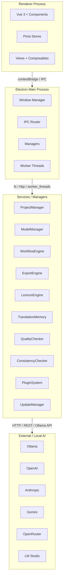

# Volume 1 — Architecture

## 1.1 Choix techniques

### Electron

**Rationale.** Electron fournit un shell desktop cross-platform, un accès natif au système de fichiers, et un écosystème mature pour l’auto-update via `electron-builder`/`electron-updater`.

**Security baseline** (Context7: `/electron/electron`):
- `contextIsolation` reste à `true` (défaut depuis Electron 12).
- `nodeIntegration` à `false`.
- APIs exposées via `contextBridge.exposeInMainWorld()` dans un preload script.
- Sandbox activé par défaut dès Electron 20 ; `nodeIntegration: false`, `contextIsolation: true`, `webSecurity: true`.
- Content Security Policy stricte via `session.defaultSession.webRequest.onHeadersReceived`.

```javascript
// preload.js
const { contextBridge, ipcRenderer } = require('electron')

contextBridge.exposeInMainWorld('novelTradAPI', {
  openProject: (path) => ipcRenderer.invoke('project:open', path),
  onLog: (callback) => ipcRenderer.on('log', (_event, value) => callback(value))
})
```

### Vue 3 + TypeScript + Vite

**Rationale.** Vue 3 offre le Composition API, une réactivité performante et une intégration TypeScript naturelle. Vite fournit un serveur de développement rapide et un bundling optimisé.

**Patterns retenus** (Context7: `/websites/vuejs_guide`, `/vitejs/vite`):
- `<script setup lang="ts">` par défaut.
- Composants métier sous `src/renderer/components/`.
- Stores Pinia sous `src/renderer/stores/`.
- Services métier sous `src/main/services/` (processus main Electron).
- Types partagés sous `src/shared/types/`.

### Pinia

**Rationale.** Pinia remplace Vuex, est modulaire, type-safe et accepte des plugins (persistance, logs).

**Patterns retenus** (Context7: `/vuejs/pinia`):
- Un store par domaine : `useProjectStore`, `useWorkflowStore`, `useModelStore`, `useLexiconStore`.
- Actions asynchrones retournant des promesses.
- Getters pour les dérivations.
- Plugin de persistence éventuel pour les préférences globales.

### SQLite

**Rationale.** Base relationnelle embarquée, zero-config, portable dans le dossier projet.
- Librairie : `better-sqlite3` (synchrone, performante, précompilée pour Electron).
- Schéma versionné avec migrations.
- Repositories pour isoler les requêtes SQL du reste du code.

### Node.js only

**Rationale.** Un seul runtime supprime la dépendance Python, simplifie l’installation et le packaging.
- Les appels IA passent par HTTP à Ollama ou aux API compatibles OpenAI.
- Le pré-traduction est assuré par un modèle Ollama léger (ex. `qwen3.5:4b`, `qwen3.5:2b`, `llama3.2:3b`, ou un modèle spécifique choisi par l’utilisateur).
- Les worker threads Node.js (`worker_threads`) exécutent les agents longs pour ne pas bloquer le main process.

## 1.2 Architecture globale



### Flux d’un clic “Traduire le chapitre”

1. **Renderer** : appelle `novelTradAPI.runWorkflow(chapterId)`.
2. **IPC Router** : valide le message et route vers `WorkflowEngine`.
3. **WorkflowEngine** : crée un `Job` dans SQLite, publie des événements.
4. **AgentRunner** (Worker Thread) : exécute chaque agent séquentiellement.
5. **LexiconEngine / TranslationMemory** : injectés comme contexte.
6. **QualityChecker / ConsistencyChecker** : évaluent le résultat.
7. **ExportEngine** : écrit le fichier final.
8. **Historique** : sauvegarde une version.
9. **Événements** : retournés au renderer via `webContents.send('job:event', payload)`.

## 1.3 Arborescence du projet

```text
noveltrad2/
├── apps/
│   └── desktop/
│       ├── electron-builder.yml
│       ├── package.json
│       ├── resources/
│       │   ├── icon.ico
│       │   ├── icon.png
│       │   └── splash.html
│       ├── src/
│       │   ├── main/
│       │   │   ├── index.ts              # entry point Electron main
│       │   │   ├── ipc/
│       │   │   │   ├── channels.ts       # IPC channel registry
│       │   │   │   ├── router.ts         # validation + dispatch
│       │   │   │   └── handlers/         # per-domain handlers
│       │   │   ├── managers/
│       │   │   │   ├── ProjectManager.ts
│       │   │   │   ├── ModelManager.ts
│       │   │   │   ├── WorkflowEngine.ts
│       │   │   │   ├── UpdateManager.ts
│       │   │   │   └── FileManager.ts
│       │   │   ├── services/
│       │   │   │   ├── AiRouter.ts
│       │   │   │   ├── LexiconEngine.ts
│       │   │   │   ├── TranslationMemory.ts
│       │   │   │   ├── ConsistencyChecker.ts
│       │   │   │   ├── QualityChecker.ts
│       │   │   │   ├── ExportEngine.ts
│       │   │   │   └── PluginHost.ts
│       │   │   ├── workers/
│       │   │   │   └── AgentWorker.ts
│       │   │   └── utils/
│       │   │       ├── logger.ts
│       │   │       ├── paths.ts
│       │   │       └── errors.ts
│       │   ├── preload/
│       │   │   └── index.ts
│       │   └── renderer/
│       │       ├── index.html
│       │       ├── src/
│       │       │   ├── main.ts
│       │       │   ├── App.vue
│       │       │   ├── router/
│       │       │   ├── stores/
│       │       │   ├── views/
│       │       │   ├── components/
│       │       │   ├── composables/
│       │       │   ├── services/
│       │       │   │   └── ipc.ts
│       │       │   └── types/
│       │       └── package.json
│       └── tests/
│           ├── e2e/
│           └── unit/
├── packages/
│   ├── shared/                           # types + schemas partagés
│   │   ├── src/
│   │   │   ├── types/
│   │   │   ├── schemas/
│   │   │   └── constants.ts
│   │   └── package.json
│   └── agent-contracts/                  # définitions des agents
│       ├── src/
│       │   ├── contracts/
│       │   ├── prompts/
│       │   └── tests/
│       └── package.json
├── docs/                                 # ce SDD (dépôt NovelTrad-Documentation séparé)
│   ├── volumes/
│   ├── examples/
│   ├── assets/
│   └── .vitepress/
├── scripts/
│   ├── setup-dev.js
│   └── build.js
├── tests/
│   └── fixtures/
└── package.json
```

## 1.4 Design Patterns

| Pattern | Usage |
|---------|-------|
| **Repository** | Isoler SQL dans `repositories/*.ts` (Projects, Chapters, Lexicon, etc.). |
| **Factory** | Créer les instances d’agent selon le type d’étape (`AgentFactory`). |
| **Observer** | Événements workflow publiés via EventEmitter et WebSocket-like IPC. |
| **Command** | Chaque étape workflow = commande avec `execute()`, `undo()`, `retry()`. |
| **Strategy** | Choisir le provider IA (Ollama, OpenAI, etc.) via `ModelStrategy`. |
| **Dependency Injection** | Managers injectés dans le moteur via un `Container` simple (pas de framework lourd). |

## 1.5 Gestion des erreurs

- Toute erreur métier hérite de `NovelTradError`.
- Erreurs propagées au renderer via `{ type: 'error', code, message, details }`.
- Retry avec backoff exponentiel sur les appels réseau.
- Circuit breaker pour Ollama : si 3 échecs consécutifs, on marque le provider comme indisponible.

## 1.6 Gestion mémoire et multi-thread

- Le main process ne fait pas de traitement LLM direct.
- Les agents tournent dans `Worker` threads via `new Worker(path)`.
- Les gros fichiers sont streamés, jamais chargés entièrement en RAM.
- Limite de concurrence configurable : `maxConcurrentJobs` (défaut 1 modèle Ollama local).

## ✅ Critères d’acceptation de l’architecture

- [ ] L’arborescence est créée et compilable (`npm run build`).
- [ ] Un preload script sécurisé expose uniquement les API nécessaires au renderer.
- [ ] Le main process ne contient pas de logique UI.
- [ ] Chaque manager/service a une interface TypeScript et un test unitaire.
- [ ] Le workflow s’exécute dans un worker thread sans bloquer l’UI.


