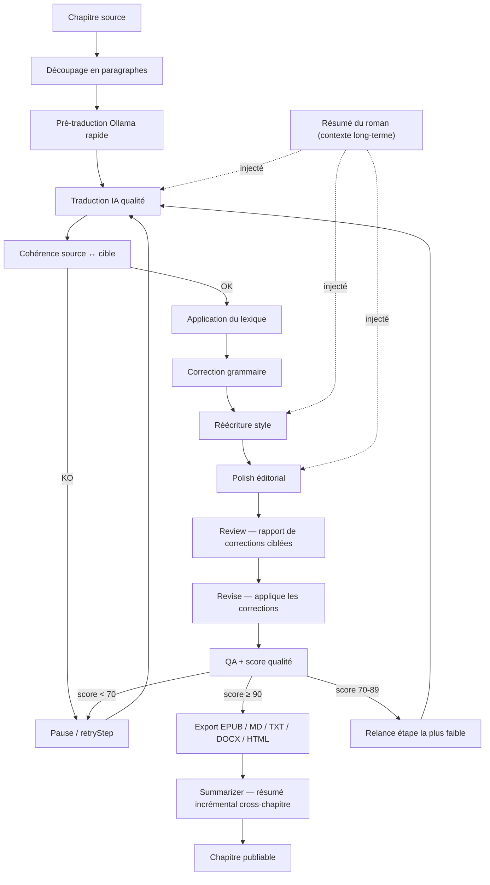

# Volume 7 — Workflow Engine

## 7.1 Vue d’ensemble

Le Workflow Engine est le cœur opérationnel de NovelTrad 2.0. Il orchestre la transformation d’un chapitre source en un chapitre publiable en coordonnant une séquence d’agents. Chaque agent est une étape indépendante, observable, relançable et testable.

Le pipeline par défaut est :



> **Nouveaux stages v1.4 (boucle de révision pro)** : `review` produit un
> `ReviewReport` (corrections paragraphe-par-paragraphe), `revise` applique ces
> corrections ciblées. Inspiré de **honya** (boucle Reviewer→Translator) et
> **LaTeXTrans** (Validator). C'est ce qui transforme une "traduction retry-boucle"
> en "traduction révisée comme par un humain" : les corrections sont *ciblées*
> (paragraphe + raison + suggestion) plutôt qu'un simple re-run global.
>
> **Summarizer transverse** : agent hors-pipeline, exécuté après export d'un
> chapitre réussi. Maintient un `NovelSummary` incrémental injecté dans le
> contexte de `translate`/`style`/`polish` des chapitres suivants → cohérence
> des noms et de l'intrigue sur l'ensemble du roman (inspiré de **LaTeXTrans**
> Summarizer et **TransAgents**).

Chaque étape produit un `outputSnapshot` qui sert d’`inputSnapshot` à l’étape suivante. Cette immutabilité permet le retry, le rollback et l’audit.

## 7.2 Job

Un `Job` représente une exécution du workflow sur un chapitre (mode `single`) ou sur un ensemble de chapitres (mode `batch`).

```typescript
interface Job {
  id: string
  projectId: string
  chapterId?: string
  chapterIds?: string[] // mode batch
  type: 'single' | 'batch'
  status: 'pending' | 'running' | 'paused' | 'completed' | 'failed' | 'cancelled'
  startedAt?: string
  finishedAt?: string
  errorMessage?: string
  options: WorkflowOptions
  metadata?: Record<string, unknown>
}

interface WorkflowOptions {
  startStage?: WorkflowStage
  stopStage?: WorkflowStage
  skipStages?: WorkflowStage[]
  modelId?: string
  fastModelId?: string
  usePreTranslation?: boolean
  useTranslationMemory?: boolean
  qualityThreshold?: number
  maxRetries?: number
  stepTimeoutMs?: number // défaut 120 000 ms (2 min), par étape
}
```

## 7.3 Step

Chaque étape est un `Step` persisté dans `job_steps`.

```typescript
interface Step {
  id: string
  jobId: string
  agentId: string
  name: string
  stage: WorkflowStage
  orderIndex: number
  status: 'pending' | 'running' | 'completed' | 'failed' | 'skipped'
  inputSnapshot?: Record<string, unknown>
  outputSnapshot?: Record<string, unknown>
  score?: number
  tokensIn?: number
  tokensOut?: number
  durationMs?: number
  timeoutMs?: number // hérité de WorkflowOptions.stepTimeoutMs
  startedAt?: string
  finishedAt?: string
  errorMessage?: string
}
```

## 7.4 WorkflowEngine

```typescript
type WorkflowStage =
  | 'split'
  | 'pre_translate'
  | 'translate'
  | 'consistency'
  | 'lexicon'
  | 'grammar'
  | 'style'
  | 'polish'
  | 'review'    // v1.4 : rapport de corrections ciblées par paragraphe
  | 'revise'    // v1.4 : applique les corrections du ReviewReport
  | 'qa'
  | 'export'

class WorkflowEngine extends EventEmitter {
  constructor(
    private db: Database,
    private aiRouter: AiRouter,
    private lexiconEngine: LexiconEngine,
    private tmEngine: TranslationMemoryEngine,
    private consistencyChecker: ConsistencyChecker,
    private qualityChecker: QualityChecker,
    private exportEngine: ExportEngine,
    private pluginHost: PluginHost,
    private agentFactory: AgentFactory,
    private maxConcurrentJobs: number
  ) {
    super()
  }

  async createJob(config: JobConfig): Promise<Job>
  async start(jobId: string): Promise<void>
  async pause(jobId: string): Promise<void>
  async resume(jobId: string): Promise<void>
  async retryStep(jobId: string, stepId: string): Promise<void>
  async retryFrom(jobId: string, stage: WorkflowStage): Promise<void>
  async cancel(jobId: string): Promise<void>
  async getStatus(jobId: string): Promise<JobStatus>

  private async runStep(job: Job, step: Step): Promise<void>
  private emitProgress(jobId: string, stepId: string, percent: number, message: string): void
}
```

## 7.5 AgentFactory

```typescript
class AgentFactory {
  create(stage: WorkflowStage, overrides?: Partial<AgentConfig>): Agent {
    // SDD §15 : un plugin peut remplacer n'importe quel agent built-in
    const pluginAgent = this.pluginHost?.getAgent(stage)
    if (pluginAgent) return pluginAgent(config)

    const baseConfig = this.getBaseConfig(stage)
    const config = { ...baseConfig, ...overrides }

    switch (stage) {
      case 'split': return new SplitAgent(config)
      case 'pre_translate': return new PreTranslateAgent(config, this.aiRouter)
      case 'translate': return new TranslateAgent(config, this.aiRouter, this.tmEngine)
      case 'consistency': return new ConsistencyAgent(config, this.consistencyChecker)
      case 'lexicon': return new LexiconAgent(config, this.lexiconEngine)
      case 'grammar': return new GrammarAgent(config, this.aiRouter)
      case 'style': return new StyleAgent(config, this.aiRouter)
      case 'polish': return new PolishAgent(config, this.aiRouter)
      case 'review': return new ReviewAgent(config, this.aiRouter)        // v1.4
      case 'revise': return new ReviseAgent(config, this.aiRouter)        // v1.4
      case 'qa': return new QaAgent(config, this.qualityChecker)
      case 'export': return new ExportAgent(config, this.exportEngine)
      default:
        throw new Error(`Unknown workflow stage: ${stage}`)
    }
  }
}
```

> **Câblage plugin** : le `WorkflowEngine` injecte le `PluginHost` partagé dans
> l'`AgentFactory` via `getPluginAgent` (et l'`AiRouter` via
> `setPluginProviderResolver`). C'est ce câblage qui rend l'extensibilité
> d'agents/providers fonctionnelle — sans lui, un plugin peut enregistrer un
> agent mais le workflow l'ignore. (v1.4 : câblage effectif, cf. §7.12.)

## 7.6 Observable events

Le renderer reçoit les événements suivants via IPC :

| Event | Direction | Payload |
|-------|-----------|---------|
| `workflow:created` | Main → Renderer | `{ jobId, chapterId?, chapterIds? }` |
| `workflow:started` | Main → Renderer | `{ jobId }` |
| `workflow:step-started` | Main → Renderer | `{ jobId, stepId, name, stage }` |
| `workflow:step-progress` | Main → Renderer | `{ jobId, stepId, percent, message }` |
| `workflow:step-completed` | Main → Renderer | `{ jobId, stepId, stage, score?, durationMs? }` |
| `workflow:step-failed` | Main → Renderer | `{ jobId, stepId, stage, error }` |
| `workflow:paused` | Main → Renderer | `{ jobId }` |
| `workflow:resumed` | Main → Renderer | `{ jobId }` |
| `workflow:cancelled` | Main → Renderer | `{ jobId }` |
| `workflow:completed` | Main → Renderer | `{ jobId, qualityScore, exportPath? }` |
| `workflow:failed` | Main → Renderer | `{ jobId, error }` |

## 7.7 Algorithme d’exécution

```typescript
async function runJob(engine: WorkflowEngine, job: Job): Promise<void> {
  const stages = getStageSequence(job.options)
  const steps = stages.map((stage, i) => createStep(job, stage, i))

  for (const step of steps) {
    if (job.status === 'paused' || job.status === 'cancelled') break

    engine.emitStepStarted(job.id, step)
    try {
      const input = buildInput(job, step, previousOutput)
      const agent = engine.agentFactory.create(step.stage, job.options.agentOverrides)
      const output = await agent.execute(input, buildContext(job))
      validateOutput(output, step.outputSchema)
      step.outputSnapshot = output
      step.score = output.score
      step.status = 'completed'
      engine.emitStepCompleted(job.id, step)
    } catch (error) {
      step.status = 'failed'
      step.errorMessage = formatError(error)
      engine.emitStepFailed(job.id, step, error)
      job.status = 'paused'
      await engine.save(job)
      return
    }
  }

  job.status = 'completed'
  await engine.save(job)
  engine.emitCompleted(job.id, job)
}
```

## 7.8 Retry et relance partielle

- Si une étape échoue, le workflow se met en pause.
- L’utilisateur peut modifier :
  - le lexique,
  - le prompt de l’agent,
  - le modèle utilisé pour cette étape,
  - le texte d’entrée de l’étape.
- `retryStep(jobId, stepId)` relance uniquement cette étape à partir de son `inputSnapshot`.
- `retryFrom(jobId, stage)` relance à partir d’une étape donnée.
- La limite de retries par étape est configurable (`maxRetries`, défaut 2). Cette limite est **distincte** des retries réseau automatiques (§7.10 : ×3 avec backoff), qui sont gérés par le wrapper provider et ne consomment pas le compteur `maxRetries`.

## 7.9 Traitement par lots

- Sélection multiple de chapitres dans l’UI.
- File d’attente interne dans `WorkflowEngine`.
- Limitation de concurrence selon `maxConcurrentJobs` (défaut 1 pour Ollama local).
- Reprise après interruption au dernier chapitre non terminé.
- Possibilité de pauser/reprendre le lot entier.

## 7.10 Gestion des erreurs

| Erreur | Comportement |
|--------|--------------|
| Erreur réseau Ollama | Retry ×3, puis pause + fallback si configuré |
| Timeout dépassé (`stepTimeoutMs`) | Abandon de l'étape, traité comme erreur réseau (retry ×3, puis pause) |
| Sortie mal formée | Retry avec prompt de correction |
| Échec de validation | Pause, notification utilisateur |
| Disque plein | Pause, message explicite |
| Annulation utilisateur | `cancelled`, nettoyage des états partiels |

## 7.11 Persistance et reprise

- À chaque changement de statut d’étape, le job et le step sont sauvegardés dans SQLite.
- Au démarrage de l’application, les jobs en cours (`running` ou `paused`) sont automatiquement rechargés.
- L’utilisateur est invité à reprendre ou annuler.

## 7.12 Boucle de révision pro (v1.4) — review / revise

Le pipeline v1.4 ajoute deux stages de révision ciblée entre `polish` et `qa` :

1. **`review`** : le `ReviewAgent` analyse le texte traduit paragraphe-par-paragraphe
   et produit un `ReviewReport` (`issues[]` : `paragraphIndex`, `severity`
   `high|medium|low`, `original`, `suggestion`, `reason`). Le rapport est persisté
   dans la table `review_reports` (migration 014) et exposé dans l'UI pour
   édition/acceptation humaine.
2. **`revise`** : le `ReviseAgent` applique les corrections du `ReviewReport` via
   LLM (réécriture ciblée). En cas de refus éthique, conserve le texte d'entrée.

> Différence clé vs `retryWeakestStep()` (§7.8) : le retry relance *toute* une
> étape (coûteux, non ciblé) ; la boucle review/revise produit des corrections
> *ciblées* réinjectées précisément. Le branching QA (§7.1) peut, en cas de score
> intermédiaire, reboucler sur `revise` avec le `ReviewReport` + `QualityReport`
> en contexte plutôt que sur `retryWeakestStep`.

Les deux stages sont **désactivables** via `WorkflowOptions.enableReviewLoop`
(défaut `true` en mode pro, `false` en mode rapide).

## 7.13 Summarizer transverse (v1.4)

Le `SummarizerAgent` **n'est pas dans la séquence `WorkflowStage`** : c'est un
agent transverse appelé par le `WorkflowEngine` après l'export réussi d'un
chapitre (même mécanisme que le stockage des embeddings RAG, §7.7).

- Produit un `ChapterSummary` (résumé du chapitre courant) puis fusionne dans un
  `NovelSummary` incrémental (persistance : tables `chapter_summaries` +
  `novel_summaries`, migration 015).
- Le `NovelSummary` est **injecté** dans l'`AgentInput.context` des stages
  `translate`, `style`, `polish` des chapitres *suivants* → cohérence long-terme
  des noms, intrigue, ton du roman (inspiré de LaTeXTrans Summarizer + TransAgents).
- Désactivable via `WorkflowOptions.enableSummarizer` (défaut `true`).

## ✅ Critères d’acceptation du workflow

- [ ] Un test d’intégration exécute les 12 étapes `split → pre_translate → translate → consistency → lexicon → grammar → style → polish → review → revise → qa → export` dans l’ordre sur un chapitre de test.
- [ ] Chaque étape est persistée dans `job_steps` avec `status`, `score`, `input_snapshot`, `output_snapshot`, `tokens_in`, `tokens_out`, `duration_ms`.
- [ ] Un événement `workflow:step-*` est émis au renderer à chaque changement d’étape ; le store Pinia est mis à jour.
- [ ] `retryStep(jobId, stepId)` relance une étape individuelle à partir de son `input_snapshot` sans recommencer le workflow.
- [ ] Un job batch interrompu (crash / fermeture app) reprend au dernier chapitre non terminé après redémarrage.
- [ ] Une erreur réseau Ollama déclenche 3 retries avec backoff exponentiel, puis fallback provider ou pause + notification.
- [ ] Une étape dépassant `stepTimeoutMs` (défaut 120 s) est abandonnée et retryée selon la politique réseau.
- [ ] Les jobs `running` ou `paused` sont rechargés au démarrage et l’utilisateur peut reprendre ou annuler.
- [ ] **v1.4** : le `ReviewAgent` produit un `ReviewReport` persisté, le `ReviseAgent` l'applique, et le `SummarizerAgent` maintient un `NovelSummary` injecté dans les chapitres suivants.
